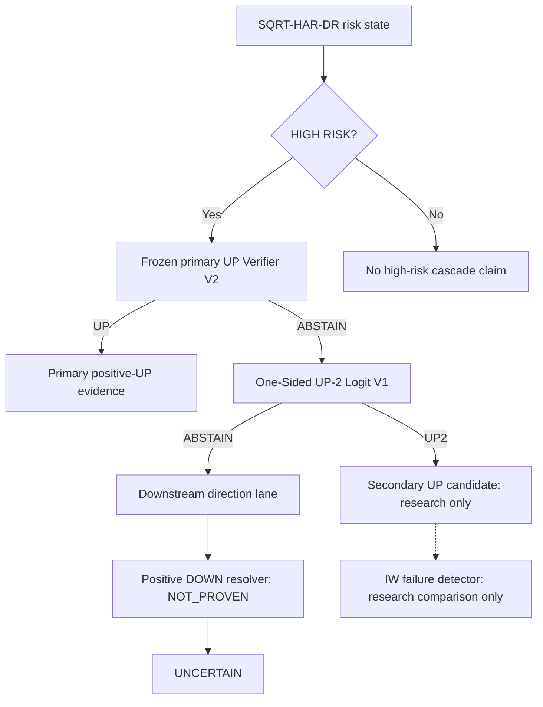

# GOLD CONTROL / GOLD DIRECTION ENGINE — PROJECT MANIFEST

**Manifest version:** 3.00

**Issue date:** 2026-09-23

**Repository:** ataullahturgut/sim3-automation

**Canonical branch:** gold-r4-direction-engine

**Canonical path:** gold_axis_2026/GOLD_CONTROL_PROJECT_MANIFEST.md

**Authority:** sole project-level technical contract and research memory

**Consolidation baseline:** v2.43 at `140365ffcad2d40eac7c0e0c50fe99b991b32800`

**Change scope:** documentation and evidence reconciliation only; no model execution, fitting, threshold search, DB write or runtime change.

## 1. PROJECT CONTRACT / GOVERNANCE — CURRENT / BINDING

### 1.1 Problem and system boundary

The main price/return forecast model already exists **separately**. This research program builds a **direction / direction-confirmation engine**: can a completed-origin downside-risk state be resolved into positive UP evidence, positive DOWN evidence, or deliberate uncertainty? It does not replace the main forecast, forecast the portfolio return, or decide trades.

The current evidence supports a frozen risk reference, a frozen selective primary UP verifier, and a promising residual UP-2 specialist. It does **not** establish a general DOWN resolver. A research-only importance-weighted failure detector can filter some UP-2 calls in retrospective transport, but is not a runtime layer. Module P&L is a diagnostic of the specified calls and return clock, never main-model or total-system P&L. The separate main model's complete identity/interface is NOT_PROVEN by this consolidation; the retained monthly/context identities below do not redefine it.

### 1.2 Non-negotiable rules

- No random split. Use chronological, rolling or expanding-origin evaluation, with training and preprocessing confined to information available at the forecast origin.
- No target-day/future measurements or unmatured labels in earlier-origin features, fitting, calibration, competence, neighbor pools or selection. Completed **origin-day** intraday measurements are allowed; the next retained target day is not.
- **2025 is locked retrospective transport/stress, researcher-visible, not a fresh blind holdout.** It cannot select or retune a model, threshold, feature, weight cap or rescue a failed pre-2025 gate. Causal updates from matured outcomes are permitted only where already part of the frozen algorithm; they are not discretionary retuning.
- **2026 cannot be used for model selection/tuning.** Historical artifacts containing already-observed 2026 scores remain retrospective evidence, not independent confirmation. Any future validation needs an explicit information-availability cutoff and untouched outcomes.
- Research DB access is read-only. Production Neon is the authority for mutable observations and point-in-time source lineage. GitHub is the code/commit/lineage authority. This manifest is the project-level authority. Frozen output files are evidence of what was recorded; they do not alone prove the full data-acquisition chain.
- No silent provider substitution, clock substitution, result-dependent rescue under the same identity, or promotion by copying a result into this manifest.
- **ABSTAIN ≠ DOWN; HIGH RISK ≠ DOWN; risk forecasting ≠ direction forecasting.** Absence of positive UP evidence is not positive DOWN evidence.
- No automatic BUY/SELL/HOLD/EXIT mapping. `AUTO_SELECTOR=OFF`, `AUTO_ENSEMBLE=OFF` at the whole-system level. The already-frozen expert selection inside Router V2 is its research algorithm, not permission to switch on a production selector.
- Runtime/production promotion requires explicit authorization. All direction-research components described here remain NOT_RUNTIME / NOT_PRODUCTION_AUTHORITY.
- Missing artifact/identity: **NOT_FOUND**. Unsupported correctness/authority: **NOT_PROVEN**. Execution prevented by formation/data/integrity: **BLOCKED**. Do not replace those labels with guessed numbers.
- Before proposing research, inspect the registry and closed-path conditions. A new identity needs a new mechanism/data/route/target rationale, preregistration, frozen comparison and a legitimate evaluation period.

### 1.3 Status and evidence vocabulary

| Label | Meaning |
|---|---|
| CURRENT / BINDING | Present project contract or architecture interpretation; not synonymous with runtime authorization |
| FROZEN REFERENCE | Immutable research comparator; preserve exact code, clock, pool, parameters and output semantics |
| PROMISING RESEARCH | Positive scoped evidence with unresolved validation limitations |
| NOT_SUPPORTED | Named method failed its stated gate or use case; not a universal rejection of its family |
| NOT_PROVEN | Evidence does not establish the requested claim or authority |
| SUPERSEDED | Replaced implementation/interpretation; retain historical results and correction reason |
| NON_BINDING HISTORICAL | Past result, diagnostic, instruction or priority; does not direct today's work |
| BLOCKED | A required support/data/integrity gate prevented the proposed experiment |

“Forward” in this document means chronological evaluation after the fitting period. It does not imply prospectively collected evidence. A gate pass, source-harmonization pass, and runtime certification are three different claims.

## 2. CURRENT SYSTEM ARCHITECTURE

### 2.1 Research cascade and routes



The dotted detector branch is **not installed** in the frozen cascade. A detector veto means withdrawing that secondary UP call to ABSTAIN/UNCERTAIN; it does not create a DOWN call. The diagram is a research composition, not an assertion that its combined end-to-end production behavior has been validated.

Route definitions must be carried into every comparison:

| Route | Definition | Relevant recorded support |
|---|---|---|
| Full daily | Same-clock aligned expert timeline | Primary Router V2 standalone 2024/2025 |
| SQRT alarm | Frozen forecast DR at or above formation Q80 | Governed 2024: 17; 2025: 90 |
| Primary residual | SQRT HIGH RISK AND primary Router ABSTAIN | Corrected external 2020–21: 98; governed 2022–24: 26; 2025: 74 |
| UP-2 calls | Positive UP-2 outputs within primary residual | 2022–24: 11; 2025: 25 |
| Hard residual after UP-2 | Primary residual AND UP-2 ABSTAIN | A different population from the CBR primary-residual studies |

**Route consistency correction:** the frozen route-consistent CBR result was evaluated after **primary Router ABSTAIN**, before UP-2 was introduced. Its 26/74-row metrics must not be advertised as validated performance on the later, smaller post-UP-2 residual lane. A future downstream DOWN resolver needs its own exact-route validation.

### 2.2 SQRT-HAR-DR — FROZEN REFERENCE

Identity: `DOWNSIDE_RAW_VS_SQRT_HAR_DR_MULTIORIGIN_V1_RESEARCH` (SQRT member). It predicts next-retained-day downside realized semivariance, not close-return sign.

For within-date five-minute log returns, `DR_t = sum(r_i² for r_i < 0)` and `SD_t = sqrt(DR_t)`. An intercept-plus-OLS HAR predicts `SD_(t+1)` from `SD_t`, the latest 5-day mean SD and latest 22-day mean SD. Squaring the positive prediction returns it to DR units. The frozen code **stops on nonpositive SD predictions**; it does not silently clip them. The HIGH RISK threshold is nearest-rank Q80 of formation target DR, and normalized `sqrt_score` is predicted DR divided by that threshold.

The governed source is `public.xau_intraday_research_cache_5m`, America/New_York calendar dates, weekdays, at least 240 retained bars, no cross-date intraday returns. Target is the next retained date, not necessarily the next civil date. Do not casually rename this cache-date construction “NY17”; other project panels use explicitly governed NY17 clocks and require an alignment audit. Annual fitting includes only target dates through 31 December of the preceding year, minimum 250 supervised rows. The frozen parent panel spans 2020-04-06 through 2026-08-31; 2026 is historical stress only.

| Year | SQRT OOS R² vs historical mean | Native high-risk AUC | Evidence role |
|---|---:|---:|---|
| 2022 | 0.2640 | 0.7153 | Historical multi-origin comparison |
| 2023 | 0.5698 | 0.6896 | Historical multi-origin comparison |
| 2024 | 0.2025 | 0.7320 | Historical multi-origin comparison |
| 2025 | 0.0611 | 0.8401 | Locked retrospective stress |
| 2026 available | 0.2841 | 0.6434 | Previously observed stress; no selection authority |

Pooled 2022–24 n=613: SQRT MSE `6.875463503e-10` vs RAW `6.921930006e-10`; QLIKE `0.1484967071` vs `0.1520286090`. Improvements are modest (about 0.67% and 2.32%); paired HAC evidence is not statistically strong. Keep RAW HAR-DR as mandatory comparator. “Frozen” means a stable reference for isolating downstream hypotheses, not proof of universally superior risk prediction.

In 2025, 90 alarms contain 66 realized high-risk hits and 24 risk misses (73.33% native precision). Those same alarms contain 45 DOWN closes and 45 UP closes. Calling all 90 “DOWN” changes the target and yields 50% direction precision. These are not contradictory results.

### 2.3 Frozen Primary UP Verifier V2 — FROZEN RESEARCH BASELINE

Identity: `UP_EXPERT_ROUTER_V2_LEGACY_CONTEXT_RESEARCH`. Direct experts are **TTSM-S2, TTSM-S1, Bonato AR1_RM QBoost h=1, AR1_RM_LOGIT, RM_LOGIT**, in that fixed tie-break order. Legacy FAST ROBUST_UP, SLOW ROBUST_UP and MONTHLY_DIRECTION_3M UP form a context bucket: at least two UP states means CONSENSUS_UP, otherwise NON_CONSENSUS_UP. They are context, not three additional direction votes.

For each currently active UP expert, use matured prior outcomes in the current bucket if it has at least 30 prior UP calls; otherwise use the frozen global fallback. Eligibility requires at least 30 historical UP calls, precision >50%, and false-UP FPR <50%. Rank by one-sided 90% Wilson lower bound on precision, then lower FPR, higher precision and fixed identity order. Emit the selected expert's **UP**, or **ABSTAIN** if none is eligible. FPR denominates actual DOWN cases; precision denominates UP calls.

| Scope | 2024 | Locked 2025 |
|---|---|---|
| Standalone UP calls | 42 =26 true +16 false | 37 =27 true +10 false |
| Precision / FPR / coverage | 61.90% / 18.60% / 20.49% | 72.97% / 10.31% / 15.61% |
| SQRT-alarm intersection | 4 =3 true UP +1 false UP | 16 =10 true UP +6 false UP |

V2 passed its pre-2025 improvement gate and is the authoritative **research UP-verifier baseline**. This is a selective low-coverage result, not general daily direction mastery. The separate hard-veto coupling missed its 2024 precision-lift gate (+4.98 pp vs required +5.00 pp); that failure neither promotes the coupling nor invalidates the frozen standalone verifier. Changes to membership, bucket, eligibility, confidence level or tie-break require a new router identity and side-by-side frozen-V2 comparison.

### 2.4 Residual One-Sided UP-2 Logit V1 — PROMISING RESEARCH

Identity: `RESIDUAL_ONE_SIDED_UP2_LOGIT_V1_RESEARCH`. Operates only on primary residual rows, to recover missed positive-UP cases. Features: `sqrt_score`, `lag1_close_return`, `downside_share`, `intraday_end_norm`, `close_location`, `trough_recovery_norm`, `last_quarter_return_norm`, `direct_up_fraction`, `legacy_up_fraction`.

L2 logistic regression C=1.0, lbfgs, no class weighting, training-only mean/SD scaling, annual chronological training. Threshold `tau = max(0.50, nearest-rank Q80 of strictly prequential historical actual-DOWN p_UP scores)`. Each calibration score uses earlier rows only, with minimum 40 prior rows and minimum 20 DOWN calibration scores. Exact code predicate is **p_UP > tau**, not >=. 2022/2023/2024/2025 training n=98/109/111/124; thresholds approximately 0.500000/0.534609/0.534609/0.531227. A moving threshold here is the frozen calibration algorithm, not target-year tuning.

Pooled 2022–24 residual n=26 =13 UP +13 DOWN: 11 calls =8 true UP +3 false UP; precision 72.73%, missed-UP recall 61.54%, FPR 23.08%, one-sided 90% precision LCB 53.45%. The frozen pre-2025 gate passed. Locked 2025 residual n=74 =35 UP +39 DOWN: 25 calls =13 true UP +12 false UP; precision 52.00%, recall 37.14%, FPR 30.77%, versus residual UP base rate 47.30%.

Its captured UP cases exhibit late stress/incomplete recovery/rebound morphology in retrospective anatomy. Similar-looking paths can continue DOWN. The 2025 AUC is only 0.5165 and precision LCB 0.3947: a supportive scoped transport flag must not be read as strong general direction skill. Preserve PROMISING / RESEARCH_ONLY / NOT_RUNTIME; output UP2 or ABSTAIN, never DOWN.

### 2.5 Importance-Weighted Historical Source Adaptation V1 — PROMISING, NOT_CERTIFIED

Identity: `UP2_IMPORTANCE_WEIGHTED_SOURCE_ADAPTATION_V1_RESEARCH`. This is a proposed **UP-2 failure filter**, separate from the unchanged UP-2 model. Strict reconstruction found only two chronology-valid historical UP-2 calls (one true, one false), so V1 transfers ordinary labeled residual cases instead of fabricating a historical call population.

Source: corrected external 2020–21 primary residual n=98 =46 UP +52 DOWN (2020:72; 2021:26). Target covariates: seven frozen **2022 UP-2 calls**, not the whole 2022 residual pool and not 2025. Features: `last_hour_trend_r2`, `sqrt_score`, `late_downside_intensity`. Source label 1 is actual DOWN; it becomes a proposed failure probability when applied to UP-2 calls. It is not an assertion that every source row was a false-UP call.

A three-feature L2 logistic domain classifier distinguishes source from target covariates. For source rows, with target-domain probability eta, raw ratio is `eta/(1-eta) * n_source/n_target`. Cap at 10, then normalize capped weights to mean 1. The domain scaler uses combined **source plus 2022 target covariates**; the failure-detector scaler uses source rows only. Failure model is L2 logistic C=1.0 with sample weights; veto when p_failure >=0.50. The 2022 outcome labels enter neither weight estimation nor source-label fitting. The unlabeled 2022 adaptation means its own 2022 score is diagnostic, not an independent forward test.

ESS `(sum w)^2/sum(w^2)` =46.0867, above frozen minimum 20. Raw max=4.4350 (no ratio hits cap), normalized median=0.5644, max=4.4720. Domain training AUC=0.8163 is descriptive domain discrimination, **not** failure-prediction AUC. Good weight concentration does not establish the covariate-shift assumption that conditional label behavior transfers.

| Detector | 2023–24 true UP retained | 2025 false UP removed | 2025 true UP retained | Remaining 2025 calls / precision |
|---|---:|---:|---:|---:|
| No detector | 4/4 | 0/12 | 13/13 | 25 / 52.00% |
| Unweighted older source | 2/4 | 6/12 | 10/13 | 16 / 62.50% |
| Importance-weighted older source | 3/4 | 6/12 | 11/13 | 17 / 64.71% |

Weighted forward-retention and retrospective transport gates pass. However 2023–24 contains **zero false-UP examples**; it tests retention only. 2025 is the first forward mixed-label period and is already researcher-visible retrospective transport. Therefore status is **IMPORTANCE_WEIGHTED_SIGNAL_SAMPLE_LIMITED_NOT_CERTIFIED / RESEARCH_ONLY / NOT_RUNTIME**. The 17-call precision is after-filter UP-call precision, not whole-cascade accuracy, profit, or statistical certification. Vetoed calls remain unresolved.

### 2.6 Positive DOWN resolver and UNCERTAIN

Positive DOWN authority remains **NOT_PROVEN**. Original CBR-DTW diagnostic, retained-specialist crosswalk, non-route-consistent historical extension and route-consistent extension are different experiments. The broad retained-specialist crosswalk found a narrow CBR candidate; that corrects the earlier narrow audit's scope, not the later route-consistent failure.

Route-consistent CBR: pre-2025 16 DOWN calls =9 correct +7 false (56.25% precision, LCB 40.52%); 2025 36 =20 correct +16 false (55.56%). It failed the pre-2025 support gate. It is a research comparator, not VERIFIED_DOWN, and its metrics belong to the primary residual route. No CBR result authorizes forcing primary or secondary ABSTAIN to DOWN.

UNCERTAIN is deliberate selective prediction: lack of validated evidence is preserved instead of hidden by compulsory binary output. NORMAL RISK likewise does not by itself establish direction.

### 2.7 Retained independent monthly and legacy context

CAUSAL_PATCH, VW_MIDAS_MSVR_SUCCESSOR_V1, MOMENTUM_3M and RANDOM_WALK retain their independent monthly H=1 price-level roles; MONTHLY_DIRECTION_3M remains a strategic prior. FAST is tactical trend context; SLOW is slower confirmation; GVZ_RISK is risk/severity context; MACRO_EVENT_SUCCESSOR_V2 is event-time. BOCPD_RETURN_SUCCESSOR_V1 and Emergency identities retain their documented blocked/context limitations. No event-time, weekly, H5/H20 or monthly metric is imported as next-day directional validation. Their historical tables and source anchors are retained in section 8.

## 3. CURRENT BEST EVIDENCE TABLE

| Component | Role | Evidence period | Key result | Locked-2025 behavior | Status | Authority level | Next action |
|---|---|---|---|---|---|---|---|
| SQRT-HAR-DR | Downside-risk intensity | 2022–24 | Small pooled MSE/QLIKE gain vs RAW; weak HAC significance | Native risk 66/90 hits; close DOWN 45/90 | FROZEN REFERENCE | Research risk comparator | Keep frozen; preserve RAW comparator |
| Primary UP V2 | Selective positive UP | 2024 standalone | 26/42 true; precision 61.90% | 27/37 true; 72.97% | FROZEN REFERENCE | Primary research UP baseline | No silent rule changes |
| UP-2 Logit | Recover residual missed UP | 2022–24 primary residual | 8/11 true; pre-gate passed | 13/25 true; 52% | PROMISING RESEARCH | Secondary candidate only | Preserve exact route/threshold algorithm |
| IW source adaptation | Filter UP-2 failures | 2020–21 source; 2022 covariates; 2023–24 guard | ESS 46.09; 3/4 UP kept; no guard negatives | 6/12 errors removed; 11/13 UP kept | SAMPLE_LIMITED / NOT_CERTIFIED | Research filter only | Independent mixed-label forward validation |
| CBR route-consistent | Positive DOWN candidate | 2022–24 primary residual | 9/16 correct; pre-gate failed | 20/36 correct | NOT_SUPPORTED for verified DOWN | Comparator only | New evidence/identity before reconsideration |
| Positive DOWN resolver | Resolve remaining direction | No validated current identity | NOT_PROVEN | NOT_PROVEN | NOT_PROVEN | None | Exact-route independent validation needed |
| UNCERTAIN | Preserve unresolved cases | Architecture contract | Avoids false complement labels | Same semantics | CURRENT / BINDING | Output semantics | Keep explicit |

## 4. FAILURE MODES / LEARNED MECHANISMS

| Finding | Evidence class | What it supports / what it does not |
|---|---|---|
| High downside semivariance can coexist with an UP close | Validated semantic distinction in frozen anatomy | Separate native risk hits from close-direction errors; 2020–24 103 of 218 risk hits close UP |
| UP-2 captured-UP differs from missed-UP in downside pressure, trough timing, close location and recovery | Descriptive, cross-period anatomy | Late-stress/incomplete-recovery/rebound hypothesis; not a causal economic law |
| False-UP actual-DOWN paths mimic the rebound prototype | Descriptive hard-negative anatomy | Continuation-mimic failure hypothesis, not permission to relabel all residual DOWN rows as UP-2 errors |
| Last-hour trend R² is higher/more persistent in false-UP anatomy | Descriptive retrospective discrimination | Candidate failure feature; anatomy thresholds are not deployable rules |
| Certain SQRT/late-downside regimes strengthen the R² pattern | Descriptive regime-conditioned transport | New learning hypothesis only; multiple inspected regimes do not establish independent validation |
| 2022-only three-feature learned detector over-vetoes | Predictive test, NOT_SUPPORTED | 2025 keeps only 6/13 true UP, removes 4/12 false UP, precision 42.86%; coefficients with plausible signs do not prove transport |
| IW transfers old residual labels more effectively than unweighted comparator in this frozen study | Predictive research comparison, sample-limited | Better retention (3/4 vs 2/4; 11/13 vs 10/13), same 6/12 error removal; no mixed-label pre-2025 forward validation |
| Missed-UP vs remaining DOWN separation did not stably transport in simple static features | Descriptive non-transport | Does not prove inseparability under every representation or data source |
| Expanding competence can respond late to regime deterioration | Historical controller anatomy | Within-cell confidence can remain permissive during deteriorating performance; no universal benefit from recency tuning established |
| Strong raw UP accuracy can be an almost-always-UP classifier | Validated metric interpretation | Retain BA, FPR, coverage and class counts alongside accuracy |

## 5. DO-NOT-REPEAT / CLOSED PATHS REGISTER

“Closed” below applies to the exact frozen experiment/use case. It is not a permanent ban on a scientific family. Reopening is a separate authorized, preregistered identity and must not use 2025/2026 outcomes for selection.

| Method / scope | Status and why closed | What exactly must not be repeated | What could justify reopening |
|---|---|---|---|
| RAW QHAR / SQRT-QHAR estimation | NOT_SUPPORTED; QLIKE intervention did not improve required result | Same representation/optimizer as a supposedly new method; outcome-driven rescue | New independently motivated estimator or data with frozen comparator |
| HARK-SD V1 / ME-SQRT V1 | NOT_SUPPORTED for superiority; over-filtering or too-small gain | Rebranding these frozen variants as untested | New observation-noise mechanism or independent data |
| Current scalar bridge/meta/SP500/consensus verifiers | NOT_SUPPORTED or exploratory only | Same features and gate presented as a fresh solution | Independent directional sensor/mechanism or target/route change |
| Early-alarm V1 | NOT_SUPPORTED; broad fallback has no sign-conversion lift | Retuning horizon/context after seeing failures | New timing target and independent support |
| Hard Router × SQRT veto | No promotion; near-miss plus historical safety failure | Treating UP confirmation as permission to erase genuine risk | New action-loss contract and independent conditional safety evidence |
| NP V1 / three-action V1 / direct and monotonic controllers | No incremental discrimination, collapse, failed gate, or zero utility | Static-LCB threshold rescue; post-hoc WATCH-to-SUPPRESS conversion | New time-stable mechanism and adequate action-conditional calibration |
| LTT V1 | BLOCKED by n=7 vs minimum 11 | Weakening risk/confidence levels to manufacture certification | More legitimate same-clock calibration cases; dependence/design conditions checked |
| External session-mask V1 / CBR non-route extension | SUPERSEDED for current cascade | Uncorrected time mask or broad historical neighbor pool as route-consistent | Corrected source and exact-route reconstruction under new identity |
| Regime Q80/Q90 dampener V1 | REJECTED_SAFETY | Threshold adjustment under same identity | New safety mechanism and independent evidence |
| Route-consistent CBR V1 | NOT_SUPPORTED as VERIFIED_DOWN | Reusing 2025 pocket to erase failed pre-gate; pretending primary-residual results validate post-UP-2 route | New information or independent exact-route sample |
| Local-DES UP-2 / trajectory UP-2 / sequence-shapelet V1 | NOT_SUPPORTED; no calls or failed pre-gate | Lowering eligibility or selecting a 2025-favorable threshold under V1 | Competent expert pool, new representation or new forward support |
| Strict historical UP-2 error pool | Insufficient: 2 calls | Relabeling all 98 residual rows as historical UP-2 calls | Genuine chronology-valid calls from additional history |
| 2019 extension | BLOCKED: formation 238 <250 | Relaxing frozen SQRT minimum to force execution | Earlier valid data restoring required formation support |
| Continuation scalar veto / first regime detector | NOT_SUPPORTED; no eligible vetoes or over-veto | 2025 threshold rescue; treating anatomy thresholds as learned rules | Sufficient earlier hard negatives or independently validated transfer |
| BCT/CTW + BCT-AR current direction sequence | Family closed in frozen BCT-AR result | D/beta/window/quantizer rescue without explicit reopening | Explicit user reopening plus new scientific condition |
| Unsupported weekly/general 1D/3D families | Scoped failures in section 8 | Recommending already-tested variants as new; cross-clock metric substitution | New target, external information or forward data; identify exact difference |

Persistence-only and conditional-competence dampeners remain historical research references, **not certified and not current direction layers**. They are not globally “closed” merely because utility is limited. IW adaptation is open for validation, not closed and not promoted.

## 6. OPEN RESEARCH QUESTIONS / NEXT RESEARCHER ENTRY POINT

1. Can the frozen IW method preserve UP and reject failures on a genuinely independent, later **mixed-label** UP-2-call population? Log source/target support, density-ratio diagnostics, retention, error removal, coverage and uncertainty. The 2023–24 four-positive guard cannot answer the negative-class question.
2. Does the covariate-shift assumption hold across regimes/providers? Feature correlation and ESS do not establish stable conditional labels. Any alternative transfer method must preserve ordinary source labels and exact route membership.
3. Can a regime-conditioned resolver separate hard-UP from DOWN after both UP stages abstain? First establish a positive DOWN target/route and sufficient chronological support; never use the complement of UP as validation.
4. Can selective prediction/defer improve useful coverage without sacrificing conditional safety? Compare risk and direction objectives separately, with unchanged reference modules and predeclared action costs if authorized.
5. Can earlier valid source history remove the 2019 formation block or yield genuine historical hard negatives? Do not relax the frozen 250-row rule or the UP-2 calibration floors.
6. How should research direction evidence interface with the existing separate main forecast? That interface and any end-to-end economic claim require their own contract and explicit authorization.

Start with sections 1–3, then read the exact matching registry entry and lineage row before proposing a method. Check whether the idea is anatomy, prediction, extension, cascade, or transport. State what is new and which untouched evidence can evaluate it. No new experiment or priority is authorized by this consolidation; historical “next step” prose below is not an active instruction.

## 7. RESEARCH HISTORY / METHOD REGISTRY

Entries are grouped by scientific role rather than execution date. Each has a standard decision record followed by preserved historical detail. The latter retains counts, variant distinctions and original caveats; any old “binding”, “current”, “next step”, “should test” or “freeze” wording inside historical detail is **NON_BINDING HISTORICAL** unless expressly reaffirmed in sections 1–6 or the final binding summary. Original section numbers are lineage labels, not current section links. Numeric claims marked artifact-verified were checked against retained frozen output; this task does not rerun the DB/model pipeline.

| Registry ID | Method / experiment | Current scoped status |
|---|---|---|
| [R01](#r01) | Discrete-Burr LACD-POT extreme-DOWN hazard R2 | NOT_SUPPORTED; R 1 SUPERSEDED |
| [R02](#r02) | RAW HAR-DR | FROZEN REFERENCE |
| [R03](#r03) | RAW QHAR-DR | NOT_SUPPORTED |
| [R04](#r04) | SQRT-QHAR-DR | NOT_SUPPORTED |
| [R05](#r05) | SQRT-HAR-DR multi-origin representation study | FROZEN REFERENCE |
| [R06](#r06) | ME-SQRT-HAR-DR | NOT_SUPPORTED |
| [R07](#r07) | HARK-SD latent-state transfer | NOT_SUPPORTED |
| [R08](#r08) | SQRT alarm semantic audit V1 — risk versus direction disentanglement | CURRENT / BINDING interpretation |
| [R09](#r09) | High-risk hurdle resolution V1 — first selective conditional-resolution probe | PROMISING RESEARCH architecture; NOT_PROVEN direction |
| [R10](#r10) | TTSM realized-semivariance direction/reversal | NOT_SUPPORTED standalone; retained experts |
| [R11](#r11) | UP Expert Router V1 — dynamic class-specific selector | NOT_SUPPORTED for promotion; historical comparator |
| [R12](#r12) | Original 12-engine stack — UP inclusion audit | CURRENT / BINDING role distinction |
| [R13](#r13) | UP Expert Router V2 — original legacy context reintegrated | FROZEN REFERENCE |
| [R14](#r14) | Router V2 historical extension V1 — validated | FROZEN REFERENCE reconstruction; NOT_CERTIFIED |
| [R15](#r15) | External Dukascopy-derived XAUUSD feature spine — staged | SUPERSEDED source representation |
| [R16](#r16) | External Dukascopy pre-2022 SQRT + Router test — executed | SUPERSEDED counts; NON_BINDING HISTORICAL |
| [R17](#r17) | External-data full method audit V2 — session correction and confirmation | FROZEN REFERENCE corrected source |
| [R18](#r18) | UP countersign veto V1 — executed and closed for current candidates | NOT_SUPPORTED in named candidate scope |
| [R19](#r19) | V2 expanded historical-UP veto — executed | NOT_SUPPORTED for tested coupling |
| [R20](#r20) | SQRT × frozen UP Router V2 countersign veto — executed | NOT_SUPPORTED coupling; verifier stays frozen |
| [R21](#r21) | SQRT + pure-UP detector conditional audit — test the manifest UP leader directly | NOT_SUPPORTED forced-binary composition |
| [R22](#r22) | SQRT × MOMENTUM_3M conditional-resolution audit — monthly prior tested directly | NOT_SUPPORTED daily resolution |
| [R23](#r23) | SQRT × frozen UP Verifier V2 semantic audit — correct UP motor re-tested under corrected semantics | CURRENT / BINDING semantic interpretation |
| [R24](#r24) | Time-to-event / early-alarm diagnostic V1 — executed and closed | NOT_SUPPORTED timing hypothesis V 1 |
| [R25](#r25) | Cross-domain direction bridge family | NOT_SUPPORTED for tested feature set |
| [R26](#r26) | Meta false-alarm veto | NOT_SUPPORTED |
| [R27](#r27) | S&P 500 cross-market veto | NOT_SUPPORTED |
| [R28](#r28) | Heterogeneous consensus veto | NON_BINDING HISTORICAL / NOT_SUPPORTED promotion |
| [R29](#r29) | NP-constrained suppressor V1 — executed | NOT_SUPPORTED incremental improvement |
| [R30](#r30) | Selective three-action controller V1 — executed | NOT_SUPPORTED |
| [R31](#r31) | Selective-controller method audit — correction and parameter-learning scope | CURRENT / BINDING methodological correction |
| [R32](#r32) | Direct action-risk controller V1 — executed | NOT_SUPPORTED |
| [R33](#r33) | Monotonic action-risk controller V1 — executed | NOT_SUPPORTED |
| [R34](#r34) | Learn-Then-Test action-risk V1 — support-blocked | BLOCKED |
| [R35](#r35) | Regime-gated selective dampener V1 — preregistered Q80/Q90 reject gate | NOT_SUPPORTED / REJECTED_SAFETY |
| [R36](#r36) | Persistent risk-state dampener V1 — preregistered causal persistence reject gate | FROZEN REFERENCE historical safety; NOT_CERTIFIED |
| [R37](#r37) | Persistent conditional-competence dampener V1 — causal within-cell authority recovery | PROMISING RESEARCH historical utility; NOT_CERTIFIED |
| [R38](#r38) | DOWN verifier candidate audit — narrow baseline screen only | NOT_SUPPORTED within narrow scope |
| [R39](#r39) | Comprehensive retained DOWN-specialist crosswalk — CBR-DTW emerges as a narrow candidate | PROMISING RESEARCH narrow candidate; not final DOWN authority |
| [R40](#r40) | CBR-DTW intraday path morphology | NOT_SUPPORTED original task |
| [R41](#r41) | CBR DOWN verifier historical extension — superseded for cascade use because the historical CBR pool was not route-consistent | SUPERSEDED for cascade use |
| [R42](#r42) | Cascade-route-consistent CBR — intended architecture tested correctly | NOT_SUPPORTED as VERIFIED_DOWN |
| [R43](#r43) | False-DOWN next-origin UP rescue audit — frozen UP verifier does not immediately rescue CBR mistakes | NON_BINDING HISTORICAL diagnostic |
| [R44](#r44) | Residual one-sided UP-2 — first dedicated missed-UP specialist passes the pre-2025 gate | PROMISING RESEARCH / NOT_RUNTIME |
| [R45](#r45) | Residual local-competence UP-2 DES — no eligible local expert signal | NOT_SUPPORTED |
| [R46](#r46) | Residual trajectory/rebound morphology UP-2 — pre-2025 gate fails despite cleaner locked-2025 transport | NOT_SUPPORTED |
| [R47](#r47) | Independent UP-2 integrity and economic arithmetic audit — PASS | FROZEN REFERENCE integrity evidence |
| [R48](#r48) | Direction error anatomy — missed-UP and missed-DOWN failure modes are not symmetric | NON_BINDING HISTORICAL / DESCRIPTIVE |
| [R49](#r49) | Direction mechanism-gap audit — actionable failure-mode features identified | NON_BINDING HISTORICAL / DESCRIPTIVE |
| [R50](#r50) | Residual sequence-shapelet UP V1 — sequence subsequences do not rescue the hard residual lane | NOT_SUPPORTED |
| [R51](#r51) | UP-2 last-hour trend-R2 threshold anatomy — retrospective scalar separation exists, but no rule is authorized | NON_BINDING HISTORICAL / DIAGNOSTIC_ONLY |
| [R52](#r52) | UP-2 regime-conditioned R2 anatomy — origin-state conditioning materially improves the retrospective veto pattern | NON_BINDING HISTORICAL / DIAGNOSTIC_ONLY |
| [R53](#r53) | UP-2 regime-conditioned failure detector V1 — forward retention passes, locked transport fails | NOT_SUPPORTED |
| [R54](#r54) | Importance-weighted historical source adaptation — older residual data becomes useful without fabricating historical UP-2 calls | PROMISING RESEARCH / SAMPLE_LIMITED / NOT_CERTIFIED |
| [R55](#r55) | Strictly prequential 2020–2021 UP-2 error-pool extension | BLOCKED dedicated-detector support |
| [R56](#r56) | Attempt to prepend 2019 — blocked by frozen SQRT support rule | BLOCKED |
| [R57](#r57) | Continuation-mimic veto V1 — feasibility not supported | NOT_SUPPORTED |

<a id="r01"></a>

### R01. Discrete-Burr LACD-POT extreme-DOWN hazard R2

**METHOD / IDENTITY:** `DOWNSIDE_DISCRETE_BURR_LACDPOT_HAZARD_XAU_V1R2_RESEARCH`

**ROLE:** Extreme-negative-return hazard

**WHY TESTED:** Test duration/POT tail-event forecasting

**DATA / ROUTE:** Corrected Twelve Data XAU/USD daily NY bars; formation through 2023

**FEATURES / INPUTS:** Discrete-Burr log-LACD duration and excess

**METHOD:** Discrete-Burr log-LACD duration and excess; formation Q 95 loss/hazard

**PRE-2025 RESULT:** 2024 AUC 0.5933 but zero alerts/recall

**LOCKED 2025 RESULT:** TP 4 FP 40; precision 9.09%, recall 23.53%

**FINAL STATUS:** NOT_SUPPORTED; R 1 SUPERSEDED

**WHY ACCEPTED / REJECTED / NOT_PROVEN:** Tail ranking does not yield useful frozen alerts; not ordinary DOWN classifier

**CAN IT BE RETRIED?:** Reproduction: yes. Retuning: only under a new authorized identity.

**IF YES, UNDER WHAT NEW CONDITION?:** New source-faithful hazard mechanism; do not revive StakTrakr R 1

**DO NOT REPEAT:** Same identity/input/route/gate as a new idea; 2025/2026 outcome-driven rescue.

**EVIDENCE CHECK:** retained frozen result artifact(s) found; exact blob/commit links in lineage R01. No pipeline rerun.

<details>
<summary>Preserved detailed research record (historical wording; current status above controls)</summary>

**Identity:** DOWNSIDE_DISCRETE_BURR_LACDPOT_HAZARD_XAU_V1R2_RESEARCH

**Role:** next-day probability of an extreme negative return; not ordinary DOWN classification.

**Source:** Bień-Barkowska (2024), “Forecasting extreme negative returns in gold and silver: A discrete-duration approach to POT models”, DOI 10.1002/asmb.2759; reconstruction authority Bień-Barkowska (2020), DOI 10.12693/APhysPolA.138.48.

**Data:** Twelve Data XAU/USD daily bars, America/New_York.

**Construction:** formation Q95 loss threshold; inter-event duration and excess magnitude; log-LACD state; right-shifted discrete Burr duration likelihood; one-day hazard; formation Q95 hazard alert threshold.

**Chronology:** formation through 2023-12-31; 2024 fixed validation; unchanged 2025 challenge.

**Result:** 2024 AUC 0.5933 but alert coverage and recall were 0. In 2025 AUC 0.5649; TP 4, FP 40, recall 0.2353, precision 0.0909.

**Decision:** NO_PROMOTION / EXTREME_DOWN_HAZARD_NOT_SUPPORTED. R1 StakTrakr input conclusion is non-authoritative.

</details>

<a id="r02"></a>

### R02. RAW HAR-DR

**METHOD / IDENTITY:** `DOWNSIDE_HAR_DR_XAU_V1_RESEARCH`

**ROLE:** Risk comparator

**WHY TESTED:** Measure downside semivariance with an interpretable memory model

**DATA / ROUTE:** Governed daily DR, annual chronological origins

**FEATURES / INPUTS:** Daily/5 D/22 D DR

**METHOD:** Daily/5 D/22 D DR; OLS HAR

**PRE-2025 RESULT:** 2024 native risk gate passed; mandatory RAW comparator

**LOCKED 2025 RESULT:** 2025 R² -0.0014, risk AUC 0.8395

**FINAL STATUS:** FROZEN REFERENCE

**WHY ACCEPTED / REJECTED / NOT_PROVEN:** Calibration weakened but native ranking remained useful

**CAN IT BE RETRIED?:** Reproduction: yes. Retuning: only under a new authorized identity.

**IF YES, UNDER WHAT NEW CONDITION?:** New estimator/representation compared against unchanged RAW

**DO NOT REPEAT:** Same identity/input/route/gate as a new idea; 2025/2026 outcome-driven rescue.

**EVIDENCE CHECK:** retained frozen result artifact(s) found; exact blob/commit links in lineage R02. No pipeline rerun.

<details>
<summary>Preserved detailed research record (historical wording; current status above controls)</summary>

**Identity:** DOWNSIDE_HAR_DR_XAU_V1_RESEARCH

**Role:** next-day downside realized-semivariance intensity.

**Source:** Xie, Wang, Chen & Gong (2019), DOI 10.1016/j.physa.2018.11.028; realized-semivariance authority Barndorff-Nielsen, Kinnebrock & Shephard.

**Data:** public.xau_intraday_research_cache_5m.

**Construction:** OLS HAR with daily DR, mean5(DR), mean22(DR). No regularization, transforms, jumps, macro or nonlinear terms.

**Result:** annual-origin comparison gave 2022 R2 0.2791/AUC 0.7146; 2023 0.5308/0.6821; 2024 0.1891/0.7283; 2025 stress -0.0014/0.8395; 2026 YTD 0.2474/0.6198. Original 2024 fixed validation passed the risk gate; level calibration weakened in 2025 while risk ranking remained strong.

**Decision:** RETAINED_DOWNSIDE_RISK_BASELINE / MANDATORY_COMPARATOR / NOT_RUNTIME. Risk sensor only, not a DOWN-direction engine.

</details>

<a id="r03"></a>

### R03. RAW QHAR-DR

**METHOD / IDENTITY:** `DOWNSIDE_QHAR_DR_XAU_V1_RESEARCH`

**ROLE:** Risk estimation intervention

**WHY TESTED:** Test QLIKE rather than OLS estimation

**DATA / ROUTE:** Same governed HAR-DR panel

**FEATURES / INPUTS:** Raw DR HAR with direct QLIKE fit

**METHOD:** Raw DR HAR with direct QLIKE fit

**PRE-2025 RESULT:** 2024 QLIKE 0.7361 vs OLS 0.1565; alarm coverage 1.0

**LOCKED 2025 RESULT:** Worse than raw OLS

**FINAL STATUS:** NOT_SUPPORTED

**WHY ACCEPTED / REJECTED / NOT_PROVEN:** Frozen estimation intervention failed

**CAN IT BE RETRIED?:** Reproduction: yes. Retuning: only under a new authorized identity.

**IF YES, UNDER WHAT NEW CONDITION?:** Independently motivated estimator; no same-identity optimizer rescue

**DO NOT REPEAT:** Same identity/input/route/gate as a new idea; 2025/2026 outcome-driven rescue.

**EVIDENCE CHECK:** retained frozen result artifact(s) found; exact blob/commit links in lineage R03. No pipeline rerun.

<details>
<summary>Preserved detailed research record (historical wording; current status above controls)</summary>

**Identity:** DOWNSIDE_QHAR_DR_XAU_V1_RESEARCH

**Role:** test direct QLIKE estimation of the raw HAR-DR form.

**Source:** same HAR-DR structure; estimation intervention only.

**Data:** same 5-minute Gold panel.

**Construction:** identical daily/5D/22D linear form, coefficients estimated by direct QLIKE rather than OLS.

**Result:** 2024 QLIKE 0.7361 versus raw OLS 0.1565; high-risk coverage collapsed to 1.0; 2025 remained worse.

**Decision:** REJECTED / RAW_QLIKE_ESTIMATION_FAILED. Closed under this identity.

</details>

<a id="r04"></a>

### R04. SQRT-QHAR-DR

**METHOD / IDENTITY:** `DOWNSIDE_SQRT_QHAR_DR_XAU_V1_RESEARCH`

**ROLE:** Risk estimation intervention

**WHY TESTED:** Test whether semideviation scaling fixes QLIKE behavior

**DATA / ROUTE:** Same governed panel

**FEATURES / INPUTS:** SQRT-DR HAR fitted under QLIKE, squared back

**METHOD:** SQRT-DR HAR fitted under QLIKE, squared back

**PRE-2025 RESULT:** 2024 SD-QLIKE 0.037432 vs OLS 0.037306

**LOCKED 2025 RESULT:** DR-QLIKE 0.335471 vs raw 0.309654

**FINAL STATUS:** NOT_SUPPORTED

**WHY ACCEPTED / REJECTED / NOT_PROVEN:** Source-consistent QLIKE variant did not improve gate

**CAN IT BE RETRIED?:** Reproduction: yes. Retuning: only under a new authorized identity.

**IF YES, UNDER WHAT NEW CONDITION?:** New estimation mechanism; keep this negative comparator

**DO NOT REPEAT:** Same identity/input/route/gate as a new idea; 2025/2026 outcome-driven rescue.

**EVIDENCE CHECK:** retained frozen result artifact(s) found; exact blob/commit links in lineage R04. No pipeline rerun.

<details>
<summary>Preserved detailed research record (historical wording; current status above controls)</summary>

**Identity:** DOWNSIDE_SQRT_QHAR_DR_XAU_V1_RESEARCH

**Role:** source-consistent QLIKE estimation on semideviation scale.

**Source:** transformed realized-volatility literature; same HAR memory structure.

**Data:** same 5-minute Gold panel.

**Construction:** SD=sqrt(DR); QLIKE fit on SD using daily/5D/22D components; squared back to DR.

**Result:** 2024 SD-QLIKE 0.037432 versus transformed OLS 0.037306; DR-QLIKE 0.157983 versus raw HAR-DR 0.156463. 2025 DR-QLIKE 0.335471 versus raw 0.309654.

**Decision:** NO_PROMOTION / SOURCE_CONSISTENT_QLIKE_HYPOTHESIS_FAILED. QLIKE route closed; transformed OLS comparator motivated the next study.

</details>

<a id="r05"></a>

### R05. SQRT-HAR-DR multi-origin representation study

**METHOD / IDENTITY:** `DOWNSIDE_RAW_VS_SQRT_HAR_DR_MULTIORIGIN_V1_RESEARCH`

**ROLE:** Risk reference

**WHY TESTED:** Isolate representation change from estimation change

**DATA / ROUTE:** Governed 2022–24 primary; 2025/2026 historical stress

**FEATURES / INPUTS:** SD daily/5 D/22 D OLS

**METHOD:** SD daily/5 D/22 D OLS; squared positive forecasts; formation Q 80

**PRE-2025 RESULT:** Pooled MSE improvement 0.67%, QLIKE 2.32%; weak HAC significance

**LOCKED 2025 RESULT:** Native high-risk 66/90; close-DOWN 45/90

**FINAL STATUS:** FROZEN REFERENCE

**WHY ACCEPTED / REJECTED / NOT_PROVEN:** Pre-gate passed; risk only, not general direction

**CAN IT BE RETRIED?:** Reproduction: yes. Retuning: only under a new authorized identity.

**IF YES, UNDER WHAT NEW CONDITION?:** Only new identity with unchanged SQRT comparator

**DO NOT REPEAT:** Same identity/input/route/gate as a new idea; 2025/2026 outcome-driven rescue.

**EVIDENCE CHECK:** retained frozen result artifact(s) found; exact blob/commit links in lineage R05. No pipeline rerun.

<details>
<summary>Preserved detailed research record (historical wording; current status above controls)</summary>

**Identity:** DOWNSIDE_RAW_VS_SQRT_HAR_DR_MULTIORIGIN_V1_RESEARCH

**Role:** current strongest recent downside-risk research candidate.

**Source:** HAR-DR plus semideviation representation; hypothesis isolated to representation only.

**Data:** public.xau_intraday_research_cache_5m.

**Construction:** OLS HAR on SD=sqrt(DR), predictors SD_t, mean5(SD), mean22(SD), target SD_t+1; forecast squared back to DR. No bias correction, clipping, macro, regime, window search or QLIKE fit.

**Chronology:** annual expanding origins; 2022–2024 primary retrospective falsification, 2025/2026 retrospective stress.

**Result:** R2/AUC by year: 2022 0.2640/0.7153; 2023 0.5698/0.6896; 2024 0.2025/0.7320; 2025 stress 0.0611/0.8401; 2026 YTD 0.2841/0.6434. Pooled 2022–2024 MSE improved about 0.67% versus RAW and QLIKE improved about 2.32%; paired HAC loss differences were not statistically strong. Native 2025 high-risk task: 90 alarms, TP 66, FP 24, precision 0.7333, recall 0.6735, F1 0.7021. If those alarms are incorrectly forced into DOWN calls, the same 90 become 45 TP and 45 FP, precision 0.50 and recall about 0.464.

**Decision:** CURRENT_RECENT_DOWNSIDE_RISK_RESEARCH_REFERENCE / RESEARCH_ONLY / NOT_RUNTIME / NOT_PROVEN_GENERAL_DOWN_DIRECTION_ENGINE.


</details>

<a id="r06"></a>

### R06. ME-SQRT-HAR-DR

**METHOD / IDENTITY:** `DOWNSIDE_ME_SQRT_HAR_DR_XAU_V1_RESEARCH`

**ROLE:** Measurement-error correction

**WHY TESTED:** Transfer quarticity-based uncertainty correction

**DATA / ROUTE:** Same risk panel and annual origins

**FEATURES / INPUTS:** Add ME_SD × SD interaction to SQRT HAR

**METHOD:** Add ME_SD × SD interaction to SQRT HAR

**PRE-2025 RESULT:** Tiny pooled MSE/QLIKE gain; calibration requirement failed

**LOCKED 2025 RESULT:** R² 0.0862; cannot rescue pre-gate

**FINAL STATUS:** NOT_SUPPORTED

**WHY ACCEPTED / REJECTED / NOT_PROVEN:** Coherent sign but insufficient superiority evidence

**CAN IT BE RETRIED?:** Reproduction: yes. Retuning: only under a new authorized identity.

**IF YES, UNDER WHAT NEW CONDITION?:** New noise proxy or independent source

**DO NOT REPEAT:** Same identity/input/route/gate as a new idea; 2025/2026 outcome-driven rescue.

**EVIDENCE CHECK:** retained frozen result artifact(s) found; exact blob/commit links in lineage R06. No pipeline rerun.

<details>
<summary>Preserved detailed research record (historical wording; current status above controls)</summary>

**Identity:** DOWNSIDE_ME_SQRT_HAR_DR_XAU_V1_RESEARCH

**Role:** measurement-error correction of SQRT-HAR-DR.

**Source:** Barndorff-Nielsen, Kinnebrock & Shephard realized semivariance; Bollerslev, Patton & Quaedvlieg (2016) HARQ measurement-error mechanism; Taylor (2017) transformed realized-volatility benchmark.

**Data:** same 5-minute Gold panel.

**Construction:** downside quarticity proxy RQminus and semideviation measurement-error proxy ME_SD; one added interaction ME_SD_t × SD_t. Coefficient sign not constrained.

**Result:** bME was negative in every annual origin. R2: 2022 0.2644, 2023 0.5703, 2024 0.2054, 2025 0.0862, 2026 YTD 0.2983. Pooled 2022–2024 MSE improved only about 0.16% and QLIKE about 0.32% versus SQRT; HAC significance was weak. Calibration-slope error did not improve in the required pre-2025 years.

**Decision:** RETROSPECTIVE_MECHANISM_NOT_SUPPORTED. Keep as a small, theoretically coherent mechanism signal, not as a superior new model.


</details>

<a id="r07"></a>

### R07. HARK-SD latent-state transfer

**METHOD / IDENTITY:** `DOWNSIDE_HARK_SD_XAU_V1_RESEARCH`

**ROLE:** Latent-state risk model

**WHY TESTED:** Filter noisy semideviation observations

**DATA / ROUTE:** Same risk panel

**FEATURES / INPUTS:** 22-state Kalman HAR

**METHOD:** 22-state Kalman HAR; constant and time-varying observation noise

**PRE-2025 RESULT:** TV pooled MSE about 6.2% worse; QLIKE 0.1575 vs 0.1485

**LOCKED 2025 RESULT:** TV R² 0.0533

**FINAL STATUS:** NOT_SUPPORTED

**WHY ACCEPTED / REJECTED / NOT_PROVEN:** Quarticity-TV variant over-filtered real risk shocks

**CAN IT BE RETRIED?:** Reproduction: yes. Retuning: only under a new authorized identity.

**IF YES, UNDER WHAT NEW CONDITION?:** New observation-noise mechanism

**DO NOT REPEAT:** Same identity/input/route/gate as a new idea; 2025/2026 outcome-driven rescue.

**EVIDENCE CHECK:** retained frozen result artifact(s) found; exact blob/commit links in lineage R07. No pipeline rerun.

<details>
<summary>Preserved detailed research record (historical wording; current status above controls)</summary>

**Identity:** DOWNSIDE_HARK_SD_XAU_V1_RESEARCH

**Role:** test whether latent-state filtering and quarticity-informed measurement uncertainty improve downside-risk forecasts.

**Source:** Buccheri & Corsi (2021) HARK/SHARK; realized-semivariance asymptotics from Barndorff-Nielsen, Kinnebrock & Shephard.

**Data:** same 5-minute Gold panel.

**Construction:** 22-state latent HAR Kalman filter on SD. HARK_SD_CONST uses formation median observation variance; HARK_SD_TV uses causal quarticity-derived time-varying variance.

**Result:** constant-noise model stayed very close to SQRT-HAR. Time-varying model R2: 2022 0.1925, 2023 0.5751, 2024 0.1778, 2025 0.0533, 2026 YTD 0.1354. Pooled 2022–2024 MSE was about 6.2% worse than SQRT and QLIKE worsened from about 0.1485 to 0.1575; the quarticity-TV model over-filtered genuine risk shocks.

**Decision:** RETROSPECTIVE_LATENT_STATE_NOT_SUPPORTED. HARK-SD V1 closed in this form.


</details>

<a id="r08"></a>

### R08. SQRT alarm semantic audit V1 — risk versus direction disentanglement

**METHOD / IDENTITY:** `SQRT_ALARM_SEMANTIC_AUDIT_V1_RESEARCH`

**ROLE:** Semantic audit

**WHY TESTED:** Separate risk-hit correctness from close-direction sign

**DATA / ROUTE:** 270 alarms, corrected external plus governed 2020–24

**FEATURES / INPUTS:** Four-way risk-hit/miss × UP/DOWN crosswalk

**METHOD:** Four-way risk-hit/miss × UP/DOWN crosswalk

**PRE-2025 RESULT:** 218 native risk hits:115 DOWN+103 UP; 52 misses:12 DOWN+40 UP

**LOCKED 2025 RESULT:** No new 2025 predictive fit in this audit

**FINAL STATUS:** CURRENT / BINDING interpretation

**WHY ACCEPTED / REJECTED / NOT_PROVEN:** UP close does not invalidate a genuine risk hit

**CAN IT BE RETRIED?:** Reproduction: yes. Retuning: only under a new authorized identity.

**IF YES, UNDER WHAT NEW CONDITION?:** New data may extend anatomy; never reintroduce conflated labels

**DO NOT REPEAT:** Same identity/input/route/gate as a new idea; 2025/2026 outcome-driven rescue.

**EVIDENCE CHECK:** retained frozen result artifact(s) found; exact blob/commit links in lineage R08. No pipeline rerun.

<details>
<summary>Preserved detailed research record (historical wording; current status above controls)</summary>

**Identity:** `SQRT_ALARM_SEMANTIC_AUDIT_V1_RESEARCH`

**Status:** `DIRECTION_FALSE_ALARM_LABEL_CONFOUNDS_RISK_AND_DIRECTION`.

#### Historical detail — 11N.1 Audit question and frozen semantics

The audit tested whether the project had been incorrectly calling an SQRT alarm "false" merely because the next-day close direction ended UP.

The parent SQRT-HAR-DR target is next-day downside realized variance, not next-day close direction.

For each evaluation year Y:
- forecast high risk = frozen SQRT forecast `>= Q80_Y`;
- realized high risk = realized target-day downside realized variance `>= Q80_Y`;
- direction = sign of next-day close-to-close log return.

The same already-frozen annual Q80 boundary was used for forecast and realized risk. No alternative threshold was searched.

Alarm rows were partitioned into:
- `RISK_HIT_DOWN_CLOSE`;
- `RISK_HIT_UP_CLOSE`;
- `RISK_MISS_DOWN_CLOSE`;
- `RISK_MISS_UP_CLOSE`.

The audit does not claim chronological intraday "rebound" timing because that path ordering was not separately proven; `RISK_HIT_UP_CLOSE` means high downside-risk realized even though the day closed UP.

#### Historical detail — 11N.2 Integrity

Frozen alarm counts reproduced exactly:
- 2020=212;
- 2021=28;
- 2022=11;
- 2023=2;
- 2024=17;
- pooled=270.

Frozen pooled alarm direction counts reproduced exactly:
- actual DOWN=127;
- actual UP=143.

Integrity errors=0.

#### Historical detail — 11N.3 Four-way alarm anatomy

| year | alarms | risk hit + DOWN close | risk hit + UP close | risk miss + DOWN close | risk miss + UP close | risk-hit rate among alarms | share of UP-close alarms that were risk hits |
|---|---:|---:|---:|---:|---:|---:|---:|
| 2020 | 212 | 89 | 91 | 8 | 24 | 84.91% | 79.13% |
| 2021 | 28 | 15 | 5 | 1 | 7 | 71.43% | 41.67% |
| 2022 | 11 | 4 | 5 | 2 | 0 | 81.82% | 100.00% |
| 2023 | 2 | 1 | 0 | 0 | 1 | 50.00% | 0.00% |
| 2024 | 17 | 6 | 2 | 1 | 8 | 47.06% | 20.00% |

Pooled 2020–2024:
- alarms=270;
- `RISK_HIT_DOWN_CLOSE`=115;
- `RISK_HIT_UP_CLOSE`=103;
- `RISK_MISS_DOWN_CLOSE`=12;
- `RISK_MISS_UP_CLOSE`=40;
- realized-risk hits among alarms=218/270=**80.74%**;
- realized-risk misses among alarms=52/270=19.26%.

Critically, among the 143 SQRT alarm days whose next-day close direction was UP:
- 103 were nevertheless realized high downside-risk days;
- only 40 were realized-risk misses;
- therefore **72.03% of the UP-close alarms were actual risk hits**.

Among the 127 DOWN-close alarm days:
- 115 were realized-risk hits;
- 12 were realized-risk misses;
- risk-hit share=90.55%.

#### Historical detail — 11N.4 Full-parent risk-state diagnostics

Across all 1, 131 evaluated parent rows from 2020–2024:
- realized high-risk targets=319;
- SQRT risk alarms=270;
- true high-risk positives=218;
- false high-risk positives=52;
- false negatives=101;
- true negatives=760;
- risk precision=**80.74%**;
- risk recall=**68.34%**;
- risk specificity=**93.60%**.

Year heterogeneity is material:
- 2020: risk precision 84.91%, recall 93.26%;
- 2021: precision 71.43%, recall 40.82%;
- 2022: precision 81.82%, recall 25.71%;
- 2023: precision 50.00%, recall 11.11% (only two alarms);
- 2024: precision 47.06%, recall 24.24%.

Thus the parent risk sensor is not uniformly calibrated across regimes, but the pooled semantic result is unequivocal: close-direction disagreement does not imply risk-forecast failure.

#### Historical detail — 11N.5 Binding architecture correction

The prior phrase "SQRT false alarm" must no longer mean "SQRT alarm followed by an UP close."

That label confounds two separate tasks:
1. downside-risk-state forecasting;
2. next-day close-direction / resolution forecasting.

Of 143 historical UP-close SQRT alarms, 103 (72.03%) were genuine realized high-risk hits under the parent model's own frozen Q80 semantics. Any suppressor that deletes these alarms merely because direction later closes UP is deleting many correct risk warnings.

Therefore the completed hard-veto, persistence and conditional-competence experiments remain valuable diagnostic evidence about direction-resolution logic, but their "false-alarm cleaning" interpretation must be narrowed. They should not be treated as attempts to improve SQRT risk precision by deleting all UP-close cases.

The architecture must now separate:
- **risk state:** normal risk versus high downside risk;
- **conditional resolution:** within high-risk forecasts, DOWN-close / UP-close / uncertain.

The next research lane should not continue threshold tuning on suppression. It should first define and preregister a conditional outcome model for the high-risk subset, with an explicit abstain/uncertain state. Router V2 becomes one candidate feature or benchmark for that second-stage conditional-resolution problem, not a universal alarm deletion authority.

No production/runtime promotion is authorized.

</details>

<a id="r09"></a>

### R09. High-risk hurdle resolution V1 — first selective conditional-resolution probe

**METHOD / IDENTITY:** `HIGH_RISK_HURDLE_RESOLUTION_V1_RESEARCH`

**ROLE:** Conditional predictive hurdle

**WHY TESTED:** Resolve risk realization and conditional direction separately

**DATA / ROUTE:** Corrected external and governed SQRT alarms, 2020–24

**FEATURES / INPUTS:** Two-stage logistic: risk hit, then DOWN given hit

**METHOD:** Two-stage logistic: risk hit, then DOWN given hit; seven risk features; joint-probability abstention

**PRE-2025 RESULT:** Coverage 50.37%; selective accuracy 47.06%; hit-direction AUC 0.5558

**LOCKED 2025 RESULT:** Not used in the frozen pre-2025 experiment

**FINAL STATUS:** PROMISING RESEARCH architecture; NOT_PROVEN direction

**WHY ACCEPTED / REJECTED / NOT_PROVEN:** Conditional sign information weak; HIT_DOWN recall 3.48%

**CAN IT BE RETRIED?:** Reproduction: yes. Retuning: only under a new authorized identity.

**IF YES, UNDER WHAT NEW CONDITION?:** New directional mechanism; do not retune same seven-feature V 1

**DO NOT REPEAT:** Same identity/input/route/gate as a new idea; 2025/2026 outcome-driven rescue.

**EVIDENCE CHECK:** retained frozen result artifact(s) found; exact blob/commit links in lineage R09. No pipeline rerun.

<details>
<summary>Preserved detailed research record (historical wording; current status above controls)</summary>

**Identity:** `HIGH_RISK_HURDLE_RESOLUTION_V1_RESEARCH`

**Initial implementation commit:** `6b2fe6ab537ffd626a98aedbb765bfdc8d24223f`

**Integrity correction commit:** `71589ca74b90fe08b6b4574094d4447bd32f7ae4`

**Status:** `SELECTIVE_SIGNAL_PRESENT_NOT_CERTIFIED`.

#### Historical detail — 11O.1 Problem definition

Following the semantic audit, this study no longer treats every UP-close after an SQRT alarm as a false risk alarm.

For each frozen SQRT alarm the joint outcome is one of:
- `HIT_DOWN`: realized target downside-RV >= frozen yearly Q80 and the day closes DOWN;
- `HIT_UP`: realized target downside-RV >= Q80 and the day closes UP;
- `MISS`: realized target downside-RV < Q80, regardless of close direction.

The model is therefore a conditional-resolution architecture, not a suppressor.

#### Historical detail — 11O.2 Frozen two-stage hurdle architecture

Stage A:
- L2 logistic regression for realized risk hit versus miss.

Stage B:
- L2 logistic regression for DOWN versus UP, fitted only on formation rows that are realized risk hits.

Joint probabilities:
- P(HIT_DOWN)=P(hit)*P(DOWN|hit);
- P(HIT_UP)=P(hit)*(1-P(DOWN|hit));
- P(MISS)=1-P(hit).

Seven preregistered origin-safe features:
- daily / weekly / monthly downside-RV relative to Q80;
- daily realized variance relative to Q80;
- realized skewness;
- one-day origin return;
- recent 20-day high-risk share.

Router and legacy direction votes were intentionally excluded from V1.

Selective rule:
- emit the joint argmax only if max joint probability > 0.50;
- otherwise `UNCERTAIN`.

No hyperparameter, threshold, feature-list or class-weight tuning was allowed.

#### Historical detail — 11O.3 Integrity correction

The first workflow run was correctly blocked by the mandatory integrity gate:
- 2020 alarms reproduced as 215 rather than 212;
- 2023 as 3 rather than 2;
- pooled n=274 rather than 270.

The cause was isolated to the parent SQRT-HAR reconstruction:
- incorrect implementation used `sqrt(mean(DR))` for weekly/monthly parent features;
- frozen SQRT-HAR-DR semantics use `mean(sqrt(DR))`.

This was corrected without changing the preregistered conditional model, feature list, decision threshold or scoring rule.

After correction:
- 2020=212;
- 2021=28;
- 2022=11;
- 2023=2;
- 2024=17;
- pooled=270;
- HIT_DOWN=115;
- HIT_UP=103;
- MISS=52;
- integrity errors=0.

#### Historical detail — 11O.4 Final results

Pooled 2020–2024:
- n=270 SQRT alarms;
- observed HIT_DOWN=115;
- observed HIT_UP=103;
- observed MISS=52;
- emitted HIT_DOWN=11;
- emitted HIT_UP=68;
- emitted MISS=57;
- UNCERTAIN=134;
- selective coverage=**50.37%**;
- selective accuracy among emitted rows=**47.06%**;
- non-selective argmax accuracy=**39.26%**;
- largest observed class share=**42.59%**;
- multiclass Brier=**0.64869**;
- multiclass log loss=**1.03160**.

The preregistered selective-signal criterion technically passes because selective accuracy 47.06% exceeds the pooled largest-class share 42.59% with nonzero coverage.

However the class anatomy is weak:
- HIT_DOWN precision=36.36%, recall=3.48%;
- HIT_UP precision=50.00%, recall=33.01%;
- MISS precision=45.61%, recall=50.00%.

Conditional direction discrimination on the 218 alarms that actually realized high risk:
- AUC of P(DOWN|hit)=**0.5558**;
- 0.5-threshold direction accuracy=**50.92%**.

Year behavior is heterogeneous:
- 2020 selective accuracy 45.61% at 53.77% coverage; conditional direction AUC 0.533;
- 2021 selective accuracy 37.50% at 28.57% coverage; direction AUC 0.573 on only 20 hit rows;
- 2022 selective accuracy 42.86% at 63.64% coverage; direction AUC 0.350 on 9 hit rows;
- 2023 only two alarms;
- 2024 selective accuracy 83.33% at 35.29% coverage, but all six emitted decisions were MISS and there were only 17 alarms.

#### Historical detail — 11O.5 Binding interpretation

The new semantic architecture is more coherent than suppressor tuning: risk realization and conditional direction are now explicitly separated, and an abstain state is part of the model contract. This is consistent with selective-classification methodology, where coverage is deliberately traded for lower error rather than forcing a label on every case.

But the first simple risk-geometry hurdle model does **not** solve conditional direction. The pooled Stage-B direction AUC of 0.556 and accuracy of 50.9% are only weakly above chance, while HIT_DOWN recall is essentially absent.

Therefore the technically positive selective-signal status must not be overstated. The main evidence is:

1. the architecture correction is justified;
2. origin-side realized-risk geometry contains some information about risk-hit versus miss;
3. the same feature set contains little stable information about DOWN versus UP resolution after a risk hit.

Do not tune C, the 0.50 abstain threshold, class weights or the seven-feature list under V1.

The next research identity should add genuinely directional or state information rather than another logistic variation. Candidate lanes are:
- Router/direct-expert/context features as an explicit Stage-B input;
- hidden-state / regime-state resolution models;
- selective/conformal direction classification on realized-risk-like states;
- competing-risk / cause-specific formulations if timing is modeled explicitly.

Any successor must remain chronological and preregistered. 2025 remains unavailable for tuning.

</details>

<a id="r10"></a>

### R10. TTSM realized-semivariance direction/reversal

**METHOD / IDENTITY:** `DIRECTION_TTSM_REALIZED_SEMIVARIANCE_XAU_V1_RESEARCH`

**ROLE:** Direction/reversal candidate

**WHY TESTED:** Test signed-semivariance momentum reversal mechanism

**DATA / ROUTE:** Governed five-minute panel; 2022–23 audit, 2024 validation

**FEATURES / INPUTS:** TSM/TTSM-S 1/S 2

**METHOD:** TSM/TTSM-S 1/S 2; 20 D momentum, 5 D semivariances, 250-observation Q 80

**PRE-2025 RESULT:** 2024 S 1 active BA 47.25%; DOWN/reversal gate failed

**LOCKED 2025 RESULT:** S 1 full DOWN sensitivity 17.53%; reversal sensitivity 3.95%

**FINAL STATUS:** NOT_SUPPORTED standalone; retained experts

**WHY ACCEPTED / REJECTED / NOT_PROVEN:** Standalone failure differs from eligibility inside primary UP router

**CAN IT BE RETRIED?:** Reproduction: yes. Retuning: only under a new authorized identity.

**IF YES, UNDER WHAT NEW CONDITION?:** New role or mechanism; do not erase frozen expert outputs

**DO NOT REPEAT:** Same identity/input/route/gate as a new idea; 2025/2026 outcome-driven rescue.

**EVIDENCE CHECK:** retained frozen result artifact(s) found; exact blob/commit links in lineage R10. No pipeline rerun.

<details>
<summary>Preserved detailed research record (historical wording; current status above controls)</summary>

**Identity:** DIRECTION_TTSM_REALIZED_SEMIVARIANCE_XAU_V1_RESEARCH

**Role:** standalone direction/reversal candidate.

**Source:** Liu, Lu, Li & Wang (2023), “Time series momentum and reversal: Intraday information from realized semivariance”, Journal of Empirical Finance 72, 54–77, DOI 10.1016/j.jempfin.2023.03.001.

**Data:** public.xau_intraday_research_cache_5m.

**Construction:** 20-day momentum; five-day positive/negative realized semivariance; 250-observation empirical Q80 references; source Region 1–4 mapping.

**Chronology:** warm-up through 2021; 2022–2023 development/audit; 2024 fixed validation; unchanged 2025 challenge.

**Result:** 2024 TTSM-S1 active BA 0.4725, full DOWN sensitivity 0.2907, UP-to-DOWN reversal sensitivity 0.1111. In 2025 full DOWN sensitivity fell to 0.1753 and reversal sensitivity to 0.0395.

**Decision:** NO_PROMOTION / PRE2025_DOWN_REVERSAL_GATE_FAILED / 2025_TRANSPORT_FAILED. Retain only as signed-semivariance reversal reference.

</details>

<a id="r11"></a>

### R11. UP Expert Router V1 — dynamic class-specific selector

**METHOD / IDENTITY:** `UP_EXPERT_ROUTER_V1_RESEARCH`

**ROLE:** Primary selective UP selector

**WHY TESTED:** Choose currently credible UP expert using matured competence

**DATA / ROUTE:** 645 exact aligned daily rows across 2023–25

**FEATURES / INPUTS:** Five direct experts

**METHOD:** Five direct experts; support 30, precision>50%, FPR<50%, Wilson 90 ranking

**PRE-2025 RESULT:** 2024 precision 57.04%; +0.66 pp not required+3 pp; failed gate

**LOCKED 2025 RESULT:** 87/137 true; precision 63.50%

**FINAL STATUS:** NOT_SUPPORTED for promotion; historical comparator

**WHY ACCEPTED / REJECTED / NOT_PROVEN:** FPR improved but pre-2025 precision lift inadequate

**CAN IT BE RETRIED?:** Reproduction: yes. Retuning: only under a new authorized identity.

**IF YES, UNDER WHAT NEW CONDITION?:** New contextual/recency mechanism with V 1 comparator

**DO NOT REPEAT:** Same identity/input/route/gate as a new idea; 2025/2026 outcome-driven rescue.

**EVIDENCE CHECK:** retained frozen result artifact(s) found; exact blob/commit links in lineage R11. No pipeline rerun.

<details>
<summary>Preserved detailed research record (historical wording; current status above controls)</summary>

**Identity:** `UP_EXPERT_ROUTER_V1_RESEARCH`

**Status:** `ROUTER_V1_NOT_PROMOTED_2024_PRECISION_GAIN_GATE_FAILED`.

#### Historical detail — 6A.1 Purpose and pool

The router implements class-specific dynamic expert selection rather than majority voting. On each daily origin it chooses the most credible currently-active UP expert or abstains.

Frozen same-clock pool:
- TTSM-S2;
- TTSM-S1;
- Bonato AR1_RM QBoost h=1;
- AR1_RM_LOGIT;
- RM_LOGIT.

The competence state uses only matured prior outcomes. Eligibility requires >=30 historical UP calls, historical UP precision >50%, and historical false-UP FPR <50%. Eligible active experts are ranked by a one-sided 90% Wilson lower bound on UP precision; no eligible expert means ABSTAIN.

Alignment across TTSM, Bonato h=1 and realized-moment-logit artifacts is exact on 645 rows: 203 in 2023, 205 in 2024 and 237 in 2025; target-date mismatches=0, actual-sign mismatches=0.

#### Historical detail — 6A.2 2023 development benchmark

The 2023-only fixed benchmark selected before 2024 scoring is `RM_LOGIT`.

| Expert | 2023 UP precision | 2023 false-UP FPR |
|---|---:|---:|
| TTSM-S2 | 51.49% | 48.04% |
| TTSM-S1 | 51.85% | 50.98% |
| Bonato AR1_RM h=1 | 48.74% | 59.80% |
| AR1_RM_LOGIT | 52.43% | 48.04% |
| RM_LOGIT | **54.21%** | **48.04%** |

#### Historical detail — 6A.3 Frozen 2024 validation

| Metric | Router | Fixed RM_LOGIT |
|---|---:|---:|
| UP outputs | 135 | 149 |
| Coverage | 65.85% | 72.68% |
| True UP / false UP | 77 / 58 | 84 / 65 |
| **UP precision** | **57.04%** | 56.38% |
| **False-UP FPR** | **67.44%** | 75.58% |
| Actual-UP recall | 64.71% | 70.59% |

2024 selected-expert counts:
- RM_LOGIT 64;
- TTSM-S1 55;
- TTSM-S2 14;
- AR1_RM_LOGIT 2;
- Bonato 0.

The router reduced false-UP FPR by **8.14 pp**, but UP precision improved by only **+0.66 pp**. The preregistered promising gate required at least +3 pp precision lift as well as at least -5 pp FPR. Therefore V1 failed the frozen 2024 gate.

#### Historical detail — 6A.4 Locked 2025 challenge

Rules remained unchanged and updated only causally from matured prior outcomes.

| Metric | Router | Fixed RM_LOGIT |
|---|---:|---:|
| UP outputs | 137 | 229 |
| Coverage | 57.81% | 96.62% |
| True UP / false UP | 87 / 50 | 135 / 94 |
| **UP precision** | **63.50%** | 58.95% |
| **False-UP FPR** | **51.55%** | 96.91% |
| Actual-UP recall | 62.14% | 96.43% |

2025 router selections:
- TTSM-S2: **109**;
- TTSM-S1: **28**;
- all other experts: **0**.

This is strong descriptive transport evidence that the causal competence layer learned to distrust the broad logit UP states. However 2025 cannot rescue the failed 2024 gate or be used to retune V1.

#### Historical detail — 6A.5 Interpretation

V1 is not promoted, but the architecture is not rejected. The selector materially reduced false-UP burden in both 2024 and 2025 and by 2025 routed all UP decisions through TTSM-S1/S2. The missing requirement is a sufficient pre-2025 UP-precision lift.

A successor may investigate a preregistered recency-aware competence or conservative probability-combination layer, but it must not use 2025 to tune thresholds or candidate rules.

</details>

<a id="r12"></a>

### R12. Original 12-engine stack — UP inclusion audit

**METHOD / IDENTITY:** `LEGACY12_UP_INCLUSION_AUDIT_V1_RESEARCH`

**ROLE:** Legacy inclusion audit

**WHY TESTED:** Check which of original 12 engines can legitimately support UP

**DATA / ROUTE:** Same-clock reconstructed daily context plus separate monthly/event clocks

**FEATURES / INPUTS:** FAST/SLOW/monthly direction as context

**METHOD:** FAST/SLOW/monthly direction as context; other engines role-preserving

**PRE-2025 RESULT:** SLOW 2023 precision 54.43%, FPR 35.29%, then degraded

**LOCKED 2025 RESULT:** Daily legacy states broadly UP; no stable independent daily skill

**FINAL STATUS:** CURRENT / BINDING role distinction

**WHY ACCEPTED / REJECTED / NOT_PROVEN:** Legacy context cannot be omitted or flattened into equal votes

**CAN IT BE RETRIED?:** Reproduction: yes. Retuning: only under a new authorized identity.

**IF YES, UNDER WHAT NEW CONDITION?:** New causal context evidence; preserve clock exclusions

**DO NOT REPEAT:** Same identity/input/route/gate as a new idea; 2025/2026 outcome-driven rescue.

**EVIDENCE CHECK:** retained frozen result artifact(s) found; exact blob/commit links in lineage R12. No pipeline rerun.

<details>
<summary>Preserved detailed research record (historical wording; current status above controls)</summary>

**Identity:** `LEGACY12_UP_INCLUSION_AUDIT_V1_RESEARCH`


The original governed 12-engine stack is:
CAUSAL_PATCH, VW_MIDAS_MSVR_SUCCESSOR_V1, MOMENTUM_3M, RANDOM_WALK, MONTHLY_DIRECTION_3M, FAST, SLOW, MACRO_EVENT_SUCCESSOR_V2, BOCPD_RETURN_SUCCESSOR_V1, EMERGENCY_LEVEL, EMERGENCY_REVERSAL and GVZ_RISK.

Router V1 omitted this legacy layer. That omission is now explicitly corrected: the original 12 must be retained in successor UP architecture in **role-preserving** form, not flattened into equal daily votes.

#### Historical detail — 6B.1 Same-clock FAST / SLOW / monthly-direction reconstruction

Frozen FAST, SLOW and MONTHLY_DIRECTION_3M rules were reconstructed on the exact next-day daily-close axis used by TTSM/Bonato/logit models.

| Legacy UP state | 2023 UP precision / false-UP FPR | 2024 | 2025 |
|---|---:|---:|---:|
| FAST ROBUST_UP | 51.89% / 50.00% | 54.84% / 65.12% | 57.80% / 75.26% |
| **SLOW ROBUST_UP** | **54.43% / 35.29%** | 52.25% / 61.63% | 57.06% / 75.26% |
| MONTHLY_DIRECTION_3M UP | 51.88% / 62.75% | 58.05% / **100%** | 57.73% / 95.88% |

SLOW has a genuine 2023 low-false-UP pocket, but it does not transport. FAST gains nominal precision while becoming more permissive. MONTHLY_DIRECTION_3M becomes effectively always-UP in 2024 and therefore cannot be treated as a standalone next-day expert.

#### Historical detail — 6B.2 Role-preserving eligibility

- **FAST / SLOW / MONTHLY_DIRECTION_3M:** eligible as causal context/regime inputs to expert competence; not unconditional equal votes.
- **CAUSAL_PATCH / VW_MIDAS_MSVR_SUCCESSOR_V1 / MOMENTUM_3M:** retain as slower monthly H1 strategic priors. Their retained direction accuracies are already listed in section 6.
- **MACRO_EVENT_SUCCESSOR_V2:** retain only on its event-time clock.
- **GVZ_RISK:** retain as risk context only.
- **RANDOM_WALK:** benchmark only.
- **BOCPD_RETURN_SUCCESSOR_V1:** blocked where pre-2025 daily origin state is not retained.
- **EMERGENCY_LEVEL / EMERGENCY_REVERSAL:** context/reversal roles remain NOT_PROVEN as independent next-day UP predictors.

**Binding implication:** Router V1 remains a valid narrow same-clock experiment, but it is incomplete as the full Gold Control UP architecture. A successor router must reintegrate the original 12 in role-preserving form.

</details>

<a id="r13"></a>

### R13. UP Expert Router V2 — original legacy context reintegrated

**METHOD / IDENTITY:** `UP_EXPERT_ROUTER_V2_LEGACY_CONTEXT_RESEARCH`

**ROLE:** Frozen primary UP verifier

**WHY TESTED:** Reintegrate legacy competence context into direct-expert router

**DATA / ROUTE:** Full aligned daily 2024 validation, locked 2025

**FEATURES / INPUTS:** Five experts

**METHOD:** Five experts; 2-of-3 legacy bucket; support 30/global fallback; Wilson 90

**PRE-2025 RESULT:** 26/42 true; 61.90% precision; 18.60% FPR; gate passed

**LOCKED 2025 RESULT:** 27/37 true; 72.97% precision; 10.31% FPR

**FINAL STATUS:** FROZEN REFERENCE

**WHY ACCEPTED / REJECTED / NOT_PROVEN:** Strong selective improvement with low coverage

**CAN IT BE RETRIED?:** Reproduction: yes. Retuning: only under a new authorized identity.

**IF YES, UNDER WHAT NEW CONDITION?:** New router identity only; immutable V 2 side-by-side

**DO NOT REPEAT:** Same identity/input/route/gate as a new idea; 2025/2026 outcome-driven rescue.

**EVIDENCE CHECK:** retained frozen result artifact(s) found; exact blob/commit links in lineage R13. No pipeline rerun.

<details>
<summary>Preserved detailed research record (historical wording; current status above controls)</summary>

**Identity:** `UP_EXPERT_ROUTER_V2_LEGACY_CONTEXT_RESEARCH`

**Status:** `PROMISING_LEGACY_CONTEXT_ROUTER_V2_PRE2025_GATE_PASSED`.

V2 corrects Router V1's omission of the original legacy layer. Direct daily UP experts remain TTSM-S2, TTSM-S1, Bonato AR1_RM h=1, AR1_RM_LOGIT and RM_LOGIT. The original FAST, SLOW and MONTHLY_DIRECTION_3M states are reintegrated **as competence context, not equal votes**.

Frozen legacy context:
- FAST_UP = ROBUST_UP;
- SLOW_UP = ROBUST_UP;
- MONTHLY_UP = MONTHLY_DIRECTION_3M UP;
- CONSENSUS_UP iff at least 2 of 3 are UP;
- otherwise NON_CONSENSUS_UP.

Each modern expert is ranked from matured historical UP performance in the current legacy context bucket, with frozen global fallback if bucket support is below 30 UP calls.

#### Historical detail — 6C.1 Frozen 2024 validation

| Metric | Router V2 | Router V1 | Fixed RM_LOGIT |
|---|---:|---:|---:|
| UP outputs | 42 | 135 | 149 |
| Coverage | **20.49%** | 65.85% | 72.68% |
| True UP / false UP | **26 / 16** | 77 / 58 | 84 / 65 |
| **UP precision** | **61.90%** | 57.04% | 56.38% |
| **False-UP FPR** | **18.60%** | 67.44% | 75.58% |
| Actual-UP recall | 21.85% | 64.71% | 70.59% |

Relative to Router V1:
- UP precision: **+4.87 pp**;
- false-UP FPR: **-48.84 pp**;
- coverage: **-45.37 pp**.

All preregistered 2024 promising-gate conditions passed.

#### Historical detail — 6C.2 Locked 2025 transport

| Metric | Router V2 | Router V1 |
|---|---:|---:|
| UP outputs | 37 | 137 |
| Coverage | **15.61%** | 57.81% |
| True UP / false UP | **27 / 10** | 87 / 50 |
| **UP precision** | **72.97%** | 63.50% |
| **False-UP FPR** | **10.31%** | 51.55% |
| Actual-UP recall | 19.29% | 62.14% |

2025 did not tune V2 and cannot alter the pre-2025 decision.

#### Historical detail — 6C.3 Interpretation

Reintroducing the original 12-engine legacy direction layer materially changes the UP-verifier result. The gain comes from **selectivity**, not broad direction coverage: Router V2 abstains on most days and emits only a small subset of high-specificity UP calls.

All emitted V2 signals in both 2024 and 2025 occur in the frozen `NON_CONSENSUS_UP` legacy context. This is an empirical routing result, not a causal economic claim.

The original 12-engine work is therefore **not obsolete**. In role-preserving form it materially improves the modern UP router. CAUSAL_PATCH/VW-MIDAS/MOMENTUM remain slower priors, Macro Event remains event-time, GVZ remains risk context, and BOCPD/Emergency retain their blocked/not-proven statuses.

**Next allowed step:** freeze V2 as-is and test its emitted UP calls against SQRT downside alarms in a new preregistered countersign-veto study. No V2 threshold or context rule may change in that intersection test.

</details>

<a id="r14"></a>

### R14. Router V2 historical extension V1 — validated

**METHOD / IDENTITY:** `ROUTER_V2_HISTORICAL_EXTENSION_V1_RESEARCH`

**ROLE:** Historical reconstruction

**WHY TESTED:** Increase action-conditional calibration support

**DATA / ROUTE:** Governed 2021 formation and 2022–24 router/SQRT

**FEATURES / INPUTS:** Reconstruct exact expert states and causal Router V 2

**METHOD:** Reconstruct exact expert states and causal Router V 2

**PRE-2025 RESULT:** Actual-DOWN alarms increase 7→14; one bad suppression; LTT p 0.1979

**LOCKED 2025 RESULT:** Not used for selecting extension

**FINAL STATUS:** FROZEN REFERENCE reconstruction; NOT_CERTIFIED

**WHY ACCEPTED / REJECTED / NOT_PROVEN:** More support but not enough for safety claim with observed error

**CAN IT BE RETRIED?:** Reproduction: yes. Retuning: only under a new authorized identity.

**IF YES, UNDER WHAT NEW CONDITION?:** Earlier exact-clock data; no relaxed alpha/delta

**DO NOT REPEAT:** Same identity/input/route/gate as a new idea; 2025/2026 outcome-driven rescue.

**EVIDENCE CHECK:** retained frozen result artifact(s) found; exact blob/commit links in lineage R14. No pipeline rerun.

<details>
<summary>Preserved detailed research record (historical wording; current status above controls)</summary>

**Identity:** `ROUTER_V2_HISTORICAL_EXTENSION_V1_RESEARCH`

**Status:** `HISTORICAL_EXTENSION_VALIDATED_SUPPORT_INCREASED_BUT_LTT_NOT_YET_CERTIFIABLE`.

#### Historical detail — 11G.1 Reconstruction integrity

Frozen expert definitions were reconstructed directly from the governed 5-minute panel without using 2025.

Source:
- 958 retained weekdays;
- 2020-04-06 through 2024-12-30;
- >=240 five-minute bars/day.

Common expert rows:
- 2021=91;
- 2022=205;
- 2023=203;
- 2024=205.

Reconstruction validation against frozen 2023/2024 artifacts:
- target-date mismatches=0;
- actual-direction mismatches=0;
- TTSM UP-state mismatches=0;
- Bonato AR1_RM h=1 median-UP mismatches=0;
- RM_LOGIT UP mismatches=0;
- AR1_RM_LOGIT UP mismatches=0.

The 2024 Router V2 result is reproduced exactly:
- n=205;
- Router UP=42;
- TP=26;
- FP=16;
- UP precision=61.90%;
- false-UP FPR=18.60%;
- SQRT alarm overlap=4 = 3 actual UP + 1 actual DOWN.

#### Historical detail — 11G.2 Historical yearly Router

Using only Y-1 common rows as formation and matured within-year outcomes:

| year | n | Router UP | TP | FP | UP precision | false-UP FPR |
|---|---:|---:|---:|---:|---:|---:|
| 2022 | 205 | 22 | 12 | 10 | 54.55% | 10.20% |
| 2023 | 203 | 19 | 5 | 14 | 26.32% | 13.73% |
| 2024 | 205 | 42 | 26 | 16 | 61.90% | 18.60% |

The weak 2023 result is retained; it is not removed post hoc.

#### Historical detail — 11G.3 SQRT alarm support

| year | SQRT alarms | actual DOWN | actual UP | Router-UP overlap | good/bad hard veto |
|---|---:|---:|---:|---:|---:|
| 2022 | 11 | 6 | 5 | 0 | 0/0 |
| 2023 | 2 | 1 | 1 | 0 | 0/0 |
| 2024 | 17 | 7 | 10 | 4 | 3/1 |
| **pooled** | **30** | **14** | **16** | **4** | **3/1** |

Thus alarm-conditional actual-DOWN support increases from 7 to **14**.

#### Historical detail — 11G.4 LTT implication

The earlier single-policy zero-bad feasibility floor was 11 cases, so raw support now exceeds that floor.

But the frozen hard Router policy has **1 bad suppression among 14 actual-DOWN alarms**.

At alpha=0.20:
- exact one-sided lower-tail p-value = **0.1979121**;
- required delta = 0.10;
- therefore the policy is **not risk-certified**.

With one bad suppression:
- a single-policy test needs at least **18** actual-DOWN alarm cases at alpha=0.20, delta=0.10.

For the previously proposed five-policy Bonferroni family:
- delta per policy=0.02;
- zero bad suppressions require at least **18** actual-DOWN alarms;
- one bad suppression requires at least **27**.

The governed SQRT multi-origin parent begins at 2022 because yearly fitting requires at least 250 formation rows; 2021 does not provide a methodologically equivalent earlier parent origin from the retained 2020 source. Therefore 2022 is the earliest currently defensible same-clock parent year under the frozen construction.

**Binding next step:** do not weaken alpha/delta. Either obtain additional valid historical parent/verifier support from a genuinely longer source, or define one single suppression policy under a new preregistration without selecting it from pooled SQRT outcomes.

Router V2 remains frozen.

</details>

<a id="r15"></a>

### R15. External Dukascopy-derived XAUUSD feature spine — staged

**METHOD / IDENTITY:** `EXTERNAL_DUKASCOPY_XAUUSD_FEATURE_SPINE_V1_RESEARCH`

**ROLE:** External source staging

**WHY TESTED:** Find longer pre-2022 feature history

**DATA / ROUTE:** Dukascopy-derived public external daily spine

**FEATURES / INPUTS:** Derived intraday features, source/session harmonization

**METHOD:** Derived intraday features, source/session harmonization

**PRE-2025 RESULT:** V 1 staging established; subsequently session-corrected

**LOCKED 2025 RESULT:** Not a 2025 model test

**FINAL STATUS:** SUPERSEDED source representation

**WHY ACCEPTED / REJECTED / NOT_PROVEN:** V 2 corrects session masking; original provider download chain not fully proved

**CAN IT BE RETRIED?:** Reproduction: yes. Retuning: only under a new authorized identity.

**IF YES, UNDER WHAT NEW CONDITION?:** Corrected source paths and independent provenance

**DO NOT REPEAT:** Same identity/input/route/gate as a new idea; 2025/2026 outcome-driven rescue.

**EVIDENCE CHECK:** historical audit/source record and cited Git objects retained; independent JSON result for this exact identity NOT_FOUND in scanned result set. See lineage and limitations.

<details>
<summary>Preserved detailed research record (historical wording; current status above controls)</summary>

**Identity:** `EXTERNAL_DUKASCOPY_XAUUSD_FEATURE_SPINE_V1_RESEARCH`

**Staging/result commit:** `eea308e7099f3aaff810b6e0a62512b119cc0056`

**Status:** `STAGED_AND_SOURCE_HARMONIZATION_DIAGNOSTIC_PASSED / RESEARCH_ONLY`.

To investigate methodologically valid pre-2022 support, older XAUUSD intraday evidence was staged from a public one-minute bid/ask history mirror whose README identifies Dukascopy as the historical source.

Raw third-party minute files were **not** copied into Gold Control. Only derived daily research features were retained.

#### Historical detail — 11H.1 Staged derived data

Construction:
- exact bid/ask timestamp inner join;
- mid close = (bid+ask)/2;
- last close per UTC 5-minute bin;
- America/New_York daily grouping;
- weekday retention with >=240 five-minute bars.

Derived daily fields:
- last mid close;
- 5m bar count;
- realized variance;
- realized third moment;
- downside realized variance;
- positive/negative realized semivariance;
- average/max spread.

Consolidated period:
- 2018-01-01 through 2021-12-31.

Consolidated artifact:
- `gold_axis_2026/external_data/dukascopy_xauusd_mid_5m_daily_features_2018_2021.csv`

Consolidated audit:
- `gold_axis_2026/external_data/dukascopy_xauusd_mid_5m_daily_features_2018_2021_audit.json`

After dropping seven zero-variance holiday rows:
- retained daily rows = **1038**.

Per-segment provenance stores exact source ask/bid blob SHAs and row counts.

#### Historical detail — 11H.2 Source harmonization against governed cache

Overlap with `public.xau_intraday_research_cache_5m`:
- common days = **345**;
- 2020-04-06 through 2021-12-30.

Close returns:
- n=344;
- Pearson correlation = **0.9999746**;
- sign agreement = **99.4186%**;
- mean absolute return difference = **0.00004326**.

Levels:
- close correlation = **0.9999991**;
- median external/internal ratio = **0.99999725**.

Realized risk:
- log RV correlation = **0.9981286**;
- log downside-RV correlation = **0.9979377**;
- median RV ratio = **0.9977241**;
- median downside-RV ratio = **0.9955379**.

Top-20% downside-risk state:
- both high = 69;
- external-only high = 1;
- internal-only high = 1;
- neither high = 274;
- state agreement = **99.4203%**.

#### Historical detail — 11H.3 Binding authority

The overlap is strong enough to classify this spine as a **credible pre-2022 research-extension candidate**, but it is not silently merged into any frozen governed model.

Any use for 2020/2021 SQRT + Router extension requires a new preregistered research identity, source-boundary sensitivity reporting, and reproduction checks on the overlap period.

Production DB remains unchanged and read-only for this work.

</details>

<a id="r16"></a>

### R16. External Dukascopy pre-2022 SQRT + Router test — executed

**METHOD / IDENTITY:** `EXTERNAL_DUKASCOPY_PRE2022_SQRT_ROUTER_EXTENSION_V1_RESEARCH`

**ROLE:** External historical transport plus LTT

**WHY TESTED:** Test router/SQRT before governed history begins

**DATA / ROUTE:** External 2020–21 plus governed pre-2025

**FEATURES / INPUTS:** Harmonization, unchanged SQRT and router reconstruction, single-policy LTT

**METHOD:** Harmonization, unchanged SQRT and router reconstruction, single-policy LTT

**PRE-2025 RESULT:** Hard-veto safety failed; uncorrected source superseded by V 2 audit

**LOCKED 2025 RESULT:** Not tuning/selection evidence

**FINAL STATUS:** SUPERSEDED counts; NON_BINDING HISTORICAL

**WHY ACCEPTED / REJECTED / NOT_PROVEN:** Historical regime exposes coupling fragility; corrected V 2 carries authority

**CAN IT BE RETRIED?:** Reproduction: yes. Retuning: only under a new authorized identity.

**IF YES, UNDER WHAT NEW CONDITION?:** New valid source; preserve corrected current counts

**DO NOT REPEAT:** Same identity/input/route/gate as a new idea; 2025/2026 outcome-driven rescue.

**EVIDENCE CHECK:** retained frozen result artifact(s) found; exact blob/commit links in lineage R16. No pipeline rerun.

<details>
<summary>Preserved detailed research record (historical wording; current status above controls)</summary>

**Harmonization preregistration:** `039960e98489bd098e5e47344cb333b811bfe97c`

**Single-policy LTT V2 preregistration:** `9a0c98861b6d26890d52dab576038a666492c25a`

**Harmonization result:** `0cb9a445da28cea5a0f739e2154a31b7d8577d67`

**Pre-2022 extension result:** `691de95745bf77a96e5b59e0c5ed410839c2f5f8`

**Single-policy LTT result:** `d513c5672e83923330e67248579cb37645a1b553`

**Report:** `5ba455da183982bddb07dbce68d8db5fb64a5eeb`.

#### Historical detail — 11I.1 Harmonization gate

The external Dukascopy-derived spine passed every preregistered source-harmonization gate against the governed 5-minute cache.

Pooled exact overlap 2020-04-06..2021-12-31:
- governed retained days=345;
- exact common days=345;
- overlap=100%;
- close-return Pearson=**0.9999746**;
- close-return sign agreement=**99.42%**;
- RV Spearman=**0.99753**;
- downside-RV Spearman=**0.99699**;
- mean external/governed RV ratio=**0.99664**;
- mean external/governed downside-RV ratio=**0.99608**;
- top-quintile downside-risk event agreement=**99.42%**.

Year-specific checks remain equally strong:
- 2020 return correlation 0.999958; sign agreement 98.64%; DR Spearman 0.9950;
- 2021 return correlation 0.999993; sign agreement 100%; DR Spearman 0.9968.

Status: `HARMONIZED_FOR_RESEARCH_EXTENSION_NOT_PRODUCTION_AUTHORITY`.

#### Historical detail — 11I.2 External SQRT parent

Using the exact frozen SQRT-HAR-DR annual-origin equations:

| year | formation n | test n | SQRT alarms | actual DOWN | actual UP |
|---|---:|---:|---:|---:|---:|
| 2020 | 498 | 260 | **212** | 97 | 115 |
| 2021 | 758 | 258 | **28** | 16 | 12 |

2020 is a severe crisis-regime stress case: the source-specific annual threshold makes SQRT active on **81.5%** of the year.

#### Historical detail — 11I.3 External Router reconstruction

Frozen direct experts and legacy-context Router semantics were reconstructed origin-safely:

| year | n | Router UP | TP | FP | UP precision | false-UP FPR |
|---|---:|---:|---:|---:|---:|---:|
| 2020 | 260 | **185** | 111 | 74 | **60.00%** | **66.07%** |
| 2021 | 258 | **33** | 19 | 14 | **57.58%** | **11.20%** |

#### Historical detail — 11I.4 SQRT × Router intersection

| year | SQRT alarms | Router-UP overlap | good suppress | bad suppress | veto precision | true-DOWN retention |
|---|---:|---:|---:|---:|---:|---:|
| 2020 | 212 | **140** | 80 | **60** | 57.14% | **38.14%** |
| 2021 | 28 | **2** | 1 | 1 | 50.00% | **93.75%** |

The 2020 hard-veto coupling is therefore a clear crisis-regime safety failure.

Because source harmonization is near-exact on the governed overlap, this behavior must not be dismissed as a simple external-feed artifact.

#### Historical detail — 11I.5 Single-policy LTT V2, pooled 2020–2024

Predeclared fixed policy:
- suppress SQRT forced-DOWN iff frozen Router V2 emits UP.

Pooled:
- SQRT alarms=**270**;
- actual DOWN=**127**;
- actual UP=**143**;
- suppressions=**146**;
- good suppressions=**84**;
- bad suppressions=**62**;
- suppression precision=**57.53%**;
- false-alarm reduction=**58.74%**;
- true-DOWN retention=**51.18%**;
- baseline forced-DOWN precision=**47.04%**;
- remaining forced-DOWN precision=**52.42%**;
- precision gain=**+5.38 pp**.

Exact safety test:
- alpha=0.20;
- delta=0.10;
- n=127 actual-DOWN alarms;
- x=62 bad suppressions;
- exact lower-tail binomial p≈**1.0000**.

Status:
`HARD_ROUTER_POLICY_DECISIVELY_NOT_RISK_CERTIFIED_ON_2020_2024_EXTENSION`.

#### Historical detail — 11I.6 Binding interpretation

The larger historical sample resolves the earlier small-n ambiguity.

The frozen Router V2 may still be retained as an UP-verifier research baseline, because its standalone role is not the same as a universal suppression policy.

However the coupling:

`Router V2 UP => delete SQRT DOWN`

is now **rejected as a generally safe controller** across regimes.

The failure is strongly concentrated in 2020, where Router-UP is permissive during an extreme-risk environment and suppresses 60 of 97 true DOWN SQRT alarms.

**Current next lane:** preserve Router V2, but any future dampener must be explicitly regime/risk aware and must prevent extreme/high-SQRT-risk states from inheriting the same suppression semantics as calm regimes. No hard-veto runtime promotion is allowed.

</details>

<a id="r17"></a>

### R17. External-data full method audit V2 — session correction and confirmation

**METHOD / IDENTITY:** `EXTERNAL_DUKASCOPY_SESSIONMASK_V2_METHOD_AUDIT`

**ROLE:** Source/method correction audit

**WHY TESTED:** Correct session mask and recheck frozen implementations

**DATA / ROUTE:** External 2018–21 formation spine and governed overlap

**FEATURES / INPUTS:** Exclude NY 17:00–17:55 hour

**METHOD:** Exclude NY 17:00–17:55 hour; verify parent/expert code and overlap

**PRE-2025 RESULT:** Corrected 2020 alarms 212, 2021 alarms 28; residual 72+26=98

**LOCKED 2025 RESULT:** No new 2025 selection

**FINAL STATUS:** FROZEN REFERENCE corrected source

**WHY ACCEPTED / REJECTED / NOT_PROVEN:** Method/data checks pass after correction; hard-veto failure remains

**CAN IT BE RETRIED?:** Reproduction: yes. Retuning: only under a new authorized identity.

**IF YES, UNDER WHAT NEW CONDITION?:** New provider proof or independently aligned extension

**DO NOT REPEAT:** Same identity/input/route/gate as a new idea; 2025/2026 outcome-driven rescue.

**EVIDENCE CHECK:** retained frozen result artifact(s) found; exact blob/commit links in lineage R17. No pipeline rerun.

<details>
<summary>Preserved detailed research record (historical wording; current status above controls)</summary>

**Identity:** `EXTERNAL_DUKASCOPY_SESSIONMASK_V2_METHOD_AUDIT`

**Audit branch:** `gold-external-dukascopy-sessionmask-v2-20260922`

**Corrected consolidated spine commit:** `509c5ffa762f4ea49644b8ffe723ed2591ba52bf`

**Audit result:** `f28bef02860dcc9f84acaf84d070a033e64aab40`

**Status:** `METHOD_AND_DATA_AUDIT_PASSED_AFTER_SESSION_CORRECTION; HARD_VETO_FAILURE_CONFIRMED`.

#### Historical detail — 11J.1 Audit correction

A real construction mismatch was found after the first external extension:

- external V1 normal days retained 288 five-minute bars;
- the governed internal source has 276 recurring local-time bins;
- the governed source consistently excludes **17:00–17:55 America/New_York**.

This mismatch was corrected from the governed source clock before any further model interpretation.

The correction is methodological, not outcome-tuned.

**Binding authority:** the V1 288-bar external spine is now **SUPERSEDED FOR MODEL USE**. It remains only as an audit/history artifact.

#### Historical detail — 11J.2 Corrected V2 spine

The external raw mirrored one-minute bid/ask files were rebuilt as:

- exact bid/ask timestamp inner join;
- mid close;
- last close per 5-minute bin;
- America/New_York conversion;
- local 17:00–17:55 maintenance hour removed;
- weekday daily aggregation;
- zero-variance synthetic holiday rows removed.

Corrected retained panel:
- 2018=260;
- 2019=260;
- 2020=260;
- 2021=258;
- total=**1038**;
- duplicates=0;
- unsorted=0;
- nonfinite/bad rows=0;
- retained zero-RV rows=0;
- bars per retained day=**276 exactly**.

Corrected artifact:
`gold_axis_2026/external_data/v2/dukascopy_xauusd_govsession_mid_5m_daily_features_2018_2021.csv`.

#### Historical detail — 11J.3 Corrected source harmonization

Against governed 2020-04-06..2021-12-31:
- exact overlap=345/345=100%;
- close-return Pearson=**0.9999746**;
- return-sign agreement=**99.42%**;
- RV Spearman=**0.99753**;
- downside-RV Spearman=**0.99699**;
- mean RV scale ratio external/governed=**0.99664**;
- mean downside-RV scale ratio=**0.99608**;
- top-quintile downside-risk state agreement=**99.42%**.

The harmonization gate passes after correction.

#### Historical detail — 11J.4 Frozen SQRT implementation audit

The exact extension implementation was rerun on the governed source and compared to the frozen parent artifact for 2022–2024.

Across **613 rows**:
- target-date mismatches=0;
- SQRT alert mismatches=0;
- next-return sign mismatches=0;
- max absolute SQRT-DR forecast difference=`4.93e-18`;
- max normalized-score difference=`7.82e-14`;
- high-risk-threshold difference=0.

Thus the SQRT parent extension code is numerically equivalent to the frozen governed method.

#### Historical detail — 11J.5 Direct-expert / Router method audit

The prior exact reproduction remains binding:
- 2023/2024 TTSM mismatch=0;
- Bonato h=1 median-UP mismatch=0;
- RM_LOGIT mismatch=0;
- AR1_RM_LOGIT mismatch=0;
- target/date and actual-direction mismatches=0;
- frozen 2024 Router n=205 / UP=42 / TP=26 / FP=16 reproduced exactly.

#### Historical detail — 11J.6 Corrected pre-2022 rerun

After rebuilding the external spine to the governed 276-bar session, the full 2020/2021 SQRT + Router reconstruction was rerun.

The result is **unchanged**:

| year | SQRT alarms | Router-UP overlap | good suppress | bad suppress | true-DOWN retention |
|---|---:|---:|---:|---:|---:|
| 2020 | 212 | 140 | 80 | **60** | **38.14%** |
| 2021 | 28 | 2 | 1 | 1 | **93.75%** |

Therefore the 2020 crisis-regime failure is **not caused by the discovered session-loading mismatch**.

#### Historical detail — 11J.7 Hard-veto safety conclusion after full audit

Pooled 2020–2024 fixed hard-veto policy:
- SQRT alarms=270;
- actual DOWN=127;
- actual UP=143;
- suppressions=146;
- good=84;
- bad=62;
- suppression precision=57.53%;
- empirical BAD_SUPPRESSION rate among true DOWN alarms=**48.82%**;
- true-DOWN retention=**51.18%**;
- false-alarm reduction=58.74%;
- remaining forced-DOWN precision=52.42%.

At alpha=0.20 / delta=0.10, exact one-sided safety p-value≈1.0000.

**Binding conclusion:** after correcting and re-auditing data loading, clock/session construction, SQRT formula implementation and expert/Router reconstruction, there is no current evidence that the 2020 failure is an implementation artifact. The universal hard veto remains rejected.

The frozen UP Router V2 itself remains preserved as an UP-verifier baseline. Any next controller must be explicitly regime/risk aware.

#### Historical detail — 11J.8 Provenance limitation

The older raw minute data come from a public GitHub mirror whose README states Dukascopy/`dukascopy-node` provenance. The audit did not independently redownload every minute directly from Dukascopy.

This limitation is mitigated for research by the near-exact overlap with the governed internal source, but external history remains research-only and never production authority.

</details>

<a id="r18"></a>

### R18. UP countersign veto V1 — executed and closed for current candidates

**METHOD / IDENTITY:** `DOWNSIDE_UP_COUNTERSIGN_VETO_V1_RESEARCH`

**ROLE:** Narrow UP countersign veto

**WHY TESTED:** Test whether available UP calls remove forced-DOWN errors

**DATA / ROUTE:** Frozen SQRT alarms; narrowly preregistered same-clock candidates

**FEATURES / INPUTS:** Frozen candidate calls intersected with parent alarms

**METHOD:** Frozen candidate calls intersected with parent alarms

**PRE-2025 RESULT:** Current candidate set failed frozen veto gate

**LOCKED 2025 RESULT:** Stress cannot rescue pre-gate

**FINAL STATUS:** NOT_SUPPORTED in named candidate scope

**WHY ACCEPTED / REJECTED / NOT_PROVEN:** Not evidence that all legacy UP engines were tested

**CAN IT BE RETRIED?:** Reproduction: yes. Retuning: only under a new authorized identity.

**IF YES, UNDER WHAT NEW CONDITION?:** New eligible sensor/candidate pool explicitly identified

**DO NOT REPEAT:** Same identity/input/route/gate as a new idea; 2025/2026 outcome-driven rescue.

**EVIDENCE CHECK:** retained frozen result artifact(s) found; exact blob/commit links in lineage R18. No pipeline rerun.

<details>
<summary>Preserved detailed research record (historical wording; current status above controls)</summary>

**Identity:** DOWNSIDE_UP_COUNTERSIGN_VETO_V1_RESEARCH

**Role:** test the user's counter-model architecture: when SQRT-HAR-DR raises a downside-risk alarm, suppress the forced-DOWN interpretation if an independently frozen same-horizon direction model says UP. A veto is NO-DOWN/SUPPRESSED, not an UP trading signal.

**Final status:** UP_COUNTERSIGN_VETO_NOT_SUPPORTED_WITH_CURRENT_ELIGIBLE_MODELS.

#### Historical detail — 10.1 Parent baseline

Across 2022–2024 the frozen SQRT-HAR-DR parent issued 30 alarms:
- true next-day DOWN: 14;
- false forced-DOWN / actual UP: 16;
- forced-DOWN precision: 46.67%.

The verifier objective was to remove false forced-DOWN calls while retaining most true DOWN calls.

#### Historical detail — 10.2 Eligible candidates and source

**TTSM S1/S2**
- source: Liu, Lu, Li & Wang (2023), Journal of Empirical Finance 72, 54–77, DOI 10.1016/j.jempfin.2023.03.001;
- data/clock: same governed Gold 5-minute panel and same next-trading-day target axis as SQRT;
- veto: TTSM S1 or S2 signal = +1.

**Bonato QBoost**
- source: Bonato, Demirer, Gupta & Pierdzioch (2018), Resources Policy 57:196–212, DOI 10.1016/j.resourpol.2018.03.004;
- data/clock: same governed Gold 5-minute panel and same next-trading-day target axis;
- veto surfaces: h=1 AR1_QBOOST median > 0 and h=1 AR1_RM_QBOOST median > 0.

**Altuntaş AlexNet candle model**
- source: Altuntaş, Okumuş & Kocamaz (2022), DOI 10.53070/bbd.1205299;
- data: Twelve Data provider-day daily OHLC;
- intended veto: frozen pred_up = 1;
- target-axis check failed sufficiently strong equivalence with the SQRT NY-grouped 5-minute daily axis.

Weekly BCTX-AR, VLMC-BS, COVLMC, RealP-CARR and Parisi Rolling-Ward were excluded from V1 because a weekly UP target cannot be carried into a next-trading-day SQRT origin as if it were the same forecast horizon.

#### Historical detail — 10.3 Results

**TTSM S1/S2 — clean target axis**
- pre-2025 SQRT alarm overlap: 30;
- both S1 and S2 issued zero UP vetoes on those 30 alarms;
- therefore false-alarm reduction = 0 and precision unchanged;
- 2025 stress: S1 veto precision 55.0%, false-alarm reduction 24.44%, true-DOWN retention 80.0%, remaining precision 51.43%; S2 veto precision 53.33%, false-alarm reduction 17.78%, retention 84.44%, remaining precision 50.67%.
- decision: INSUFFICIENT_VETO_SUPPORT / NOT_PROMISING.

**Bonato AR1 h=1 — clean target axis**
- pre-2025 overlap 19, baseline 8 TP / 11 FP;
- vetoed 7: only 1 good veto and 6 bad vetoes;
- veto precision 14.29%;
- false-alarm reduction 9.09%;
- true-DOWN retention 25.0%;
- remaining DOWN precision fell from 42.11% to 16.67%.
- decision: COUNTERSIGN_VETO_NOT_SUPPORTED.

**Bonato AR1+realized-moments h=1 — clean target axis**
- pre-2025 overlap 19;
- vetoed 6: 1 good, 5 bad;
- veto precision 16.67%;
- false-alarm reduction 9.09%;
- true-DOWN retention 37.5%;
- remaining precision fell from 42.11% to 23.08%.
- decision: COUNTERSIGN_VETO_NOT_SUPPORTED.

**Altuntaş AlexNet**
- parent/candidate recorded next-day actual sign matched only 10/17 = 58.82% on 2024 SQRT-alarm overlap and 69/89 = 77.53% on 2025 stress overlap;
- therefore BLOCKED_TARGET_CLOCK_MISMATCH / NOT_VALID_AS_PARENT_VETO;
- even descriptive 2024 exact-date anatomy retained only 42.86% of true DOWNs after veto.

**Preregistered 2-of-3 family consensus**
- not admissible as decision evidence because it contains the target-clock-misaligned Altuntaş family;
- raw 2024 anatomy had only two vetoes, one good and one bad, and reduced remaining DOWN precision;
- status: INVALID_TARGET_CLOCK_MIX / INSUFFICIENT_VETO_SUPPORT.

#### Historical detail — 10.4 Execution integrity note

An interim in-memory Bonato check initially allowed multiple Bonato horizons to share an origin key, so a later h=10 row could overwrite h=1. This was detected before any result artifact was frozen. The final evidence filters horizon==1 before joining, as preregistered, and its actual_return reproduces the SQRT parent target_close_return exactly on overlap. No preregistered rule changed.

#### Historical detail — 10.5 Decision and implication

**UP_COUNTERSIGN_VETO_NOT_SUPPORTED_WITH_CURRENT_ELIGIBLE_MODELS**

This does not reject the counter-model architecture itself. Scope correction in v1.98: V1 tested only the preregistered narrow set TTSM, Bonato and Altuntaş plus their fixed family-consensus rule. It did not test the full historical UP/context inventory consolidated in section 6 — notably FAST, SLOW, MONTHLY_DIRECTION_3M, monthly implied-direction experts, Macro Event, GVZ-qualified context or older multi-horizon specialists. It rejects only the preregistered narrow candidate set as a safe next-day verifier.

The verifier requirement remains:
- same target clock as SQRT;
- genuinely selective UP/rebound information on SQRT alarm days;
- strong false-alarm removal without sacrificing true DOWN alarms;
- no 2025-based tuning.

A successor dedicated UP/rebound verifier requires a new identity and preregistration. Given only 30 pre-2025 parent alarms, fitting a flexible verifier directly on the alarm subset is support-limited; new direction-resolving information or a longer same-clock history is preferred over unconstrained model fitting.

</details>

<a id="r19"></a>

### R19. V2 expanded historical-UP veto — executed

**METHOD / IDENTITY:** `DOWNSIDE_UP_COUNTERSIGN_VETO_V2_FULLHISTORY_RESEARCH`

**ROLE:** Expanded UP countersign veto

**WHY TESTED:** Include omitted historical UP-capable engines appropriately

**DATA / ROUTE:** Primary 2023–24 SQRT intersections; 2025 stress

**FEATURES / INPUTS:** Expanded legacy/expert outputs with target-clock exclusions

**METHOD:** Expanded legacy/expert outputs with target-clock exclusions

**PRE-2025 RESULT:** No supported frozen successor in this expanded screen

**LOCKED 2025 RESULT:** Descriptive only; does not authorize winner selection

**FINAL STATUS:** NOT_SUPPORTED for tested coupling

**WHY ACCEPTED / REJECTED / NOT_PROVEN:** Pure-UP quality differs from alarm-conditional safety

**CAN IT BE RETRIED?:** Reproduction: yes. Retuning: only under a new authorized identity.

**IF YES, UNDER WHAT NEW CONDITION?:** New conditioned information with predeclared selection

**DO NOT REPEAT:** Same identity/input/route/gate as a new idea; 2025/2026 outcome-driven rescue.

**EVIDENCE CHECK:** retained frozen result artifact(s) found; exact blob/commit links in lineage R19. No pipeline rerun.

<details>
<summary>Preserved detailed research record (historical wording; current status above controls)</summary>

**Identity:** DOWNSIDE_UP_COUNTERSIGN_VETO_V2_FULLHISTORY_RESEARCH

**Branch:** gold-downside-up-counterveto-v2-fullhistory-20260922

**FAST SQRT-clock reconstruction preregistration:** 100feec892d2b23c5d6bdf648eeb5e1210103b40

**Final status:** NO_EXISTING_HISTORICAL_UP_ENGINE_SAFELY_CLEANS_SQRT_FALSE_ALARMS_UNDER_V2.

V2 explicitly tested the historical candidates requested after the V1 scope correction:
- FAST ROBUST_UP;
- RV_LOGIT UP;
- RM_LOGIT UP;
- AR1_RM_LOGIT UP;
- TTSM-S1 UP;
- TTSM-S2 UP.

Primary common support is 2023–2024 because all logit/TTSM candidates exist there. The parent baseline on those exact origins is 19 SQRT alarms = 8 true next-day DOWN + 11 false forced-DOWN, baseline forced-DOWN precision 42.11%.

| Candidate | Vetoes | Good / bad veto | False DOWN removed | True DOWN retained | Remaining forced-DOWN precision | Decision |
|---|---:|---:|---:|---:|---:|---|
| TTSM-S1 | 0 | 0 / 0 | 0% | 100% | 42.11% | INSUFFICIENT_ACTION_SUPPORT |
| TTSM-S2 | 0 | 0 / 0 | 0% | 100% | 42.11% | INSUFFICIENT_ACTION_SUPPORT |
| RV_LOGIT | 19 | 11 / 8 | 100% | 0% | none remain | UNSAFE_VETO |
| RM_LOGIT | 19 | 11 / 8 | 100% | 0% | none remain | UNSAFE_VETO |
| AR1_RM_LOGIT | 18 | 10 / 8 | 90.91% | 0% | 0% | UNSAFE_VETO |
| FAST original | 10 | 5 / 5 | 45.45% | 37.50% | 33.33% | BLOCKED_TARGET_CLOCK_MISMATCH |
| FAST SQRT-clock recon | 13 | 6 / 7 | 54.55% | 12.50% | 16.67% | UNSAFE_VETO |

The original FAST clock audit matched parent next target date on only 14/19 primary alarm origins and next-direction sign on 13/19. A separately preregistered reconstruction applied the unchanged SMA20 + two-day persistence FAST rule to the exact SQRT daily-close panel; clock integrity then passed 19/19, but veto performance remained unsafe.

2025 stress, unchanged:
- TTSM-S1: 20 vetoes, 11 good / 9 bad, false-alarm reduction 24.44%, true-DOWN retention 80.00%;
- TTSM-S2: 15 vetoes, 8 good / 7 bad, false-alarm reduction 17.78%, retention 84.44%;
- RV_LOGIT: 90/90 alarms vetoed, retention 0%;
- RM_LOGIT: 88/90 vetoed, retention 4.44%;
- AR1_RM_LOGIT: 86/90 vetoed, retention 6.67%;
- FAST SQRT-clock recon: 59/90 vetoed, retention 31.11%.

2025 cannot retroactively select TTSM because both TTSM variants issued zero UP vetoes on the pre-2025 primary parent-alarm subset.

**Binding interpretation:** no active existing historical UP engine passes the predeclared safety rule of at least 80% true-DOWN retention with useful veto support. Generic UP classifiers/states are not sufficient as a SQRT false-alarm cleaner. The counter-model architecture remains open, but it now requires a deliberately high-specificity UP/rebound verifier or genuinely new direction-resolving information.

</details>

<a id="r20"></a>

### R20. SQRT × frozen UP Router V2 countersign veto — executed

**METHOD / IDENTITY:** `SQRT_UP_ROUTER_V2_COUNTERSIGN_VETO_V1_RESEARCH`

**ROLE:** Frozen Router V 2 × SQRT coupling

**WHY TESTED:** Test unchanged primary verifier as hard veto

**DATA / ROUTE:** 2024 alarm intersection; locked 2025

**FEATURES / INPUTS:** UP from frozen V 2 suppresses forced-DOWN interpretation

**METHOD:** UP from frozen V 2 suppresses forced-DOWN interpretation

**PRE-2025 RESULT:** 4 vetoes:3 good 1 bad; precision gain 4.98 pp<5.00 pp gate

**LOCKED 2025 RESULT:** 16 vetoes:10 good 6 bad; true-DOWN retention 86.67%

**FINAL STATUS:** NOT_SUPPORTED coupling; verifier stays frozen

**WHY ACCEPTED / REJECTED / NOT_PROVEN:** Formal near miss is not pass; native risk target separate

**CAN IT BE RETRIED?:** Reproduction: yes. Retuning: only under a new authorized identity.

**IF YES, UNDER WHAT NEW CONDITION?:** New action-loss mechanism, not silent gate rounding

**DO NOT REPEAT:** Same identity/input/route/gate as a new idea; 2025/2026 outcome-driven rescue.

**EVIDENCE CHECK:** retained frozen result artifact(s) found; exact blob/commit links in lineage R20. No pipeline rerun.

<details>
<summary>Preserved detailed research record (historical wording; current status above controls)</summary>

**Identity:** `SQRT_UP_ROUTER_V2_COUNTERSIGN_VETO_V1_RESEARCH`

**Final status:** `NEAR_MISS_PRE2025_GATE_FAILED_BY_PRECISION_DELTA`.

The already-frozen legacy-context Router V2 was intersected with SQRT alarms without changing any verifier rule.

Exact alignment:
- 2024: 17/17 SQRT alarms matched exact Router target date and next-direction sign;
- 2025: 90/90 matched;
- no target-date or sign mismatches.

#### 10.7.1 Primary 2024

Baseline:
- 17 SQRT alarms;
- 7 true next-day DOWN;
- 10 false forced-DOWN / actual UP;
- forced-DOWN precision = **41.18%**.

Router V2 veto:
- vetoes = **4**;
- good vetoes = **3**;
- bad vetoes = **1**;
- veto precision = **75.00%**;
- false-alarm reduction = **30.00%**;
- true-DOWN retention = **85.71%**;
- remaining forced-DOWN precision = **46.15%**;
- precision improvement = **+4.98 percentage points**;
- net veto benefit = **+2**.

Veto origins:
- 2024-08-06 → actual UP → good veto;
- 2024-11-12 → actual DOWN → bad veto;
- 2024-11-13 → actual UP → good veto;
- 2024-11-25 → actual UP → good veto.

All four were emitted through RM_LOGIT competence inside the frozen NON_CONSENSUS_UP legacy bucket.

Frozen gate:

| Requirement | Observed | Result |
|---|---:|---|
| veto count >=3 | 4 | PASS |
| veto precision >=65% | 75.00% | PASS |
| false-alarm reduction >=25% | 30.00% | PASS |
| true-DOWN retention >=80% | 85.71% | PASS |
| remaining precision gain >=+5.00 pp | **+4.98 pp** | **FAIL** |

The final criterion misses by about **0.02 percentage point**. The preregistered gate is binding and is not relaxed after the result.

#### 10.7.2 Locked 2025 stress

Baseline:
- 90 alarms = 45 true DOWN + 45 false forced-DOWN;
- precision 50.00%.

Unchanged Router V2:
- 16 vetoes;
- 10 good / 6 bad;
- veto precision = **62.50%**;
- false-alarm reduction = **22.22%**;
- true-DOWN retention = **86.67%**;
- remaining forced-DOWN precision = **52.70%**;
- precision gain = **+2.70 pp**;
- net veto benefit = **+4**.

2025 is directionally supportive but cannot rescue the failed 2024 gate.

#### 10.7.3 Binding interpretation

This is the strongest SQRT countersign result in the current sequence. It is the first tested architecture to simultaneously show:
- veto precision materially above chance;
- meaningful false-alarm removal;
- >80% true-DOWN retention;
- improved remaining forced-DOWN precision.

However the formal pre-2025 gate fails by a very small margin and the primary sample is only 17 alarms / 4 vetoes. Therefore the result is **NEAR MISS, NOT PROMOTED**.

The correct next step is to preserve the frozen verifier and obtain more independent same-clock historical evidence / longer parent-alarm support rather than changing the threshold post hoc.

</details>

<a id="r21"></a>

### R21. SQRT + pure-UP detector conditional audit — test the manifest UP leader directly

**METHOD / IDENTITY:** `SQRT_PURE_UP_DETECTOR_CONDITIONAL_AUDIT_V1_RESEARCH`

**ROLE:** Pure-UP conditional audit

**WHY TESTED:** Test actual pure-UP leader rather than confusing it with Router

**DATA / ROUTE:** SQRT alarms 2020–24; retrospective characterization

**FEATURES / INPUTS:** RV_LOGIT p>=0.5 and frozen TTSM-S 2

**METHOD:** RV_LOGIT p>=0.5 and frozen TTSM-S 2; UP else DOWN diagnostic

**PRE-2025 RESULT:** RV balanced accuracy 49.78%; TTSM 49.99% on 270 alarms

**LOCKED 2025 RESULT:** No new selection allowed; TTSM designation is transport-descriptive

**FINAL STATUS:** NOT_SUPPORTED forced-binary composition

**WHY ACCEPTED / REJECTED / NOT_PROVEN:** General-population leader loses discrimination on selected route

**CAN IT BE RETRIED?:** Reproduction: yes. Retuning: only under a new authorized identity.

**IF YES, UNDER WHAT NEW CONDITION?:** Explicit conditional model with new information

**DO NOT REPEAT:** Same identity/input/route/gate as a new idea; 2025/2026 outcome-driven rescue.

**EVIDENCE CHECK:** retained frozen result artifact(s) found; exact blob/commit links in lineage R21. No pipeline rerun.

<details>
<summary>Preserved detailed research record (historical wording; current status above controls)</summary>

**Identity:** `SQRT_PURE_UP_DETECTOR_CONDITIONAL_AUDIT_V1_RESEARCH`

**Status:** descriptive audit; no promotion.

#### Historical detail — 11P.1 Why this audit was required

The project had tested Router-based couplings, but the manifest already contains a direct pure-UP ranking. The binding UP-detector conclusions are:

- **pre-2025 pooled 2023–2024 pure-UP leader:** `RV_LOGIT`;
- **best 2025 transport trade-off among the frozen daily pure-UP models:** `TTSM-S2`.

Therefore the user's proposed simple composition was tested directly, without Router:

> if SQRT high-risk alarm and pure-UP detector says UP -> predict UP; otherwise -> predict DOWN.

No threshold tuning was performed:
- RV_LOGIT uses frozen p>=0.50;
- TTSM-S2 uses its frozen UP signal.

#### Historical detail — 11P.2 Integrity

The audit reproduced exactly:
- SQRT alarms: 2020=212, 2021=28, 2022=11, 2023=2, 2024=17, pooled=270;
- joint alarm anatomy: HIT_DOWN=115, HIT_UP=103, MISS=52;
- integrity errors=0.

#### Historical detail — 11P.3 Pooled 2020–2024 — all SQRT alarms

**RV_LOGIT**:
- UP calls=263/270;
- UP precision=52.85%;
- UP recall=97.20%;
- false-UP FPR=97.64%;
- DOWN recall=2.36%;
- binary accuracy under `UP else DOWN`=52.59%;
- balanced accuracy=49.78%.

**TTSM-S2**:
- UP calls=68/270;
- UP precision=52.94%;
- UP recall=25.17%;
- false-UP FPR=25.20%;
- DOWN recall=74.80%;
- binary accuracy=48.52%;
- balanced accuracy=49.99%.

Thus the two models fail in opposite directions on SQRT alarm days:
- RV_LOGIT becomes almost-always-UP;
- TTSM-S2 becomes mostly-not-UP / effectively mostly-DOWN under the user's complement rule.

Neither provides useful balanced discrimination on the SQRT-alarm subpopulation.

#### Historical detail — 11P.4 Realized-high-risk subset only

Among the 218 SQRT alarms that truly realized high downside risk:
- actual HIT_UP=103;
- actual HIT_DOWN=115.

RV_LOGIT:
- UP calls=211/218;
- UP precision=46.92%;
- UP recall=96.12%;
- false-UP FPR=97.39%;
- DOWN recall=2.61%;
- accuracy=46.79%;
- balanced accuracy=49.36%.

TTSM-S2:
- UP calls=52/218;
- UP precision=46.15%;
- UP recall=23.30%;
- false-UP FPR=24.35%;
- DOWN recall=75.65%;
- accuracy=50.92%;
- balanced accuracy=49.48%.

The simple rule `UP signal => UP; otherwise => DOWN` therefore does not solve HIT_DOWN versus HIT_UP even when restricted to days where the downside-risk event actually materializes.

#### Historical detail — 11P.5 Binding interpretation

The user correction was valid: Router is not the same thing as the manifest's best pure-UP detector, and the pure-UP leader had to be tested directly.

However the direct audit shows an important conditional-distribution shift. A model that looks useful on the general next-day population can lose discrimination inside the special subset selected by SQRT high-risk alarms.

RV_LOGIT's previously strong UP capture comes largely from very broad UP calling; on SQRT-high-risk days it calls virtually everything UP. TTSM-S2 is much more selective but misses most HIT_UP cases in this subset.

Therefore the simple two-model composition is not sufficient in its frozen form. The next Stage-B research must condition explicitly on the high-risk state rather than assume that general-population UP performance transports unchanged into the SQRT-alarm population.

Chronology warning: RV_LOGIT was designated the pre-2025 pure-UP leader using pooled 2023–2024 evidence, so 2020–2022 numbers in this audit are retrospective characterization, not prospective model-selection evidence. 2023–2024 themselves contain only 19 SQRT alarms, so they are too sparse for strong conditional validation.

</details>

<a id="r22"></a>

### R22. SQRT × MOMENTUM_3M conditional-resolution audit — monthly prior tested directly

**METHOD / IDENTITY:** `SQRT_MOMENTUM3M_CONDITIONAL_RESOLUTION_AUDIT_V1_RESEARCH`

**ROLE:** Monthly prior conditional audit

**WHY TESTED:** Check whether monthly momentum resolves daily alarms

**DATA / ROUTE:** 19 alarms 2023–24 and 90 locked 2025

**FEATURES / INPUTS:** Previous-month MOMENTUM_3 M forecast sign used as slow prior

**METHOD:** Previous-month MOMENTUM_3 M forecast sign used as slow prior

**PRE-2025 RESULT:** All 19 UP; daily BA 50%; realized-risk-hit direction accuracy 22.22%

**LOCKED 2025 RESULT:** All 90 UP; daily accuracy/BA 50%

**FINAL STATUS:** NOT_SUPPORTED daily resolution

**WHY ACCEPTED / REJECTED / NOT_PROVEN:** Monthly success does not establish next-day sign skill

**CAN IT BE RETRIED?:** Reproduction: yes. Retuning: only under a new authorized identity.

**IF YES, UNDER WHAT NEW CONDITION?:** New same-clock mechanism; retain monthly role

**DO NOT REPEAT:** Same identity/input/route/gate as a new idea; 2025/2026 outcome-driven rescue.

**EVIDENCE CHECK:** retained frozen result artifact(s) found; exact blob/commit links in lineage R22. No pipeline rerun.

<details>
<summary>Preserved detailed research record (historical wording; current status above controls)</summary>

**Identity:** `SQRT_MOMENTUM3M_CONDITIONAL_RESOLUTION_AUDIT_V1_RESEARCH`

**Status:** `DESCRIPTIVE_AUDIT_COMPLETE / NO_DAILY_RESOLUTION_DISCRIMINATION`.

#### Historical detail — 11Q.1 Why this audit was required

The manifest already records `MOMENTUM_3M` as a strong **monthly H=1 price/momentum direction** expert, including 2025 direction accuracy 11/12 = 91.67%.

The user proposed the simple composition:

> if SQRT says next-day downside risk is high and MOMENTUM_3M says the target month is UP, interpret the alarm as UP; if MOMENTUM_3M says DOWN, interpret it as DOWN.

This was tested directly. MOMENTUM_3M was not converted into a next-day model; it remained a slower prior whose target-month forecast is formed in the previous month and is therefore available before each daily SQRT origin inside that month.

Frozen daily composition:
- monthly MOMENTUM_3M UP -> daily UP;
- monthly MOMENTUM_3M DOWN -> daily DOWN;
- NEUTRAL -> ABSTAIN.

No Router, RV_LOGIT, TTSM, threshold search, persistence gate or post-result rescue entered the rule.

#### Historical detail — 11Q.2 Inputs and integrity

SQRT input:
- exact frozen forecast ledger from `2926796b6a7e9048d2c091c9c571cb928b773e02`.

MOMENTUM_3M input:
- `gold_axis_2026/patch_repro_v1/locked_replay_v7_daily_feature_pit_43.csv`;
- monthly direction = sign(`mom - rw`).

Integrity passed:
- 2023 SQRT alarms=2;
- 2024=17;
- 2025=90;
- 2023–2024 pooled=19;
- 2025 realized-high-risk alarms=66;
- no zero target returns;
- no missing MOMENTUM target month;
- integrity errors=0.

2025 remained locked retrospective stress only. 2026 was not used.

#### Historical detail — 11Q.3 Primary 2023–2024 result

Across the 19 SQRT alarms:
- unique target months=5;
- MOMENTUM_3M UP on **19/19** alarm rows;
- MOMENTUM_3M DOWN on **0/19**;
- actual UP=11;
- actual DOWN=8;
- ordinary accuracy=57.89%;
- balanced accuracy=**50.00%**.

On the 9 alarms that truly realized high downside risk:
- MOMENTUM_3M UP=9/9;
- actual HIT_UP=2;
- actual HIT_DOWN=7;
- daily direction accuracy=22.22%;
- there was no DOWN call, so no two-sided daily discrimination was present.

The five alarm-bearing target months were:
- 2023-03;
- 2024-04;
- 2024-05;
- 2024-08;
- 2024-11.

MOMENTUM_3M was UP in all five.

#### Historical detail — 11Q.4 Locked 2025 stress

Across 90 frozen SQRT alarms:
- unique target months=7;
- MOMENTUM_3M UP=**90/90**;
- DOWN=0;
- actual UP=45;
- actual DOWN=45;
- accuracy=50.00%;
- balanced accuracy=**50.00%**.

On the 66 alarms where high downside risk actually materialized:
- MOMENTUM_3M UP=66/66;
- HIT_UP=29;
- HIT_DOWN=37;
- accuracy=43.94%;
- balanced accuracy=50.00%.

The seven 2025 alarm-bearing months were April, May, June, July, October, November and December. MOMENTUM_3M was UP in every one of them.

#### Historical detail — 11Q.5 Binding interpretation

The user's architecture idea was methodologically valid to test, but the frozen monthly MOMENTUM_3M prior does not resolve the daily high-risk direction problem.

The reason is structural rather than a threshold failure: **on every SQRT-alarm month available in the retained 2023–2025 replay, MOMENTUM_3M is UP.** Therefore the composition collapses to an always-UP daily rule on the very subset where discrimination is needed.

This does not contradict MOMENTUM_3M's strong monthly record. A month can finish above its previous-month reference while containing many individual high-risk days that close DOWN. Monthly direction accuracy and next-day conditional resolution are different targets.

Accordingly:
- keep MOMENTUM_3M as a strategic monthly prior;
- do not use its binary monthly sign alone as the Stage-B HIT_UP/HIT_DOWN resolver;
- do not retune MOMENTUM_3M to force daily variation;
- if retained in a future Stage-B model, use it only as one slow context feature alongside genuinely daily directional/state evidence.

Daily alarm rows inside a month are clustered because they share the same monthly prior, so they are not independent statistical trials.

</details>

<a id="r23"></a>

### R23. SQRT × frozen UP Verifier V2 semantic audit — correct UP motor re-tested under corrected semantics

**METHOD / IDENTITY:** `SQRT_FROZEN_UP_VERIFIER_V2_SEMANTIC_AUDIT_V1_RESEARCH`

**ROLE:** Primary verifier semantic audit

**WHY TESTED:** Reinterpret V 2 under corrected risk/direction semantics

**DATA / ROUTE:** 2024 primary; 2022–24 secondary; 2025 stress

**FEATURES / INPUTS:** Crosswalk UP/ABSTAIN with risk hit/miss and actual sign

**METHOD:** Crosswalk UP/ABSTAIN with risk hit/miss and actual sign

**PRE-2025 RESULT:** 4 UP calls 3 true; ABSTAIN 13 includes 7 UP+6 DOWN

**LOCKED 2025 RESULT:** 16 UP calls 10 true; ABSTAIN 74 includes 35 UP+39 DOWN

**FINAL STATUS:** CURRENT / BINDING semantic interpretation

**WHY ACCEPTED / REJECTED / NOT_PROVEN:** ABSTAIN is mixed direction, never positive DOWN authority

**CAN IT BE RETRIED?:** Reproduction: yes. Retuning: only under a new authorized identity.

**IF YES, UNDER WHAT NEW CONDITION?:** New data may extend exact semantic crosswalk

**DO NOT REPEAT:** Same identity/input/route/gate as a new idea; 2025/2026 outcome-driven rescue.

**EVIDENCE CHECK:** retained frozen result artifact(s) found; exact blob/commit links in lineage R23. No pipeline rerun.

<details>
<summary>Preserved detailed research record (historical wording; current status above controls)</summary>

**Identity:** `SQRT_FROZEN_UP_VERIFIER_V2_SEMANTIC_AUDIT_V1_RESEARCH`

**Frozen report commit:** `b82ff4e4a815fd1a93cb1fe8a76eb264f0dbb163`

**Status:** `RETROSPECTIVE_SEMANTIC_AUDIT_COMPLETE_NOT_CERTIFIED`.

#### Historical detail — 11R.1 Why this audit was necessary

The authoritative frozen UP verifier is **not** RV_LOGIT, TTSM-S2 or MOMENTUM_3M in isolation.

The binding verifier baseline is:

`UP_EXPERT_ROUTER_V2_LEGACY_CONTEXT_RESEARCH`

It passed the frozen standalone 2024 UP-verifier gate and transported descriptively to 2025:
- 2024 UP precision=61.90%, false-UP FPR=18.60%, coverage=20.49%;
- locked 2025 UP precision=72.97%, false-UP FPR=10.31%, coverage=15.61%.

The earlier direct RV_LOGIT/TTSM and MOMENTUM_3M conditional audits remain useful diagnostics, but they are not substitutes for testing the authoritative frozen UP verifier.

#### Historical detail — 11R.2 Primary 2024 conditional result

Among 17 frozen SQRT alarms:
- actual UP=10;
- actual DOWN=7.

Router V2 emitted UP on 4:
- 3 actual UP;
- 1 actual DOWN;
- conditional UP precision = **75.00%**.

Router V2 abstained on 13:
- 7 actual UP;
- 6 actual DOWN;
- P(DOWN | ABSTAIN, SQRT alarm) = **46.15%**.

Thus the positive UP signal is selective and useful, but abstention does not imply DOWN.

If one forcibly applies the complement rule:
- Router UP -> UP;
- Router ABSTAIN -> DOWN;

then 2024 accuracy is only **52.94%** and balanced accuracy **57.86%**.

#### Historical detail — 11R.3 Corrected risk-semantic crosswalk

The four 2024 Router-UP/SQRT-overlap rows are:

| target | actual close | realized risk semantics |
|---|---|---|
| 2024-08-07 | UP | RISK_MISS_UP_CLOSE |
| 2024-11-13 | DOWN | RISK_HIT_DOWN_CLOSE |
| 2024-11-14 | UP | RISK_MISS_UP_CLOSE |
| 2024-11-26 | UP | RISK_MISS_UP_CLOSE |

Therefore:
- 3/4 Router-UP calls were genuine realized-risk misses;
- all three correct UP calls were true SQRT risk misses, not merely days that happened to close UP;
- the single wrong Router-UP call was a genuine high-risk DOWN day.

This is important because it shows that the strongest 2024 UP-verifier overlap survives the later semantic correction: its three "good vetoes" were also genuine risk-cleaning successes.

Among the 13 Router-ABSTAIN alarms:
- RISK_HIT_DOWN_CLOSE=5;
- RISK_HIT_UP_CLOSE=2;
- RISK_MISS_DOWN_CLOSE=1;
- RISK_MISS_UP_CLOSE=5.

Abstention is therefore mixed in both risk realization and direction.

#### Historical detail — 11R.4 Secondary 2022–2024 support

Across 30 frozen SQRT alarms:
- actual UP=16;
- actual DOWN=14;
- Router UP=4 = 3 UP / 1 DOWN;
- Router ABSTAIN=26 = 13 UP / 13 DOWN.

Forced complement-rule accuracy=53.33%, balanced accuracy=55.80%.

Again, the UP signal contains useful selective evidence; the complement does not.

#### Historical detail — 11R.5 Locked 2025 stress

Among 90 frozen SQRT alarms:
- actual UP=45;
- actual DOWN=45.

Router V2 emitted UP on 16:
- 10 actual UP;
- 6 actual DOWN;
- conditional UP precision=**62.50%**.

Router abstained on 74:
- 35 actual UP;
- 39 actual DOWN;
- P(DOWN | ABSTAIN)=**52.70%**.

Forced complement-rule accuracy=54.44%, balanced accuracy=54.44%.

The retained frozen 2025 intersection artifact does not preserve the 16 individual Router-UP dates. Therefore the 2025 realized-risk semantic crosswalk is **NOT_PROVEN** and is not reconstructed from memory.

#### Historical detail — 11R.6 Binding architecture consequence

The correct use of the frozen UP verifier is asymmetric:

- **Router V2 UP = positive evidence for UP / rebound resolution**;
- **Router V2 ABSTAIN ≠ DOWN**.

Therefore the project must not convert the verifier's silence into a DOWN label.

The active architecture becomes:

1. SQRT estimates whether downside risk is elevated.
2. Frozen UP Verifier V2 may identify a selective subset with strong UP evidence.
3. If the verifier abstains, the state remains **UNRESOLVED / UNCERTAIN** unless a separately validated DOWN-confirmation motor fires.

This narrows the unresolved problem substantially. We do not need another general UP model first; the missing component is a **positive DOWN-confirmation motor for the Router-abstain high-risk subset**.

No runtime promotion is authorized.

</details>

<a id="r24"></a>

### R24. Time-to-event / early-alarm diagnostic V1 — executed and closed

**METHOD / IDENTITY:** `DOWNSIDE_TIME_TO_EVENT_EARLY_ALARM_DIAGNOSTIC_V1_RESEARCH`

**ROLE:** Early-alarm timing diagnostic

**WHY TESTED:** Ask whether false t+1 direction calls are early warnings

**DATA / ROUTE:** Frozen parent and independent same-clock close reconstruction

**FEATURES / INPUTS:** Origin-anchored t+2/t+3/t+5 sign conversion

**METHOD:** Origin-anchored t+2/t+3/t+5 sign conversion; context/broad controls

**PRE-2025 RESULT:** 16 cases; t+3 conversion 37.50% vs broad 37.62%; context n 26<30

**LOCKED 2025 RESULT:** Alarm conversion 42.22% vs context 50.0%, unstable

**FINAL STATUS:** NOT_SUPPORTED timing hypothesis V 1

**WHY ACCEPTED / REJECTED / NOT_PROVEN:** Required comparator under-supported; fallback gives no lift

**CAN IT BE RETRIED?:** Reproduction: yes. Retuning: only under a new authorized identity.

**IF YES, UNDER WHAT NEW CONDITION?:** New timing mechanism/target and independent support

**DO NOT REPEAT:** Same identity/input/route/gate as a new idea; 2025/2026 outcome-driven rescue.

**EVIDENCE CHECK:** retained frozen result artifact(s) found; exact blob/commit links in lineage R24. No pipeline rerun.

<details>
<summary>Preserved detailed research record (historical wording; current status above controls)</summary>

**Identity:** DOWNSIDE_TIME_TO_EVENT_EARLY_ALARM_DIAGNOSTIC_V1_RESEARCH

**Role:** diagnostic test of whether t+1 false direction interpretations are actually early warnings for downside at t+2/t+3/t+5.

**Methodological source:** discrete-time survival/time-to-event framing from Suresh, Severn & Ghosh (2022), DOI 10.1186/s12874-022-01679-6; multi-day financial early-warning-window precedent from Gresnigt, Kole & Franses (2015), DOI 10.1016/j.jbankfin.2015.03.003; early-warning prediction-horizon logic from event-level alarm evaluation literature.

**Data:** frozen annual-origin SQRT-HAR-DR parent forecast panel plus read-only public.xau_intraday_research_cache_5m daily closes reconstructed under the same America/New_York, weekday and >=240-bar retention contract.


#### Historical detail — 9.1 Construction

A t+1 false direction interpretation is:
- frozen SQRT high-risk alarm == 1;
- origin-to-t+1 cumulative close return >= 0.

Primary event:
- first origin-anchored cumulative close return < 0 within t+2/t+3/t+5;
- primary diagnostic horizon = t+3.

Severity diagnostics:
- formation-only supervised-history Q25 and Q05 one-day close-return thresholds;
- report whether the minimum origin-anchored cumulative return through the horizon crosses Q25 or Q05.

Primary comparator:
- CONTEXT_CONTROL: non-alarm origins with sqrt_normalized_risk_score >= 0.80 and t+1 return >= 0.

Fallback comparator:
- BROAD_CONTROL: all non-alarm origins with t+1 return >= 0.

No predictive model was fitted.

#### Historical detail — 9.2 Integrity checks

- parent panel rows: 1, 023;
- retained daily Gold rows: 1, 368, 2020-04-06 through 2026-08-31;
- parent target-return versus independently reconstructed daily-return max absolute difference: 3.47e-18;
- supervised formation counts reproduced exactly: 323 / 528 / 731 / 936 / 1173 for 2022–2026;
- independently reconstructed formation Q05 thresholds matched the frozen parent extreme-return thresholds exactly in every year.

#### Historical detail — 9.3 Primary 2022–2024 result

Pooled false-t+1 alarm sample:
- ALARM_FALSE_T1 n=16;
- t+2 conversion 31.25%;
- t+3 conversion 37.50%;
- t+5 conversion 43.75%;
- Q25 excursion by t+3 31.25%;
- Q05 excursion by t+3 18.75%.

CONTEXT_CONTROL:
- n=26;
- t+3 conversion 23.08%;
- t+3 absolute conversion lift for alarms +14.42 pp;
- t+3 risk ratio 1.625;
- Q25 excursion lift +15.87 pp;
- Q05 excursion lift +11.06 pp.

However the preregistered minimum pooled CONTEXT_CONTROL support was 30. Actual support was only 26, so the frozen rule required fallback to BROAD_CONTROL.

BROAD_CONTROL:
- n=311;
- t+3 conversion 37.62%;
- alarm-versus-broad t+3 lift -0.12 pp;
- risk ratio 0.997;
- Q25 excursion lift +9.06 pp;
- Q05 excursion lift +14.25 pp.

Annual t+3 context lift was positive in 2022 and 2024, but 2023 had only one false-t+1 alarm and four context controls. Stress results were unstable: 2025 alarm conversion 42.22% versus context 50.0%; 2026 40.54% versus 20.0%.

#### Historical detail — 9.4 Decision

**EARLY_ALARM_TIMING_NOT_SUPPORTED**

The V1 gate failed because the intended context comparator was under-supported and the preregistered fallback broad comparator showed essentially identical t+3 sign-conversion probability.

A descriptive severity difference remains: false-t+1 alarms showed more Q25/Q05 adverse excursions than broad controls even though their t+3 sign-conversion rate was not higher. This is retained as anatomy only and does not authorize a result-dependent timing-model rescue.

Therefore:
- do not promote a survival/hazard timing model from V1;
- do not retune horizons, event labels or context thresholds after the result;
- return to genuinely new direction-resolving information channels.

</details>

<a id="r25"></a>

### R25. Cross-domain direction bridge family

**METHOD / IDENTITY:** `DOWNSIDE_CROSSDOMAIN_DIRECTION_V1_RESEARCH`

**ROLE:** Cross-domain direction bridge

**WHY TESTED:** Transfer binary, competing-risk, duration and robust mechanisms

**DATA / ROUTE:** Governed daily panel; 2022–24 primary

**FEATURES / INPUTS:** Four scalar origin features

**METHOD:** Four scalar origin features; static/dynamic logit, softmax, duration, Huber

**PRE-2025 RESULT:** Direction BA roughly 49.9–51.3%; Huber risk worse

**LOCKED 2025 RESULT:** Historical stress only; no promotion

**FINAL STATUS:** NOT_SUPPORTED for tested feature set

**WHY ACCEPTED / REJECTED / NOT_PROVEN:** Different model families do not resolve weak information set

**CAN IT BE RETRIED?:** Reproduction: yes. Retuning: only under a new authorized identity.

**IF YES, UNDER WHAT NEW CONDITION?:** Independent directional information, not classifier churn

**DO NOT REPEAT:** Same identity/input/route/gate as a new idea; 2025/2026 outcome-driven rescue.

**EVIDENCE CHECK:** retained frozen result artifact(s) found; exact blob/commit links in lineage R25. No pipeline rerun.

<details>
<summary>Preserved detailed research record (historical wording; current status above controls)</summary>

**Identity:** DOWNSIDE_CROSSDOMAIN_DIRECTION_V1_RESEARCH

**Role:** distinguish true next-day DOWN from rebound/UP when downside risk is elevated.

**Source:** cross-domain transfers from biostatistics dynamic binary models, medical competing-risk models, reliability/semi-Markov duration models and robust estimation. Exact single-paper authority was not frozen for every submodel; where absent it remains NOT_PROVEN rather than invented.

**Data:** same 5-minute Gold panel; four fixed origin-safe features: current close return, log SD, short-run SD acceleration, medium-run SD slope.

**Construction/results:**

| Submodel | Construction | 2022–2024 pooled BA | Pooled AUC | Decision |
|---|---|---:|---:|---|
| STATIC_LOGIT | fixed-coefficient logistic | about 0.513 | about 0.507 | FAIL |
| DYNAMIC_LOGIT_D99 | causal dynamic logistic, discount 0.99 | about 0.499 | about 0.496 | FAIL |
| COMPETING_RISK_MULTINOMIAL | UP/flat vs normal DOWN vs extreme DOWN softmax | about 0.511 | about 0.518 | FAIL |
| EXPLICIT_DURATION_TRANSITION | risk-state × return-sign × duration with fixed backoff | about 0.511 | about 0.507 | FAIL |
| HUBER_SQRT_HAR | Huber-loss SQRT-HAR risk model, epsilon 1.35 | risk model; pooled MSE about 7.283e-10 vs SQRT 6.875e-10 | QLIKE about 0.1584 vs 0.1485 | FAIL |

The direction models repeatedly returned near chance despite very different architectures.

**Decision:** RETROSPECTIVE_DIRECTION_BRIDGE_NOT_SUPPORTED and RETROSPECTIVE_ROBUST_RISK_NOT_SUPPORTED. This is the principal evidence for an information-set problem rather than a simple classifier-choice problem.


</details>

<a id="r26"></a>

### R26. Meta false-alarm veto

**METHOD / IDENTITY:** `DOWNSIDE_META_FALSE_ALARM_VETO_V1_RESEARCH`

**ROLE:** Meta false-alarm veto

**WHY TESTED:** Learn second-stage alarm correctness

**DATA / ROUTE:** SQRT prior alarms or risk>=0.80 context

**FEATURES / INPUTS:** Five Gold scalar features

**METHOD:** Five Gold scalar features; L2 logit C 1; P 050/Recall 75

**PRE-2025 RESULT:** 2024 P 050 retains 2/7 true DOWN; Recall 75 removes no false alarms

**LOCKED 2025 RESULT:** Main AUCs below 0.50

**FINAL STATUS:** NOT_SUPPORTED

**WHY ACCEPTED / REJECTED / NOT_PROVEN:** Safety/utility trade-off and transport fail

**CAN IT BE RETRIED?:** Reproduction: yes. Retuning: only under a new authorized identity.

**IF YES, UNDER WHAT NEW CONDITION?:** New feature mechanism or separately governed route

**DO NOT REPEAT:** Same identity/input/route/gate as a new idea; 2025/2026 outcome-driven rescue.

**EVIDENCE CHECK:** retained frozen result artifact(s) found; exact blob/commit links in lineage R26. No pipeline rerun.

<details>
<summary>Preserved detailed research record (historical wording; current status above controls)</summary>

**Identity:** DOWNSIDE_META_FALSE_ALARM_VETO_V1_RESEARCH

**Role:** second-stage verifier; primary SQRT-HAR-DR alarm is unchanged.

**Source:** project false-alarm filtering/meta-classification architecture; no single exact external paper authority was frozen.

**Data:** frozen SQRT-HAR forecast surface plus five Gold-origin features: risk margin, RAW-vs-SQRT disagreement, origin close return, signed semivariance imbalance, risk acceleration.

**Construction:** ridge logistic C=1.0; STRICT training on prior alarms; CONTEXT on normalized risk >=0.80; P050 and formation-only Recall75 thresholds.

**Result:** 2024 STRICT P050 AUC 0.657 but retained only 2 of 7 true DOWN cases; Recall75 preserved all 7 but removed no false alarms. In 2025/2026 AUC fell below 0.50 for the main variants; false alarms and true DOWNs were vetoed at similar rates.

**Decision:** PRE2025_META_VETO_NOT_SUPPORTED. Architecture remains conceptually valid, current Gold scalar features do not resolve alarm correctness.


</details>

<a id="r27"></a>

### R27. S&P 500 cross-market veto

**METHOD / IDENTITY:** `DOWNSIDE_SP500_CROSSMARKET_VETO_V1_RESEARCH`

**ROLE:** Cross-market veto

**WHY TESTED:** Test independent equity safe-haven signal

**DATA / ROUTE:** SP 500_FRED causally aligned to Gold origins

**FEATURES / INPUTS:** Q 10 equity-return rule and four-feature ridge logit

**METHOD:** Q 10 equity-return rule and four-feature ridge logit

**PRE-2025 RESULT:** 2024 logit AUC 0.657 but BA 0.536, recall 0.571

**LOCKED 2025 RESULT:** AUC 0.477

**FINAL STATUS:** NOT_SUPPORTED

**WHY ACCEPTED / REJECTED / NOT_PROVEN:** SP 500 alone insufficient; external-sensor family not globally rejected

**CAN IT BE RETRIED?:** Reproduction: yes. Retuning: only under a new authorized identity.

**IF YES, UNDER WHAT NEW CONDITION?:** New origin-safe external sensor/history

**DO NOT REPEAT:** Same identity/input/route/gate as a new idea; 2025/2026 outcome-driven rescue.

**EVIDENCE CHECK:** retained frozen result artifact(s) found; exact blob/commit links in lineage R27. No pipeline rerun.

<details>
<summary>Preserved detailed research record (historical wording; current status above controls)</summary>

**Identity:** DOWNSIDE_SP500_CROSSMARKET_VETO_V1_RESEARCH

**Role:** independent external verifier.

**Source:** safe-haven mechanism hypothesis: severe equity weakness may coincide with flight-to-gold rebound rather than Gold continuation DOWN. Exact single-paper authority was not frozen for this V1.

**Data:** SP500_FRED daily close aligned causally to Gold origin; plus parent Gold risk margin.

**Construction:** mechanism-first formation Q10 equity-return veto and a ridge logistic using SP500 1-observation return, 5-observation return, 20-day-vol-normalized return and Gold risk margin.

**Result:** 2024 logistic P050 AUC 0.657 but BA 0.536 and recall 0.571; the Q10 rule vetoed the wrong single case in 2024. In 2025 logistic AUC fell to 0.477 and did not transport; later stress remained weak.

**Decision:** PRE2025_CROSSMARKET_VETO_NOT_SUPPORTED. External-sensor idea retained, SP500 alone insufficient.


</details>

<a id="r28"></a>

### R28. Heterogeneous consensus veto

**METHOD / IDENTITY:** `DOWNSIDE_HETEROGENEOUS_CONSENSUS_VETO_V1_RESEARCH`

**ROLE:** Exploratory consensus veto

**WHY TESTED:** Combine heterogeneous weak path/equity sensors

**DATA / ROUTE:** Frozen CBR and SP 500 aligned alarms

**FEATURES / INPUTS:** max(p_path, p_sp)

**METHOD:** max(p_path, p_sp); veto only if both<0.50

**PRE-2025 RESULT:** 2024 recall 0.857, BA 0.579; result-informed design

**LOCKED 2025 RESULT:** AUC 0.499, BA 0.522

**FINAL STATUS:** NON_BINDING HISTORICAL / NOT_SUPPORTED promotion

**WHY ACCEPTED / REJECTED / NOT_PROVEN:** Exploratory pocket failed transport

**CAN IT BE RETRIED?:** Reproduction: yes. Retuning: only under a new authorized identity.

**IF YES, UNDER WHAT NEW CONDITION?:** Independent sensor plus untouched validation

**DO NOT REPEAT:** Same identity/input/route/gate as a new idea; 2025/2026 outcome-driven rescue.

**EVIDENCE CHECK:** retained frozen result artifact(s) found; exact blob/commit links in lineage R28. No pipeline rerun.

<details>
<summary>Preserved detailed research record (historical wording; current status above controls)</summary>

**Identity:** DOWNSIDE_HETEROGENEOUS_CONSENSUS_VETO_V1_RESEARCH

**Role:** combine two heterogeneous weak verifiers without a learned stacker.

**Source:** safety-system consensus logic applied to the existing CBR-DTW and SP500 V1 verifiers. This architecture was explicitly designed after viewing their results.

**Data:** frozen Gold path verifier plus frozen SP500 context verifier.

**Construction:** p_consensus = max(p_path, p_sp); confirm if either verifier supports DOWN; veto only if both reject. Threshold fixed at 0.50.

**Result:** 2024 exploratory pocket: TP 6, FP 7, FN 1, TN 3, recall 0.857, BA 0.579, AUC 0.743, false alarms reduced 30%. Because the architecture was result-informed, this is not confirmatory. 2025 AUC 0.499/BA 0.522; 2026 AUC 0.567/BA 0.527 with recall 0.689.

**Decision:** EXPLORATORY_ONLY / NOT_PROMOTED. The heterogeneous-verifier architecture remains a research direction, but current two sensors do not establish a transportable solution.


</details>

<a id="r29"></a>

### R29. NP-constrained suppressor V1 — executed

**METHOD / IDENTITY:** `NP_CONSTRAINED_SUPPRESSOR_V1_RESEARCH`

**ROLE:** Neyman-Pearson suppressor

**WHY TESTED:** Control asymmetric bad suppression risk

**DATA / ROUTE:** 2024 full daily calibration; SQRT intersections

**FEATURES / INPUTS:** Order-statistic NP threshold alpha 0.20, delta 0.10

**METHOD:** Order-statistic NP threshold alpha 0.20, delta 0.10

**PRE-2025 RESULT:** Tau 0.430266 below all intersecting UPscores; same hard veto

**LOCKED 2025 RESULT:** Identical 16 suppressions 10 good 6 bad

**FINAL STATUS:** NOT_SUPPORTED incremental improvement

**WHY ACCEPTED / REJECTED / NOT_PROVEN:** Formal gate passed but non-discriminating operationally

**CAN IT BE RETRIED?:** Reproduction: yes. Retuning: only under a new authorized identity.

**IF YES, UNDER WHAT NEW CONDITION?:** Action-conditional calibration with sufficient support

**DO NOT REPEAT:** Same identity/input/route/gate as a new idea; 2025/2026 outcome-driven rescue.

**EVIDENCE CHECK:** retained frozen result artifact(s) found; exact blob/commit links in lineage R29. No pipeline rerun.

<details>
<summary>Preserved detailed research record (historical wording; current status above controls)</summary>

**Identity:** `NP_CONSTRAINED_SUPPRESSOR_V1_RESEARCH`

**Status:** `FORMAL_PASS_BUT_NP_GATE_NON_DISCRIMINATING / NO_INCREMENTAL_OPERATIONAL_GAIN`.

#### Historical detail — 11A.1 Design

The frozen Router V2 remains unchanged.

Suppression score:
- selected Router-V2 expert's one-sided 90% Wilson lower bound on historical UP precision;
- Router ABSTAIN = no suppression.

Neyman-Pearson safety target:
- prioritized error = suppress an actual DOWN;
- alpha = **0.20**;
- delta = **0.10**.

2024 daily actual-DOWN calibration support:
- n0 = **86**;
- NP order-statistic index k = **74**;
- binomial tail = **0.098998**;
- threshold `tau = 0.4302662741`.

Operational rule:
- suppress only if SQRT alarms, Router V2 says UP and score > tau.

#### Historical detail — 11A.2 2024 calibration diagnostics

All 2024 daily rows:
- actual DOWN = 86;
- suppressed DOWN = 12;
- daily DOWN suppression rate = **13.95%**;
- suppressed UP = 22;
- suppression precision = **64.71%**.

On 17 SQRT alarms:
- suppressions = 4;
- good / bad = 3 / 1;
- suppression precision = **75.00%**;
- false-alarm reduction = **30.00%**;
- true-DOWN retention = **85.71%**;
- remaining forced-DOWN precision = **46.15%**.

These are calibration diagnostics, not independent validation.

#### Historical detail — 11A.3 Locked 2025 challenge

Frozen 2024 tau applied unchanged:

- SQRT alarms = 90;
- suppressions = **16**;
- good / bad = **10 / 6**;
- suppression precision = **62.50%**;
- false-alarm reduction = **22.22%**;
- true-DOWN retention = **86.67%**;
- remaining forced-DOWN precision = **52.70%**;
- precision change = **+2.70 pp**.

The full 2025 daily actual-DOWN suppression rate is **10.31%**, descriptively below alpha=20%.

#### Historical detail — 11A.4 Binding interpretation

The NP threshold is below every frozen Router-V2 UP score that intersects SQRT alarms in 2024 and 2025. Therefore:

**NP V1 reproduces the existing hard Router-V2 veto exactly.**

It adds the correct asymmetric-risk framing and a formal safety-calibration layer, but it does **not** reduce any additional bad veto or false alarm relative to the hard veto.

Thus NP V1 is not a better operational dampener. The next method should change the action structure, not retrain the UP verifier: a separately preregistered `RETAIN / WATCH / SUPPRESS` selective controller is the preferred next experiment.

</details>

<a id="r30"></a>

### R30. Selective three-action controller V1 — executed

**METHOD / IDENTITY:** `SELECTIVE_THREE_ACTION_CONTROLLER_V1_RESEARCH`

**ROLE:** Three-action controller

**WHY TESTED:** Create RETAIN/WATCH/SUPPRESS distinction

**DATA / ROUTE:** 2024 calibrated Router scores; locked 2025 alarms

**FEATURES / INPUTS:** Static Wilson-score thresholds

**METHOD:** Static Wilson-score thresholds

**PRE-2025 RESULT:** Calibration defined middle WATCH region

**LOCKED 2025 RESULT:** WATCH 0; SUPPRESS 16; retention 86.67%<90%

**FINAL STATUS:** NOT_SUPPORTED

**WHY ACCEPTED / REJECTED / NOT_PROVEN:** Confidence score changes with growing history; middle region collapses

**CAN IT BE RETRIED?:** Reproduction: yes. Retuning: only under a new authorized identity.

**IF YES, UNDER WHAT NEW CONDITION?:** Time-stable calibrated action risk

**DO NOT REPEAT:** Same identity/input/route/gate as a new idea; 2025/2026 outcome-driven rescue.

**EVIDENCE CHECK:** retained frozen result artifact(s) found; exact blob/commit links in lineage R30. No pipeline rerun.

<details>
<summary>Preserved detailed research record (historical wording; current status above controls)</summary>

**Identity:** `SELECTIVE_THREE_ACTION_CONTROLLER_V1_RESEARCH`

**Status:** `SUPPRESS_SAFETY_FAILED_AND_THREE_ACTION_COLLAPSED`.

#### Historical detail — 11B.1 Design

The frozen Router V2 was left unchanged.

The controller used two preregistered NP-style thresholds on the Router selected-expert Wilson lower-bound score:

- WATCH safety target: alpha=0.20, delta=0.10;
- SUPPRESS safety target: alpha=0.10, delta=0.10.

From 2024 actual-DOWN daily calibration rows (n0=86):

- `tau_watch = 0.4302662741`;
- `tau_suppress = 0.4948452868`.

Frozen actions:
- Router ABSTAIN or score <= tau_watch -> RETAIN_DOWN;
- tau_watch < score <= tau_suppress -> WATCH_DOWN;
- score > tau_suppress -> SUPPRESS_DOWN.

#### Historical detail — 11B.2 2024 calibration diagnostics

All 205 daily rows:
- RETAIN: 171 = 97 UP / 74 DOWN;
- WATCH: 25 = 17 UP / 8 DOWN;
- SUPPRESS: 9 = 5 UP / 4 DOWN.

On 17 SQRT alarms:
- RETAIN: 13 = 7 UP / 6 DOWN;
- WATCH: 3 = 2 UP / 1 DOWN;
- SUPPRESS: 1 = 1 UP / 0 DOWN.

These are calibration diagnostics only.

#### Historical detail — 11B.3 Locked 2025 challenge

All 237 daily rows:
- RETAIN: 200 = 113 UP / 87 DOWN;
- WATCH: **0**;
- SUPPRESS: **37 = 27 UP / 10 DOWN**.

On 90 SQRT alarms:
- RETAIN = 74;
- WATCH = **0**;
- SUPPRESS = **16**;
- good / bad suppressions = **10 / 6**;
- suppression precision = **62.50%**;
- false-alarm reduction = **22.22%**;
- true-DOWN retention = **86.67%**;
- remaining forced-DOWN precision = **52.70%**.

The 16 SUPPRESS actions are exactly the same 16 actions as the frozen hard Router-V2 veto.

#### Historical detail — 11B.4 Binding interpretation

The intended middle WATCH region vanished in 2025 because every Router-V2 UP score exceeded the frozen 2024 `tau_suppress`.

The selected expert's Wilson lower confidence bound is **not stable on an absolute scale through time**. Its value can rise as matured support grows, empirical precision changes, or the selected expert changes.

Therefore fixed absolute Wilson-LCB thresholds are not a reliable way to maintain stable RETAIN / WATCH / SUPPRESS semantics across years.

The preregistered SUPPRESS safety gate required true-DOWN retention >=90%; observed 2025 retention was **86.67%**, so the safety gate failed.

**Conclusion:** the three-action idea remains conceptually open, but this static-score implementation is rejected. A successor should calibrate the action/loss risk itself, or use a time-normalized/rank-based confidence measure, rather than thresholding the raw Router Wilson-LCB.

</details>

<a id="r31"></a>

### R31. Selective-controller method audit — correction and parameter-learning scope

**METHOD / IDENTITY:** `SELECTIVE_CONTROLLER_METHOD_AUDIT_V1`

**ROLE:** Controller method audit

**WHY TESTED:** Distinguish calibration flaws from tunable variation

**DATA / ROUTE:** Frozen controller code and result construction

**FEATURES / INPUTS:** Audit target risk and interpretation of confidence scores

**METHOD:** Audit target risk and interpretation of confidence scores

**PRE-2025 RESULT:** All-daily calibration is not alarm-conditional certification

**LOCKED 2025 RESULT:** No independent new model result

**FINAL STATUS:** CURRENT / BINDING methodological correction

**WHY ACCEPTED / REJECTED / NOT_PROVEN:** A fixed Wilson threshold need not remain comparable over time

**CAN IT BE RETRIED?:** Reproduction: yes. Retuning: only under a new authorized identity.

**IF YES, UNDER WHAT NEW CONDITION?:** New audit only if implementation or contract changes

**DO NOT REPEAT:** Same identity/input/route/gate as a new idea; 2025/2026 outcome-driven rescue.

**EVIDENCE CHECK:** historical audit/source record and cited Git objects retained; independent JSON result for this exact identity NOT_FOUND in scanned result set. See lineage and limitations.

<details>
<summary>Preserved detailed research record (historical wording; current status above controls)</summary>

**Identity:** `SELECTIVE_CONTROLLER_METHOD_AUDIT_V1`

**Audit branch:** `gold-selective-controller-method-audit-v1-20260922`

**Audit commit:** `86e998f49feece984f55b814bd5f347fe46ad123`.

The NP order-statistic arithmetic used in NP Suppressor V1 and Three-Action V1 was independently rechecked and is correct:

- alpha=0.20, delta=0.10, n0=86 -> k=74; tail=0.0989978241; k=73 tail=0.1590683295;
- alpha=0.10, delta=0.10, n0=86 -> k=82; tail=0.0603435146; k=81 tail=0.1288214450.

However two methodological limitations are now binding:

1. **Risk-conditioning mismatch.** V1 thresholds were calibrated on all daily actual-DOWN rows, whereas the operational project safety target is retention conditional on `actual DOWN AND SQRT alarm`. Full-daily NP calibration does not directly guarantee the alarm-conditional error rate.

2. **Absolute Wilson-score drift.** The selected expert's cumulative Wilson lower confidence bound is not a time-stable absolute action score. 2024 Router-UP SQRT-alarm scores were roughly 0.474–0.504; 2025 Router-UP SQRT-alarm scores were all above the frozen 0.494845 SUPPRESS threshold, so WATCH collapsed to zero.

Direct 2024 alarm-conditional NP calibration is support-infeasible:
- only 7 actual-DOWN SQRT alarms exist;
- with delta=0.10, alpha=0.20 requires at least 11 class-0 calibration cases;
- alpha=0.10 requires at least 22;
- with n=7 even the most conservative possible tails are 0.8^7=0.2097152 and 0.9^7=0.4782969, both above 0.10.

Therefore:
- NP Suppressor V1 remains a correct unconditional-risk wrapper but adds no operational gain over hard Router V2;
- Three-Action V1 rejects only the **fixed absolute cumulative-Wilson-threshold implementation**, not the broader RETAIN/WATCH/SUPPRESS concept.

Legitimate successor parameter-learning formulations include:
- fixed-effective-sample / rolling competence;
- exponentially discounted Beta-Binomial competence;
- causal time-normalized confidence percentile/rank;
- direct BAD_SUPPRESSION action-risk calibration;
- alarm-conditional/Mondrian risk control when support is sufficient;
- importance-weighted risk control;
- hierarchical Bayesian partial pooling;
- adaptive/non-exchangeable conformal control.

Any successor requires a new identity and must state explicitly:
- the risk conditioning set;
- how parameters are learned;
- whether memory is cumulative, fixed-window, discounted, ranked, Bayesian or conformal;
- why its confidence/risk scale is transport-stable.

**Current preferred lane:** direct action-risk calibration with a time-stable confidence construction, while keeping frozen Router V2 unchanged and keeping 2025 out of parameter selection.

</details>

<a id="r32"></a>

### R32. Direct action-risk controller V1 — executed

**METHOD / IDENTITY:** `DIRECT_ACTION_RISK_CONTROLLER_V1_RESEARCH`

**ROLE:** Direct action-risk prediction

**WHY TESTED:** Estimate bad suppression risk directly

**DATA / ROUTE:** 42 Router-UP-2024 training cases; 2025 SQRT alarms

**FEATURES / INPUTS:** F 30/D 30 competence plus SQRT score

**METHOD:** F 30/D 30 competence plus SQRT score; conservative max risk

**PRE-2025 RESULT:** 2024 zero suppressions; WATCH 4

**LOCKED 2025 RESULT:** SUPPRESS 5=3 good 2 bad; WATCH 8=7 UP 1 DOWN; gate failed

**FINAL STATUS:** NOT_SUPPORTED

**WHY ACCEPTED / REJECTED / NOT_PROVEN:** Safety improved but utility/precision gates failed

**CAN IT BE RETRIED?:** Reproduction: yes. Retuning: only under a new authorized identity.

**IF YES, UNDER WHAT NEW CONDITION?:** New causal mechanism; no post-hoc WATCH relabeling

**DO NOT REPEAT:** Same identity/input/route/gate as a new idea; 2025/2026 outcome-driven rescue.

**EVIDENCE CHECK:** retained frozen result artifact(s) found; exact blob/commit links in lineage R32. No pipeline rerun.

<details>
<summary>Preserved detailed research record (historical wording; current status above controls)</summary>

**Identity:** `DIRECT_ACTION_RISK_CONTROLLER_V1_RESEARCH`

**Status:** `NOT_SUPPORTED_AS_ACTION_RISK_SUCCESSOR`.

#### Historical detail — 11D.1 Design

Frozen Router V2 remained unchanged.

Two time-stable competence constructions were added downstream:

- **F30:** most recent 30 selected-expert UP calls;
- **D30:** exponentially discounted Beta-Binomial competence with 30-call half-life.

Two separate ridge-logistic BAD_SUPPRESSION models were fit on 2024 daily Router-UP cases using:
- SQRT normalized risk score;
- competence error `1 - competence`;
- L2 lambda=1.0;
- intercept unpenalized;
- no hyperparameter search.

Conservative action risk:
- `p_bad = max(p_bad_F30, p_bad_D30)`.

Actions:
- p_bad <=0.20 -> SUPPRESS
- 0.20<p_bad<=0.35 -> WATCH
- p_bad>0.35 -> RETAIN.

#### Historical detail — 11D.2 2024 development

Router-UP daily n=42:
- actual UP=26;
- actual DOWN=16.

Both logistic models converged in 5 Newton iterations.

Training Brier:
- F30=0.2322;
- D30=0.2286.

On 17 SQRT alarms:
- RETAIN=13;
- WATCH=4 = 3 UP / 1 DOWN;
- SUPPRESS=0.

Development only; no independent validation claim.

#### Historical detail — 11D.3 Locked 2025 challenge

| Action | Count | Actual UP | Actual DOWN |
|---|---:|---:|---:|
| RETAIN | 77 | 35 | 42 |
| **WATCH** | **8** | **7** | **1** |
| **SUPPRESS** | **5** | **3** | **2** |

SUPPRESS:
- precision **60.00%**;
- false-alarm reduction **6.67%**;
- true-DOWN retention **95.56%**;
- remaining forced-DOWN precision **50.59%**;
- net benefit +1.

Frozen hard-veto benchmark:
- precision 62.50%;
- true-DOWN retention 86.67%;
- remaining precision 52.70%.

The successor gate failed because suppression precision and remaining forced-DOWN precision did not beat the hard-veto benchmark.

#### Historical detail — 11D.4 Important positive diagnostic

Unlike Three-Action V1, the WATCH region survived transport:
- WATCH n=8;
- actual UP=7;
- actual DOWN=1;
- descriptive UP rate=87.5%.

This shows that fixed-window / discounted competence solves the raw confidence-scale drift problem and creates a stable middle action.

However WATCH may not be promoted to SUPPRESS post hoc.

#### Historical detail — 11D.5 Failure mechanism

Both 2024 ridge-logit models learned a **negative** coefficient on `sqrt_normalized_risk_score`: stronger SQRT risk was associated in development with lower predicted BAD_SUPPRESSION risk.

That sign is not safety-coherent and did not transport reliably. Some strong-SQRT-risk 2025 Router-UP cases were therefore suppressed despite actual DOWN.

**Binding implication:** direct action-risk modeling remains open, but the next formulation should either:
- calibrate the action directly using Learn-Then-Test / risk-control logic, or
- impose monotonicity so stronger SQRT downside-risk evidence cannot reduce estimated BAD_SUPPRESSION risk.

Router V2 remains frozen.

</details>

<a id="r33"></a>

### R33. Monotonic action-risk controller V1 — executed

**METHOD / IDENTITY:** `MONOTONIC_ACTION_RISK_CONTROLLER_V1_RESEARCH`

**ROLE:** Monotonic action-risk prediction

**WHY TESTED:** Prevent higher risk from reducing estimated harm

**DATA / ROUTE:** Same 2024/2025 scope as direct controller

**FEATURES / INPUTS:** Nonnegative feature slopes

**METHOD:** Nonnegative feature slopes; two constrained logistic fits

**PRE-2025 RESULT:** Both slopes zero; constant risk 16/42=38.10%

**LOCKED 2025 RESULT:** Retain 90; WATCH 0; SUPPRESS 0

**FINAL STATUS:** NOT_SUPPORTED

**WHY ACCEPTED / REJECTED / NOT_PROVEN:** Correct sign constraint leaves no useful suppression

**CAN IT BE RETRIED?:** Reproduction: yes. Retuning: only under a new authorized identity.

**IF YES, UNDER WHAT NEW CONDITION?:** New supported feature geometry

**DO NOT REPEAT:** Same identity/input/route/gate as a new idea; 2025/2026 outcome-driven rescue.

**EVIDENCE CHECK:** retained frozen result artifact(s) found; exact blob/commit links in lineage R33. No pipeline rerun.

<details>
<summary>Preserved detailed research record (historical wording; current status above controls)</summary>

**Identity:** `MONOTONIC_ACTION_RISK_CONTROLLER_V1_RESEARCH`

**2024 fit freeze:** `194d9a1fb25f08379c1645089fdd55d079fcdc19`

**Status:** `TOO_CONSERVATIVE_INSUFFICIENT_SUPPRESS_SUPPORT`.

#### Historical detail — 11E.1 Design

Frozen Router V2, F30 and D30 competence constructions were retained.

Two BAD_SUPPRESSION ridge-logistic models were refit on 2024 Router-UP daily origins with hard monotonicity:

- `beta_sqrt >= 0`;
- `beta_competence_error >= 0`.

The constrained optimum was selected by exact active-set comparison with no hyperparameter search.

#### Historical detail — 11E.2 2024 fit result

Development support:
- Router-UP n=42;
- actual DOWN=16;
- actual UP=26.

For both F30 and D30 formulations:
- the unconstrained solution required negative SQRT and negative competence-error slopes;
- fixing either one slope at zero still left the other negative;
- the only feasible monotone solution fixed **both slopes at zero**.

Therefore both models collapsed to the same intercept-only risk:

`p_bad = 16/42 = 0.380952`.

The fit was frozen before reading 2025 challenge outcomes.

#### Historical detail — 11E.3 Locked 2025 challenge

Frozen action thresholds:
- p_bad<=0.20 -> SUPPRESS;
- 0.20<p_bad<=0.35 -> WATCH;
- p_bad>0.35 -> RETAIN.

Since 0.380952>0.35, every SQRT alarm is retained.

2025:
- SQRT alarms=90;
- RETAIN=90;
- WATCH=0;
- SUPPRESS=0;
- true-DOWN retention=100%;
- false-alarm reduction=0%;
- remaining forced-DOWN precision=50.00%.

#### Historical detail — 11E.4 Binding interpretation

The monotonic constraint correctly removes the safety-incoherent negative-risk slope found in the unconstrained controller, but it reveals that the chosen two-feature 2024 development surface contains no usable monotone signal strong enough to justify suppression.

This is not score drift and should not be repaired by retuning thresholds around the same fit.

**Next clean lane:** Learn-Then-Test / direct risk-control calibration of the suppression action itself rather than another parametric BAD-risk probability model.

Router V2 remains frozen.

</details>

<a id="r34"></a>

### R34. Learn-Then-Test action-risk V1 — support-blocked

**METHOD / IDENTITY:** `LEARN_THEN_TEST_ACTION_RISK_V1_RESEARCH`

**ROLE:** Learn-Then-Test safety feasibility

**WHY TESTED:** Certify exact action-conditional bad-suppression risk

**DATA / ROUTE:** 2024 actual-DOWN SQRT alarms only

**FEATURES / INPUTS:** Exact binomial risk alpha 20%, confidence 90%

**METHOD:** Exact binomial risk alpha 20%, confidence 90%

**PRE-2025 RESULT:** n 7; minimum 11 even with zero errors; blocked before policy scoring

**LOCKED 2025 RESULT:** Not run under support-blocked identity

**FINAL STATUS:** BLOCKED

**WHY ACCEPTED / REJECTED / NOT_PROVEN:** Data-support failure, not scored model failure

**CAN IT BE RETRIED?:** Reproduction: yes. Retuning: only under a new authorized identity.

**IF YES, UNDER WHAT NEW CONDITION?:** More valid conditional calibration observations

**DO NOT REPEAT:** Same identity/input/route/gate as a new idea; 2025/2026 outcome-driven rescue.

**EVIDENCE CHECK:** retained frozen result artifact(s) found; exact blob/commit links in lineage R34. No pipeline rerun.

<details>
<summary>Preserved detailed research record (historical wording; current status above controls)</summary>

**Identity:** `LEARN_THEN_TEST_ACTION_RISK_V1_RESEARCH`

**Status:** `BLOCKED_INSUFFICIENT_ALARM_CONDITIONAL_CALIBRATION_SUPPORT`.

#### Historical detail — 11F.1 Correct operational risk target

Unlike earlier all-daily safety wrappers, LTT V1 targeted exactly:

`P(SUPPRESS_DOWN | actual DOWN AND SQRT alarm)`

with:
- alpha=0.20;
- delta=0.10;
- equivalent project safety target: true-DOWN retention >=80%.

#### Historical detail — 11F.2 Mandatory support feasibility

Before scoring any policy, the preregistered protocol required enough 2024 actual-DOWN SQRT alarms to certify the target even under zero observed bad suppressions.

2024:
- SQRT alarms=17;
- actual-DOWN SQRT alarms=7;
- actual-UP/false forced-DOWN alarms=10.

Best-case exact requirement:

`(1-alpha)^n <= delta`

therefore:

`n_min = ceil(log(0.10)/log(0.80)) = 11`.

Available:
- n=7;
- best possible zero-error tail = `0.8^7 = 0.2097152` >0.10.

Thus no suppression policy can be honestly risk-certified from the available 2024 alarm-conditional support at the frozen alpha/delta levels.

#### Historical detail — 11F.3 Binding consequence

Per preregistration:
- no candidate policy was scored;
- no threshold family was selected;
- 2025 was not scored under this identity;
- alpha/delta were not relaxed;
- all-daily risk was not substituted for alarm-conditional risk.

This is a **data-support limitation**, not a negative model-performance result.

**Next clean step:** extend same-clock pre-2025 SQRT + frozen-verifier history until there are at least 11 actual-DOWN calibration alarms; more support is preferable if multiple candidate policies will be tested with multiplicity control.

Router V2 remains frozen.

</details>

<a id="r35"></a>

### R35. Regime-gated selective dampener V1 — preregistered Q80/Q90 reject gate

**METHOD / IDENTITY:** `REGIME_GATED_SELECTIVE_DAMPENER_V1_RESEARCH`

**ROLE:** Regime-gated dampener

**WHY TESTED:** Avoid suppressing extreme-risk states

**DATA / ROUTE:** Corrected 2020–24 alarms 270

**FEATURES / INPUTS:** Formation Q 80/Q 90 gate with frozen Router

**METHOD:** Formation Q 80/Q 90 gate with frozen Router

**PRE-2025 RESULT:** 57 suppressions 30 good 27 bad; upper bad-risk 26.64%>20%

**LOCKED 2025 RESULT:** Not used in policy scoring

**FINAL STATUS:** NOT_SUPPORTED / REJECTED_SAFETY

**WHY ACCEPTED / REJECTED / NOT_PROVEN:** Frozen risk regime gate insufficient safety

**CAN IT BE RETRIED?:** Reproduction: yes. Retuning: only under a new authorized identity.

**IF YES, UNDER WHAT NEW CONDITION?:** New independent safety mechanism

**DO NOT REPEAT:** Same identity/input/route/gate as a new idea; 2025/2026 outcome-driven rescue.

**EVIDENCE CHECK:** retained frozen result artifact(s) found; exact blob/commit links in lineage R35. No pipeline rerun.

<details>
<summary>Preserved detailed research record (historical wording; current status above controls)</summary>

**Identity:** `REGIME_GATED_SELECTIVE_DAMPENER_V1_RESEARCH`

**Status:** `REJECTED_SAFETY`.

#### Historical detail — 11K.1 Motivation and frozen rule

The V2 audit confirmed that the universal Router-UP hard veto fails in the 2020 crisis regime and that this failure is not a data/session implementation artifact. The first successor therefore tested a deliberately low-flexibility regime-aware reject option rather than another unconstrained classifier.

For each evaluation year, using only formation rows available by 31 December Y-1:

- `Q80` = the existing frozen nearest-rank 80th-percentile downside-RV threshold;
- `Q90` = a preregistered nearest-rank 90th-percentile downside-RV boundary;
- SQRT alarm with forecast in `[Q80,Q90)` = `HIGH_NON_EXTREME`;
- SQRT alarm with forecast `>=Q90` = `EXTREME`.

Controller:
- Router V2 ABSTAIN -> retain DOWN;
- Router V2 UP + EXTREME -> WATCH and retain DOWN;
- Router V2 UP + HIGH_NON_EXTREME -> suppress DOWN.

No percentile grid search, Router retuning or 2025/2026 policy selection was allowed.

#### Historical detail — 11K.2 Integrity reproduction

The first implementation exposed a one-day SLOW completed-week clock discrepancy around Friday-holiday weeks. The audit correctly blocked scoring.

The implementation was corrected to preserve the frozen completed-week availability semantics: a shortened holiday week becomes available at its calendar Friday boundary, not one day early on Thursday.

After correction:
- 2023 FAST/SLOW/MONTHLY UP counts = 106 / 79 / 133 exactly;
- 2024 FAST/SLOW/MONTHLY UP counts = 124 / 111 / 205 exactly;
- 2020 Router UP=185, SQRT overlap=140, good/bad=80/60 exactly;
- 2021 Router UP=33, overlap=2, good/bad=1/1 exactly;
- 2022 Router UP=22, overlap=0 exactly;
- 2023 Router UP=19, overlap=0 exactly;
- 2024 Router UP=42, overlap=4, good/bad=3/1 exactly.

Final integrity errors=0.

#### Historical detail — 11K.3 Preregistered V1 result

Year-by-year controller anatomy:

| year | SQRT alarms | suppress | WATCH | good suppress | bad suppress | false-alarm reduction | true-DOWN retention |
|---|---:|---:|---:|---:|---:|---:|---:|
| 2020 | 212 | 51 | 89 | 26 | 25 | 22.61% | 74.23% |
| 2021 | 28 | 2 | 0 | 1 | 1 | 8.33% | 93.75% |
| 2022 | 11 | 0 | 0 | 0 | 0 | 0.00% | 100.00% |
| 2023 | 2 | 0 | 0 | 0 | 0 | 0.00% | 100.00% |
| 2024 | 17 | 4 | 0 | 3 | 1 | 30.00% | 85.71% |

Pooled 2020–2024:
- alarms=270;
- actual DOWN=127;
- actual UP=143;
- RETAIN=124;
- WATCH=89;
- SUPPRESS=57;
- good suppressions=30;
- bad suppressions=27;
- suppression precision=52.63%;
- false-alarm reduction=20.98%;
- true-DOWN retention=78.74%;
- baseline forced-DOWN precision=47.04%;
- remaining forced-DOWN precision=46.95%;
- precision change=**-0.09 pp**.

Primary safety diagnostic:
- alpha=0.20;
- delta=0.10;
- bad suppressions=27 of 127 actual-DOWN SQRT alarms;
- exact lower-tail binomial p=**0.68545**;
- exact 90% upper Clopper-Pearson bad-suppression bound=**26.64%**.

Therefore the preregistered safety diagnostic fails.

#### Historical detail — 11K.4 Binding interpretation

The individual-risk magnitude gate materially improves true-DOWN retention relative to the rejected universal hard veto (78.74% versus 51.18%), but it does not make suppression safe and it destroys the precision benefit: remaining forced-DOWN precision is slightly below the parent baseline.

The 2020 failure is not confined to only the most extreme SQRT forecasts. Even after the >=Q90 cases are converted to WATCH, the Q80-Q90 band still contains 51 Router-UP suppression opportunities, including 25 actual DOWN cases.

This falsifies the simple hypothesis that one fixed upper SQRT-risk percentile boundary is sufficient to make Router veto authority safe.

Do not tune Q90 post hoc under this identity. The next controller, if pursued, must model **state/regime persistence or conditional competence** rather than only the instantaneous SQRT forecast magnitude. Candidate successor families remain causal crisis-state reject options, Mondrian/hierarchical alarm-conditional risk control, discounted competence with explicit regime conditioning, or non-exchangeable conformal risk control. Any successor requires a new preregistration.

</details>

<a id="r36"></a>

### R36. Persistent risk-state dampener V1 — preregistered causal persistence reject gate

**METHOD / IDENTITY:** `PERSISTENT_RISK_STATE_DAMPENER_V1_RESEARCH`

**ROLE:** Persistence dampener

**WHY TESTED:** Treat persistent risk conflicts cautiously

**DATA / ROUTE:** Corrected 2020–24 alarms 270

**FEATURES / INPUTS:** N 20/K 9 persistence

**METHOD:** N 20/K 9 persistence; Router-UP persistent→WATCH

**PRE-2025 RESULT:** 8 suppressions 6 good 2 bad; retention 98.43%; false reduction 4.20%

**LOCKED 2025 RESULT:** Not used in frozen study

**FINAL STATUS:** FROZEN REFERENCE historical safety; NOT_CERTIFIED

**WHY ACCEPTED / REJECTED / NOT_PROVEN:** Retrospective safety passes, utility very small

**CAN IT BE RETRIED?:** Reproduction: yes. Retuning: only under a new authorized identity.

**IF YES, UNDER WHAT NEW CONDITION?:** Independent validation or new competence mechanism

**DO NOT REPEAT:** Same identity/input/route/gate as a new idea; 2025/2026 outcome-driven rescue.

**EVIDENCE CHECK:** retained frozen result artifact(s) found; exact blob/commit links in lineage R36. No pipeline rerun.

<details>
<summary>Preserved detailed research record (historical wording; current status above controls)</summary>

**Identity:** `PERSISTENT_RISK_STATE_DAMPENER_V1_RESEARCH`

**Status:** `RETROSPECTIVELY_PROMISING_NOT_CERTIFIED`.

#### Historical detail — 11L.1 Motivation and frozen state rule

The Q80/Q90 instantaneous-magnitude gate failed, so this successor did not retune Q90 or search another forecast-magnitude boundary. It tested whether Router-UP suppression should lose authority when downside risk has remained abnormally elevated across recent completed days.

For each evaluation year, the existing parent `Q80_Y` downside-RV threshold remains frozen from formation data available by 31 December Y-1.

At each forecast origin:
- take the latest 20 completed daily downside-realized-variance observations, ending at and including the origin day;
- count how many satisfy `DR >= Q80_Y`;
- `PERSISTENT_HIGH` iff that count is at least 9;
- otherwise `NON_PERSISTENT`;
- insufficient 20-day history would deny suppression authority.

The cutoff is analytical, not outcome-searched. Under the Q80 nominal exceedance probability p0=0.20, K=9 is the smallest integer with `P[Binomial(20,0.20)>=K] <= 0.01`:
- tail at K=9 = **0.0099817863**;
- tail at K=8 = **0.0321426631**.

Controller:
- Router ABSTAIN -> retain DOWN;
- Router UP + PERSISTENT_HIGH -> WATCH and retain DOWN;
- Router UP + NON_PERSISTENT -> suppress DOWN.

No 2025/2026 tuning, no alternate lookback/cutoff search and no production writes were allowed.

#### Historical detail — 11L.2 Integrity gate

All predecessor reconstruction checks passed with zero integrity errors.

Frozen parent/Router intersections reproduced exactly:
- 2020: 212 SQRT alarms; Router UP total=185; overlap=140; good/bad universal-veto cases=80/60;
- 2021: 28 alarms; Router UP=33; overlap=2; good/bad=1/1;
- 2022: 11 alarms; Router UP=22; overlap=0;
- 2023: 2 alarms; Router UP=19; overlap=0;
- 2024: 17 alarms; Router UP=42; overlap=4; good/bad=3/1.

The corrected legacy-context counts also reproduced exactly:
- 2023 FAST/SLOW/MONTHLY=106/79/133;
- 2024 FAST/SLOW/MONTHLY=124/111/205.

#### Historical detail — 11L.3 Preregistered result

| year | alarms | persistent alarms | suppress | WATCH | good suppress | bad suppress | false-alarm reduction | true-DOWN retention |
|---|---:|---:|---:|---:|---:|---:|---:|---:|
| 2020 | 212 | 199 | 3 | 137 | 3 | 0 | 2.61% | 100.00% |
| 2021 | 28 | 18 | 1 | 1 | 0 | 1 | 0.00% | 93.75% |
| 2022 | 11 | 4 | 0 | 0 | 0 | 0 | 0.00% | 100.00% |
| 2023 | 2 | 0 | 0 | 0 | 0 | 0 | 0.00% | 100.00% |
| 2024 | 17 | 8 | 4 | 0 | 3 | 1 | 30.00% | 85.71% |

Pooled 2020–2024:
- SQRT alarms=270;
- actual DOWN=127;
- actual UP=143;
- persistent alarms=229;
- non-persistent alarms=41;
- RETAIN=124;
- WATCH=138;
- SUPPRESS=8;
- good suppressions=6;
- bad suppressions=2;
- bad-suppression rate among actual DOWN alarms=**1.57%**;
- suppression precision=**75.00%**;
- false-alarm reduction=**4.20%**;
- true-DOWN retention=**98.43%**;
- baseline forced-DOWN precision=47.04%;
- remaining forced-DOWN precision=47.71%;
- precision change=**+0.67 pp**.

Primary exact safety diagnostic:
- alpha=0.20;
- delta=0.10;
- n=127 actual-DOWN alarms;
- x=2 bad suppressions;
- exact lower-tail binomial p=**2.624e-10**;
- exact 90% Clopper-Pearson upper bad-suppression bound=**4.14%**;
- retrospective safety diagnostic=**PASS**.

For comparison:
- rejected universal Router veto suppressed 146 alarms, including 62 true DOWN; true-DOWN retention=51.18%;
- rejected Q80/Q90 gate suppressed 57 alarms, including 27 true DOWN; true-DOWN retention=78.74%;
- persistent-state V1 suppresses only 8 alarms, including 2 true DOWN; true-DOWN retention=98.43%.

#### Historical detail — 11L.4 Binding interpretation

This is the first preregistered successor in this sequence to pass the frozen pooled historical safety diagnostic. The main scientific finding is that **risk persistence is materially informative for veto safety**: 229 of 270 SQRT alarms are classified persistent, and 138 of the 146 Router-UP/SQRT overlaps occur inside that persistent state. In 2020 specifically, 199 of 212 SQRT alarms are persistent; the gate converts 137 Router-UP conflicts to WATCH and permits only three suppressions, all three of which are false alarms.

However the controller is deliberately very conservative. It removes only 6 of 143 false parent alarms (4.20%) and improves remaining forced-DOWN precision by only +0.67 pp. Therefore the historical safety problem is substantially controlled, but the practical false-alarm-cleaning problem is **not yet solved**.

The preregistered status remains `RETROSPECTIVELY_PROMISING_NOT_CERTIFIED`, not a promotion decision. The hypothesis was created after prior historical failures were visible, so the tiny p-value is a retrospective diagnostic and must not be interpreted as prospective certification.

Do not tune N=20, K=9 or the 0.01 persistence boundary post hoc under this identity. Freeze this model as the current **safety-reference dampener**. Any successor intended to recover useful suppression coverage must use a new preregistration, preferably alarm-conditional / within-regime Router competence or hierarchical/non-exchangeable risk control. 2025 may only serve as retrospective locked transport and may not be used for parameter selection; genuine certification requires new prospective or otherwise independent same-clock evidence.

</details>

<a id="r37"></a>

### R37. Persistent conditional-competence dampener V1 — causal within-cell authority recovery

**METHOD / IDENTITY:** `PERSISTENT_CONDITIONAL_COMPETENCE_DAMPENER_V1_RESEARCH`

**ROLE:** Conditional-competence dampener

**WHY TESTED:** Recover suppression utility within persistent cells

**DATA / ROUTE:** Same 270 alarms; only matured same-cell history

**FEATURES / INPUTS:** Selected expert×legacy bucket

**METHOD:** Selected expert×legacy bucket; support 30, Wilson 90 LCB>0.50

**PRE-2025 RESULT:** 42 suppressions 24 good 18 bad; retention 85.83%; upper bad-risk 18.97%

**LOCKED 2025 RESULT:** Not used in frozen study

**FINAL STATUS:** PROMISING RESEARCH historical utility; NOT_CERTIFIED

**WHY ACCEPTED / REJECTED / NOT_PROVEN:** More utility at substantial safety cost; competence decays

**CAN IT BE RETRIED?:** Reproduction: yes. Retuning: only under a new authorized identity.

**IF YES, UNDER WHAT NEW CONDITION?:** New nonstationarity mechanism and independent calibration

**DO NOT REPEAT:** Same identity/input/route/gate as a new idea; 2025/2026 outcome-driven rescue.

**EVIDENCE CHECK:** retained frozen result artifact(s) found; exact blob/commit links in lineage R37. No pipeline rerun.

<details>
<summary>Preserved detailed research record (historical wording; current status above controls)</summary>

**Identity:** `PERSISTENT_CONDITIONAL_COMPETENCE_DAMPENER_V1_RESEARCH`

**Status:** `RETROSPECTIVE_UTILITY_GAIN_NOT_CERTIFIED`.

#### Historical detail — 11M.1 Motivation and frozen rule

The N20/K9 persistence gate created a strong safety reference but was too conservative: only 8 suppressions, 6 good / 2 bad, 4.20% false-alarm reduction and 98.43% true-DOWN retention.

This successor kept that persistence definition unchanged and tested whether suppression authority could be restored inside `PERSISTENT_HIGH` only when the exact Router cell demonstrated sufficient causal competence.

Frozen cell:
`(selected_expert, legacy_bucket)`.

For a persistent SQRT alarm where Router V2 emits UP, the cell history contains only earlier matured rows that are:
- SQRT alarms;
- Router-UP;
- `PERSISTENT_HIGH`;
- same selected expert;
- same legacy bucket;
- target outcome matured by the current forecast origin.

No global fallback or neighboring-cell pooling was allowed.

Persistent-state suppression authority required:
- same-cell matured n >= 30, reusing frozen Router V2's competence floor;
- one-sided 90% Wilson lower confidence bound for UP precision > 0.50, using the same z=1.2815515655446004 convention.

Non-persistent Router-UP behavior remained unchanged from the safety reference: suppress.

#### Historical detail — 11M.2 Integrity gate

All frozen parent, Router, common-row and legacy-context reconstruction checks passed with zero integrity errors.

The frozen persistence reference was also reproduced exactly:
- alarms=270;
- suppressions=8;
- good=6;
- bad=2.

No 2025/2026 data entered policy definition or scoring; governed DB access remained read-only.

#### Historical detail — 11M.3 Preregistered result

| year | alarms | suppress | WATCH | good suppress | bad suppress | false-alarm reduction | true-DOWN retention |
|---|---:|---:|---:|---:|---:|---:|---:|
| 2020 | 212 | 37 | 103 | 21 | 16 | 18.26% | 83.51% |
| 2021 | 28 | 1 | 1 | 0 | 1 | 0.00% | 93.75% |
| 2022 | 11 | 0 | 0 | 0 | 0 | 0.00% | 100.00% |
| 2023 | 2 | 0 | 0 | 0 | 0 | 0.00% | 100.00% |
| 2024 | 17 | 4 | 0 | 3 | 1 | 30.00% | 85.71% |

Pooled 2020–2024:
- alarms=270;
- actual DOWN=127;
- actual UP=143;
- RETAIN=124;
- WATCH=104;
- SUPPRESS=42;
- good suppressions=24;
- bad suppressions=18;
- empirical bad-suppression rate among actual DOWN alarms=**14.17%**;
- suppression precision=**57.14%**;
- false-alarm reduction=**16.78%**;
- true-DOWN retention=**85.83%**;
- baseline forced-DOWN precision=47.04%;
- remaining forced-DOWN precision=47.81%;
- precision change=**+0.77 pp**.

Relative to the frozen persistence safety reference:
- +34 additional suppressions;
- +18 additional good suppressions;
- +16 additional bad suppressions;
- no previously permitted non-persistent suppression was removed.

Primary exact safety diagnostic:
- alpha=0.20;
- delta=0.10;
- n=127 actual-DOWN alarms;
- x=18 bad suppressions;
- exact lower-tail p=**0.05864**;
- exact 90% Clopper-Pearson upper bad-suppression bound=**18.97%**;
- retrospective safety diagnostic=**PASS**, but with materially less safety margin than the persistence-only reference.

#### Historical detail — 11M.4 Competence anatomy

Only one persistent cell obtained suppression authority:

`BONATO_AR1_RM_QBOOST_H1 | NON_CONSENSUS_UP`.

Across the full persistent sample this cell contains:
- 77 Router-UP cases;
- 44 actual UP;
- 33 actual DOWN;
- 34 causally authorized suppressions;
- 18 authorized good;
- 16 authorized bad.

Authority first becomes available after enough matured evidence accumulates and the Wilson LCB rises above 0.50. The rule remains active through a late-2020 interval while cumulative cell precision deteriorates, then loses authority once the confidence bound falls back below the threshold.

Other persistent cells never qualified:
- TTSM_S2 | CONSENSUS_UP: 50 cases; max decision-time LCB < 0.50;
- RM_LOGIT | NON_CONSENSUS_UP: only 7 cases;
- TTSM_S2 | NON_CONSENSUS_UP: only 3 cases;
- AR1_RM_LOGIT | NON_CONSENSUS_UP: only 1 case.

#### Historical detail — 11M.5 Binding interpretation

Conditional competence recovers a meaningful amount of utility relative to the persistence-only safety reference: false-alarm reduction rises from 4.20% to 16.78% and good suppressions rise from 6 to 24.

However the recovered utility is expensive. True-DOWN retention falls from 98.43% to 85.83%, 18 true DOWN alarms are suppressed, and the exact 90% upper bad-suppression bound rises to 18.97%, only narrowly below the frozen 20% risk limit. The +0.77 pp remaining-precision gain is small relative to the added safety burden.

The central methodological finding is therefore not that a static competence threshold solves the controller. Rather, the persistent Bonato/non-consensus cell shows **time-varying competence**: expanding-history confidence can authorize the cell during a favorable run and react too slowly when its error rate worsens.

Freeze this V1 result. Do not tune n=30, the 90% Wilson level, the 0.50 threshold, cell definition, or persistence N/K post hoc under the same identity.

The next lane should explicitly address competence non-stationarity while preserving causal safety: a newly preregistered discounted/recency-weighted competence controller, sequential change-detection reject gate, or non-exchangeable/hierarchical risk-control method. The objective is to retain more of the 16.78% false-alarm reduction without allowing the risk bound to drift toward the 20% ceiling. 2025 remains unavailable for parameter selection; genuine certification still requires independent/prospective same-clock evidence.

</details>

<a id="r38"></a>

### R38. DOWN verifier candidate audit — narrow baseline screen only

**METHOD / IDENTITY:** `DOWN_VERIFIER_CANDIDATE_AUDIT_V1_RESEARCH`

**ROLE:** Narrow DOWN screen

**WHY TESTED:** Check small daily baseline pool on unresolved route

**DATA / ROUTE:** Primary residual 2022–24 n 26

**FEATURES / INPUTS:** Frozen small candidate set

**METHOD:** Frozen small candidate set; minimum support, precision/FPR screen

**PRE-2025 RESULT:** No qualifying candidate in this narrow screen

**LOCKED 2025 RESULT:** Only preregistered selected-candidate transport eligible

**FINAL STATUS:** NOT_SUPPORTED within narrow scope

**WHY ACCEPTED / REJECTED / NOT_PROVEN:** Cannot imply that all retained DOWN specialists failed

**CAN IT BE RETRIED?:** Reproduction: yes. Retuning: only under a new authorized identity.

**IF YES, UNDER WHAT NEW CONDITION?:** Broader authority-scanned pool; see comprehensive crosswalk already done

**DO NOT REPEAT:** Same identity/input/route/gate as a new idea; 2025/2026 outcome-driven rescue.

**EVIDENCE CHECK:** retained frozen result artifact(s) found; exact blob/commit links in lineage R38. No pipeline rerun.

<details>
<summary>Preserved detailed research record (historical wording; current status above controls)</summary>

**Identity:** `DOWN_VERIFIER_CANDIDATE_AUDIT_V1_RESEARCH`

**Initial implementation commit:** `af1a29fabbf6036acbfc033e5dc44aa05746aae0`

**Router chronology corrections:** `7300df8223c44b89658482335b35380d8ca0b3ea`, `b5e714f23311b8470bbc40fdc549516e987284c7`

**Status:** `NARROW_BASELINE_SCREEN_NO_ELIGIBLE_CANDIDATE / NOT_A_COMPREHENSIVE_EXISTING_MODEL_AUDIT`.

#### Historical detail — 11S.1 Target subset

The audit did not re-open the solved positive-UP lane.

It examined only:

> `SQRT high-risk alarm AND frozen UP Verifier V2 ABSTAIN`

because section 11R showed:
- Router V2 UP contains useful positive-UP evidence;
- Router V2 ABSTAIN is not itself a DOWN label.

Primary candidate-selection period:
- 2022–2024 only.

Locked 2025 could be used only for unchanged transport of a candidate selected pre-2025. Since no candidate qualified, no 2025 candidate was selected or rescued.

#### Historical detail — 11S.2 Frozen candidate pool

Ten existing same-clock next-day outputs were tested without changing their thresholds:

1. TTSM-S2 DOWN;
2. TTSM-S1 DOWN;
3. TSM DOWN;
4. Bonato AR1_RM QBoost h=1 median DOWN;
5. Bonato AR1 QBoost h=1 median DOWN;
6. AR1_RM_LOGIT p(UP)<0.50;
7. RM_LOGIT p(UP)<0.50;
8. RV_LOGIT p(UP)<0.50;
9. RSK_LOGIT p(UP)<0.50;
10. AR1_LOGIT p(UP)<0.50.

FAST/SLOW/monthly priors were not converted into flat next-day DOWN votes. Altuntaş and non-H1 horizons remained excluded for clock/horizon reasons.

#### Historical detail — 11S.3 Integrity and Router reconstruction

The mandatory integrity gate exposed two implementation mistakes before any result was accepted.

First attempt incorrectly accumulated competence across all historical years.

Second attempt correctly used Y-1 formation for the backward historical extension, but incorrectly reset the original locked 2025 challenge at the start of 2025.

The final implementation reproduces the two frozen chronology contracts exactly:

- historical extension:
  - 2022 initialized from 2021;
  - 2023 initialized from 2022;
- original frozen path:
  - 2024 initialized from 2023;
  - competence then continued causally through 2024 into locked 2025 without reset.

Final exact Router reproduction:
- 2022: n=205, Router UP=22, TP=12, FP=10;
- 2023: n=203, Router UP=19, TP=5, FP=14;
- 2024: n=205, Router UP=42, TP=26, FP=16;
- 2025: n=237, Router UP=37, TP=27, FP=10, all 37 selected through RM_LOGIT.

SQRT alarm counts also reproduced:
- 2022=11;
- 2023=2;
- 2024=17;
- 2025=90.

Pre-2025 SQRT/Router overlap reproduced exactly:
- 2022=0;
- 2023=0;
- 2024=4 = 3 actual UP / 1 actual DOWN.

Final integrity errors: **none**.

#### Historical detail — 11S.4 Primary 2022–2024 unresolved subset

After removing the four Router-UP alarms, the exact unresolved pre-2025 subset is:

- n=26;
- actual DOWN=13;
- actual UP=13;
- baseline DOWN prevalence=50%.

Results:

| Candidate | DOWN calls | Correct DOWN | False DOWN | DOWN precision | DOWN recall | False-DOWN FPR |
|---|---:|---:|---:|---:|---:|---:|
| TTSM-S2 | 0 | 0 | 0 | — | 0.00% | 0.00% |
| TTSM-S1 | 2 | 1 | 1 | 50.00% | 7.69% | 7.69% |
| TSM | 3 | 1 | 2 | 33.33% | 7.69% | 15.38% |
| Bonato AR1_RM QBoost h=1 | 16 | 6 | 10 | 37.50% | 46.15% | 76.92% |
| Bonato AR1 QBoost h=1 | 14 | 4 | 10 | 28.57% | 30.77% | 76.92% |
| AR1_RM_LOGIT | 3 | 1 | 2 | 33.33% | 7.69% | 15.38% |
| RM_LOGIT | 1 | 1 | 0 | 100.00% | 7.69% | 0.00% |
| RV_LOGIT | 0 | 0 | 0 | — | 0.00% | 0.00% |
| RSK_LOGIT | 7 | 1 | 6 | 14.29% | 7.69% | 46.15% |
| AR1_LOGIT | 7 | 2 | 5 | 28.57% | 15.38% | 38.46% |

The preregistered exploratory eligibility rule required:
- at least 5 DOWN calls;
- DOWN precision >50%;
- false-DOWN FPR <50%.

**No candidate qualified.**

RM_LOGIT's single 1/1 DOWN call is not sufficient support and is explicitly not promoted.

#### Historical detail — 11S.5 Corrected interpretation

**Correction entered 2026-09-23:** the original v2.25 wording overreached. This audit screened only ten baseline same-clock outputs drawn mainly from the Router/direct-expert and realized-moment families. It did **not** include all previously developed DOWN-specific / reversal / conditional-confirmation engines already recorded elsewhere in this manifest.

In particular it did not screen, among others:
- V1.53 moderate-downshock reversal specialist;
- DOWNSIDE_CROSSDOMAIN_DIRECTION_V1 variants;
- DOWNSIDE_CBR_DTW_PATH_V1;
- DOWNSIDE_SP500_CROSSMARKET_VETO_V1;
- DOWNSIDE_HETEROGENEOUS_CONSENSUS_VETO_V1;
- market-shock / macro-event conditional direction evidence;
- other previously frozen specialist outputs whose target clock and row-level artifacts must be verified before reuse.

Therefore this audit **does not establish that no existing Gold Control DOWN-capable model can help**. It establishes only that the ten preregistered baseline candidates in section 11S.2 did not provide an eligible DOWN verifier on the exact Router-abstain subset.

The ten screened baseline motors do not provide a supported positive DOWN verifier inside the exact state where one is needed:

> `SQRT high risk + frozen UP Verifier V2 abstain`.

The failure is not because the system lacks DOWN calls. Bonato variants emit many DOWN calls, but in this subset they are mostly false. Conversely, RM_LOGIT produces one clean DOWN call but has essentially no coverage.

Therefore:
- do not convert Router abstention into DOWN;
- do not reuse a weak existing DOWN complement merely because it emits often;
- do not tune thresholds on these 26 cases;
- do not use 2025 to choose a candidate after the pre-2025 failure.

The next clean step is first a **comprehensive authority scan and conditional crosswalk of the already-developed DOWN-specific/specialist engines** against the exact `SQRT high risk + Router V2 ABSTAIN` subset. Only if that comprehensive screen also fails should the project move to genuinely new information or a new DOWN-specific state model.

The intended role is narrow:

> given SQRT high risk and no verified UP signal, is there positive evidence strong enough to confirm DOWN; otherwise remain UNCERTAIN?

No runtime or production promotion is authorized.

</details>

<a id="r39"></a>

### R39. Comprehensive retained DOWN-specialist crosswalk — CBR-DTW emerges as a narrow candidate

**METHOD / IDENTITY:** `COMPREHENSIVE_DOWN_SPECIALIST_CROSSWALK_V1R2_RESEARCH`

**ROLE:** Comprehensive retained-specialist crosswalk

**WHY TESTED:** Correct narrow-audit overgeneralization

**DATA / ROUTE:** Same primary residual 26/74; exact target-clock exclusions

**FEATURES / INPUTS:** Retained specialist outputs

**METHOD:** Retained specialist outputs; CBR_STRICT_P 050 only screen-positive

**PRE-2025 RESULT:** CBR qualifies narrow screen; not a runtime certificate

**LOCKED 2025 RESULT:** Original CBR 21/33 correct; 63.64%precision

**FINAL STATUS:** PROMISING RESEARCH narrow candidate; not final DOWN authority

**WHY ACCEPTED / REJECTED / NOT_PROVEN:** Broader screen finds signal; later formation/route tests still required

**CAN IT BE RETRIED?:** Reproduction: yes. Retuning: only under a new authorized identity.

**IF YES, UNDER WHAT NEW CONDITION?:** New exact-route support; do not rerun as undiscovered idea

**DO NOT REPEAT:** Same identity/input/route/gate as a new idea; 2025/2026 outcome-driven rescue.

**EVIDENCE CHECK:** retained frozen result artifact(s) found; exact blob/commit links in lineage R39. No pipeline rerun.

<details>
<summary>Preserved detailed research record (historical wording; current status above controls)</summary>

**Final identity:** `COMPREHENSIVE_DOWN_SPECIALIST_CROSSWALK_V1R2_RESEARCH`

**V1 preregistration commit:** `1a2a445c239f9f4674aa2fd7f303b11fbd43bbe6`

**V1R2 integrity amendment:** `ca10e095a2c6e605c22c2bb0ad3895fc3a4c4dd4`

**R2 implementation commit:** `8d2e58e978c335a454d4ba94c16eccbc6710ba9f`

**Workflow freeze fix:** `25dabba3af6a013262fb0ede20c082cd0ddcb314`

**Status:** `PRE2025_SPECIALIST_SIGNAL_WITH_SUPPORTIVE_LOCKED2025_TRANSPORT / NOT_CERTIFIED / NOT_RUNTIME`.

#### Historical detail — 11T.1 Purpose and correction of the narrow audit

Section 11S screened only ten baseline same-clock outputs. It did not justify the broader claim that all previously developed DOWN/reversal specialists had failed inside the exact unresolved branch.

This successor performed the broader authority scan and exact conditional crosswalk against:

> `SQRT HIGH RISK + frozen UP Verifier V2 ABSTAIN`.

The frozen primary unresolved set remains:
- 2022–2024 total n=26;
- actual DOWN=13;
- actual UP=13.

The locked 2025 unresolved stress set is:
- n=74;
- actual DOWN=39;
- actual UP=35;
- baseline DOWN prevalence=52.70%.

No 2025 outcome participated in candidate selection or threshold design.

#### Historical detail — 11T.2 Authority scan and target-clock integrity

The preregistered V1 attempted to include:
- V1.53 intraday specialists;
- Cross-domain conditional direction V1;
- CBR-DTW path morphology V1;
- S&P 500 cross-market V1;
- heterogeneous CBR + S&P consensus V1.

The V1 integrity gate correctly blocked interpretation because the V1.53 exact-NY17 target sign did **not** map one-to-one to the SQRT parent target-day sign under a simple `target_date` join. First observed mismatches included:
- 2024-04-16;
- 2025-05-01;
- 2025-05-02;
- 2025-05-07;
- 2025-05-13.

V1.53 was therefore removed under the preregistered V1R2 integrity amendment and is now:

`NOT_PROVEN_TARGET_CLOCK_ALIGNMENT`

for this SQRT conditional crosswalk. Its blocked V1 numbers have no candidate-selection authority.

The following were also not silently coerced into the daily same-clock task:
- Market Shock / Macro Event: event/minute target clock mismatch;
- weekly, H5/H10/H20 and 3D engines: horizon mismatch;
- MONTHLY_DIRECTION_3M / MOMENTUM_3M: slow-clock priors;
- Altuntaş AlexNet: target-clock identity unresolved;
- V1.63: 2024 is training history under that identity;
- later 1D models without a proven retained pre-scoring exact-row artifact;
- older internal variants whose exact row-level evidence is NOT_FOUND.

These are evidence-discipline exclusions, not claims that the methods are intrinsically useless.

#### Historical detail — 11T.3 Final R2 integrity

Final R2 integrity errors: **none**.

The audit reproduced:
- primary unresolved set 26 = 13 DOWN + 13 UP;
- locked 2025 unresolved set 74 = 39 DOWN + 35 UP;
- frozen Router annual behavior;
- Cross-domain target signs;
- the original full-2024 CBR-DTW aggregates;
- the original full-2024 S&P aggregates;
- the original full-2024 heterogeneous-consensus aggregate.

No threshold was changed after observing subset outcomes.

#### Historical detail — 11T.4 Pre-2025 conditional crosswalk

The screen rule, frozen before scoring, required:
- available support n >=10;
- at least 5 DOWN calls;
- DOWN precision >50%;
- false-DOWN FPR <50%.

Among the retained same-clock specialist candidates, exactly one passed:

> **`CBR_STRICT_P050_DOWN`**

This is the original CBR-DTW path-morphology model using:
- origin-day normalized cumulative intraday return path;
- cumulative signed-variance-pressure path;
- DTW nearest-neighbour case matching;
- STRICT historical pool = prior frozen SQRT high-risk alarms;
- fixed probability threshold = 0.50.

Its pre-2025 usable conditional support is **2024 only**, because the original CBR contract does not provide candidate predictions for the 2022–2023 unresolved rows.

On the 13 unresolved 2024 rows:
- actual DOWN=6;
- actual UP=7;
- DOWN calls=5;
- correct DOWN=3;
- false DOWN=2;
- DOWN precision=**60.00%**;
- DOWN recall=**50.00%**;
- false-DOWN FPR=**28.57%**;
- decision coverage=**38.46%**;
- one-sided 90% Wilson lower bound on DOWN precision=**33.04%**.

This satisfies the preregistered exploratory screen but is based on a very small retrospective support set. It is a candidate signal, not certification.

Other important retained results:
- Cross-domain STATIC: 0 DOWN calls;
- Cross-domain DYNAMIC D99: 2 DOWN calls, 0 correct / 2 false;
- Cross-domain competing-risk: 1 DOWN call, incorrect;
- Cross-domain explicit-duration: 17 calls, 7 correct / 10 false, precision 41.18%;
- CBR STRICT_RECALL75: 9 calls, 5 correct / 4 false, precision 55.56% but false-DOWN FPR 57.14%;
- CBR CONTEXT_P050: 6 calls, 3 / 3, precision 50%;
- S&P P050: 8 calls, 4 / 4, precision 50%, false-DOWN FPR 57.14%;
- heterogeneous consensus: 11 calls, 6 correct / 5 false, precision 54.55%, but false-DOWN FPR 71.43%.

Thus the useful property of CBR STRICT P050 is not merely raw accuracy; it is the combination of selective DOWN calling and lower false-DOWN contamination in the unresolved state.

#### Historical detail — 11T.5 Locked 2025 transport of the pre-2025-selected CBR rule

Only the pre-2025 screen-positive candidate was transported to 2025, unchanged.

On the exact 74 locked 2025 unresolved rows:

- actual DOWN=39;
- actual UP=35;
- CBR DOWN calls=33;
- correct DOWN=21;
- false DOWN=12;
- DOWN precision=**63.64%**;
- DOWN recall=**53.85%**;
- false-DOWN FPR=**34.29%**;
- decision coverage=**44.59%**;
- one-sided 90% Wilson lower bound on DOWN precision=**52.50%**.

Baseline DOWN prevalence in the unresolved subset is 39/74 = **52.70%**.

Therefore the unchanged CBR rule's DOWN-call precision exceeds the unresolved-state base rate by **+10.93 percentage points**.

Under the preregistered transport rule this is:

`TRANSPORT_SUPPORTIVE`.

This is locked retrospective transport/stress, not fresh prospective confirmation and not a tuning authority.

#### Historical detail — 11T.6 Binding interpretation

The corrected comprehensive screen changes the project state materially:

- the earlier broad statement that no existing DOWN-capable specialist was useful was wrong and remains superseded;
- one retained specialist, **CBR-DTW STRICT P050**, provides a plausible positive DOWN-confirmation signal specifically in the state where SQRT says high risk and the frozen UP verifier abstains;
- its pre-2025 selection evidence is only 13 unresolved 2024 rows, so the evidence is too small for certification;
- its unchanged locked-2025 behavior is directionally supportive rather than collapsing.

The active architecture is now:

1. **SQRT risk motor** -> HIGH RISK / NORMAL RISK.
2. **Frozen UP Verifier V2** -> VERIFIED UP or ABSTAIN.
3. On HIGH RISK + UP-ABSTAIN, **CBR-DTW STRICT P050** is the current research candidate for a positive VERIFIED DOWN lane.
4. If CBR does not confirm DOWN -> remain **UNCERTAIN**.

This is not yet a production model. The next scientific question is no longer "can any existing specialist help?" but whether this narrow CBR signal survives stronger same-clock support / prospective evidence without retuning.

No runtime or production promotion is authorized.

</details>

<a id="r40"></a>

### R40. CBR-DTW intraday path morphology

**METHOD / IDENTITY:** `DOWNSIDE_CBR_DTW_PATH_V1_RESEARCH`

**ROLE:** Original path verifier

**WHY TESTED:** Test whole intraday morphology as heterogeneous sensor

**DATA / ROUTE:** SQRT alarm STRICT/CONTEXT, not later residual-specific formation

**FEATURES / INPUTS:** Two 48-point channels

**METHOD:** Two 48-point channels; DTW band 6; k 3 inverse-distance

**PRE-2025 RESULT:** 2024 STRICT BA 0.514, AUC 0.557, recall 0.429; gate failed

**LOCKED 2025 RESULT:** STRICT TP 26 FP 16; AUC 0.604

**FINAL STATUS:** NOT_SUPPORTED original task

**WHY ACCEPTED / REJECTED / NOT_PROVEN:** 2025 pocket does not rescue pre-gate

**CAN IT BE RETRIED?:** Reproduction: yes. Retuning: only under a new authorized identity.

**IF YES, UNDER WHAT NEW CONDITION?:** New route/formation may be legitimate; subsequent studies below already tested

**DO NOT REPEAT:** Same identity/input/route/gate as a new idea; 2025/2026 outcome-driven rescue.

**EVIDENCE CHECK:** retained frozen result artifact(s) found; exact blob/commit links in lineage R40. No pipeline rerun.

<details>
<summary>Preserved detailed research record (historical wording; current status above controls)</summary>

**Identity:** DOWNSIDE_CBR_DTW_PATH_V1_RESEARCH

**Role:** case-based verifier using the entire completed intraday path shape.

**Source:** case-based reasoning in fault diagnosis/predictive maintenance, Dynamic Time Warping signal matching, and waveform-morphology false-alarm suppression in medical monitoring. No single exact paper was frozen; source family is recorded as cross-domain methodology.

**Data:** same 5-minute Gold panel plus frozen primary alarm surface.

**Construction:** two 48-point channels: RV-normalized cumulative return path and cumulative signed variance-pressure path; multivariate DTW, Sakoe-Chiba band 6, k=3 inverse-distance vote; no hyperparameter search.

**Result:** 2024 STRICT P050 BA 0.514, AUC 0.557, recall 0.429, so the pre-2025 gate failed. 2025 STRICT P050 was an interesting stress pocket: TP 26, FP 16, recall 0.578, BA 0.611, AUC 0.604; 2026 context AUC was only about 0.535.

**Decision:** PRE2025_PATH_MORPHOLOGY_NOT_SUPPORTED. Keep path shape as a possible heterogeneous sensor, not a standalone proven verifier.


</details>

<a id="r41"></a>

### R41. CBR DOWN verifier historical extension — superseded for cascade use because the historical CBR pool was not route-consistent

**METHOD / IDENTITY:** `CBR_DOWN_VERIFIER_HISTORICAL_EXTENSION_V1_RESEARCH`

**ROLE:** CBR historical extension

**WHY TESTED:** Increase historical analog pool

**DATA / ROUTE:** External prior SQRT alarms plus governed primary residual

**FEATURES / INPUTS:** Frozen DTW representation, k, band

**METHOD:** Frozen DTW representation, k, band; historical pool not primary-route filtered

**PRE-2025 RESULT:** Recorded extension results retained below; not route-consistent cascade evidence

**LOCKED 2025 RESULT:** Recorded transport belongs to broad-pool identity only

**FINAL STATUS:** SUPERSEDED for cascade use

**WHY ACCEPTED / REJECTED / NOT_PROVEN:** Historical neighbors include Router-UP cases never eligible for residual lane

**CAN IT BE RETRIED?:** Reproduction: yes. Retuning: only under a new authorized identity.

**IF YES, UNDER WHAT NEW CONDITION?:** Correct route reconstruction; already completed in route-consistent V 1

**DO NOT REPEAT:** Same identity/input/route/gate as a new idea; 2025/2026 outcome-driven rescue.

**EVIDENCE CHECK:** retained frozen result artifact(s) found; exact blob/commit links in lineage R41. No pipeline rerun.

<details>
<summary>Preserved detailed research record (historical wording; current status above controls)</summary>

**Identity:** `CBR_DOWN_VERIFIER_HISTORICAL_EXTENSION_V1_RESEARCH`

**Initial implementation commit:** `2c1bcac63b1c8d841231ea9a868602ef91fa2ea6`

**Workflow YAML fix:** `734525b38f16afee4793b08589c6c3cbec86d8d1`

**Representable-overlap integrity amendment:** `92434d47ac4a6e1faa7b34eeab0932bcb214d0f9`

**Path-harmonization implementation fix:** `e4b68e2da7012506cbfba668b5bd119741e9eac5`

**Governed path materialization fix:** `1949c553a41fe420c7baba831522c7137055072f`

**Status:** `HISTORICAL_EXTENSION_NOT_SUPPORTED / METHODOLOGICALLY_NON_BINDING_FOR_FINAL_CASCADE`.

#### Historical detail — 11U.1 Frozen question

Section 11T found `CBR_STRICT_P050_DOWN` as a narrow research candidate in the unresolved state:

> `SQRT HIGH RISK + frozen UP Verifier V2 ABSTAIN`.

Its original pre-2025 candidate evidence was only the 13 unresolved 2024 rows. This successor therefore kept the CBR method completely frozen and extended only its historical case library backward using the corrected external Dukascopy 2020–2021 SQRT-alarm cases.

Frozen CBR method:
- NPTS=48;
- two path channels = normalized cumulative intraday return and cumulative signed-variance pressure;
- DTW band=6;
- K=3;
- EPS=1e-8;
- STRICT pool = prior SQRT high-risk alarms;
- DOWN iff `p(DOWN) >= 0.50`.

No threshold, K, band or representation was tuned.

#### Historical detail — 11U.2 External raw-path reconstruction and harmonization

Pinned public minute source:
`kevingtlin/Market-Data-Lab@922f83a60cc574e7395fb27397077288055a1ef6`.

Pinned corrected external daily spine:
`509c5ffa762f4ea49644b8ffe723ed2591ba52bf`.

The raw 2020–2021 bid/ask minute history was downloaded transiently in CI, rebuilt as:
- exact bid/ask timestamp inner join;
- mid close;
- 5-minute last close;
- America/New_York calendar;
- 17:00–17:55 maintenance hour excluded.

External daily reconstruction passed exactly enough for method use:
- reconstructed rows=518;
- corrected-spine rows=518;
- missing/extra dates=0;
- bad 276-bar dates=0;
- max absolute close difference=4.55e-13;
- max RV difference=3.55e-17;
- max downside-RV difference=3.25e-17.

The first path-harmonization implementation exposed governed overlap days with fewer than the frozen CBR minimum of 239 intraday returns. Before scoring, the preregistered integrity amendment restricted path harmonization to dates representable by the frozen CBR contract; no padding or imputation was allowed.

Final cross-source path gate:
- calendar overlap=450;
- CBR-representable exact-date overlap=345;
- short governed overlap days excluded from the gate=105;
- median same-date flattened path correlation=**0.999914**;
- median same-date DTW=**0.005832**;
- median deterministic shifted-date DTW=**0.440900**;
- same/shifted median DTW ratio=**0.01323**;
- fraction of same-date DTW below shifted-date median=**100%**.

The path-harmonization gate passed strongly.

#### Historical detail — 11U.3 External SQRT parent reproduction

The pinned frozen SQRT implementation reproduced the corrected external historical alarm anatomy exactly:

- 2020: 212 alarms = 97 DOWN + 115 UP;
- 2021: 28 alarms = 16 DOWN + 12 UP.

Thus the extended CBR formation pool contributed 240 external high-risk historical cases:
- DOWN=113;
- UP=127.

#### Historical detail — 11U.4 Historical-extension results, 2022–2024

The frozen CBR rule was tested only on the exact unresolved rows:
`SQRT HIGH RISK + Router V2 ABSTAIN`.

#### 2022
- test n=11;
- actual DOWN=6, UP=5;
- training cases=240 external 2020–2021 alarms;
- DOWN calls=6;
- correct DOWN=3;
- false DOWN=3;
- precision=**50.00%**;
- recall=**50.00%**;
- false-DOWN FPR=**60.00%**.

#### 2023
- test n=2;
- actual DOWN=1, UP=1;
- training cases=251;
- DOWN calls=1;
- correct DOWN=0;
- false DOWN=1;
- precision=**0.00%**;
- false-DOWN FPR=**100%**.

#### 2024
- test n=13;
- actual DOWN=6, UP=7;
- training cases=253;
- DOWN calls=5;
- correct DOWN=3;
- false DOWN=2;
- precision=**60.00%**;
- recall=**50.00%**;
- false-DOWN FPR=**28.57%**.

The 2024 unresolved result is numerically the same 3/5 DOWN confirmation pattern that had made CBR promising in section 11T.

#### Pooled 2022–2024
- n=26;
- actual DOWN=13, UP=13;
- DOWN calls=12;
- correct DOWN=6;
- false DOWN=6;
- precision=**50.00%**;
- recall=**46.15%**;
- false-DOWN FPR=**46.15%**;
- coverage=**46.15%**;
- one-sided 90% Wilson lower bound on precision=32.65%.

The preregistered support gate required DOWN precision strictly above 50%. It therefore **failed**.

#### Historical detail — 11U.5 Locked 2025 transport under the extended formation

The unchanged extended CBR pool was then carried to the exact 74 locked 2025 unresolved rows:

- actual DOWN=39, UP=35;
- training cases=270;
- DOWN calls=33;
- correct DOWN=18;
- false DOWN=15;
- precision=**54.55%**;
- recall=**46.15%**;
- false-DOWN FPR=**42.86%**;
- coverage=**44.59%**;
- unresolved-subset DOWN base rate=**52.70%**;
- precision lift over base rate=**+1.84 pp**.

This narrowly satisfies the preregistered 2025 descriptive transport condition, but the pre-2025 extension gate had already failed. Therefore 2025 cannot rescue the architecture and the final status remains:

`HISTORICAL_EXTENSION_NOT_SUPPORTED`.

For comparison, the original governed-history CBR candidate in section 11T had performed better on the same locked 2025 unresolved subset:
- 21 correct / 12 false;
- precision=63.64%;
- recall=53.85%;
- false-DOWN FPR=34.29%.

Adding the large 2020–2021 external case library therefore **diluted**, rather than strengthened, the 2025 conditional DOWN signal.

#### Historical detail — 11U.6 Neighbor-provenance diagnostic

The extension is heavily dominated by the 2020 external crisis-regime case library.

Across the 26 pre-2025 test rows, the K=3 nearest-neighbour slots were sourced:
- external 2020: 64;
- external 2021: 9;
- governed 2022: 4;
- governed 2023: 1.

Across locked 2025:
- external 2020: 182 neighbour slots;
- external 2021: 17;
- governed 2022: 10;
- governed 2023: 3;
- governed 2024: 10.

This is descriptive diagnosis only; no post-hoc weighting or year filtering is authorized under this identity. It indicates that mechanically enlarging the CBR case library with older high-risk episodes changes the effective neighbour regime substantially.

#### Historical detail — 11U.7 Binding interpretation

The historical extension does **not** strengthen the CBR candidate.

What remains valid:
- external source reconstruction passed;
- cross-source CBR path morphology harmonizes very strongly;
- historical SQRT alarm reconstruction passed exactly;
- original 2024 CBR unresolved result remains 3/5 correct DOWN calls;
- original locked-2025 governed-history transport remains a real retrospective observation.

What is newly learned:
- when 240 older 2020–2021 high-risk cases are added without changing CBR, pooled 2022–2024 precision falls to exactly 50%;
- locked-2025 precision falls from 63.64% to 54.55%;
- the nearest-neighbour set becomes dominated by 2020 external crisis cases.

Therefore **do not adopt the historical-extension formation pool**.

The original `CBR_STRICT_P050_DOWN` candidate may remain preserved as a narrow retrospective candidate, but confidence in its cross-regime robustness is materially weaker. The project must not solve this by post-hoc year weighting, K changes, distance thresholds or excluding 2020 under the same identity.

The next DOWN-lane research should explicitly address **regime-conditioned case relevance / transportability** under a new preregistered identity, or seek independent prospective same-clock evidence for the original frozen CBR rule.

No runtime or production promotion is authorized.

</details>

<a id="r42"></a>

### R42. Cascade-route-consistent CBR — intended architecture tested correctly

**METHOD / IDENTITY:** `CBR_CASCADE_ROUTE_CONSISTENT_EXTENSION_V1_RESEARCH`

**ROLE:** Route-consistent CBR extension

**WHY TESTED:** Correct broad historical neighbor population

**DATA / ROUTE:** 2020–21 residual 98; 2022–24 residual 26; 2025 residual 74

**FEATURES / INPUTS:** Unchanged DTW with prior same-route neighbors only

**METHOD:** Unchanged DTW with prior same-route neighbors only

**PRE-2025 RESULT:** 16 DOWN calls 9 correct 7 false; precision 56.25%; gate failed

**LOCKED 2025 RESULT:** 36 calls 20 correct 16 false; precision 55.56%

**FINAL STATUS:** NOT_SUPPORTED as VERIFIED_DOWN

**WHY ACCEPTED / REJECTED / NOT_PROVEN:** Pre-gate fails; small transport lift cannot rescue

**CAN IT BE RETRIED?:** Reproduction: yes. Retuning: only under a new authorized identity.

**IF YES, UNDER WHAT NEW CONDITION?:** New mechanism/data; post-UP-2 route requires separate evaluation

**DO NOT REPEAT:** Same identity/input/route/gate as a new idea; 2025/2026 outcome-driven rescue.

**EVIDENCE CHECK:** retained frozen result artifact(s) found; exact blob/commit links in lineage R42. No pipeline rerun.

<details>
<summary>Preserved detailed research record (historical wording; current status above controls)</summary>

**Identity:** `CBR_CASCADE_ROUTE_CONSISTENT_EXTENSION_V1_RESEARCH`

**Generated-source newline fix:** `b7a10307652afca0ea493f4818e322ca161f5ccf`

**Status:** `CASCADE_ROUTE_CONSISTENT_NOT_SUPPORTED`.

#### Historical detail — 11V.1 Correct binding cascade

The intended architecture is:

```
SQRT
  |
HIGH RISK
  |
Frozen UP Verifier V2
 /                  \
UP                  ABSTAIN
|                      |
VERIFIED UP           CBR-DTW
                     /       \
                  DOWN        no
                    |          |
             VERIFIED DOWN   UNCERTAIN
```

The critical correction is **route consistency**.

A historical row may enter the CBR case library only if that historical row itself would have reached the CBR node:

`SQRT HIGH RISK + Frozen UP Verifier V2 ABSTAIN`.

Rows where the UP verifier emitted UP terminate at `VERIFIED UP` and are excluded from the CBR library.

Section 11U did not enforce this on the historical training pool and is therefore not binding evidence for the final cascade.

#### Historical detail — 11V.2 External route reconstruction — exact integrity

The corrected external 2020–2021 source and frozen Router V2 were reconstructed before CBR scoring.

External SQRT:
- 2020: 212 alarms = 97 DOWN +115 UP;
- 2021: 28 alarms =16 DOWN +12 UP.

External Router V2:
- 2020: n=260, Router UP=185, TP=111, FP=74;
- 2021: n=258, Router UP=33, TP=19, FP=14.

Exact SQRT × Router intersection:
- 2020: Router-UP overlap=140 =80 actual UP +60 actual DOWN;
- 2021: overlap=2 =1 UP +1 DOWN.

Therefore the historical rows that truly route to CBR are:

- 2020: **72 =37 DOWN +35 UP**;
- 2021: **26 =15 DOWN +11 UP**;
- pooled external CBR library: **98 =52 DOWN +46 UP**.

This replaces the incorrect section-11U use of all 240 external SQRT alarms as CBR cases.

External raw-path reconstruction and cross-source path harmonization remained valid:
- 518/518 corrected 2020–2021 daily rows reproduced;
- CBR-representable overlap n=345;
- median same-date path correlation=0.999914;
- same/shifted median DTW ratio=0.01323;
- 100% of same-date distances below the shifted-date median.

Final integrity errors: **none**.

#### Historical detail — 11V.3 Route-consistent chronological training sizes

Only prior matured Router-ABSTAIN high-risk rows were admitted.

- 2022 test: train n=98;
- 2023 test: train n=109 =98 external +11 governed-2022 unresolved;
- 2024 test: train n=111 =98 +11 +2;
- locked 2025 test: train n=124 =98 +11 +2 +13.

The test sets remained:
- 2022 unresolved n=11 =6 DOWN +5 UP;
- 2023 n=2 =1/1;
- 2024 n=13 =6 DOWN +7 UP;
- pooled 2022–2024 n=26 =13 DOWN +13 UP;
- locked 2025 n=74 =39 DOWN +35 UP.

No VERIFIED-UP row entered CBR training.

#### Historical detail — 11V.4 Correct route-consistent results

#### 2022
- DOWN calls=10/11;
- correct DOWN=6;
- false DOWN=4;
- precision=**60.00%**;
- DOWN recall=**100%**;
- false-DOWN FPR=**80.00%**.

The high recall is therefore achieved with excessive false-DOWN contamination.

#### 2023
Only two unresolved rows:
- DOWN calls=1;
- correct=1;
- false=0;
- precision=100%.

This sample is too small to carry independent authority.

#### 2024
- DOWN calls=5/13;
- correct DOWN=2;
- false DOWN=3;
- precision=**40.00%**;
- recall=**33.33%**;
- false-DOWN FPR=**42.86%**.

This differs from the earlier non-route-consistent/original CBR diagnostic (3/5 correct), confirming that cascade-consistent historical case selection materially changes the prediction surface.

#### Pooled 2022–2024
- n=26;
- actual DOWN=13, UP=13;
- DOWN calls=16;
- correct DOWN=9;
- false DOWN=7;
- precision=**56.25%**;
- recall=**69.23%**;
- false-DOWN FPR=**53.85%**;
- coverage=**61.54%**;
- one-sided 90% Wilson LCB precision=40.52%.

The preregistered support rule required:
- DOWN calls >=5;
- precision >50%;
- false-DOWN FPR <50%.

Precision passed, but false-DOWN FPR failed. Therefore:

`PRE2025 ROUTE-CONSISTENT SUPPORT = FALSE`.

#### Historical detail — 11V.5 Locked 2025 transport

The unchanged route-consistent CBR was carried to the exact 74 locked 2025 unresolved rows.

- DOWN calls=36;
- correct DOWN=20;
- false DOWN=16;
- precision=**55.56%**;
- recall=**51.28%**;
- false-DOWN FPR=**45.71%**;
- coverage=**48.65%**;
- unresolved DOWN base rate=52.70%;
- precision lift=**+2.85 pp**.

Under the isolated 2025 descriptive gate this is technically supportive, because precision is above the unresolved-state base rate and FPR is below 50%.

However the pre-2025 route-consistent gate had already failed. By preregistration, 2025 cannot rescue the model. Final status therefore remains:

`CASCADE_ROUTE_CONSISTENT_NOT_SUPPORTED`.

#### Historical detail — 11V.6 Binding interpretation

The user's cascade definition was correct, and the historical training population must obey that same route.

Once tested correctly, CBR-DTW STRICT P050 does **not** currently qualify as the VERIFIED-DOWN motor.

The result is not a total absence of signal:
- pooled precision is 56.25%;
- locked-2025 precision is 55.56%;
- but the pre-2025 false-DOWN rate among actual UP cases is 53.85%, above the frozen limit.

The principal failure is therefore **insufficient selectivity**, not total inability to find DOWN cases.

The active architecture remains:

1. SQRT -> HIGH RISK / NORMAL RISK.
2. Frozen UP Verifier V2 -> VERIFIED UP / ABSTAIN.
3. On ABSTAIN, **no DOWN verifier is yet validated**.
4. Until a positive DOWN confirmer passes its own gate -> **UNCERTAIN**.

The prior statements that CBR was a current VERIFIED-DOWN candidate based on section 11T are superseded for the final cascade because those CBR histories were not fully route-consistent.

No post-hoc tuning of CBR p=0.50, K, DTW band, year weights, or 2020 exclusion is authorized under this identity.

</details>

<a id="r43"></a>

### R43. False-DOWN next-origin UP rescue audit — frozen UP verifier does not immediately rescue CBR mistakes

**METHOD / IDENTITY:** `CBR_FALSE_DOWN_NEXT_ORIGIN_UP_RESCUE_AUDIT_V1_RESEARCH`

**ROLE:** Next-origin rescue audit

**WHY TESTED:** Check if primary UP promptly rescues false CBR DOWN

**DATA / ROUTE:** 23 route-consistent false DOWN cases across 2022–25

**FEATURES / INPUTS:** Next-origin standalone/router-in-cascade UP join

**METHOD:** Next-origin standalone/router-in-cascade UP join; diagnostic arithmetic

**PRE-2025 RESULT:** No immediate UP rescue in pre-2025 cases

**LOCKED 2025 RESULT:** No immediate UP rescue; overall 0/23

**FINAL STATUS:** NON_BINDING HISTORICAL diagnostic

**WHY ACCEPTED / REJECTED / NOT_PROVEN:** Do not assume subsequent UP automatically offsets mistakes

**CAN IT BE RETRIED?:** Reproduction: yes. Retuning: only under a new authorized identity.

**IF YES, UNDER WHAT NEW CONDITION?:** Different predeclared rescue mechanism; not portfolio P&L

**DO NOT REPEAT:** Same identity/input/route/gate as a new idea; 2025/2026 outcome-driven rescue.

**EVIDENCE CHECK:** retained frozen result artifact(s) found; exact blob/commit links in lineage R43. No pipeline rerun.

<details>
<summary>Preserved detailed research record (historical wording; current status above controls)</summary>

**Identity:** `CBR_FALSE_DOWN_NEXT_ORIGIN_UP_RESCUE_AUDIT_V1_RESEARCH`

**Status:** `RETROSPECTIVE_NEXT_ORIGIN_RESCUE_AUDIT_COMPLETE`.

#### Historical detail — 11W.1 Question

Section 11V showed that route-consistent CBR produces false-DOWN calls. The economic question was whether the frozen UP verifier would emit an UP signal at the close of such a false-DOWN day for the immediately following trading day, potentially allowing a trader to reverse on the next leg and recover some of the loss.

This audit distinguishes:

- **standalone next-origin Router-UP**: Router V2 emits UP at the false-DOWN target day's close;
- **cascade next-origin VERIFIED-UP**: the next-origin SQRT state is HIGH RISK and Router V2 emits UP.

The T-close signal cannot erase the short loss already realized from the prior origin close to T close. It can only affect the following trade.

#### Historical detail — 11W.2 Exact false-DOWN universe

Route-consistent CBR false-DOWN counts reproduced exactly:

- 2022: 4;
- 2023: 0;
- 2024: 3;
- locked 2025: 16.

Total=23.

#### Historical detail — 11W.3 Immediate next-origin UP result

Across **all 23** route-consistent CBR false-DOWN cases:

- standalone frozen Router V2 emitted UP at the immediately following origin: **0 / 23**;
- cascade next-origin VERIFIED-UP: **0 / 23**.

Annual:
- 2022: 0/4;
- 2024: 0/3;
- 2025: 0/16.

Thus the hypothesis that the current frozen UP verifier would immediately reverse these CBR false-DOWN mistakes on the next trading decision is **not supported**.

The exact audit ledger also shows that many next origins remained HIGH RISK, yet Router V2 still abstained. For example, the 2025 false-DOWN sequence around October/November contains several consecutive next origins with SQRT HIGH RISK and Router ABSTAIN.

#### Historical detail — 11W.4 Economic implication

Gross false-DOWN move totals, using equal fixed notional, no leverage/fees/slippage:

- 2022: 5.2731%;
- 2024: 1.9610%;
- locked 2025: 17.7773%.

Because next-origin Router-UP count is zero, there is no frozen-UP-model following-leg recovery to subtract under this immediate one-step rescue definition.

This does **not** mean the whole trading strategy loses these amounts after accounting for correct DOWN trades or other independent signals. It means only that the specific "the UP verifier will probably flip us long on the very next origin" rescue mechanism does not exist in the current frozen architecture.

#### Historical detail — 11W.5 Binding interpretation

The UP verifier and CBR errors are not complementary in the way initially hypothesized.

When CBR falsely calls DOWN inside `SQRT HIGH RISK + Router ABSTAIN`, the frozen Router V2 does not immediately recognize the rebound on the next origin in any observed 2022–2025 false-DOWN case.

Therefore the false-DOWN selectivity problem cannot be dismissed on the assumption that the UP verifier automatically repairs it one trading decision later.

A separate full-strategy P&L audit may still be useful, but it must include:
- correct DOWN profits;
- VERIFIED-UP profits/losses;
- UNCERTAIN/flat treatment;
- one-day position reset;
- transaction-cost assumptions.

No model tuning is authorized from this audit.

</details>

<a id="r44"></a>

### R44. Residual one-sided UP-2 — first dedicated missed-UP specialist passes the pre-2025 gate

**METHOD / IDENTITY:** `RESIDUAL_ONE_SIDED_UP2_LOGIT_V1_RESEARCH`

**ROLE:** Residual missed-UP predictor

**WHY TESTED:** Recover UPs that primary verifier abstained on

**DATA / ROUTE:** Primary residual 98 source, 26 pre, 74 locked

**FEATURES / INPUTS:** Ninefeatures

**METHOD:** Ninefeatures; L2 logit C 1; strict-prequential DOWN-Q 80 threshold

**PRE-2025 RESULT:** 11 calls 8 true 3 false; precision 72.73%; gate passed

**LOCKED 2025 RESULT:** 25 calls 13 true 12 false; precision 52%

**FINAL STATUS:** PROMISING RESEARCH / NOT_RUNTIME

**WHY ACCEPTED / REJECTED / NOT_PROVEN:** Positive scoped pre-gate; small weak-transport sample

**CAN IT BE RETRIED?:** Reproduction: yes. Retuning: only under a new authorized identity.

**IF YES, UNDER WHAT NEW CONDITION?:** New identity/independent validation; preserve frozen baseline

**DO NOT REPEAT:** Same identity/input/route/gate as a new idea; 2025/2026 outcome-driven rescue.

**EVIDENCE CHECK:** retained frozen result artifact(s) found; exact blob/commit links in lineage R44. No pipeline rerun.

<details>
<summary>Preserved detailed research record (historical wording; current status above controls)</summary>

**Identity:** `RESIDUAL_ONE_SIDED_UP2_LOGIT_V1_RESEARCH`

**Integrity amendment commits:** `5361178290d59cad39c5982c92b8cd0fa3378f85`, `031703f65a8fe080d9fbdc3488f1e1cac2ac93c6`

**Status:** `RESIDUAL_UP2_SIGNAL_WITH_SUPPORTIVE_LOCKED2025_TRANSPORT / RESEARCH_ONLY / NOT_RUNTIME`.

#### Historical detail — 11X.1 Role

This is the first model built specifically for the residual state:

`SQRT HIGH RISK + Frozen UP Verifier V2 ABSTAIN`.

It is not a general UP model and it never emits DOWN.

Its outputs are:

- `UP2`: second-stage positive UP evidence;
- `ABSTAIN`: no second-stage UP confirmation.

The intended cascade is now:

```
SQRT HIGH RISK
      |
Frozen UP Verifier V2
   /             \
 UP              ABSTAIN
 |                  |
VERIFIED UP      UP-2 specialist
                /             \
              UP2              ABSTAIN
              |                  |
      VERIFIED UP-2        downstream resolver
```

#### Historical detail — 11X.2 Frozen model

Base classifier:
- L2 logistic regression;
- C=1.0;
- lbfgs;
- no hyperparameter sweep.

Nine origin-safe features:
1. SQRT normalized risk score;
2. lag-1 close return;
3. downside semivariance share;
4. normalized intraday end position;
5. close location inside the origin-day intraday range;
6. normalized recovery from the intraday trough;
7. normalized final-quarter intraday return;
8. fraction of five frozen direct UP experts voting UP;
9. frozen legacy-context UP fraction.

The one-sided threshold is not ordinary 0.50 classification. For each target year, strictly prequential historical residual probabilities are generated after 40 matured prior cases. The threshold is:

`tau = max(0.50, nearest-rank q80 of historical prequential DOWN scores)`.

At least 20 historical DOWN calibration scores are required.

#### Historical detail — 11X.3 Source and route integrity

External 2020–2021 route reconstruction reproduced exactly:
- 2020 residual CBR/UP2 population: 72 =37 DOWN +35 UP;
- 2021 residual: 26 =15 DOWN +11 UP;
- pooled external residual formation: 98 =52 DOWN +46 UP.

Governed evaluation:
- 2022: 11 =6 DOWN +5 UP;
- 2023: 2 =1/1;
- 2024: 13 =6 DOWN +7 UP;
- locked 2025: 74 =39 DOWN +35 UP.

Source-derived feature harmonization passed:
- exact representable overlap n=344;
- lag-1 return sign agreement=90.99%;
- all six raw/source-derived feature Pearson correlations >=0.90;
- five of six path-state features were >=0.994 correlation; lag-1 close return correlation=0.9014.

Final integrity errors: **none**.

#### Historical detail — 11X.4 Pre-2025 chronological result

#### 2022
- residual n=11;
- UP2 calls=7;
- true UP=4;
- false UP=3;
- precision=57.14%;
- missed-UP recall=80.00%;
- false-UP FPR=50.00%;
- AUC=0.700;
- tau=0.5000.

This year is useful for recall but insufficiently selective on its own.

#### 2023
Only two residual rows:
- UP2 calls=1;
- true UP=1;
- false UP=0.

Too small to carry independent authority.

#### 2024
- residual n=13;
- UP2 calls=3;
- true UP=3;
- false UP=0;
- precision=100%;
- missed-UP recall=42.86%;
- false-UP FPR=0%;
- AUC=0.8571;
- tau=0.5346.

#### Pooled 2022–2024
- residual n=26 =13 UP +13 DOWN;
- UP2 calls=11;
- true UP=8;
- false UP=3;
- precision=**72.73%**;
- missed-UP recall=**61.54%**;
- false-UP FPR=**23.08%**;
- coverage=42.31%;
- one-sided 90% Wilson LCB precision=**53.45%**;
- AUC=**0.7870**;
- Brier=0.2272.

The frozen pre-2025 gate required:
- n=26;
- calls >=4;
- precision >50%;
- Wilson90 LCB precision >50%;
- false-UP FPR <=25%.

All conditions passed.

Therefore:

`PRE2025_RESIDUAL_UP2_SIGNAL = TRUE`.

#### Historical detail — 11X.5 Locked 2025 transport

Unchanged V1 on exact locked residual rows:

- n=74 =35 UP +39 DOWN;
- UP2 calls=25;
- true UP=13;
- false UP=12;
- precision=**52.00%**;
- missed-UP recall=**37.14%**;
- false-UP FPR=**30.77%**;
- coverage=33.78%;
- Wilson90 LCB precision=39.47%;
- AUC=**0.5165**;
- tau=0.5312.

Residual UP base rate is 35/74 = 47.30%, so raw precision is +4.70 percentage points above base. This meets the preregistered descriptive locked-2025 transport criterion, but the discrimination is materially weaker than pre-2025 and the AUC is close to 0.50.

Therefore 2025 is **supportive only in the narrow preregistered descriptive sense**; it is not strong confirmation and does not authorize runtime use.

#### Historical detail — 11X.6 Architectural implication

This experiment materially changes the residual problem.

Before UP-2, pooled 2022–2024 residual state was:
- 13 UP / 13 DOWN.

UP-2 removes:
- 8 UP;
- 3 DOWN.

The remaining downstream unresolved state becomes:
- **5 UP / 10 DOWN**, n=15.

So the DOWN share rises from 50.0% to **66.7%** before any DOWN specialist is applied.

Locked 2025:
- original residual: 35 UP / 39 DOWN;
- UP-2 removes 13 UP / 12 DOWN;
- remaining: **22 UP / 27 DOWN**, n=49;
- DOWN share rises from 52.70% to **55.10%**.

Thus the first missed-UP specialist does make the downstream direction problem cleaner pre-2025, although the 2025 improvement is modest.

#### Historical detail — 11X.7 Binding interpretation

The first residual UP-2 experiment is **promising research evidence**, not production authority.

What is now supported:
- the residual state contains a recoverable missed-UP subpopulation;
- a one-sided specialist can identify a selective portion of it;
- pre-2025 evidence is materially stronger than the earlier route-consistent CBR DOWN evidence.

What is not yet supported:
- runtime promotion;
- treating every UP2 as production VERIFIED UP without further validation;
- assuming 2025 discrimination is strong;
- replacing the frozen primary UP Verifier V2.

The next research lane should preserve this exact role separation. A second method may now be tested against the same residual UP-2 task, or the downstream resolver may be reevaluated **only after** a separately preregistered cascade study that inserts this frozen UP-2 stage.

No result-dependent retuning of V1 is authorized.

</details>

<a id="r45"></a>

### R45. Residual local-competence UP-2 DES — no eligible local expert signal

**METHOD / IDENTITY:** `RESIDUAL_LOCAL_COMPETENCE_UP2_DES_V1_RESEARCH`

**ROLE:** Local competence/DES missed-UP

**WHY TESTED:** Test local expertise instead of global residual classifier

**DATA / ROUTE:** Same primary residual route as UP-2

**FEATURES / INPUTS:** Five-expert pool

**METHOD:** Five-expert pool; nine context features; 25 neighbors; min 5 local calls; LCB>0.50

**PRE-2025 RESULT:** Zero eligible calls

**LOCKED 2025 RESULT:** Zero eligible calls

**FINAL STATUS:** NOT_SUPPORTED

**WHY ACCEPTED / REJECTED / NOT_PROVEN:** Existing experts not locally competent under frozen rules

**CAN IT BE RETRIED?:** Reproduction: yes. Retuning: only under a new authorized identity.

**IF YES, UNDER WHAT NEW CONDITION?:** New competent/diverse pool or independent feature mechanism

**DO NOT REPEAT:** Same identity/input/route/gate as a new idea; 2025/2026 outcome-driven rescue.

**EVIDENCE CHECK:** retained frozen result artifact(s) found; exact blob/commit links in lineage R45. No pipeline rerun.

<details>
<summary>Preserved detailed research record (historical wording; current status above controls)</summary>

**Identity:** `RESIDUAL_LOCAL_COMPETENCE_UP2_DES_V1_RESEARCH`

**Status:** `RESIDUAL_LOCAL_DES_V1_NOT_SUPPORTED / RESEARCH_ONLY / NOT_RUNTIME`.

#### Historical detail — 11Y.1 Role and method

This experiment tested the second prespecified residual-UP idea: dynamic/local expert selection after

`SQRT HIGH RISK + Frozen UP Verifier V2 ABSTAIN`.

Candidate pool was fixed to the same five direct UP experts used by Router V2:

- TTSM-S2;
- TTSM-S1;
- Bonato AR1_RM QBoost h=1;
- AR1_RM_LOGIT;
- RM_LOGIT.

For each residual target case, the method:

1. standardized the nine frozen residual-state variables on prior matured residual history only;
2. selected the fixed K=25 nearest historical residual neighbours;
3. measured each currently-UP expert's competence inside those neighbours;
4. required at least 5 local UP calls, local precision >50%, local FPR <50%, and one-sided 90% Wilson precision LCB >50%;
5. emitted UP2_DES only if at least one expert passed all local gates.

No global fallback was allowed.

#### Historical detail — 11Y.2 Integrity

All source and route checks passed exactly.

Residual populations reproduced:
- external 2020–2021: 98 =46 UP +52 DOWN;
- pooled governed 2022–2024: 26 =13 UP +13 DOWN;
- locked 2025: 74 =35 UP +39 DOWN.

The same raw-feature harmonization gate from UP-2 Logit V1 passed:
- representable overlap n=344;
- lag-1 return sign agreement 90.99%;
- all six source-derived feature correlations >=0.90.

Final integrity errors: **none**.

#### Historical detail — 11Y.3 Result

The local DES emitted **zero** UP2_DES calls in every evaluated year:

- 2022: 0/11;
- 2023: 0/2;
- 2024: 0/13;
- pooled 2022–2024: **0/26**;
- locked 2025: **0/74**.

Thus:
- pre-2025 recall =0%;
- coverage =0%;
- no precision can be estimated;
- frozen pre-2025 gate fails immediately because calls <4.

Locked 2025 also produces zero calls and is not supportive.

#### Historical detail — 11Y.4 Why the method abstained

The zero-call result is not caused by missing direct-expert UP votes. Many residual rows still have current UP votes from AR1_RM_LOGIT, RM_LOGIT and sometimes Bonato.

The problem is their **local historical competence** inside the residual state.

Representative 2022 rows show:
- AR1_RM_LOGIT / RM_LOGIT often vote UP on nearly all 25 local neighbours;
- local precision is commonly around 44–56%;
- because almost every local DOWN neighbour is also called UP, local false-UP FPR is commonly roughly 0.8–1.0;
- Wilson lower bounds therefore remain below the frozen eligibility threshold even when raw precision slightly exceeds 50%.

One representative residual case had RM_LOGIT local precision 65.2% with Wilson LCB 51.9%, but local false-UP FPR was still 80%, so it correctly remained ineligible.

Thus the retained direct experts are not locally selective enough in the **post-primary-Router residual population**.

#### Historical detail — 11Y.5 Comparison with One-Sided Logit UP-2 V1

Pooled 2022–2024:

- One-Sided Logit V1: 11 calls, 8 true UP / 3 false UP, precision 72.73%, recall 61.54%, FPR 23.08%, coverage 42.31%;
- Local DES V1: 0 calls, recall 0%, coverage 0%.

Locked 2025:

- One-Sided Logit V1: 25 calls, 13 true UP /12 false UP, precision 52.0%, recall 37.14%, FPR 30.77%;
- Local DES V1: 0 calls.

This comparison is descriptive only. No automatic combination or result-dependent relaxation of DES gates is authorized.

#### Historical detail — 11Y.6 Binding interpretation

Dynamic local selection of the **existing five direct UP experts** does not solve the missed-UP problem under the preregistered support and safety rules.

The result is informative: after the primary Router has abstained, the surviving direct experts still vote UP frequently, but those votes are not sufficiently selective in local residual neighbourhoods.

Therefore:

- do not tune K, local-call minimum, FPR limit or Wilson threshold under the same identity;
- do not add a global fallback after seeing this result;
- retain One-Sided Logit UP-2 V1 as the only currently promising second-stage UP specialist;
- proceed, if desired, to the third prespecified residual-UP family: a **trajectory / rebound morphology specialist** built to distinguish stress-to-rebound from stress-to-continuation directly, rather than recycling the same direct expert votes.

</details>

<a id="r46"></a>

### R46. Residual trajectory/rebound morphology UP-2 — pre-2025 gate fails despite cleaner locked-2025 transport

**METHOD / IDENTITY:** `RESIDUAL_TRAJECTORY_REBOUND_UP2_V1_RESEARCH`

**ROLE:** Trajectory/rebound UP predictor

**WHY TESTED:** Test explicit morphology representation

**DATA / ROUTE:** Same primary residual route

**FEATURES / INPUTS:** Eight trajectory features

**METHOD:** Eight trajectory features; L2 logit C 1; same prequential calibration

**PRE-2025 RESULT:** 4 calls 2 true 2 false; precision 50%; gate failed

**LOCKED 2025 RESULT:** 13 calls 8 true 5 false; 61.54%precision

**FINAL STATUS:** NOT_SUPPORTED

**WHY ACCEPTED / REJECTED / NOT_PROVEN:** Cleaner 2025 cannotrescuefailedpre-gate

**CAN IT BE RETRIED?:** Reproduction: yes. Retuning: only under a new authorized identity.

**IF YES, UNDER WHAT NEW CONDITION?:** New independent morphology mechanism or forward data

**DO NOT REPEAT:** Same identity/input/route/gate as a new idea; 2025/2026 outcome-driven rescue.

**EVIDENCE CHECK:** retained frozen result artifact(s) found; exact blob/commit links in lineage R46. No pipeline rerun.

<details>
<summary>Preserved detailed research record (historical wording; current status above controls)</summary>

**Identity:** `RESIDUAL_TRAJECTORY_REBOUND_UP2_V1_RESEARCH`

**Status:** `RESIDUAL_TRAJECTORY_UP2_V1_NOT_SUPPORTED / RESEARCH_ONLY / NOT_RUNTIME`.

#### Historical detail — 11Z.1 Role

This was the third prespecified missed-UP family for the residual state:

`SQRT HIGH RISK + Frozen UP Verifier V2 ABSTAIN`.

Unlike Local-DES, it does not recycle direct-expert votes. Unlike the first One-Sided Logit V1, it deliberately removes SQRT/context/expert-disagreement features and tests only the completed origin-day trajectory geometry.

Eight frozen morphology features were used:
- downside semivariance share;
- normalized maximum drawdown;
- trough position in the session;
- recovery-to-close ratio;
- close location;
- normalized post-trough return;
- normalized final-quarter return;
- post-trough positive-return fraction.

Classifier:
- L2 logistic regression, C=1.0, lbfgs;
- same chronological one-sided threshold rule:
  `tau=max(0.50, q80 of strictly prequential historical DOWN scores)`.

No feature or threshold sweep was performed.

#### Historical detail — 11Z.2 Integrity

All route and source checks passed.

Exact residual populations reproduced:
- external 2020–2021: 98 =46 UP +52 DOWN;
- governed 2022–2024: 26 =13 UP +13 DOWN;
- locked 2025: 74 =35 UP +39 DOWN.

Morphology source harmonization passed strongly:
- exact representable overlap n=345;
- median trough-position difference =0;
- downside-share correlation=0.9946;
- max-drawdown correlation=0.9984;
- trough-position correlation=0.9930;
- recovery-to-close correlation=0.9992;
- close-location correlation=0.9997;
- post-trough-return correlation=0.9993;
- last-quarter-return correlation=0.9986;
- post-trough-positive-fraction correlation=0.8729, above its frozen 0.85 gate.

Final integrity errors: **none**.

#### Historical detail — 11Z.3 Pre-2025 chronological result

#### 2022
- n=11;
- UP2_MORPH calls=1;
- true UP=0;
- false UP=1;
- precision=0%;
- recall=0%;
- FPR=16.67%;
- AUC=0.6667;
- tau=0.5879.

#### 2023
Only two rows:
- one UP call;
- one true UP;
- zero false UP.

This sample is too small to carry independent authority.

#### 2024
- n=13;
- calls=2;
- true UP=1;
- false UP=1;
- precision=50%;
- recall=14.29%;
- FPR=16.67%;
- AUC=0.5952.

#### Pooled 2022–2024
- n=26 =13 UP +13 DOWN;
- calls=4;
- true UP=2;
- false UP=2;
- precision=**50.00%**;
- missed-UP recall=**15.38%**;
- false-UP FPR=**15.38%**;
- coverage=15.38%;
- Wilson90 LCB precision=23.02%;
- AUC=0.6095.

The frozen gate required precision >50% and Wilson90 LCB >50%. Both failed.

Therefore:

`PRE2025_RESIDUAL_TRAJECTORY_UP2_SIGNAL = FALSE`.

#### Historical detail — 11Z.4 Locked 2025 transport

Unchanged V1 on locked 2025:

- n=74;
- calls=13;
- true UP=8;
- false UP=5;
- precision=**61.54%**;
- missed-UP recall=22.86%;
- false-UP FPR=**12.82%**;
- coverage=17.57%;
- Wilson90 LCB precision=43.90%;
- AUC=0.5648;
- tau=0.5879.

This is descriptively cleaner than the first One-Sided Logit V1 in 2025:
- Morphology: 61.54% precision, 12.82% FPR, 17.57% coverage;
- One-Sided Logit V1: 52.0% precision, 30.77% FPR, 33.78% coverage.

However 2025 is locked transport and cannot rescue the failed pre-2025 gate.

#### Historical detail — 11Z.5 Comparison of the three residual-UP methods

Pooled 2022–2024:

- **One-Sided Logit V1:** 11 calls, 8 true /3 false, precision 72.73%, recall 61.54%, FPR 23.08%;
- **Local-DES V1:** 0 calls;
- **Trajectory Morphology V1:** 4 calls, 2 true /2 false, precision 50.0%, recall 15.38%, FPR 15.38%.

Locked 2025:

- **One-Sided Logit V1:** 25 calls, 13 true /12 false, precision 52.0%, recall 37.14%, FPR 30.77%;
- **Local-DES V1:** 0 calls;
- **Trajectory Morphology V1:** 13 calls, 8 true /5 false, precision 61.54%, recall 22.86%, FPR 12.82%.

#### Historical detail — 11Z.6 Binding interpretation

Pure origin-day rebound morphology is **not validated** as the second-stage UP specialist because it fails the pre-2025 gate.

The result nevertheless contains a useful transport clue:
- in locked 2025, morphology is much more selective than One-Sided Logit V1;
- but the pre-2025 evidence is too weak to authorize choosing it or combining it post hoc.

Therefore:
- One-Sided Logit UP-2 V1 remains the only residual-UP method that passed its frozen pre-2025 gate;
- Local-DES V1 remains unsupported;
- Trajectory Morphology V1 remains unsupported;
- no post-result hybrid, OR-rule, AND-rule, threshold change, or feature recombination is authorized under these identities.

A future method may use a new preregistered identity if there is a principled reason to combine stable morphology with the broader state/context information from Logit V1, but the current results themselves cannot be used to tune such a combination.

</details>

<a id="r47"></a>

### R47. Independent UP-2 integrity and economic arithmetic audit — PASS

**METHOD / IDENTITY:** `UP2_INDEPENDENT_INTEGRITY_ECON_AUDIT_V1_RESEARCH`

**ROLE:** Independent integrity/economic audit

**WHY TESTED:** Verify joins, labels, counts and arithmetic of UP-2 outputs

**DATA / ROUTE:** Frozen 100 governedresidualrows and independent DBcloses

**FEATURES / INPUTS:** Recompute existing metrics/economics

**METHOD:** Recompute existing metrics/economics; no new model

**PRE-2025 RESULT:** Integrity PASS; historical arithmetic retained

**LOCKED 2025 RESULT:** Integrity PASS; no main-model P&L claim

**FINAL STATUS:** FROZEN REFERENCE integrity evidence

**WHY ACCEPTED / REJECTED / NOT_PROVEN:** Correct arithmetic does not certify predictive strength

**CAN IT BE RETRIED?:** Reproduction: yes. Retuning: only under a new authorized identity.

**IF YES, UNDER WHAT NEW CONDITION?:** Rerun only if inputs/code change or concrete discrepancy

**DO NOT REPEAT:** Same identity/input/route/gate as a new idea; 2025/2026 outcome-driven rescue.

**EVIDENCE CHECK:** retained frozen result artifact(s) found; exact blob/commit links in lineage R47. No pipeline rerun.

<details>
<summary>Preserved detailed research record (historical wording; current status above controls)</summary>

**Identity:** `UP2_INDEPENDENT_INTEGRITY_ECON_AUDIT_V1_RESEARCH`

**Frozen audit result commit:** `a254f088144343dde8a2184084286f26312c8d6a`

**Frozen audit artifact:** `gold_axis_2026/GOLD_CONTROL_UP2_INDEPENDENT_INTEGRITY_ECON_AUDIT_V1_RESULT_2026-09-23.json` (Git blob SHA `af7f09f0a18185917634f2f0a56f9e0d06bdf2e4`)

**Status:** `AUDIT_PASS`.

Independent checks did not reuse the prior assistant arithmetic. The audit read the frozen UP-2 ledger, frozen SQRT parent, and independently reconstructed governed daily closes from the read-only 5-minute research table.

Results:
- ledger rows=100; unique origin/target pairs=100;
- no chronology, label, call-rule or metric mismatch;
- maximum absolute difference between frozen parent log return and independently reconstructed DB close-to-close log return = `3.469446951953614e-18`;
- maximum simple-return difference = exactly `0.0`;
- every `actual_up` equals the sign of the independently reconstructed return;
- every `up2_call` equals the frozen rule `p_up > tau`;
- annual and pooled confusion metrics exactly reproduce the frozen UP-2 result.

Independent DB-close economic arithmetic reproduces:
- 2022: gross correct-UP gain 7.0022%, false-UP loss 5.1922%, fixed-notional net +1.8100%;
- 2023: +2.7395% net;
- 2024: +2.8987% net;
- pooled 2022–2024: gross correct-UP gain 12.6404%, false-UP loss 5.1922%, fixed-notional net +7.4482%, compounded call-only return +7.5058%;
- locked 2025: gross correct-UP gain 16.1438%, false-UP loss 7.9752%, fixed-notional net +8.1686%, compounded call-only return +8.2311%.

Missed UP/DOWN values remain opportunity costs under a flat-on-ABSTAIN assumption, not realized losses. These figures are not whole-cascade or whole-portfolio P&L and exclude fees, spread, slippage and leverage.

This audit supports the correctness of the frozen ledger labels, signal rule and previously reported arithmetic. It does not remove model-risk/generalization uncertainty, especially the weaker locked-2025 discrimination of One-Sided UP-2 Logit V1.

</details>

<a id="r48"></a>

### R48. Direction error anatomy — missed-UP and missed-DOWN failure modes are not symmetric

**METHOD / IDENTITY:** `DIRECTION_ERROR_ANATOMY_AUDIT_V1_RESEARCH`

**ROLE:** Direction-error anatomy

**WHY TESTED:** Identify captured UP/missed UP/false UP/rejected DOWN differences

**DATA / ROUTE:** 26 pre-2025 and 74 locked residual rows

**FEATURES / INPUTS:** Group contrasts in origin-safe risk/path features

**METHOD:** Group contrasts in origin-safe risk/path features

**PRE-2025 RESULT:** Captured UP late-stress/rebound pattern; 13 actual UP

**LOCKED 2025 RESULT:** False UP mimics rebound; missed UPvs DOWNnotstable

**FINAL STATUS:** NON_BINDING HISTORICAL / DESCRIPTIVE

**WHY ACCEPTED / REJECTED / NOT_PROVEN:** Mechanism hypothesis, not learned classifier

**CAN IT BE RETRIED?:** Reproduction: yes. Retuning: only under a new authorized identity.

**IF YES, UNDER WHAT NEW CONDITION?:** New preregistered predictive test with independent support

**DO NOT REPEAT:** Same identity/input/route/gate as a new idea; 2025/2026 outcome-driven rescue.

**EVIDENCE CHECK:** retained frozen result artifact(s) found; exact blob/commit links in lineage R48. No pipeline rerun.

<details>
<summary>Preserved detailed research record (historical wording; current status above controls)</summary>

**Identity:** `DIRECTION_ERROR_ANATOMY_AUDIT_V1_RESEARCH`

**First blocked workflow:** integrity assertion incorrectly required two differently defined `close_location` fields to be identical.

**Integrity amendment commit:** `eb955f76bd881b54358ed29564da5448ea80741d`

**Correction commit:** `0306e0781f6c815fb8bb3ae523e9defe1d2e199e`

**Status:** `AUDIT_COMPLETE / DESCRIPTIVE / NO_MODEL_CHANGE`.

#### Historical detail — 11ZB.1 Error-cell semantics

The audit is conditional on the exact residual route:

`SQRT HIGH RISK + Frozen Primary UP Verifier V2 ABSTAIN`.

Four cells were compared:

- `CAPTURED_UP`: One-Sided UP-2 emits UP2 and target closes UP;
- `MISSED_UP`: UP-2 abstains and target closes UP;
- `FALSE_UP_ACTUAL_DOWN`: UP-2 emits UP2 and target closes DOWN; this is the missed-DOWN analogue;
- `REJECTED_DOWN`: UP-2 abstains and target closes DOWN.

`REJECTED_DOWN` is not a validated predicted-DOWN class.

Counts:
- pre-2025: 8 captured UP, 5 missed UP, 3 false-UP actual-DOWN, 10 rejected DOWN;
- locked 2025: 13, 22, 12, 27 respectively.

#### Historical detail — 11ZB.2 Stable captured-UP versus missed-UP anatomy

Across both pre-2025 and locked-2025, captured UPs differ from missed UPs in a consistent **late-stress / incomplete-recovery** direction.

Stable effect-size patterns:
- higher downside semivariance share in captured UP;
- more negative final-quarter return in captured UP;
- smaller post-trough recovery;
- lower close location;
- later intraday trough;
- fewer direct-UP expert votes on average/rank.

Representative medians:

Pre-2025 captured UP versus missed UP:
- downside share 0.620 vs 0.564;
- final-quarter normalized return -0.176 vs +0.215;
- post-trough normalized return 0.226 vs 0.520;
- close location 0.158 vs 0.416;
- trough position 0.765 vs 0.458.

Locked 2025 preserves and generally strengthens the same geometry:
- downside share 0.615 vs 0.480;
- final-quarter normalized return -0.156 vs +0.074;
- post-trough normalized return 0.249 vs 0.810;
- close location 0.160 vs 0.676;
- trough position 0.920 vs 0.242.

Interpretation: the supported UP-2 model is not mainly detecting origin-day strength. It is selecting a contrarian/rebound-like state in which downside pressure remains strong and the trough occurs late, with little same-day recovery, followed by next-close UP.

#### Historical detail — 11ZB.3 False-UP actual-DOWN cases mimic the rebound prototype

Compared with safely rejected DOWN cases, false-UP actual-DOWN rows also show a stable stress/rebound-mimic geometry:

- lower close location;
- later trough;
- higher downside share;
- weaker recovery-to-close;
- weaker final-quarter return.

Pre-2025 medians, false-UP actual-DOWN versus rejected DOWN:
- close location 0.318 vs 0.598;
- trough position 0.658 vs 0.396;
- downside share 0.586 vs 0.507;
- recovery-to-close ratio 0.318 vs 0.994.

Locked 2025:
- close location 0.239 vs 0.674;
- trough position 0.565 vs 0.338;
- downside share 0.585 vs 0.494;
- recovery-to-close ratio 0.249 vs 0.920.

Therefore the false-UP cases are not random mistakes. They resemble the same late-stress/incomplete-recovery morphology that usually supports next-day rebound, but they instead continue DOWN. They are effectively **hard negatives / continuation mimics** for the current UP-2 rule.

#### Historical detail — 11ZB.4 Unresolved UP versus unresolved DOWN is not stably separable by the same univariate features

Inside UP-2 abstentions, the pre-2025 comparison `MISSED_UP vs REJECTED_DOWN` showed moderate-to-large differences in lagged return, recovery, intraday-end state, close location, trough timing and downside share.

However, every such pre-2025 effect either collapsed or reversed in locked 2025.

Thus no frozen origin-state feature met the cross-period stability gate for unresolved UP versus unresolved DOWN.

This is a key result for the future DOWN/conditional resolver:
- the easy/selectable UP and rejected-DOWN archetypes are strongly separable;
- the remaining abstained UP and DOWN cases are a harder residual population;
- the same simple univariate morphology does not provide a temporally stable separator.

This pattern is consistent with a regime-dependent / non-stationary decision boundary hypothesis, but the audit does not establish causality or formally prove concept drift.

#### Historical detail — 11ZB.5 Statistical caution

The error-cell samples are small, especially pre-2025 false-UP actual-DOWN n=3.

Effect-size stability across locked 2025 is therefore more informative here than nominal significance. For the key missed-UP and false-UP contrasts, Benjamini-Hochberg-adjusted q-values are generally not small.

Only the easier `CAPTURED_UP vs REJECTED_DOWN` benchmark has several pre-2025 features with q-values below 0.10 while also preserving large 2025 effect sizes.

No new model was trained, no feature was selected for production, and no 2025 outcome was used to tune the completed direction models.

</details>

<a id="r49"></a>

### R49. Direction mechanism-gap audit — actionable failure-mode features identified

**METHOD / IDENTITY:** `DIRECTION_MECHANISM_GAP_AUDIT_V1_RESEARCH`

**ROLE:** Mechanism-gap audit

**WHY TESTED:** Locate features missing from current predictor

**DATA / ROUTE:** Same frozen error cells; completedorigin paths

**FEATURES / INPUTS:** Late pressure, persistence, recovery and last-hour features

**METHOD:** Late pressure, persistence, recovery and last-hour features

**PRE-2025 RESULT:** R 2 failuremarker identified; small errorcells

**LOCKED 2025 RESULT:** Some failure patterns transport; hard-residual separation not stable

**FINAL STATUS:** NON_BINDING HISTORICAL / DESCRIPTIVE

**WHY ACCEPTED / REJECTED / NOT_PROVEN:** Retrospective variable discovery cannot certify rule

**CAN IT BE RETRIED?:** Reproduction: yes. Retuning: only under a new authorized identity.

**IF YES, UNDER WHAT NEW CONDITION?:** Chronology-safe training with enough hard negatives

**DO NOT REPEAT:** Same identity/input/route/gate as a new idea; 2025/2026 outcome-driven rescue.

**EVIDENCE CHECK:** retained frozen result artifact(s) found; exact blob/commit links in lineage R49. No pipeline rerun.

<details>
<summary>Preserved detailed research record (historical wording; current status above controls)</summary>

**Identity:** `DIRECTION_MECHANISM_GAP_AUDIT_V1_RESEARCH`

**Implementation clarification commit:** `d2b5a9b7f6cc325244de3e51f1c2402a7d10272b`

**Workflow dependency fix:** `22716fc20d2ce6ca98e304858c384254f7544603`

**Status:** `AUDIT_COMPLETE / DESCRIPTIVE / ACTIONABLE_HYPOTHESIS_GENERATION / NO_MODEL_CHANGE`.

#### Historical detail — 11ZC.1 Purpose

This audit extended the earlier error anatomy with 18 preregistered path-dynamic features designed to test:
- selling-pressure persistence;
- post-trough recovery quality;
- terminal trend / acceleration;
- negative-shock concentration.

Primary evidence remains governed 2022–2024. Locked 2025 is used only for sign/effect stability.

No classifier was trained.

#### Historical detail — 11ZC.2 Captured UP versus missed UP

Only one newly engineered path-dynamic feature met the frozen cross-period stability rule:

- **late_downside_intensity** — `MODERATE_STABLE`;
  - pre-2025 Cliff delta = +0.450;
  - locked-2025 delta = +0.336;
  - pre-2025 median 0.0544 captured-UP versus 0.0352 missed-UP;
  - locked-2025 median 0.1258 versus 0.0804.

Interpretation:
- the current UP-2's captured rebound archetype has stronger downside variance concentrated late in the origin session;
- missed UPs generally have less late downside intensity and appear closer to an already-started recovery/continuation-UP mechanism.

However the audit did **not** find a broad set of new stable path-dynamic features that cleanly separates missed UP from the downstream DOWN population. Therefore a second static UP specialist is not yet strongly supported by the new feature-gap evidence alone.

#### Historical detail — 11ZC.3 True rebound versus continuation-mimic hard negatives

The most useful new result is:

- **last_hour_trend_r2** — `MODERATE_STABLE` for `CAPTURED_UP vs FALSE_UP_ACTUAL_DOWN`;
  - pre-2025 Cliff delta = -0.667;
  - locked-2025 delta = -0.231;
  - pre-2025 median R² = **0.189** for captured UP versus **0.768** for false-UP actual-DOWN;
  - locked-2025 median R² = **0.085** versus **0.526**.

Thus the UP-2 false positives tend to have a much more **smooth / linearly persistent final-hour path**, while true rebound cases tend to have a lower-R², more irregular terminal path.

This supports a concrete hypothesis:
- the current UP-2 rebound prototype confuses some **persistent terminal continuation** paths with exhausted-selling / rebound paths;
- a future **continuation-mimic veto / failure detector** should test terminal persistence explicitly before accepting an UP-2 rebound signal.

Other terminal features showed pre-2025 differences but did not satisfy locked-2025 stability and therefore are not promoted as primary mechanisms under V1.

#### Historical detail — 11ZC.4 Missed UP versus rejected DOWN

No newly engineered path-dynamic feature met MODERATE_STABLE or STRONG_STABLE for `MISSED_UP vs REJECTED_DOWN`.

Several features had pre-2025 effects but collapsed or reversed in locked 2025, including:
- final-hour trend R²;
- near-trough revisit rate;
- final-hour return;
- final-hour slope;
- time near the session low.

Therefore the earlier conclusion is strengthened:
- the remaining abstained UP/DOWN population is not cleanly separable by a static set of simple origin-day path descriptors;
- forcing a conventional residual binary classifier remains poorly supported;
- regime-conditioned/defer-type research is more defensible if this lane is revisited.

#### Historical detail — 11ZC.5 Research priority after the audit

The evidence does **not** support indiscriminately adding many new features or trying another broad model family.

The clean next research priority is:

1. keep Frozen Primary UP Verifier V2 unchanged;
2. keep One-Sided UP-2 Logit V1 unchanged as the current rebound specialist;
3. investigate a narrowly targeted **continuation-mimic veto / UP-2 failure detector** using terminal persistence information, with `last_hour_trend_r2` as the leading mechanism candidate;
4. expand the historical route-consistent/prequential UP-2 error pool before fitting that veto whenever possible;
5. do not yet build a static DOWN resolver from the current abstained hard residual set.

The `Recovery/Continuation-UP specialist` idea remains a secondary research hypothesis, but the new path-dynamic audit provides weaker evidence for it than for the continuation-mimic veto.

No threshold or veto is authorized by this audit itself.

</details>

<a id="r50"></a>

### R50. Residual sequence-shapelet UP V1 — sequence subsequences do not rescue the hard residual lane

**METHOD / IDENTITY:** `RESIDUAL_SEQUENCE_SHAPELET_UP_V1_RESEARCH`

**ROLE:** Sequence-shapelet UP predictor

**WHY TESTED:** Use sequence subsequences for residual direction

**DATA / ROUTE:** 2020 discovery, 2021 calibration, 2022–24 test, 2025 transport

**FEATURES / INPUTS:** 2239 candidates

**METHOD:** 2239 candidates; 13/25/49 pointshapelets; two-distance L2 logit

**PRE-2025 RESULT:** 8 calls 3 true 5 false; 37.50%precision; AUC 0.2663

**LOCKED 2025 RESULT:** 17 calls 7 true 10 false; 41.18%precision

**FINAL STATUS:** NOT_SUPPORTED

**WHY ACCEPTED / REJECTED / NOT_PROVEN:** Sequence representation fails pre-gate and transport

**CAN IT BE RETRIED?:** Reproduction: yes. Retuning: only under a new authorized identity.

**IF YES, UNDER WHAT NEW CONDITION?:** Independent sequence mechanism/data; no 2025 shapeletselection

**DO NOT REPEAT:** Same identity/input/route/gate as a new idea; 2025/2026 outcome-driven rescue.

**EVIDENCE CHECK:** retained frozen result artifact(s) found; exact blob/commit links in lineage R50. No pipeline rerun.

<details>
<summary>Preserved detailed research record (historical wording; current status above controls)</summary>

**Identity:** `RESIDUAL_SEQUENCE_SHAPELET_UP_V1_RESEARCH`

**Implementation clarification:** `e65b5bfd0a6866b8b31f7ab18a5650caab49689e`

**Status:** `SHAPELET_UP_V1_NOT_SUPPORTED / RESEARCH_ONLY / NOT_RUNTIME`.

#### Historical detail — 11ZE.1 Design

This V1 was a deliberately different family from the completed aggregate-feature models.

Chronology:
- external 2020 residual n=72 =35 UP +37 DOWN: shapelet discovery and model fitting only;
- external 2021 residual n=26 =11 UP +15 DOWN: one-sided threshold calibration only;
- governed 2022–2024 residual n=26 =13 UP +13 DOWN: untouched pre-2025 evaluation;
- locked 2025 residual n=74 =35 UP +39 DOWN: descriptive transport only.

Sequence representation:
- completed origin-day 5-minute path;
- final 96 returns / 97 cumulative-path points;
- full-day RV normalization and local rebasing;
- shapelet lengths 13, 25 and 49 points, approximately 1h/2h/4h;
- candidate start grid every 6 points;
- z-normalized RMS subsequence distance.

Candidate generation/selection used 2020 only:
- 2, 239 total candidates;
- one UP-associated shapelet chosen by most-negative Cliff delta;
- one DOWN-associated shapelet chosen by most-positive Cliff delta.

A two-distance L2 logistic model was fit on 2020 only. The 2021 threshold was:
`tau=max(0.50, q80 of 2021 realized-DOWN p(UP))`.

No random split, target-year fitting, 2025 tuning or result-dependent candidate sweep.

#### Historical detail — 11ZE.2 Source-transfer integrity

Selected shapelet distance features transferred adequately across providers on n=345 exact-date overlap:

- UP-shapelet distance Pearson=0.94247; median absolute difference=0.00996;
- DOWN-shapelet distance Pearson=0.99513; median absolute difference=0.00365.

Therefore the negative result is not explained by external/governed sequence-source mismatch.

#### Historical detail — 11ZE.3 Calibration warning

The external 2021 calibration set already showed poor directional transfer:

- calls=3;
- true UP=0;
- false UP=3;
- precision=0%;
- AUC=0.3152;
- frozen tau=0.58311.

The preregistered design nevertheless kept the model and threshold fixed for governed evaluation.

#### Historical detail — 11ZE.4 Governed pre-2025 result

Pooled 2022–2024:

- n=26 =13 UP +13 DOWN;
- shapelet calls=8;
- true UP=3;
- false UP=5;
- precision=**37.50%**;
- missed-UP recall=23.08%;
- false-UP FPR=38.46%;
- coverage=30.77%;
- Wilson90 LCB precision=19.54%;
- AUC=**0.2663**;
- Brier=0.2797.

The frozen pre-2025 gate fails decisively.

By year:
- 2022: 5 calls =2 true +3 false, precision40%, AUC0.3667;
- 2023: 1 call, false, AUC0;
- 2024: 2 calls =1 true +1 false, precision50%, AUC0.2619.

#### Historical detail — 11ZE.5 Locked 2025 transport

- n=74;
- calls=17;
- true UP=7;
- false UP=10;
- precision=41.18%;
- recall=20.0%;
- FPR=25.64%;
- AUC=0.5260.

Locked transport is also not supportive.

#### Historical detail — 11ZE.6 Comparison to supported One-Sided UP-2

Pre-2025:

- **One-Sided UP-2 Logit V1:** 11 calls, 8 true /3 false, precision72.73%, recall61.54%, FPR23.08%, AUC0.7870.
- **Sequence-Shapelet V1:** 8 calls, 3 true /5 false, precision37.50%, recall23.08%, FPR38.46%, AUC0.2663.

Thus this controlled sequence-shapelet implementation does not improve the residual UP lane.

#### Historical detail — 11ZE.7 Binding interpretation

The project has now tested three increasingly different attempts to exploit the error anatomy:

1. scalar/morphology summaries;
2. a targeted scalar continuation-mimic veto;
3. local discriminative subsequence/shapelet representation.

None improves on the supported One-Sided UP-2 Logit V1.

This does **not** prove that all sequence models are useless. It does show that a low-capacity, chronology-safe shapelet representation selected only from earlier history does not recover the desired stable separation.

The remaining evidence increasingly favors a **conditional/non-stationary residual boundary** rather than a missing static pattern representation.

The next defensible family is therefore **regime-conditioned / learning-to-defer resolution**, where the model is allowed to recognize that the hard residual mapping changes across states and to abstain when a stable local authority cannot be established.

No regime-conditioned model is authorized by this section itself.

</details>

<a id="r51"></a>

### R51. UP-2 last-hour trend-R2 threshold anatomy — retrospective scalar separation exists, but no rule is authorized

**METHOD / IDENTITY:** `UP2_LAST_HOUR_TREND_R2_THRESHOLD_ANATOMY_V1_RESEARCH`

**ROLE:** Scalar threshold anatomy

**WHY TESTED:** Ask whether retrospective R 2 separation exists

**DATA / ROUTE:** Frozen UP-2 calls:pre 11, locked 25

**FEATURES / INPUTS:** Fixedthresholdgrid

**METHOD:** Fixedthresholdgrid; no learned predictive model

**PRE-2025 RESULT:** Retrospectiveusefulzoneexists; not chronologically learned

**LOCKED 2025 RESULT:** Some 0.60–0.75 thresholdstransportdescriptively

**FINAL STATUS:** NON_BINDING HISTORICAL / DIAGNOSTIC_ONLY

**WHY ACCEPTED / REJECTED / NOT_PROVEN:** Diagnostic existence differs from learnable threshold

**CAN IT BE RETRIED?:** Reproduction: yes. Retuning: only under a new authorized identity.

**IF YES, UNDER WHAT NEW CONDITION?:** Preregistered earlier-only calibration with sufficient support

**DO NOT REPEAT:** Same identity/input/route/gate as a new idea; 2025/2026 outcome-driven rescue.

**EVIDENCE CHECK:** retained frozen result artifact(s) found; exact blob/commit links in lineage R51. No pipeline rerun.

<details>
<summary>Preserved detailed research record (historical wording; current status above controls)</summary>

**Identity:** `UP2_LAST_HOUR_TREND_R2_THRESHOLD_ANATOMY_V1_RESEARCH`

**Status:** `STABLE_DIAGNOSTIC_SCALAR_VETO_ZONE_EXISTS / DIAGNOSTIC_ONLY / NOT_RUNTIME`.

#### Historical detail — 11ZF.1 Exact question

This was the intentionally small Stage-2 diagnostic requested after the error-anatomy work.

No model was fit.

The only tested rule family was:

`veto an existing UP-2 call if last_hour_trend_r2 >= t`

for a fixed preregistered threshold grid `t = 0.00, 0.05, ..., 1.00`.

Primary sample:
- governed 2022–2024 frozen UP-2 calls n=11 =8 captured UP +3 false-UP actual-DOWN.

Locked transport:
- 2025 UP-2 calls n=25 =13 captured UP +12 false-UP actual-DOWN.

#### Historical detail — 11ZF.2 Pre-2025 threshold anatomy

Frozen diagnostic usefulness required:
- remove at least 2/3 false-UP cases; and
- retain at least 6/8 true captured-UP cases.

Useful pre-2025 grid region:

`t = 0.45 ... 0.75`.

A stricter pre-2025 region:

`t = 0.45, 0.50, 0.55`

removed all 3 false-UP cases while retaining 6/8 true-UP cases, producing 100% precision among the remaining calls in this tiny retrospective sample.

Examples:

- `t=0.45`: remove 3/3 false-UP, retain 6/8 true-UP;
- `t=0.60`: remove 2/3 false-UP, retain 6/8 true-UP; remaining precision 85.7%;
- `t=0.75`: remove 2/3 false-UP, retain 7/8 true-UP; remaining precision 87.5%.

#### Historical detail — 11ZF.3 Locked-2025 transport anatomy

The preregistered transport-consistency rule required:
- remove at least 25% of locked-2025 false-UP cases; and
- retain at least 75% of locked-2025 true-UP cases.

Thresholds satisfying both pre-2025 usefulness and locked-2025 transport were:

`t = 0.60, 0.65, 0.70, 0.75`.

Examples:

- `t=0.60`: locked 2025 removes 4/12 false-UP and retains 10/13 true-UP; remaining precision 55.6%;
- `t=0.75`: locked 2025 removes 3/12 false-UP and retains 11/13 true-UP; remaining precision 55.0%.

The stricter pre-2025 thresholds 0.45–0.55 did **not** satisfy the locked-2025 true-UP retention requirement.

#### Historical detail — 11ZF.4 Reconciliation with the earlier learned scalar-veto failure

This diagnostic result does not contradict section 11ZD.

The earlier `UP2_CONTINUATION_MIMIC_VETO_V1_RESEARCH` asked a harder question:

> can a scalar veto be **learned chronologically from earlier external history** and then transported forward?

That answer was no: the historical pool was too small and the learned scalar model emitted zero governed vetoes.

The present Stage-2 anatomy asks a different, weaker question:

> does a useful retrospective threshold region exist inside the already-observed governed UP-2 errors?

That answer is yes.

Therefore:
- the feature contains retrospective discriminative structure;
- the structure has some same-direction locked-2025 stability;
- but there is still no chronology-safe evidence that a threshold can be learned prospectively from earlier history.

No threshold is selected or authorized by this audit.

#### Historical detail — 11ZF.5 Binding interpretation

The result is scientifically useful but not a model update.

It supports retaining `last_hour_trend_r2` as a serious failure-mode variable for future work.

It does **not** authorize:
- choosing 0.60, 0.65, 0.70 or 0.75 as a runtime veto;
- modifying frozen UP-2;
- using locked 2025 to tune a threshold;
- treating the retrospective 100% precision region as validated performance.

The next step, if explicitly requested, should be a separately preregistered method for learning or calibrating a veto without using governed target-period outcomes for threshold choice.

</details>

<a id="r52"></a>

### R52. UP-2 regime-conditioned R2 anatomy — origin-state conditioning materially improves the retrospective veto pattern

**METHOD / IDENTITY:** `UP2_REGIME_CONDITIONED_R2_ANATOMY_V1_RESEARCH`

**ROLE:** Regime-conditioned anatomy

**WHY TESTED:** Test whether origin regime sharpens fixed R 2 marker

**DATA / ROUTE:** Frozen UP-2 calls; pre-2025 medianregimecutpoints

**FEATURES / INPUTS:** R 2>=0.50

**METHOD:** R 2>=0.50; fivefixedaxes; HIGH/LOWregimecrosswalk

**PRE-2025 RESULT:** Fourregimeconditionspassdescriptivecriteria

**LOCKED 2025 RESULT:** Highlate-downside removes 7/12 errors, keeps 10/13 UP

**FINAL STATUS:** NON_BINDING HISTORICAL / DIAGNOSTIC_ONLY

**WHY ACCEPTED / REJECTED / NOT_PROVEN:** Multiple observed regime rules are not independent certification

**CAN IT BE RETRIED?:** Reproduction: yes. Retuning: only under a new authorized identity.

**IF YES, UNDER WHAT NEW CONDITION?:** Chronological learned model; first V 1 already tested below

**DO NOT REPEAT:** Same identity/input/route/gate as a new idea; 2025/2026 outcome-driven rescue.

**EVIDENCE CHECK:** retained frozen result artifact(s) found; exact blob/commit links in lineage R52. No pipeline rerun.

<details>
<summary>Preserved detailed research record (historical wording; current status above controls)</summary>

**Identity:** `UP2_REGIME_CONDITIONED_R2_ANATOMY_V1_RESEARCH`

**Status:** `REGIME_CONDITIONED_DIAGNOSTIC_SIGNAL_EXISTS / DIAGNOSTIC_ONLY / NOT_RUNTIME`.

#### Historical detail — 11ZG.1 Design

Stage 3 kept the Stage-2 scalar failure marker fixed:

`last_hour_trend_r2 >= 0.50`.

No model was fitted and the R² threshold was not re-searched.

The question was whether this veto becomes more reliable when applied only inside a specific origin-safe state.

Five preregistered regime axes were tested:
- normalized SQRT risk intensity;
- origin-day RV / previous-60-day median RV;
- downside semivariance share;
- late downside intensity;
- lag-1 close return.

Each regime split used only the **pre-2025 UP-2-call median** for that axis. Both HIGH and LOW sides were then transported unchanged to locked 2025.

#### Historical detail — 11ZG.2 Transport-consistent regime conditions

Four regime conditions passed both the pre-2025 diagnostic criterion and the locked-2025 transport criterion:

1. **High SQRT risk intensity**
   - pre cutpoint: `sqrt_score >= 1.29989`;
   - pre-2025: removed 3/3 false-UPs while retaining 7/8 captured-UPs;
   - locked 2025: removed 5/12 false-UPs while retaining 10/13 captured-UPs.

2. **Low downside-share state**
   - pre cutpoint: `downside_share < 0.618005`;
   - pre-2025: removed 2/3 false-UPs while retaining 7/8 captured-UPs;
   - locked 2025: removed 5/12 false-UPs while retaining 10/13 captured-UPs.

3. **High late-downside intensity**
   - pre cutpoint: `late_downside_intensity >= 0.0540692`;
   - pre-2025: removed 2/3 false-UPs while retaining 7/8 captured-UPs;
   - locked 2025: removed 7/12 false-UPs while retaining 10/13 captured-UPs.

4. **Higher lag-1 close return**
   - pre cutpoint: `lag1_close_return >= -0.0122661`;
   - pre-2025: removed 2/3 false-UPs while retaining 6/8 captured-UPs;
   - locked 2025: removed 4/12 false-UPs while retaining 11/13 captured-UPs.

The high-RV60 regime was useful pre-2025 but failed the frozen locked-2025 transport criterion.

#### Historical detail — 11ZG.3 Interpretation

The R² failure pattern is not purely unconditional. It is materially more informative inside certain origin-state regimes.

The strongest mechanistic candidate is **high late-downside intensity**:
- it preserves 7/8 true UPs pre-2025 and 10/13 in 2025;
- it removes 2/3 false-UPs pre-2025 and 7/12 in locked 2025.

High SQRT risk intensity is also notable because it removes all three pre-2025 false-UPs while retaining 7/8 true-UPs, and keeps the same-direction trade-off in locked 2025.

This supports a **regime-conditioned failure-detector** hypothesis more strongly than an unconditional scalar veto.

However the rules are still retrospective mechanism findings. No condition, cutpoint, or conjunction is authorized for runtime use.

#### Historical detail — 11ZG.4 Binding next-step implication

A future Stage-4 study, if explicitly authorized, should test a **small regime-conditioned veto model** rather than another broad residual classifier.

The clean candidate inputs are:
- `last_hour_trend_r2`;
- SQRT risk intensity;
- late-downside intensity;
- optionally downside-share / lag-1 close return as secondary context.

The study must:
- freeze the feature set and model family before scoring;
- learn chronology-safely;
- keep 2025 out of design/tuning;
- preserve ABSTAIN rather than convert vetoes to DOWN;
- not alter the primary UP verifier or base UP-2 model.

No Stage-4 model is authorized by this section.

</details>

<a id="r53"></a>

### R53. UP-2 regime-conditioned failure detector V1 — forward retention passes, locked transport fails

**METHOD / IDENTITY:** `UP2_REGIME_CONDITIONED_FAILURE_DETECTOR_V1_RESEARCH`

**ROLE:** First learned regime failure detector

**WHY TESTED:** Turn anatomy into small chronology-safe veto model

**DATA / ROUTE:** Train 2022 seven UP-2 calls; guard 2023–24 four; locked 2025 twenty-five

**FEATURES / INPUTS:** R 2, SQRTscore, late-downside

**METHOD:** R 2, SQRTscore, late-downside; L2 logit C 1; p_fail>=0.50

**PRE-2025 RESULT:** Training 4 true 3 false; guard keeps 4/4, no false-UP cases

**LOCKED 2025 RESULT:** Removes 4/12 errorsbutkeeps 6/13 UP; precision 42.86%

**FINAL STATUS:** NOT_SUPPORTED

**WHY ACCEPTED / REJECTED / NOT_PROVEN:** Over-veto despite expected coefficient signs

**CAN IT BE RETRIED?:** Reproduction: yes. Retuning: only under a new authorized identity.

**IF YES, UNDER WHAT NEW CONDITION?:** More earlier hard negatives or justified source adaptation

**DO NOT REPEAT:** Same identity/input/route/gate as a new idea; 2025/2026 outcome-driven rescue.

**EVIDENCE CHECK:** retained frozen result artifact(s) found; exact blob/commit links in lineage R53. No pipeline rerun.

<details>
<summary>Preserved detailed research record (historical wording; current status above controls)</summary>

**Identity:** `UP2_REGIME_CONDITIONED_FAILURE_DETECTOR_V1_RESEARCH`

**Status:** `FORWARD_RETENTION_OK_TRANSPORT_NOT_SUPPORTED / RESEARCH_ONLY / NOT_RUNTIME`.

#### Historical detail — 11ZH.1 Design

A deliberately small failure detector was trained only on frozen 2022 UP-2 calls.

Target:
- 1 = false-UP actual-DOWN;
- 0 = captured-UP.

Features:
- `last_hour_trend_r2`;
- `sqrt_score`;
- `late_downside_intensity`.

Model:
- L2 logistic regression;
- C=1.0;
- training-only standardization;
- veto if `p_fail >= 0.50`;
- veto means ABSTAIN, never DOWN.

No hyperparameter or threshold sweep.

Strict chronology:
- train = 2022 only;
- pre-2025 forward guard = 2023–2024;
- locked transport = 2025.

#### Historical detail — 11ZH.2 Result

2022 training fit:
- 7 UP-2 calls =4 true UP +3 false-UP actual-DOWN;
- detector removed 1/3 false-UPs;
- retained 3/4 true-UPs;
- precision moved from 57.1% to 60.0%.

2023–2024 forward guard:
- 4 calls, all true UP;
- detector retained all 4/4;
- therefore the frozen true-UP retention guard passed.

However this period contains no false-UP cases, so it cannot validate failure-detection ability.

Locked 2025:
- 25 calls =13 true UP +12 false-UP actual-DOWN;
- detector removed 4/12 false-UPs;
- but retained only **6/13** true-UPs;
- precision fell from **52.0% to 42.9%** after veto.

Thus the locked transport requirement failed because at least 10/13 true-UPs had to be retained.

#### Historical detail — 11ZH.3 Interpretation

The learned coefficients have the expected directions:
- higher `last_hour_trend_r2` -> higher estimated failure risk;
- higher SQRT risk -> higher estimated failure risk;
- higher late-downside intensity -> higher estimated failure risk.

But the 2022-only model over-vetoes badly in 2025.

This is consistent with the core limitation already identified:
- the failure-detector training sample is too small;
- all pre-2025 false-UP examples are concentrated in 2022;
- there is no chronology-clean pre-2025 forward period containing both true and false UP-2 calls.

Therefore the Stage-3 regime anatomy remains useful as mechanism evidence, but this first learned detector is **not supported for use**.

No veto is promoted.

#### Historical detail — 11ZH.4 Binding implication

Do not retune this V1 on 2025.

The clean next options are:
- stop this veto branch until more route-consistent historical false-UP examples become available; or
- pursue a different direction-improvement mechanism that does not depend on fitting a failure detector from only three pre-2025 hard negatives.

Frozen One-Sided UP-2 Logit V1 remains unchanged.

</details>

<a id="r54"></a>

### R54. Importance-weighted historical source adaptation — older residual data becomes useful without fabricating historical UP-2 calls

**METHOD / IDENTITY:** `UP2_IMPORTANCE_WEIGHTED_SOURCE_ADAPTATION_V1_RESEARCH`

**ROLE:** Importance-weighted source adaptation

**WHY TESTED:** Use older labels without inventing historical UP-2 calls

**DATA / ROUTE:** Source 98 ordinaryresidual; target 7 UP-2 covariates 2022; guard 4

**FEATURES / INPUTS:** Three features

**METHOD:** Three features; domainlogitdensityratio; cap 10; ESSgate 20; weighted L 2 failurelogit

**PRE-2025 RESULT:** ESS 46.09; guard 3/4 vsunweighted 2/4; no negative cases

**LOCKED 2025 RESULT:** Remove 6/12 errors; retain 11/13 UP; 17 calls 64.71%

**FINAL STATUS:** PROMISING RESEARCH / SAMPLE_LIMITED / NOT_CERTIFIED

**WHY ACCEPTED / REJECTED / NOT_PROVEN:** Betterretentionbutnomixed-labelpre-2025 forwardvalidation

**CAN IT BE RETRIED?:** Reproduction: yes. Retuning: only under a new authorized identity.

**IF YES, UNDER WHAT NEW CONDITION?:** Independent mixed-label forward validation; no 2025 cap/thresholdtuning

**DO NOT REPEAT:** Same identity/input/route/gate as a new idea; 2025/2026 outcome-driven rescue.

**EVIDENCE CHECK:** retained frozen result artifact(s) found; exact blob/commit links in lineage R54. No pipeline rerun.

<details>
<summary>Preserved detailed research record (historical wording; current status above controls)</summary>

**Identity:** `UP2_IMPORTANCE_WEIGHTED_SOURCE_ADAPTATION_V1_RESEARCH`

**Status:** `IMPORTANCE_WEIGHTED_SIGNAL_SAMPLE_LIMITED_NOT_CERTIFIED / RESEARCH_ONLY / NOT_RUNTIME`.

#### Historical detail — 11ZI.1 Scientific role

The strict-prequential historical UP-2 error-pool extension could reconstruct only two actual historical UP-2 calls from 2020–2021, which was insufficient for a dedicated failure detector.

V1 therefore used a different, literature-grounded strategy: **covariate-shift / sample-selection correction by importance weighting**.

The older 2020–2021 route-consistent residual rows retain their true next-direction labels and are **not** relabeled as historical UP-2 calls.

Instead:
- source = all corrected 2020–2021 route-consistent residual rows;
- target covariate domain = frozen 2022 UP-2-call covariates;
- density-ratio weights approximate `p_target(x)/p_source(x)`;
- a weighted failure detector is trained on the older source labels.

Frozen features:
- `last_hour_trend_r2`;
- `sqrt_score`;
- `late_downside_intensity`.

The 2022 call outcomes are not used to estimate the weights or train the source-label failure detector.

#### Historical detail — 11ZI.2 Source and transfer integrity

Source population reproduced exactly:
- n=98;
- 46 realized UP;
- 52 realized DOWN.

Route counts remain:
- 2020 residual n=72 =35 UP +37 DOWN;
- 2021 residual n=26 =11 UP +15 DOWN.

Feature transfer remains strong on n=345 exact-date external/governed overlap:
- `last_hour_trend_r2`: Pearson 0.992823; median absolute difference 0.009717;
- `late_downside_intensity`: Pearson 0.996374; median absolute difference 0.001362.

#### Historical detail — 11ZI.3 Importance-weight diagnostics

A three-feature logistic domain classifier estimated source-to-2022-call density ratios.

Frozen stabilization:
- raw density-ratio cap=10;
- capped weights normalized to mean 1.

Observed:
- no source ratio reached the cap; raw maximum=4.435;
- normalized weight median=0.564;
- normalized weight maximum=4.472;
- effective sample size ESS=46.09;
- frozen ESS gate >=20 passed;
- descriptive in-sample domain AUC=0.8163.

Thus the adaptation is not driven by a handful of effectively singular source observations.

#### Historical detail — 11ZI.4 Comparison with unweighted old-source detector

Both weighted and unweighted comparators used:
- the same 98 older source labels;
- the same three features;
- L2 logistic C=1.0;
- veto threshold p(failure)>=0.50;
- veto -> ABSTAIN, never DOWN.

#### Pre-2025 forward retention guard, 2023–2024
All four UP-2 calls were true UP.

- unweighted source detector retained 2/4;
- importance-weighted detector retained **3/4**.

The frozen forward-retention gate therefore passed only for the weighted model.

#### Locked 2025 transport
Original UP-2:
- 25 calls =13 true UP +12 false-UP actual-DOWN;
- precision=52.0%.

Unweighted source detector:
- removed 6/12 false-UPs;
- retained 10/13 true-UPs;
- remaining precision=62.5%.

Importance-weighted source detector:
- removed **6/12** false-UPs;
- retained **11/13** true-UPs;
- remaining calls=17;
- remaining precision=**64.71%**.

The frozen locked-2025 transport criterion passed:
- >=3/12 false-UPs removed;
- >=10/13 true-UPs retained.

The weighted method is not worse than the unweighted comparator on either locked-2025 component and improves true-UP retention.

#### Historical detail — 11ZI.5 Important limitation

This result does **not** certify a runtime veto.

Reason:
- the 2022 call covariates are used to define the target density for weighting;
- 2023–2024 provide a genuine forward retention check but contain no false-UP examples;
- locked 2025 provides the first forward period containing both true and false UP-2 calls, but 2025 remains locked retrospective transport.

Therefore the result is stronger than the earlier three-hard-negative 2022 failure-detector fit, but still sample-limited.

The key methodological gain is that the project can now use older labeled residual rows **without pretending they were actual historical UP-2 calls**.

#### Historical detail — 11ZI.6 Binding implication

Importance-weighted source adaptation is retained as a **promising research mechanism** for the UP-2 failure-detection problem.

Do not:
- promote the veto to runtime;
- tune weights/cap/threshold on 2025;
- relabel all 2020–2021 residual rows as UP-2 calls.

A future validation identity may test this frozen adaptation method on a genuinely later untouched period when available, or compare it within a preregistered regime-conditioned/defer architecture.

Frozen One-Sided UP-2 remains unchanged.

</details>

<a id="r55"></a>

### R55. Strictly prequential 2020–2021 UP-2 error-pool extension

**METHOD / IDENTITY:** `UP2_STRICT_PREQUENTIAL_ERROR_POOL_EXTENSION_V1_RESEARCH`

**ROLE:** Historical call reconstruction

**WHY TESTED:** Find genuinely chronology-valid older UP-2 errors

**DATA / ROUTE:** 2020–21 corrected primary residual n=98

**FEATURES / INPUTS:** Strict prequential fitting and calibration of frozen UP-2

**METHOD:** Strict prequential fitting and calibration of frozen UP-2

**PRE-2025 RESULT:** Only 17 scorable rows; 2 calls=1 true UP+1 false UP

**LOCKED 2025 RESULT:** Not used

**FINAL STATUS:** BLOCKED dedicated-detector support

**WHY ACCEPTED / REJECTED / NOT_PROVEN:** Ordinary residual rows cannot masquerade as actual historical UP-2 calls

**CAN IT BE RETRIED?:** Reproduction: yes. Retuning: only under a new authorized identity.

**IF YES, UNDER WHAT NEW CONDITION?:** More genuinely eligible earlier history

**DO NOT REPEAT:** Same identity/input/route/gate as a new idea; 2025/2026 outcome-driven rescue.

**EVIDENCE CHECK:** retained frozen result artifact(s) found; exact blob/commit links in lineage R55. No pipeline rerun.

<details>
<summary>Preserved detailed research record (historical wording; current status above controls)</summary>

**Identity:** `UP2_STRICT_PREQUENTIAL_ERROR_POOL_EXTENSION_V1_RESEARCH`

**Status:** `ERROR_POOL_EXTENSION_INSUFFICIENT`.

The exact Frozen One-Sided UP-2 Logit V1 was reconstructed under a strict nested prequential rule inside the corrected external 2020–2021 residual pool.

Source/route integrity reproduced exactly:
- external residual pool n=98 =46 UP +52 DOWN;
- 2020 residual n=72 =35 UP +37 DOWN;
- 2021 residual n=26 =11 UP +15 DOWN.

Mechanism-feature transfer was excellent:
- `late_downside_intensity`: Pearson 0.99637;
- `last_hour_trend_r2`: Pearson 0.99282;
- `last_hour_trend_r2` median absolute external/governed difference 0.00972;
- overlap n=345.

However strict nested calibration support left only 17 fully scorable historical rows, from 2021-02-03 through 2021-06-21.

Only two historical UP-2 calls were recoverable:
- 1 captured UP;
- 1 false-UP actual-DOWN.

The frozen sample-sufficiency gate required at least five UP-2 calls and at least two false-UP hard negatives. Therefore the historical error pool is insufficient for a properly trained UP-2-specific veto.

</details>

<a id="r56"></a>

### R56. Attempt to prepend 2019 — blocked by frozen SQRT support rule

**METHOD / IDENTITY:** `UP2_STRICT_PREQUENTIAL_ERROR_POOL_2019_2021_V1_RESEARCH`

**ROLE:** Earlier-history feasibility

**WHY TESTED:** Try to extend formation to 2019

**DATA / ROUTE:** External history before 2019 origin

**FEATURES / INPUTS:** Unchanged SQRT 250-supervised-row minimum

**METHOD:** Unchanged SQRT 250-supervised-row minimum

**PRE-2025 RESULT:** 238 formation rows; execution blocked

**LOCKED 2025 RESULT:** Not used

**FINAL STATUS:** BLOCKED

**WHY ACCEPTED / REJECTED / NOT_PROVEN:** Frozen formation requirement not met

**CAN IT BE RETRIED?:** Reproduction: yes. Retuning: only under a new authorized identity.

**IF YES, UNDER WHAT NEW CONDITION?:** Earlier valid data; no rule relaxation

**DO NOT REPEAT:** Same identity/input/route/gate as a new idea; 2025/2026 outcome-driven rescue.

**EVIDENCE CHECK:** retained frozen result artifact(s) found; exact blob/commit links in lineage R56. No pipeline rerun.

<details>
<summary>Preserved detailed research record (historical wording; current status above controls)</summary>

**Identity:** `UP2_STRICT_PREQUENTIAL_ERROR_POOL_2019_2021_V1_RESEARCH`

**Blocked-result commit:** `ced3e1768aa8e1bba437316a280e0a90d364402a`

**Status:** `BLOCKED_2019_SQRT_FORMATION_TOO_SHORT`.

The frozen SQRT implementation requires at least 250 formation rows. For a 2019 target-year extension, only 238 eligible formation rows were available.

Exact blocking error:
`SQRT_FORMATION_TOO_SHORT:2019:238`.

The minimum was not relaxed. Therefore 2019 is not admitted merely to enlarge the downstream error sample.

</details>

<a id="r57"></a>

### R57. Continuation-mimic veto V1 — feasibility not supported

**METHOD / IDENTITY:** `UP2_CONTINUATION_MIMIC_VETO_V1_RESEARCH`

**ROLE:** Learned scalar failure filter

**WHY TESTED:** Test last-hour persistence as chronology-trained veto

**DATA / ROUTE:** 98 old residual labels; 11 pre-2025/25 locked UP-2 calls

**FEATURES / INPUTS:** One-feature R 2 L2 logit C 1

**METHOD:** One-feature R 2 L2 logit C 1; prequential true-UP Q 80 p DOWN threshold

**PRE-2025 RESULT:** Zero governed vetoes; threshold 0.562313

**LOCKED 2025 RESULT:** Zero vetoes; precision unchanged 52%

**FINAL STATUS:** NOT_SUPPORTED

**WHY ACCEPTED / REJECTED / NOT_PROVEN:** Scalar separation seen retrospectively did not become eligible learned veto

**CAN IT BE RETRIED?:** Reproduction: yes. Retuning: only under a new authorized identity.

**IF YES, UNDER WHAT NEW CONDITION?:** New information or justified transfer under new identity

**DO NOT REPEAT:** Same identity/input/route/gate as a new idea; 2025/2026 outcome-driven rescue.

**EVIDENCE CHECK:** retained frozen result artifact(s) found; exact blob/commit links in lineage R57. No pipeline rerun.

<details>
<summary>Preserved detailed research record (historical wording; current status above controls)</summary>

**Identity:** `UP2_CONTINUATION_MIMIC_VETO_V1_RESEARCH`

**Status:** `VETO_V1_FEASIBILITY_NOT_SUPPORTED / RETROSPECTIVE_MECHANISM_RESEARCH / NOT_RUNTIME`.

Because the UP-2-specific historical call pool could not be enlarged sufficiently, V1 deliberately used a very low-capacity feasibility model:

- one predictor only: `last_hour_trend_r2`;
- target = realized DOWN;
- L2 logistic regression, C=1.0;
- trained on all 98 corrected external 2020–2021 residual rows;
- one-sided veto threshold calibrated from strictly prequential external realized-UP scores;
- `tau_veto=0.56231`.

The source transfer of the feature was not the problem:
- n=345 exact-date overlap;
- Pearson=0.99282;
- median absolute difference=0.00972.

But the feature did not generalize as a standalone DOWN discriminator in the earlier external residual population:
- standardized coefficient = only +0.0257.

Governed retrospective feasibility, 2022–2024:
- original UP-2 calls=11 =8 true UP +3 false UP;
- veto calls=0;
- false-UP removed=0/3;
- true-UP lost=0/8;
- remaining precision unchanged at 72.73%;
- median p(DOWN): 0.5280 on true-UP calls versus 0.5404 on false-UP calls.

Locked 2025:
- original UP-2 calls=25 =13 true +12 false;
- veto calls=0;
- remaining precision unchanged at 52.0%;
- median p(DOWN): 0.5258 true versus 0.5352 false.

Therefore the descriptive `last_hour_trend_r2` error pattern does not support a robust standalone continuation-mimic veto when learned from earlier data.

No threshold relaxation, second feature, or result-dependent rescue is authorized under V1.


Historical interpretation:

The anatomy-driven workflow has now produced both a positive and a negative result:

- it successfully identified interpretable failure modes;
- it then falsified the simplest scalar patch intended to exploit one of those modes.

This is useful evidence against repeatedly adding aggregate scalar features to the current logistic architecture.

The remaining hard residual problem is increasingly consistent with a **sequence-shape / regime-dependent** problem rather than a missing single summary statistic.

The clean next research family is therefore:
1. **sequence-level discriminative subsequence / shapelet analysis** of the origin-day 5-minute path, trained/selected only on pre-governed external history and evaluated chronologically on governed pre-2025; then
2. if sequence-level evidence also fails or is unstable, move to **regime-conditioned / defer architecture** research rather than forcing a static binary resolver.

No shapelet model is authorized by this section itself.

</details>

## 8. EARLIER MODEL FAMILIES AND CROSS-CLOCK RESEARCH MEMORY

These are family-level registry records, not additional current cascade components. A family entry may contain several frozen variants or separate diagnostic overlays, each identified in its source detail. Historical “validation/test/untouched” names describe the old experiment; current governance still classifies already-seen 2025/2026 as retrospective. Old next-step directives are NON_BINDING HISTORICAL.

<a id="h01"></a>

### H01. HS-SDL-DMA / rich short-horizon research

**METHOD / IDENTITY:** HS-SDL-DMA / rich short-horizon research

**ROLE:** General 1D/3D research

**WHY TESTED:** Test or audit the contribution of general 1d/3d research under its own frozen chronology and target, before any broader integration.

**DATA / ROUTE:** Source-specific clock and panel are retained in the linked frozen record and historical clock-separated table; no silent mapping to SQRT or post-UP-2 route.

**FEATURES / INPUTS:** The role-specific information set described in the construction excerpt and frozen source.

**METHOD:**

Nested FAST; FAST+SLOW; FAST+SLOW+MONTHLY_DIRECTION_3M direction candidates, context-only engines excluded from direct votes. Prior-only Platt calibration and delayed 3D updates; frozen symmetric0.40/0.60 abstention.

**PRE-2025 RESULT:**

Retained annual pre-2025 result split NOT_FOUND in the checkpoint; outer result is NOT_PROVEN_PROMOTION. The core preregistration preserves the candidate/calibration contract.

**LOCKED 2025 RESULT:**

Retained annual 2025 split NOT_FOUND in that checkpoint; historical ledger records available 2026 outer1Daccuracy45.28%, BA46.26% and selected1D43.40%, BA50.00%.

**FINAL STATUS:** NOT_PROVEN

**WHY ACCEPTED / REJECTED / NOT_PROVEN:** General directional skill did not become production authority; preserve target and maturity contracts.

**CAN IT BE RETRIED?:** Reproduction: yes. Same-identity retuning: no.

**IF YES, UNDER WHAT NEW CONDITION?:** New origin-safe data, target/route or independently motivated mechanism; family-specific closure below additionally requires explicit reopening.

**DO NOT REPEAT:** Same-identity rescue; 2025/2026 selection; cross-clock import of scores.

**Exact artifact links:** section 9.1, matching H registry ID.

<a id="h02"></a>

### H02. Role-hierarchical thesis forecasters

**METHOD / IDENTITY:** Role-hierarchical thesis forecasters

**ROLE:** General 1D/3D versus event-time specialist

**WHY TESTED:** Test or audit the contribution of general 1d/3d versus event-time specialist under its own frozen chronology and target, before any broader integration.

**DATA / ROUTE:** Source-specific clock and panel are retained in the linked frozen record and historical clock-separated table; no silent mapping to SQRT or post-UP-2 route.

**FEATURES / INPUTS:** The role-specific information set described in the construction excerpt and frozen source.

**METHOD:**

G0 gold history; role context; rates/FX PIT; separate equities/metals blocks with train-only missing-data handling. Pre-lock selection through 2024-06-30 chose G0 LOGIT_C01; one-pass 2024 H2lock.

**PRE-2025 RESULT:**

1Dlock n68:accuracy52.94%, BA53.36%, Brier0.25274367>P50 0.25. 3Dgate also failed.

**LOCKED 2025 RESULT:**

2025/2026 outer outcomes not read by this development identity.

**FINAL STATUS:** NOT_SUPPORTED for prospective shadow

**WHY ACCEPTED / REJECTED / NOT_PROVEN:** Selected candidate failed frozen probabilistic/coverage gates; ex-post lock leaderboard cannot rescue it.

**CAN IT BE RETRIED?:** Reproduction: yes. Same-identity retuning: no.

**IF YES, UNDER WHAT NEW CONDITION?:** New origin-safe data, target/route or independently motivated mechanism; family-specific closure below additionally requires explicit reopening.

**DO NOT REPEAT:** Same-identity rescue; 2025/2026 selection; cross-clock import of scores.

**Exact artifact links:** section 9.1, matching H registry ID.

<a id="h03"></a>

### H03. Selective event router

**METHOD / IDENTITY:** Selective event router

**ROLE:** Employment/inflation event-time direction

**WHY TESTED:** Test or audit the contribution of employment/inflation event-time direction under its own frozen chronology and target, before any broader integration.

**DATA / ROUTE:** Source-specific clock and panel are retained in the linked frozen record and historical clock-separated table; no silent mapping to SQRT or post-UP-2 route.

**FEATURES / INPUTS:** The role-specific information set described in the construction excerpt and frozen source.

**METHOD:**

Construction is governed by the linked frozen source record; it is not assumed to use the current daily residual route. Exact implementation details not established in this result-only summary remain NOT_PROVEN here.

**PRE-2025 RESULT:**

The frozen scoped decision is summarized below; available year-by-year metrics are in the historical performance tables and linked source record. No absent annual score is inferred.

**LOCKED 2025 RESULT:**

See the historical year-by-year table and linked frozen source for pooled, scored or explicitly unscored transport. No separate annual result is inferred from a pooled checkpoint.

**FINAL STATUS:** PROMISING RESEARCH event-clock only

**WHY ACCEPTED / REJECTED / NOT_PROVEN:** R15 specialist evidence is distinct from daily direction; strong-state n=4 is below minimum 5.

**CAN IT BE RETRIED?:** Reproduction: yes. Same-identity retuning: no.

**IF YES, UNDER WHAT NEW CONDITION?:** New origin-safe data, target/route or independently motivated mechanism; family-specific closure below additionally requires explicit reopening.

**DO NOT REPEAT:** Same-identity rescue; 2025/2026 selection; cross-clock import of scores.

**Exact artifact links:** section 9.1, matching H registry ID.

<a id="h04"></a>

### H04. Intraday regime specialists

**METHOD / IDENTITY:** Intraday regime specialists

**ROLE:** One-day reversal/continuation specialists

**WHY TESTED:** Test or audit the contribution of one-day reversal/continuation specialists under its own frozen chronology and target, before any broader integration.

**DATA / ROUTE:** Source-specific clock and panel are retained in the linked frozen record and historical clock-separated table; no silent mapping to SQRT or post-UP-2 route.

**FEATURES / INPUTS:** The role-specific information set described in the construction excerpt and frozen source.

**METHOD:**

Construction is governed by the linked frozen source record; it is not assumed to use the current daily residual route. Exact implementation details not established in this result-only summary remain NOT_PROVEN here.

**PRE-2025 RESULT:**

The frozen scoped decision is summarized below; available year-by-year metrics are in the historical performance tables and linked source record. No absent annual score is inferred.

**LOCKED 2025 RESULT:**

See the historical year-by-year table and linked frozen source for pooled, scored or explicitly unscored transport. No separate annual result is inferred from a pooled checkpoint.

**FINAL STATUS:** NOT_SUPPORTED general 1D

**WHY ACCEPTED / REJECTED / NOT_PROVEN:** Moderate-downshock and Europe-continuation pockets do not establish stable general daily skill.

**CAN IT BE RETRIED?:** Reproduction: yes. Same-identity retuning: no.

**IF YES, UNDER WHAT NEW CONDITION?:** New origin-safe data, target/route or independently motivated mechanism; family-specific closure below additionally requires explicit reopening.

**DO NOT REPEAT:** Same-identity rescue; 2025/2026 selection; cross-clock import of scores.

**Exact artifact links:** section 9.1, matching H registry ID.

<a id="h05"></a>

### H05. Settlement-horizon tree family

**METHOD / IDENTITY:** Settlement-horizon tree family

**ROLE:** H5/H10/H20 direction

**WHY TESTED:** Test or audit the contribution of h5/h10/h20 direction under its own frozen chronology and target, before any broader integration.

**DATA / ROUTE:** Source-specific clock and panel are retained in the linked frozen record and historical clock-separated table; no silent mapping to SQRT or post-UP-2 route.

**FEATURES / INPUTS:** The role-specific information set described in the construction excerpt and frozen source.

**METHOD:**

Construction is governed by the linked frozen source record; it is not assumed to use the current daily residual route. Exact implementation details not established in this result-only summary remain NOT_PROVEN here.

**PRE-2025 RESULT:**

The frozen scoped decision is summarized below; available year-by-year metrics are in the historical performance tables and linked source record. No absent annual score is inferred.

**LOCKED 2025 RESULT:**

See the historical year-by-year table and linked frozen source for pooled, scored or explicitly unscored transport. No separate annual result is inferred from a pooled checkpoint.

**FINAL STATUS:** NOT_SUPPORTED

**WHY ACCEPTED / REJECTED / NOT_PROVEN:** RF/BAG/SGB/logit failed cross-period gates; do not import multi-session calls into SQRT next-day route.

**CAN IT BE RETRIED?:** Reproduction: yes. Same-identity retuning: no.

**IF YES, UNDER WHAT NEW CONDITION?:** New origin-safe data, target/route or independently motivated mechanism; family-specific closure below additionally requires explicit reopening.

**DO NOT REPEAT:** Same-identity rescue; 2025/2026 selection; cross-clock import of scores.

**Exact artifact links:** section 9.1, matching H registry ID.

<a id="h06"></a>

### H06. V151 and V155–V159 master failure audit

**METHOD / IDENTITY:** V151 and V155–V159 master failure audit

**ROLE:** Orchestration, quantile selection, break-aware moments, reversal and corrected drivers

**WHY TESTED:** Test or audit the contribution of orchestration, quantile selection, break-aware moments, reversal and corrected drivers under its own frozen chronology and target, before any broader integration.

**DATA / ROUTE:** Source-specific clock and panel are retained in the linked frozen record and historical clock-separated table; no silent mapping to SQRT or post-UP-2 route.

**FEATURES / INPUTS:** The role-specific information set described in the construction excerpt and frozen source.

**METHOD:**

Construction is governed by the linked frozen source record; it is not assumed to use the current daily residual route. Exact implementation details not established in this result-only summary remain NOT_PROVEN here.

**PRE-2025 RESULT:**

The frozen scoped decision is summarized below; available year-by-year metrics are in the historical performance tables and linked source record. No absent annual score is inferred.

**LOCKED 2025 RESULT:**

See the historical year-by-year table and linked frozen source for pooled, scored or explicitly unscored transport. No separate annual result is inferred from a pooled checkpoint.

**FINAL STATUS:** NON_BINDING HISTORICAL / no general promotion

**WHY ACCEPTED / REJECTED / NOT_PROVEN:** Includes distinct V151 orchestrator, V155 crossmarket, V156 RTQ, V157 break-aware, V158 reversal-router, V159 driver/meta-trust failures; source separates mechanisms.

**CAN IT BE RETRIED?:** Reproduction: yes. Same-identity retuning: no.

**IF YES, UNDER WHAT NEW CONDITION?:** New origin-safe data, target/route or independently motivated mechanism; family-specific closure below additionally requires explicit reopening.

**DO NOT REPEAT:** Same-identity rescue; 2025/2026 selection; cross-clock import of scores.

**Exact artifact links:** section 9.1, matching H registry ID.

<a id="h07"></a>

### H07. Final regime selector

**METHOD / IDENTITY:** Final regime selector

**ROLE:** Normal-day H20 same-regime competence

**WHY TESTED:** Test or audit the contribution of normal-day h20 same-regime competence under its own frozen chronology and target, before any broader integration.

**DATA / ROUTE:** Source-specific clock and panel are retained in the linked frozen record and historical clock-separated table; no silent mapping to SQRT or post-UP-2 route.

**FEATURES / INPUTS:** The role-specific information set described in the construction excerpt and frozen source.

**METHOD:**

Construction is governed by the linked frozen source record; it is not assumed to use the current daily residual route. Exact implementation details not established in this result-only summary remain NOT_PROVEN here.

**PRE-2025 RESULT:**

The frozen scoped decision is summarized below; available year-by-year metrics are in the historical performance tables and linked source record. No absent annual score is inferred.

**LOCKED 2025 RESULT:**

See the historical year-by-year table and linked frozen source for pooled, scored or explicitly unscored transport. No separate annual result is inferred from a pooled checkpoint.

**FINAL STATUS:** NOT_SUPPORTED / NO_SIGNAL

**WHY ACCEPTED / REJECTED / NOT_PROVEN:** Zero coverage in 2024, 2025, 2026; lack of eligible experts, not an execution failure.

**CAN IT BE RETRIED?:** Reproduction: yes. Same-identity retuning: no.

**IF YES, UNDER WHAT NEW CONDITION?:** New origin-safe data, target/route or independently motivated mechanism; family-specific closure below additionally requires explicit reopening.

**DO NOT REPEAT:** Same-identity rescue; 2025/2026 selection; cross-clock import of scores.

**Exact artifact links:** section 9.1, matching H registry ID.

<a id="h08"></a>

### H08. Literature short-horizon quantile boosting

**METHOD / IDENTITY:** Literature short-horizon quantile boosting

**ROLE:** H5 primary/H3 secondary

**WHY TESTED:** Test or audit the contribution of h5 primary/h3 secondary under its own frozen chronology and target, before any broader integration.

**DATA / ROUTE:** Source-specific clock and panel are retained in the linked frozen record and historical clock-separated table; no silent mapping to SQRT or post-UP-2 route.

**FEATURES / INPUTS:** The role-specific information set described in the construction excerpt and frozen source.

**METHOD:**

Construction is governed by the linked frozen source record; it is not assumed to use the current daily residual route. Exact implementation details not established in this result-only summary remain NOT_PROVEN here.

**PRE-2025 RESULT:**

The frozen scoped decision is summarized below; available year-by-year metrics are in the historical performance tables and linked source record. No absent annual score is inferred.

**LOCKED 2025 RESULT:**

See the historical year-by-year table and linked frozen source for pooled, scored or explicitly unscored transport. No separate annual result is inferred from a pooled checkpoint.

**FINAL STATUS:** NOT_SUPPORTED

**WHY ACCEPTED / REJECTED / NOT_PROVEN:** All-UP conditional quantile calls do not establish two-direction skill.

**CAN IT BE RETRIED?:** Reproduction: yes. Same-identity retuning: no.

**IF YES, UNDER WHAT NEW CONDITION?:** New origin-safe data, target/route or independently motivated mechanism; family-specific closure below additionally requires explicit reopening.

**DO NOT REPEAT:** Same-identity rescue; 2025/2026 selection; cross-clock import of scores.

**Exact artifact links:** section 9.1, matching H registry ID.

<a id="h09"></a>

### H09. Price-discovery and realized-moment successor

**METHOD / IDENTITY:** Price-discovery and realized-moment successor

**ROLE:** H5 price-discovery forecast

**WHY TESTED:** Test or audit the contribution of h5 price-discovery forecast under its own frozen chronology and target, before any broader integration.

**DATA / ROUTE:** Source-specific clock and panel are retained in the linked frozen record and historical clock-separated table; no silent mapping to SQRT or post-UP-2 route.

**FEATURES / INPUTS:** The role-specific information set described in the construction excerpt and frozen source.

**METHOD:**

Construction is governed by the linked frozen source record; it is not assumed to use the current daily residual route. Exact implementation details not established in this result-only summary remain NOT_PROVEN here.

**PRE-2025 RESULT:**

The frozen scoped decision is summarized below; available year-by-year metrics are in the historical performance tables and linked source record. No absent annual score is inferred.

**LOCKED 2025 RESULT:**

See the historical year-by-year table and linked frozen source for pooled, scored or explicitly unscored transport. No separate annual result is inferred from a pooled checkpoint.

**FINAL STATUS:** NOT_SUPPORTED

**WHY ACCEPTED / REJECTED / NOT_PROVEN:** Pinball improvement did not satisfy balanced-accuracy and transport support gates.

**CAN IT BE RETRIED?:** Reproduction: yes. Same-identity retuning: no.

**IF YES, UNDER WHAT NEW CONDITION?:** New origin-safe data, target/route or independently motivated mechanism; family-specific closure below additionally requires explicit reopening.

**DO NOT REPEAT:** Same-identity rescue; 2025/2026 selection; cross-clock import of scores.

**Exact artifact links:** section 9.1, matching H registry ID.

<a id="h10"></a>

### H10. Context-aware meta forecasting / CRASE V0

**METHOD / IDENTITY:** Context-aware meta forecasting / CRASE V0

**ROLE:** 1D/3D local expert weighting

**WHY TESTED:** Test or audit the contribution of 1d/3d local expert weighting under its own frozen chronology and target, before any broader integration.

**DATA / ROUTE:** Source-specific clock and panel are retained in the linked frozen record and historical clock-separated table; no silent mapping to SQRT or post-UP-2 route.

**FEATURES / INPUTS:** The role-specific information set described in the construction excerpt and frozen source.

**METHOD:**

Construction is governed by the linked frozen source record; it is not assumed to use the current daily residual route. Exact implementation details not established in this result-only summary remain NOT_PROVEN here.

**PRE-2025 RESULT:**

The frozen scoped decision is summarized below; available year-by-year metrics are in the historical performance tables and linked source record. No absent annual score is inferred.

**LOCKED 2025 RESULT:**

See the historical year-by-year table and linked frozen source for pooled, scored or explicitly unscored transport. No separate annual result is inferred from a pooled checkpoint.

**FINAL STATUS:** NOT_SUPPORTED / NO_SIGNAL

**WHY ACCEPTED / REJECTED / NOT_PROVEN:** Weight-confidence gate never passed; weak near-duplicate experts cannot be rescued by selector tuning.

**CAN IT BE RETRIED?:** Reproduction: yes. Same-identity retuning: no.

**IF YES, UNDER WHAT NEW CONDITION?:** New origin-safe data, target/route or independently motivated mechanism; family-specific closure below additionally requires explicit reopening.

**DO NOT REPEAT:** Same-identity rescue; 2025/2026 selection; cross-clock import of scores.

**Exact artifact links:** section 9.1, matching H registry ID.

<a id="h11"></a>

### H11. Heterogeneous information-block forecasters

**METHOD / IDENTITY:** Heterogeneous information-block forecasters

**ROLE:** 1D/3D ridge/HGB expert pool

**WHY TESTED:** Test or audit the contribution of 1d/3d ridge/hgb expert pool under its own frozen chronology and target, before any broader integration.

**DATA / ROUTE:** Source-specific clock and panel are retained in the linked frozen record and historical clock-separated table; no silent mapping to SQRT or post-UP-2 route.

**FEATURES / INPUTS:** The role-specific information set described in the construction excerpt and frozen source.

**METHOD:**

Can genuinely heterogeneous information-block forecasters create stable 1D/3D predictive skill and complementary errors at the exact NY17 XAU target clock before any new dynamic selector is attempted?

The contract, expert definitions, training scheme, skill thresholds and diversity thresholds were frozen before scoring. `AUTO_SELECTOR=OFF`, `AUTO_ENSEMBLE=OFF`, production authority is false and production writes are none.

**PRE-2025 RESULT:**

The frozen scoped decision is summarized below; available year-by-year metrics are in the historical performance tables and linked source record. No absent annual score is inferred.

**LOCKED 2025 RESULT:**

See the historical year-by-year table and linked frozen source for pooled, scored or explicitly unscored transport. No separate annual result is inferred from a pooled checkpoint.

**FINAL STATUS:** NOT_SUPPORTED

**WHY ACCEPTED / REJECTED / NOT_PROVEN:** Diversity increased but no expert met stable skill gate; selector remained ineligible.

**CAN IT BE RETRIED?:** Reproduction: yes. Same-identity retuning: no.

**IF YES, UNDER WHAT NEW CONDITION?:** New origin-safe data, target/route or independently motivated mechanism; family-specific closure below additionally requires explicit reopening.

**DO NOT REPEAT:** Same-identity rescue; 2025/2026 selection; cross-clock import of scores.

**Exact artifact links:** section 9.1, matching H registry ID.

<a id="h12"></a>

### H12. Adaptive error memory

**METHOD / IDENTITY:** Adaptive error memory

**ROLE:** Forgetting/global/local residual correction

**WHY TESTED:** Test or audit the contribution of forgetting/global/local residual correction under its own frozen chronology and target, before any broader integration.

**DATA / ROUTE:** Source-specific clock and panel are retained in the linked frozen record and historical clock-separated table; no silent mapping to SQRT or post-UP-2 route.

**FEATURES / INPUTS:** The role-specific information set described in the construction excerpt and frozen source.

**METHOD:**

Can the short-horizon forecaster improve temporal robustness by causally learning from only matured prior errors, using exponential forgetting plus residual-error correction, with an additional state-local error-memory correction?

All constants, state variables, horizons, parent forecasters and success gates were frozen before scoring. Only `j+h<=t` outcomes can enter training or error memory. No selector, ensemble scoring, abstention tuning, random split, production write or trading action is allowed in V1.64.

**PRE-2025 RESULT:**

`V1.64 = FAIL / NEGATIVE PRIMARY SUCCESS-GATE RESULT`.

No adaptive variant passes the frozen gate in both 2025 validation and available-2026 test for either 1D or 3D. In particular, no path simultaneously beats the expanding-frequency Brier anchor, improves its own static parent in both periods, retains acceptable two-direction BA/MCC, and delivers the required 2026 Brier improvement.

This does **not** mean error-based adaptation is useless. V1.64 reveals a narrower and more useful result: adaptation helps some parents specifically during the 2026 deterioration, but an always-on fixed forgetting/correction rule damages other periods or other parents.

**LOCKED 2025 RESULT:**

See the historical year-by-year table and linked frozen source for pooled, scored or explicitly unscored transport. No separate annual result is inferred from a pooled checkpoint.

**FINAL STATUS:** NOT_SUPPORTED

**WHY ACCEPTED / REJECTED / NOT_PROVEN:** Regime-specific repairs did not produce stable benchmark-beating skill.

**CAN IT BE RETRIED?:** Reproduction: yes. Same-identity retuning: no.

**IF YES, UNDER WHAT NEW CONDITION?:** New origin-safe data, target/route or independently motivated mechanism; family-specific closure below additionally requires explicit reopening.

**DO NOT REPEAT:** Same-identity rescue; 2025/2026 selection; cross-clock import of scores.

**Exact artifact links:** section 9.1, matching H registry ID.

<a id="h13"></a>

### H13. Drift detector validation R1

**METHOD / IDENTITY:** Drift detector validation R1

**ROLE:** ADWIN/Page-Hinkley synthetic safety/power calibration

**WHY TESTED:** Test or audit the contribution of adwin/page-hinkley synthetic safety/power calibration under its own frozen chronology and target, before any broader integration.

**DATA / ROUTE:** Source-specific clock and panel are retained in the linked frozen record and historical clock-separated table; no silent mapping to SQRT or post-UP-2 route.

**FEATURES / INPUTS:** The role-specific information set described in the construction excerpt and frozen source.

**METHOD:**

R1 moved detector selection completely away from 2025/2026 outcomes. A compact predeclared detector grid was scored only on generic synthetic bounded/autocorrelated loss processes:

- ADWIN delta: `0.001`, `0.002`, `0.005`.
- One-sided Page-Hinkley: delta `0.0` or `0.1`; threshold `5`, `7.5`, `10`.
- Synthetic innovations: Normal and Student-t(5).
- AR(1) dependence: rho `0.0`, `0.3`, `0.6`.
- Stream length: 300; drift starts at 150.
- Drift shapes: abrupt and gradual-30.
- Shift sizes: `0.5`, `1.0`, `1.5` standard deviations.
- 200 replications per scenario.

Frozen gate:

- mean null false-alarm rate <= 0.10;
- worst-archetype null false-alarm rate <= 0.20;
- mean detection rate at 1 SD >= 0.70;
- worst-archetype detection rate at 1 SD >= 0.50.

Only after a detector passed this synthetic gate was the immutable V1.64 artifact allowed to be inspected descriptively. The actual 2025/2026 timeline was forbidden from changing detector family or parameters.

**PRE-2025 RESULT:**

`V1.65A-R1 = FAIL / NO DETECTOR PASSES FROZEN SYNTHETIC GATE`.

| Candidate | Mean null FAR | Worst null FAR | Mean detection @1SD | Worst detection @1SD | Median delay @1SD | Pass |
|---|---:|---:|---:|---:|---:|---|
| ADWIN_D0.001 | 0.0000 | 0.0000 | 0.0271 | 0.0000 | 132.00 | FAIL |
| ADWIN_D0.002 | 0.0000 | 0.0000 | 0.0529 | 0.0050 | 130.75 | FAIL |
| ADWIN_D0.005 | 0.0000 | 0.0000 | 0.1679 | 0.0500 | 128.00 | FAIL |
| PH_D0_T5 | 1.0000 | 1.0000 | 0.0083 | 0.0000 | 3.00 | FAIL |
| PH_D0_T7.5 | 1.0000 | 1.0000 | 0.0713 | 0.0200 | 6.00 | FAIL |
| PH_D0_T10 | 0.9867 | 1.0000 | 0.1708 | 0.0525 | 11.00 | FAIL |
| PH_D0.1_T5 | 1.0000 | 1.0000 | 0.0463 | 0.0025 | 5.00 | FAIL |
| PH_D0.1_T7.5 | 0.9725 | 1.0000 | 0.1913 | 0.0475 | 10.75 | FAIL |
| PH_D0.1_T10 | 0.8558 | 0.9900 | 0.3783 | 0.1425 | 12.50 | FAIL |

Synthetic selection status: `NO_DETECTOR_PASSES_FROZEN_SYNTHETIC_GATE`.

Because no detector passed, the V1.64 2025/2026 actual timeline diagnostic was not run. This was required by the freeze and prevents outcome-driven detector tuning.

Next-step lock: `STOP_TRIGGERED_ADAPTATION_BLOCKED_NO_DETECTOR_PASSED`.

**LOCKED 2025 RESULT:**

See the historical year-by-year table and linked frozen source for pooled, scored or explicitly unscored transport. No separate annual result is inferred from a pooled checkpoint.

**FINAL STATUS:** NOT_SUPPORTED; R0 SUPERSEDED

**WHY ACCEPTED / REJECTED / NOT_PROVEN:** No detector passed frozen synthetic gate; actual 2025/2026 timeline not scored under R1.

**CAN IT BE RETRIED?:** Reproduction: yes. Same-identity retuning: no.

**IF YES, UNDER WHAT NEW CONDITION?:** New origin-safe data, target/route or independently motivated mechanism; family-specific closure below additionally requires explicit reopening.

**DO NOT REPEAT:** Same-identity rescue; 2025/2026 selection; cross-clock import of scores.

**Exact artifact links:** section 9.1, matching H registry ID.

<a id="h14"></a>

### H14. Failure attribution audit

**METHOD / IDENTITY:** Failure attribution audit

**ROLE:** Diagnostic decomposition of forecasting errors

**WHY TESTED:** Test or audit the contribution of diagnostic decomposition of forecasting errors under its own frozen chronology and target, before any broader integration.

**DATA / ROUTE:** Source-specific clock and panel are retained in the linked frozen record and historical clock-separated table; no silent mapping to SQRT or post-UP-2 route.

**FEATURES / INPUTS:** The role-specific information set described in the construction excerpt and frozen source.

**METHOD:**

Why did the 1D/3D short-horizon probabilistic forecasts remain weak or temporally unstable: weak discrimination, calibration failure, covariate/target shift, state-dependent skill instability, estimation uncertainty, or insufficient expert-pool signal?

V1.65-DIAG changes no model. It does not refit, recalibrate, run a drift detector, trigger adaptation, score a selector, tune abstention, or write to production. It analyzes only the immutable V1.64 pointwise predictions and panel.

**PRE-2025 RESULT:**

The frozen scoped decision is summarized below; available year-by-year metrics are in the historical performance tables and linked source record. No absent annual score is inferred.

**LOCKED 2025 RESULT:**

See the historical year-by-year table and linked frozen source for pooled, scored or explicitly unscored transport. No separate annual result is inferred from a pooled checkpoint.

**FINAL STATUS:** NON_BINDING HISTORICAL / DIAGNOSTIC_ONLY

**WHY ACCEPTED / REJECTED / NOT_PROVEN:** Post-score attribution is not a new validated predictive model.

**CAN IT BE RETRIED?:** Reproduction: yes. Same-identity retuning: no.

**IF YES, UNDER WHAT NEW CONDITION?:** New origin-safe data, target/route or independently motivated mechanism; family-specific closure below additionally requires explicit reopening.

**DO NOT REPEAT:** Same-identity rescue; 2025/2026 selection; cross-clock import of scores.

**Exact artifact links:** section 9.1, matching H registry ID.

<a id="h15"></a>

### H15. 3D mechanism isolation R1

**METHOD / IDENTITY:** 3D mechanism isolation R1

**ROLE:** Recalibration-only versus forgetting-only

**WHY TESTED:** Test or audit the contribution of recalibration-only versus forgetting-only under its own frozen chronology and target, before any broader integration.

**DATA / ROUTE:** Source-specific clock and panel are retained in the linked frozen record and historical clock-separated table; no silent mapping to SQRT or post-UP-2 route.

**FEATURES / INPUTS:** The role-specific information set described in the construction excerpt and frozen source.

**METHOD:**

For 3D only, can temporal weakness be repaired by either (a) matured causal probability recalibration alone or (b) the already-frozen recency-weighted refit alone, relative to the unchanged static parent, before adding gated residual correction, drift detection, selector logic, or abstention?

The experiment used only the immutable V1.64 artifact. No external data fetch or panel reconstruction occurred. The maturity rule remained `j+3<=t`.

**PRE-2025 RESULT:**

`V1.66 R1 = NEITHER MECHANISM PASSES THE FROZEN GATE`.

Family-level pass:

- `RECAL_ONLY = FALSE`
- `FORGET_ONLY = FALSE`

Frozen decision:

`NEITHER_MECHANISM_PASSES_STOP_ADAPTATION_ESCALATION_RETURN_TO_SIGNAL_OR_NEW_HYPOTHESIS`

**LOCKED 2025 RESULT:**

See the historical year-by-year table and linked frozen source for pooled, scored or explicitly unscored transport. No separate annual result is inferred from a pooled checkpoint.

**FINAL STATUS:** NOT_SUPPORTED

**WHY ACCEPTED / REJECTED / NOT_PROVEN:** Neither mechanism passes gate; different partial repairs do not authorize ad-hoc hybrid.

**CAN IT BE RETRIED?:** Reproduction: yes. Same-identity retuning: no.

**IF YES, UNDER WHAT NEW CONDITION?:** New origin-safe data, target/route or independently motivated mechanism; family-specific closure below additionally requires explicit reopening.

**DO NOT REPEAT:** Same-identity rescue; 2025/2026 selection; cross-clock import of scores.

**Exact artifact links:** section 9.1, matching H registry ID.

<a id="h16"></a>

### H16. Invariant signal screening

**METHOD / IDENTITY:** Invariant signal screening

**ROLE:** Pre-2025 temporal-environment stability

**WHY TESTED:** Test or audit the contribution of pre-2025 temporal-environment stability under its own frozen chronology and target, before any broader integration.

**DATA / ROUTE:** Source-specific clock and panel are retained in the linked frozen record and historical clock-separated table; no silent mapping to SQRT or post-UP-2 route.

**FEATURES / INPUTS:** The role-specific information set described in the construction excerpt and frozen source.

**METHOD:**

Five pre-existing 3D information blocks were tested with the same fixed L2 logistic family:

- `GOLD`
- `SESSION_RM`
- `PRICE_DISCOVERY`
- `MACRO_CROSS`
- `ROLE_CONTEXT`

Chronology was forward-only:

- initial training: 2023 H1;
- E1 test: 2023 H2;
- E2 test: 2024 H1;
- E3 test: 2024 Q3 through 2024-09-25.

Eligibility was determined only from E1/E2/E3. A block needed positive Brier skill in at least 2/3 environments, worst-environment Brier skill >= -0.03, median AUC >= 0.53, and minimum AUC >= 0.47. 2024 Q4 was frozen as a bridge period and 2025/2026 were diagnostic only, but the bridge was never reached because no block passed formation eligibility.

**PRE-2025 RESULT:**

`V1.67 = NO_ELIGIBLE_STABLE_BLOCK`.

No current block satisfied the frozen cross-environment stability gate.

**LOCKED 2025 RESULT:**

See the historical year-by-year table and linked frozen source for pooled, scored or explicitly unscored transport. No separate annual result is inferred from a pooled checkpoint.

**FINAL STATUS:** NOT_SUPPORTED

**WHY ACCEPTED / REJECTED / NOT_PROVEN:** No block passes formation eligibility; bridge not reached.

**CAN IT BE RETRIED?:** Reproduction: yes. Same-identity retuning: no.

**IF YES, UNDER WHAT NEW CONDITION?:** New origin-safe data, target/route or independently motivated mechanism; family-specific closure below additionally requires explicit reopening.

**DO NOT REPEAT:** Same-identity rescue; 2025/2026 selection; cross-clock import of scores.

**Exact artifact links:** section 9.1, matching H registry ID.

<a id="h17"></a>

### H17. Regime similarity/local environment

**METHOD / IDENTITY:** Regime similarity/local environment

**ROLE:** Similarity versus recent/global training

**WHY TESTED:** Test or audit the contribution of similarity versus recent/global training under its own frozen chronology and target, before any broader integration.

**DATA / ROUTE:** Source-specific clock and panel are retained in the linked frozen record and historical clock-separated table; no silent mapping to SQRT or post-UP-2 route.

**FEATURES / INPUTS:** The role-specific information set described in the construction excerpt and frozen source.

**METHOD:**

Can a model trained on historically similar causal market states recover more stable 3-day predictive skill than the same model trained on all matured history or the equally-sized most-recent history window?

This was the literature-guided follow-up to V1.67. V1.67 found no globally invariant block, while `SESSION_RM` and `MACRO_CROSS` showed pockets of pre-2025 predictability. V1.68 therefore tested local state similarity rather than more generic forgetting or a selector.

**PRE-2025 RESULT:**

All local variants were worse than the causal-frequency benchmark over the frozen K-selection sample, but K=80 was the best of the predeclared similarity choices and was therefore selected exactly as specified.

- K=40: SIMILAR Brier `0.29489`; RECENT `0.29567`; GLOBAL `0.25910`; frequency `0.24793`.
- K=60: SIMILAR `0.27954`; RECENT `0.28064`.
- K=80: SIMILAR `0.27315`; RECENT `0.27731`.

Chosen K: `80`.

**LOCKED 2025 RESULT:**

See the historical year-by-year table and linked frozen source for pooled, scored or explicitly unscored transport. No separate annual result is inferred from a pooled checkpoint.

**FINAL STATUS:** NOT_SUPPORTED

**WHY ACCEPTED / REJECTED / NOT_PROVEN:** Neither block passes 2024 Q4 bridge; K/state rescue after scores forbidden.

**CAN IT BE RETRIED?:** Reproduction: yes. Same-identity retuning: no.

**IF YES, UNDER WHAT NEW CONDITION?:** New origin-safe data, target/route or independently motivated mechanism; family-specific closure below additionally requires explicit reopening.

**DO NOT REPEAT:** Same-identity rescue; 2025/2026 selection; cross-clock import of scores.

**Exact artifact links:** section 9.1, matching H registry ID.

<a id="h18"></a>

### H18. Target forecastability audit

**METHOD / IDENTITY:** Target forecastability audit

**ROLE:** Binary versus continuous1D/3D target

**WHY TESTED:** Test or audit the contribution of binary versus continuous1d/3d target under its own frozen chronology and target, before any broader integration.

**DATA / ROUTE:** Source-specific clock and panel are retained in the linked frozen record and historical clock-separated table; no silent mapping to SQRT or post-UP-2 route.

**FEATURES / INPUTS:** The role-specific information set described in the construction excerpt and frozen source.

**METHOD:**

Horizons: 1D and 3D.

For four pre-existing information blocks (`GOLD`, `SESSION_RM`, `PRICE_DISCOVERY`, `MACRO_CROSS`), the exact same causal chronology compared:

- direct binary L2 logistic regression for `y_h = 1[r_h > 0]`;
- fixed Ridge regression for continuous `r_h = log(close_{t+h}/close_t)`.

Every origin used only target-matured history. Formation environments were 2023 H2, 2024 H1 and 2024 Q3 through 2024-09-25. 2024 Q4 was the frozen bridge. 2025 and available-2026 remained retrospective diagnostics only.

No model-family search, hyperparameter search, deadband tuning, abstention tuning, selector/CRASE, drift detector, residual correction, post-score feature addition, or 2025/2026-based feature/horizon selection was allowed.

**PRE-2025 RESULT:**

The frozen scoped decision is summarized below; available year-by-year metrics are in the historical performance tables and linked source record. No absent annual score is inferred.

**LOCKED 2025 RESULT:**

See the historical year-by-year table and linked frozen source for pooled, scored or explicitly unscored transport. No separate annual result is inferred from a pooled checkpoint.

**FINAL STATUS:** NON_BINDING HISTORICAL; no general promotion

**WHY ACCEPTED / REJECTED / NOT_PROVEN:** 1D session binary signal only; no continuous-switch justification; 3D neither representation passes.

**CAN IT BE RETRIED?:** Reproduction: yes. Same-identity retuning: no.

**IF YES, UNDER WHAT NEW CONDITION?:** New origin-safe data, target/route or independently motivated mechanism; family-specific closure below additionally requires explicit reopening.

**DO NOT REPEAT:** Same-identity rescue; 2025/2026 selection; cross-clock import of scores.

**Exact artifact links:** section 9.1, matching H registry ID.

<a id="h19"></a>

### H19. Free public positioning context

**METHOD / IDENTITY:** Free public positioning context

**ROLE:** CFTC/volatility context augmentation

**WHY TESTED:** Test or audit the contribution of cftc/volatility context augmentation under its own frozen chronology and target, before any broader integration.

**DATA / ROUTE:** Source-specific clock and panel are retained in the linked frozen record and historical clock-separated table; no silent mapping to SQRT or post-UP-2 route.

**FEATURES / INPUTS:** The role-specific information set described in the construction excerpt and frozen source.

**METHOD:**

Does freely accessible, point-in-time public positioning / volatility context add incremental 1D or 3D directional skill beyond the existing Gold Control information set?

The experiment was frozen before scoring. The candidate sets were fixed as:

- `BASE_CORE`: existing SESSION/RM + MACRO/CROSS features.
- `PUBLIC_ONLY`: strictly lagged public GVZ dynamics + PIT-safe CFTC Gold COT positioning.
- `BASE_PLUS_PUBLIC`: `BASE_CORE + PUBLIC_ONLY`.

Model family was fixed to training-only median imputation -> StandardScaler -> L2 logistic regression (`C=1`). No model search, post-score feature additions, selector/CRASE, detector, residual correction, abstention tuning or paid data were allowed.

**PRE-2025 RESULT:**

The frozen scoped decision is summarized below; available year-by-year metrics are in the historical performance tables and linked source record. No absent annual score is inferred.

**LOCKED 2025 RESULT:**

See the historical year-by-year table and linked frozen source for pooled, scored or explicitly unscored transport. No separate annual result is inferred from a pooled checkpoint.

**FINAL STATUS:** NOT_SUPPORTED

**WHY ACCEPTED / REJECTED / NOT_PROVEN:** Both horizons fail pre-2025 incremental information gate; 2025 public-only pocket reverses.

**CAN IT BE RETRIED?:** Reproduction: yes. Same-identity retuning: no.

**IF YES, UNDER WHAT NEW CONDITION?:** New origin-safe data, target/route or independently motivated mechanism; family-specific closure below additionally requires explicit reopening.

**DO NOT REPEAT:** Same-identity rescue; 2025/2026 selection; cross-clock import of scores.

**Exact artifact links:** section 9.1, matching H registry ID.

<a id="h20"></a>

### H20. Original RSM V1

**METHOD / IDENTITY:** DIRECTION_RSM_V1_RESEARCH

**ROLE:** Weekly Markov direction

**WHY TESTED:** Test or audit the contribution of weekly markov direction under its own frozen chronology and target, before any broader integration.

**DATA / ROUTE:** Source-specific clock and panel are retained in the linked frozen record and historical clock-separated table; no silent mapping to SQRT or post-UP-2 route.

**FEATURES / INPUTS:** The role-specific information set described in the construction excerpt and frozen source.

**METHOD:**

This implementation reproduces the 52-week Return Signal Momentum direction method used as a source-replication benchmark in Liu, Papailias & Quinn (2021), *International Review of Financial Analysis*, 74, 101677, DOI `10.1016/j.irfa.2021.101677`.

For weekly close `C_w`:

`r_w = ln(C_w / C_(w-1))`

and the binary direction state is

`x_w = 1[r_w > 0]`.

Zero or negative return maps to `0/DOWN`.

For each forecast origin after 52 observed weekly signs:

`p_up(w) = (1/52) * sum(x_(w-51), ..., x_w)`.

The next represented week's direction is forecast as:

- `UP` if `p_up >= 0.5`;
- `DOWN` otherwise.

RSM-52 has no fitted regression coefficients and no hidden optimizer. Its only adaptive quantity is the rolling fraction of positive weekly return signs. Return magnitudes are discarded after the sign transformation.

The 52-week window and `0.5` decision boundary are source-replication settings frozen before 2025 price/return inspection. They were not selected from Gold 2025 outcomes.

**PRE-2025 RESULT:**

**Date:** 2026-09-18

**Identity:** `DIRECTION_RSM_V1_RESEARCH`

**Status:** `PRE2025_CHECKPOINT_COMPLETE / FROZEN_BEFORE_2025_TEST`

**Evidence:** `PRE2025_RETROSPECTIVE_TIME_ORDERED_RESEARCH`

**Implementation:** `gold_axis_2026/tools/direction_rsm_v1_research.py`

**Preregistration:** `gold_axis_2026/GOLD_CONTROL_DIRECTION_RSM_V1_PREREG_2026-09-18.md`

**LOCKED 2025 RESULT:**

**Date:** 2026-09-18

**Identity:** `DIRECTION_RSM_V1_RESEARCH`

**Status:** `LOCKED_2025_HISTORICAL_TEST_COMPLETE / NO_PROMOTION`

**Specification checkpoint before 2025 price/return access:** `9cac26b21b81ddf0f403c86fc2bdb8935880c1ac`

**Implementation:** `gold_axis_2026/tools/direction_rsm_v1_research.py`

**Frozen forecast table:** `gold_axis_2026/GOLD_CONTROL_DIRECTION_RSM_V1_2025_WEEKLY_FORECASTS_2026-09-18.csv`

**FINAL STATUS:** SUPERSEDED

**WHY ACCEPTED / REJECTED / NOT_PROVEN:** Corrected RSM/ERSM V2 carries family interpretation; retain original diagnostic history only.

**CAN IT BE RETRIED?:** Reproduction: yes. Same-identity retuning: no.

**IF YES, UNDER WHAT NEW CONDITION?:** New origin-safe data, target/route or independently motivated mechanism; family-specific closure below additionally requires explicit reopening.

**DO NOT REPEAT:** Same-identity rescue; 2025/2026 selection; cross-clock import of scores.

**Exact artifact links:** section 9.1, matching H registry ID.

<a id="h21"></a>

### H21. Corrected RSM / ERSM family V2

**METHOD / IDENTITY:** DIRECTION_RSM_FAMILY_V2_RESEARCH

**ROLE:** Weekly direction

**WHY TESTED:** Test or audit the contribution of weekly direction under its own frozen chronology and target, before any broader integration.

**DATA / ROUTE:** Source-specific clock and panel are retained in the linked frozen record and historical clock-separated table; no silent mapping to SQRT or post-UP-2 route.

**FEATURES / INPUTS:** The role-specific information set described in the construction excerpt and frozen source.

**METHOD:**

This checkpoint corrects the earlier overly narrow treatment of the first direction motor.

Source-faithful family:
- RSM(26), RSM(52), RSM(104);
- ERSM(26), ERSM(52), ERSM(104).

The source paper also evaluates 156, 208, 260, 520 and 780 weeks, but these are not pre-2025 evaluable from the retained same-source March-2022 history. No older provider is spliced to manufacture those windows.

RSM:
`P=(1/k)sum x_i`.

ERSM:
`alpha=2/(k+1)`;
`w_i=alpha(1-alpha)^(t-i)`;
`P=sum w_i x_i`.

The finite ERSM weights are not renormalized.

Direction:
UP iff `P>=0.5`.

**PRE-2025 RESULT:**

**Date:** 2026-09-18

**Identity:** `DIRECTION_RSM_FAMILY_V2_RESEARCH`

**Status:** `PRE2025_FAMILY_CHECKPOINT_COMPLETE / FROZEN_BEFORE_2025_REPLAY`

**Preregistration:** `gold_axis_2026/GOLD_CONTROL_DIRECTION_RSM_FAMILY_V2_PREREG_2026-09-18.md`

**Implementation:** `gold_axis_2026/tools/direction_rsm_family_v2_research.py`

**LOCKED 2025 RESULT:**

**Date:** 2026-09-18

**Identity:** `DIRECTION_RSM_FAMILY_V2_RESEARCH`

**Status:** `LOCKED_2025_FAMILY_REPLAY_COMPLETE / EVENT_OVERLAY_NOT_YET_APPLIED`

**Pre-2025 frozen checkpoint:** `62ff5d2e4b96bc5af5bc0d6830ed8d3bad73fe57`

**Frozen RSM table:** `GOLD_CONTROL_DIRECTION_RSM_FAMILY_V2_2025_RSM_FORECASTS_2026-09-18.csv`

**Frozen ERSM table:** `GOLD_CONTROL_DIRECTION_RSM_FAMILY_V2_2025_ERSM_FORECASTS_2026-09-18.csv`

**FINAL STATUS:** NOT_SUPPORTED for current daily cascade

**WHY ACCEPTED / REJECTED / NOT_PROVEN:** Family clock is weekly; probabilities/class balance and corrected source construction must remain explicit.

**CAN IT BE RETRIED?:** Reproduction: yes. Same-identity retuning: no.

**IF YES, UNDER WHAT NEW CONDITION?:** New origin-safe data, target/route or independently motivated mechanism; family-specific closure below additionally requires explicit reopening.

**DO NOT REPEAT:** Same-identity rescue; 2025/2026 selection; cross-clock import of scores.

**Exact artifact links:** section 9.1, matching H registry ID.

<a id="h22"></a>

### H22. Original VLMC-BS V1

**METHOD / IDENTITY:** DIRECTION_VLMC_BS_V1_RESEARCH

**ROLE:** Weekly variable-length Markov direction

**WHY TESTED:** Test or audit the contribution of weekly variable-length markov direction under its own frozen chronology and target, before any broader integration.

**DATA / ROUTE:** Source-specific clock and panel are retained in the linked frozen record and historical clock-separated table; no silent mapping to SQRT or post-UP-2 route.

**FEATURES / INPUTS:** The role-specific information set described in the construction excerpt and frozen source.

**METHOD:**

The model uses the prior 52 weekly return signs only.

For weekly close `C_w`:

`r_w = ln(C_w/C_(w-1))`

`x_w = 1[r_w > 0]`.

At every real forecast origin:

1. build the maximal context tree from the 52 observed binary symbols, with terminal contexts required to occur at least twice;
2. fit a large initial VLMC using `K0=0.30`;
3. generate `B=1000` bootstrap sequences of length 53 after a 10, 000-step burn-in;
4. for every `K=0.40,0.42,...,2.50`, fit/prune the context tree on bootstrap symbols 1..52 and classify symbol 53;
5. choose the smallest K among exact ties at the minimum bootstrap mean zero-one loss;
6. refit the real 52-symbol window using that `K_star`;
7. use the longest active context matched by the real past;
8. output its empirical `P(UP)`;
9. forecast UP iff `P(UP)>=0.5`, otherwise DOWN.

The pruning statistic is the classical context-algorithm quantity

`Delta(wu)=N(wu)*sum_a P_hat(a|wu)*log(P_hat(a|wu)/P_hat(a|w))`

and a terminal branch is pruned when `Delta(wu)<K`.

The bootstrap RNG is explicitly frozen to MT19937, seed 1521, with `u=(uint32+0.5)/2^32`, reset independently at each real origin.

**PRE-2025 RESULT:**

**Date:** 2026-09-18

**Identity:** `DIRECTION_VLMC_BS_V1_RESEARCH`

**Status:** `PRE2025_CHECKPOINT_COMPLETE / FROZEN_BEFORE_2025_TEST`

**Evidence:** `PRE2025_RETROSPECTIVE_TIME_ORDERED_RESEARCH`

**Preregistration:** `gold_axis_2026/GOLD_CONTROL_DIRECTION_VLMC_BS_V1_PREREG_2026-09-18.md`

**Reference implementation:** `gold_axis_2026/tools/direction_vlmc_bs_v1_research.py`

**LOCKED 2025 RESULT:**

- n = 96
- accuracy = 0.4791666667
- balanced accuracy = 0.4758169935
- Brier score = 0.4474896337
- log loss = 10.5618648721
- actual UP / DOWN = 51 / 45
- forecast UP / DOWN = 53 / 43
- UP sensitivity = 0.5294117647
- DOWN sensitivity = 0.4222222222
- TP / TN / FP / FN = 27 / 19 / 26 / 24
- always-UP accuracy = 0.5312500000
- previous-week-sign accuracy = 0.5208333333
- mean P(UP) = 0.5127974456
- P(UP)=0 origins = 35
- P(UP)=1 origins = 35
- mean K_star = 0.6616666667
- K_star range = 0.40 .. 1.40
- median K_star = 0.58
- mean final order = 5.6979166667
- final order range = 0..9
- mean final context count = 16.15625
- mean active-context transition support = 4.77083

**FINAL STATUS:** SUPERSEDED

**WHY ACCEPTED / REJECTED / NOT_PROVEN:** Corrected V2 source construction replaces original family conclusions.

**CAN IT BE RETRIED?:** Reproduction: yes. Same-identity retuning: no.

**IF YES, UNDER WHAT NEW CONDITION?:** New origin-safe data, target/route or independently motivated mechanism; family-specific closure below additionally requires explicit reopening.

**DO NOT REPEAT:** Same-identity rescue; 2025/2026 selection; cross-clock import of scores.

**Exact artifact links:** section 9.1, matching H registry ID.

<a id="h23"></a>

### H23. Corrected VLMC-BS family V2

**METHOD / IDENTITY:** DIRECTION_VLMC_BS_FAMILY_V2_RESEARCH

**ROLE:** Weekly52/104 context memory

**WHY TESTED:** Test or audit the contribution of weekly52/104 context memory under its own frozen chronology and target, before any broader integration.

**DATA / ROUTE:** Source-specific clock and panel are retained in the linked frozen record and historical clock-separated table; no silent mapping to SQRT or post-UP-2 route.

**FEATURES / INPUTS:** The role-specific information set described in the construction excerpt and frozen source.

**METHOD:**

- source weekly return = sum of governed daily simple percentage returns;
- binary sign = 1 iff weekly return > 0;
- pinned reference implementation: R 4.4.1 + VLMC 1.4-4;
- rolling windows: 26, 52, 104 weeks;
- K0 = 0.30;
- K grid = 0.40..2.50 by 0.02;
- bootstrap B = 1000;
- burn-in = 10000;
- bootstrap classification uses `VLMC::predict(type="class")`;
- final direction uses P(UP)>=0.5;
- each window's K is calibrated once pre-OOS and frozen for subsequent rolling replay.

**PRE-2025 RESULT:**

**Date:** 2026-09-18

**Identity:** `DIRECTION_VLMC_BS_FAMILY_V2_RESEARCH`

**Status:** `PRE2025_CHECKPOINT_COMPLETE / FROZEN_BEFORE_CORRECTED_2025_REPLAY`

**Checkpoint commit:** `c08455979092d4641b972da67c3ae73964c4bb15`

**LOCKED 2025 RESULT:**

| Window | Period | n | Accuracy | Balanced | UP sens. | DOWN sens. | UP/DOWN forecasts |
|---|---|---:|---:|---:|---:|---:|---:|
| 26 | 2023 | 52 | 0.5000 | 0.5060 | 0.4286 | 0.5833 | 22 / 30 |
| 26 | 2024 | 53 | 0.5660 | 0.5641 | 0.6667 | 0.4615 | 32 / 21 |
| 52 | 2023 | 43 | 0.5116 | 0.5186 | 0.4583 | 0.5789 | 19 / 24 |
| 52 | 2024 | 53 | **0.6792** | **0.6781** | 0.7407 | 0.6154 | 30 / 23 |
| 104 | 2024 | 44 | 0.5682 | 0.5583 | 0.6667 | 0.4500 | 27 / 17 |

**FINAL STATUS:** NON_BINDING HISTORICAL / no daily authority

**WHY ACCEPTED / REJECTED / NOT_PROVEN:** Window-specific pre/transport pockets differ; extreme probabilities and class imbalance remain relevant.

**CAN IT BE RETRIED?:** Reproduction: yes. Same-identity retuning: no.

**IF YES, UNDER WHAT NEW CONDITION?:** New origin-safe data, target/route or independently motivated mechanism; family-specific closure below additionally requires explicit reopening.

**DO NOT REPEAT:** Same-identity rescue; 2025/2026 selection; cross-clock import of scores.

**Exact artifact links:** section 9.1, matching H registry ID.

<a id="h24"></a>

### H24. VLMC fixed-share successor

**METHOD / IDENTITY:** VLMC fixed-share successor

**ROLE:** Causal weekly expert tracking

**WHY TESTED:** Test or audit the contribution of causal weekly expert tracking under its own frozen chronology and target, before any broader integration.

**DATA / ROUTE:** Source-specific clock and panel are retained in the linked frozen record and historical clock-separated table; no silent mapping to SQRT or post-UP-2 route.

**FEATURES / INPUTS:** The role-specific information set described in the construction excerpt and frozen source.

**METHOD:**

Construction is governed by the linked frozen source record; it is not assumed to use the current daily residual route. Exact implementation details not established in this result-only summary remain NOT_PROVEN here.

**PRE-2025 RESULT:**

Weights were carried forward unchanged from the 2023 development endpoint and updated online using the frozen rule.

n=53:
- accuracy = 0.6603774;
- balanced accuracy = 0.6595442;
- UP sensitivity = 0.7037037;
- DOWN sensitivity = 0.6153846;
- forecast UP/DOWN = 29/24;
- Brier = 0.2518638;
- log loss = 1.1798023;
- always-UP accuracy = 0.5094340;
- previous-sign accuracy = 0.5094340.

End-2024 weights:
- VLMC-26 = 0.5708201;
- VLMC-52 = 0.4291799.

Interpretation: validation is materially above trivial baselines, but it does not improve on the corrected standalone VLMC-BS-52 full-2024 result (accuracy 0.6792453; balanced accuracy 0.6780627).

**LOCKED 2025 RESULT:**

Weights were carried forward from end-2024. No rule or parameter changed.

n=52:
- accuracy = 0.4807692;
- balanced accuracy = 0.3972973;
- UP sensitivity = 0.5945946;
- DOWN sensitivity = 0.2000000;
- TP/TN/FP/FN = 22/3/12/15;
- forecast UP/DOWN = 34/18;
- Brier = 0.3430915;
- log loss = 3.3246319;
- always-UP accuracy = 0.7115385;
- previous-sign accuracy = 0.5576923.

End-2025 weights:
- VLMC-26 = 0.5221456;
- VLMC-52 = 0.4778544.

**FINAL STATUS:** NOT_SUPPORTED

**WHY ACCEPTED / REJECTED / NOT_PROVEN:** 2024 BA65.95% does not survive 2025 BA39.73%.

**CAN IT BE RETRIED?:** Reproduction: yes. Same-identity retuning: no.

**IF YES, UNDER WHAT NEW CONDITION?:** New origin-safe data, target/route or independently motivated mechanism; family-specific closure below additionally requires explicit reopening.

**DO NOT REPEAT:** Same-identity rescue; 2025/2026 selection; cross-clock import of scores.

**Exact artifact links:** section 9.1, matching H registry ID.

<a id="h25"></a>

### H25. VLMC adaptive meta successor

**METHOD / IDENTITY:** DIRECTION_VLMC_ADAPTIVE_META_V1_RESEARCH

**ROLE:** Weekly adaptive tracking

**WHY TESTED:** Test or audit the contribution of weekly adaptive tracking under its own frozen chronology and target, before any broader integration.

**DATA / ROUTE:** Source-specific clock and panel are retained in the linked frozen record and historical clock-separated table; no silent mapping to SQRT or post-UP-2 route.

**FEATURES / INPUTS:** The role-specific information set described in the construction excerpt and frozen source.

**METHOD:**

Construction is governed by the linked frozen source record; it is not assumed to use the current daily residual route. Exact implementation details not established in this result-only summary remain NOT_PROVEN here.

**PRE-2025 RESULT:**

The frozen scoped decision is summarized below; available year-by-year metrics are in the historical performance tables and linked source record. No absent annual score is inferred.

**LOCKED 2025 RESULT:**

See the historical year-by-year table and linked frozen source for pooled, scored or explicitly unscored transport. No separate annual result is inferred from a pooled checkpoint.

**FINAL STATUS:** NOT_SUPPORTED

**WHY ACCEPTED / REJECTED / NOT_PROVEN:** Parent complementarity did not turn into better combined generalization.

**CAN IT BE RETRIED?:** Reproduction: yes. Same-identity retuning: no.

**IF YES, UNDER WHAT NEW CONDITION?:** New origin-safe data, target/route or independently motivated mechanism; family-specific closure below additionally requires explicit reopening.

**DO NOT REPEAT:** Same-identity rescue; 2025/2026 selection; cross-clock import of scores.

**Exact artifact links:** section 9.1, matching H registry ID.

<a id="h26"></a>

### H26. VLMC-C104 successor

**METHOD / IDENTITY:** DIRECTION_VLMC_C_104_V1_RESEARCH

**ROLE:** Probability stabilization

**WHY TESTED:** Test or audit the contribution of probability stabilization under its own frozen chronology and target, before any broader integration.

**DATA / ROUTE:** Source-specific clock and panel are retained in the linked frozen record and historical clock-separated table; no silent mapping to SQRT or post-UP-2 route.

**FEATURES / INPUTS:** The role-specific information set described in the construction excerpt and frozen source.

**METHOD:**

The experiment uses the previously frozen VLMC-C 104 preregistration without model-parameter changes:

- rolling window = 104 weekly signs;
- `alpha0=0.05`;
- branch-specific mixed-chi-square pruning following the pinned An et al. reference semantics;
- external branch-test reference commit `8195ee16dedbb3a89c288869ee9c0b856ea2ed4f`;
- 100000 Gaussian Monte Carlo draws per branch test;
- reference seed 1 independently per branch;
- next-week UP iff `P(UP)>=0.5`;
- no smoothing, exogenous covariates, threshold rescue, event-conditioned tuning or 2025 tuning.

A workflow implementation defect in the comparison-only previous-sign column reference (`par$previous_up` after a suffixed merge) caused the earlier run to fail after predictions had been computed. Commit `787cb291b660980f41a1e29d59ae08c655832ec1` changed only that comparison-column reference to `par$previous_up_vlmc104`. No model rule, parameter, input, prediction logic or preregistered decision threshold changed.

The corrected governed workflow run `35453387137` completed successfully on 2026-09-19.

**PRE-2025 RESULT:**

n = 44.

VLMC-C 104:
- accuracy = 0.4772727;
- balanced accuracy = 0.4416667;
- UP sensitivity = 0.8333333;
- DOWN sensitivity = 0.0500000;
- TP/TN/FP/FN = 20/1/19/4;
- forecast UP/DOWN = 39/5;
- Brier = 0.2707773;
- log loss = 1.3128546.

Parent corrected VLMC-BS-104 on identical support:
- accuracy = 0.5681818;
- balanced accuracy = 0.5583333;
- UP sensitivity = 0.6666667;
- DOWN sensitivity = 0.4500000;
- TP/TN/FP/FN = 16/9/11/8;
- forecast UP/DOWN = 27/17;
- Brier = 0.3376922;
- log loss = 6.0234395.

Delta VLMC-C minus VLMC-BS-104:
- accuracy = -0.0909091;
- balanced accuracy = -0.1166667;
- Brier = -0.0669149;
- log loss = -4.7105849.

Interpretation: VLMC-C materially reduces extreme-probability loss, but it worsens the primary direction-discrimination metrics and almost eliminates DOWN detection. It therefore fails the preregistered pre-2025 successor test.

**LOCKED 2025 RESULT:**

n = 44.

VLMC-C 104:
- accuracy = 0.4772727;
- balanced accuracy = 0.4416667;
- UP sensitivity = 0.8333333;
- DOWN sensitivity = 0.0500000;
- TP/TN/FP/FN = 20/1/19/4;
- forecast UP/DOWN = 39/5;
- Brier = 0.2707773;
- log loss = 1.3128546.

Parent corrected VLMC-BS-104 on identical support:
- accuracy = 0.5681818;
- balanced accuracy = 0.5583333;
- UP sensitivity = 0.6666667;
- DOWN sensitivity = 0.4500000;
- TP/TN/FP/FN = 16/9/11/8;
- forecast UP/DOWN = 27/17;
- Brier = 0.3376922;
- log loss = 6.0234395.

Delta VLMC-C minus VLMC-BS-104:
- accuracy = -0.0909091;
- balanced accuracy = -0.1166667;
- Brier = -0.0669149;
- log loss = -4.7105849.

Interpretation: VLMC-C materially reduces extreme-probability loss, but it worsens the primary direction-discrimination metrics and almost eliminates DOWN detection. It therefore fails the preregistered pre-2025 successor test.

**FINAL STATUS:** NOT_SUPPORTED

**WHY ACCEPTED / REJECTED / NOT_PROVEN:** 2024 BA44.17% vs parent55.83%; 2025 always-UP; probability repair is not direction skill.

**CAN IT BE RETRIED?:** Reproduction: yes. Same-identity retuning: no.

**IF YES, UNDER WHAT NEW CONDITION?:** New origin-safe data, target/route or independently motivated mechanism; family-specific closure below additionally requires explicit reopening.

**DO NOT REPEAT:** Same-identity rescue; 2025/2026 selection; cross-clock import of scores.

**Exact artifact links:** section 9.1, matching H registry ID.

<a id="h27"></a>

### H27. COVLMC-X3

**METHOD / IDENTITY:** DIRECTION_COVLMC_X3_V1_RESEARCH

**ROLE:** Covariate-augmented context tree

**WHY TESTED:** Test or audit the contribution of covariate-augmented context tree under its own frozen chronology and target, before any broader integration.

**DATA / ROUTE:** Source-specific clock and panel are retained in the linked frozen record and historical clock-separated table; no silent mapping to SQRT or post-UP-2 route.

**FEATURES / INPUTS:** The role-specific information set described in the construction excerpt and frozen source.

**METHOD:**

Construction is governed by the linked frozen source record; it is not assumed to use the current daily residual route. Exact implementation details not established in this result-only summary remain NOT_PROVEN here.

**PRE-2025 RESULT:**

The frozen scoped decision is summarized below; available year-by-year metrics are in the historical performance tables and linked source record. No absent annual score is inferred.

**LOCKED 2025 RESULT:**

See the historical year-by-year table and linked frozen source for pooled, scored or explicitly unscored transport. No separate annual result is inferred from a pooled checkpoint.

**FINAL STATUS:** NOT_SUPPORTED

**WHY ACCEPTED / REJECTED / NOT_PROVEN:** Reference method prunes to neutral0.5 under short pre-2025 support.

**CAN IT BE RETRIED?:** Reproduction: yes. Same-identity retuning: no.

**IF YES, UNDER WHAT NEW CONDITION?:** New origin-safe data, target/route or independently motivated mechanism; family-specific closure below additionally requires explicit reopening.

**DO NOT REPEAT:** Same-identity rescue; 2025/2026 selection; cross-clock import of scores.

**Exact artifact links:** section 9.1, matching H registry ID.

<a id="h28"></a>

### H28. BCT/CTW V1

**METHOD / IDENTITY:** DIRECTION_BCT_CTW_V1_RESEARCH

**ROLE:** Exact Bayesian weekly context averaging

**WHY TESTED:** Test or audit the contribution of exact bayesian weekly context averaging under its own frozen chronology and target, before any broader integration.

**DATA / ROUTE:** Source-specific clock and panel are retained in the linked frozen record and historical clock-separated table; no silent mapping to SQRT or post-UP-2 route.

**FEATURES / INPUTS:** The role-specific information set described in the construction excerpt and frozen source.

**METHOD:**

The model uses the same rolling 52 weekly Gold return signs as RSM-52 and VLMC-BS-52.

For weekly close `C_w`:

`r_w = ln(C_w/C_(w-1))`

`x_w = 1[r_w > 0]`.

Frozen BCT/CTW parameters:
- alphabet `m=2` = DOWN/UP;
- maximum context depth `D=10`;
- tree-prior parameter `beta=0.5`;
- independent Jeffreys transition prior `Dirichlet(1/2,1/2)`;
- no hyperparameter grid search;
- no randomization.

Each 52-symbol rolling window is partitioned as:
- first 10 signs = fixed initial context;
- final 42 signs = CTW observations.

At each tree node with transition count vector `a_s=(a_s(0),a_s(1))`, the exact integrated local likelihood is

`P_e(a_s)=Gamma(1)/Gamma(M_s+1) * product_j Gamma(a_s(j)+1/2)/Gamma(1/2)`.

The exact CTW recursion is:
- at depth 10: `P_w,s=P_e,s`;
- otherwise:
  `P_w,s=0.5*P_e,s+0.5*P_w,s0*P_w,s1`.

For each forecast origin, the two candidate continuations DOWN and UP are scored exactly. The normalized posterior predictive is

`P(UP)=q_1/(q_0+q_1)`.

Direction:
- UP if `P(UP)>=0.5`;
- DOWN otherwise.

**PRE-2025 RESULT:**

**Date:** 2026-09-18

**Identity:** `DIRECTION_BCT_CTW_V1_RESEARCH`

**Status:** `PRE2025_CHECKPOINT_COMPLETE / FROZEN_BEFORE_BCT_V1_2025_REPLAY`

**Evidence:** `PRE2025_RETROSPECTIVE_TIME_ORDERED_RESEARCH`

**Preregistration:** `gold_axis_2026/GOLD_CONTROL_DIRECTION_BCT_CTW_V1_PREREG_2026-09-18.md`

**Implementation:** `gold_axis_2026/tools/direction_bct_ctw_v1_research.py`

**LOCKED 2025 RESULT:**

- n = 96
- accuracy = 0.5208333333
- balanced accuracy = 0.5137254902
- Brier score = 0.2628675144
- log loss = 0.7224324478
- actual UP / DOWN = 51 / 45
- forecast UP / DOWN = 59 / 37
- UP sensitivity = 0.6274509804
- DOWN sensitivity = 0.4000000000
- TP / TN / FP / FN = 32 / 18 / 27 / 19
- always-UP accuracy = 0.5312500000
- previous-week-sign accuracy = 0.5208333333
- mean P(UP) = 0.5261403356
- P(UP) range = 0.4250140970 .. 0.8670874066

**FINAL STATUS:** NOT_SUPPORTED

**WHY ACCEPTED / REJECTED / NOT_PROVEN:** 2024 BA48.29%; 2025 all52 UP, BA50%; event overlay is not event detection.

**CAN IT BE RETRIED?:** Reproduction: yes. Same-identity retuning: no.

**IF YES, UNDER WHAT NEW CONDITION?:** New origin-safe data, target/route or independently motivated mechanism; family-specific closure below additionally requires explicit reopening.

**DO NOT REPEAT:** Same-identity rescue; 2025/2026 selection; cross-clock import of scores.

**Exact artifact links:** section 9.1, matching H registry ID.

<a id="h29"></a>

### H29. BCT-AR V1

**METHOD / IDENTITY:** DIRECTION_BCTX_AR_V1_RESEARCH

**ROLE:** Weekly autoregressive context tree

**WHY TESTED:** Test or audit the contribution of weekly autoregressive context tree under its own frozen chronology and target, before any broader integration.

**DATA / ROUTE:** Source-specific clock and panel are retained in the linked frozen record and historical clock-separated table; no silent mapping to SQRT or post-UP-2 route.

**FEATURES / INPUTS:** The role-specific information set described in the construction excerpt and frozen source.

**METHOD:**

Construction is governed by the linked frozen source record; it is not assumed to use the current daily residual route. Exact implementation details not established in this result-only summary remain NOT_PROVEN here.

**PRE-2025 RESULT:**

- n = 53
- accuracy = 0.5660377358
- balanced accuracy = 0.5584045584
- UP sensitivity = 0.9629629630
- DOWN sensitivity = 0.1538461538
- TP/TN/FP/FN = 26/4/22/1
- forecast UP/DOWN = 48/5
- always-UP accuracy = 0.5094339623
- previous-sign accuracy = 0.5094339623
- return RMSE = 0.0204091170
- return MAE = 0.0154812943
- pre-registered gate passed = FALSE

Gate components:
- accuracy_gt_always_up = TRUE
- accuracy_gt_previous_sign = TRUE
- balanced_accuracy_gte_0_55 = TRUE
- down_sensitivity_gte_0_40 = FALSE
- up_sensitivity_gte_0_40 = TRUE

**LOCKED 2025 RESULT:**

- n = 52
- accuracy = 0.6923076923
- balanced accuracy = 0.4864864865
- UP sensitivity = 0.9729729730
- DOWN sensitivity = 0.0000000000
- TP/TN/FP/FN = 36/0/15/1
- forecast UP/DOWN = 51/1
- always-UP accuracy = 0.7115384615
- previous-sign accuracy = 0.5576923077
- return RMSE = 0.0251399789
- return MAE = 0.0203505404

**FINAL STATUS:** NOT_SUPPORTED / CLOSED current family sequence

**WHY ACCEPTED / REJECTED / NOT_PROVEN:** 2024 DOWN sensitivity15.38% fails gate; 2025 zeroDOWN sensitivity; explicit reopening required.

**CAN IT BE RETRIED?:** Reproduction: yes. Same-identity retuning: no.

**IF YES, UNDER WHAT NEW CONDITION?:** New origin-safe data, target/route or independently motivated mechanism; family-specific closure below additionally requires explicit reopening.

**DO NOT REPEAT:** Same-identity rescue; 2025/2026 selection; cross-clock import of scores.

**Exact artifact links:** section 9.1, matching H registry ID.

<a id="h30"></a>

### H30. B-CARS boundary-safe SV successor

**METHOD / IDENTITY:** DIRECTION_BCARS_SV_V1_RESEARCH

**ROLE:** Weekly continuous up-ratio and derived direction

**WHY TESTED:** Test or audit the contribution of weekly continuous up-ratio and derived direction under its own frozen chronology and target, before any broader integration.

**DATA / ROUTE:** Source-specific clock and panel are retained in the linked frozen record and historical clock-separated table; no silent mapping to SQRT or post-UP-2 route.

**FEATURES / INPUTS:** The role-specific information set described in the construction excerpt and frozen source.

**METHOD:**

B-CARS(1, 1) is fit by expanding-window MLE. Exact 0/1 up-ratios are handled with the preregistered Smithson-Verkuilen transformation
`y*=(y(n-1)+0.5)/n`.
The first 52 modeled weekly up-ratios are the initial estimation window. Direction is UP iff the forecast transformed mean exceeds 0.5.

No 2025 outcome is used in this checkpoint.

**PRE-2025 RESULT:**

**Date:** 2026-09-18

**Identity:** `DIRECTION_BCARS_SV_V1_RESEARCH`

**Status:** `PRE2025_CHECKPOINT_COMPLETE / FROZEN_BEFORE_2025_REPLAY`

**Parent B-CARS V1:** `BLOCKED_PRE2025_BOUNDARY_SUPPORT`

**Weekly input SHA-256:** `e7048cb9e478495e8832486cac4f763260dbcca6ab329ef7f4fc5e8216a41d9b`

**LOCKED 2025 RESULT:**

**Date:** 2026-09-18

**Identity:** `DIRECTION_BCARS_SV_V1_RESEARCH`

**Status:** `LOCKED_2025_HISTORICAL_REPLAY_COMPLETE / EVENT_OVERLAY_NOT_YET_APPLIED`

**Pre-2025 checkpoint commit:** `ab7ff7a5883463bad659a958e71db4842b7ce07a`

**Weekly input SHA-256:** `e7048cb9e478495e8832486cac4f763260dbcca6ab329ef7f4fc5e8216a41d9b`

No model rule was changed after the pre-2025 checkpoint.

**FINAL STATUS:** NOT_SUPPORTED; original boundary case BLOCKED

**WHY ACCEPTED / REJECTED / NOT_PROVEN:** 2024 BA47.29%; 2025 BA48.61%; small continuous R² does not prove directional edge.

**CAN IT BE RETRIED?:** Reproduction: yes. Same-identity retuning: no.

**IF YES, UNDER WHAT NEW CONDITION?:** New origin-safe data, target/route or independently motivated mechanism; family-specific closure below additionally requires explicit reopening.

**DO NOT REPEAT:** Same-identity rescue; 2025/2026 selection; cross-clock import of scores.

**Exact artifact links:** section 9.1, matching H registry ID.

<a id="h31"></a>

### H31. RealP-CARR V1

**METHOD / IDENTITY:** DIRECTION_REALP_CARR_V1_RESEARCH

**ROLE:** Realized probability/range-based direction

**WHY TESTED:** Test or audit the contribution of realized probability/range-based direction under its own frozen chronology and target, before any broader integration.

**DATA / ROUTE:** Source-specific clock and panel are retained in the linked frozen record and historical clock-separated table; no silent mapping to SQRT or post-UP-2 route.

**FEATURES / INPUTS:** The role-specific information set described in the construction excerpt and frozen source.

**METHOD:**

Construction is governed by the linked frozen source record; it is not assumed to use the current daily residual route. Exact implementation details not established in this result-only summary remain NOT_PROVEN here.

**PRE-2025 RESULT:**

- n = 53
- accuracy = 0.4716981132
- balanced accuracy = 0.4650997151
- UP sensitivity = 0.8148148148
- DOWN sensitivity = 0.1153846154
- TP/TN/FP/FN = 22/3/23/5
- forecast UP/DOWN = 45/8
- always-UP accuracy = 0.5094339623
- previous-sign accuracy = 0.5094339623
- historical-mean-RealP direction accuracy = 0.5094339623
- previous-RealP direction accuracy = 0.5094339623
- RealP R2_oos vs expanding historical mean = 0.0078420965
- RealP forecast range = 0.4902635953 .. 0.5167846348
- preregistered gate passed = FALSE

Gate components:
- accuracy_gt_always_up = FALSE
- accuracy_gt_previous_sign = FALSE
- balanced_accuracy_gte_0_55 = FALSE
- down_sensitivity_gte_0_40 = FALSE
- r2_oos_realp_gt_0 = TRUE
- up_sensitivity_gte_0_40 = TRUE

**LOCKED 2025 RESULT:**

- n = 52
- accuracy = 0.6153846154
- balanced accuracy = 0.4444444444
- UP sensitivity = 0.8888888889
- DOWN sensitivity = 0.0000000000
- TP/TN/FP/FN = 32/0/16/4
- forecast UP/DOWN = 48/4
- always-UP accuracy = 0.6923076923
- previous-sign accuracy = 0.5576923077
- RealP R2_oos = -0.0559187037
- RealP forecast range = 0.4886575923 .. 0.5155125926

**FINAL STATUS:** NOT_SUPPORTED

**WHY ACCEPTED / REJECTED / NOT_PROVEN:** Keep source-specific clock and gate failure in frozen record; no current route authority.

**CAN IT BE RETRIED?:** Reproduction: yes. Same-identity retuning: no.

**IF YES, UNDER WHAT NEW CONDITION?:** New origin-safe data, target/route or independently motivated mechanism; family-specific closure below additionally requires explicit reopening.

**DO NOT REPEAT:** Same-identity rescue; 2025/2026 selection; cross-clock import of scores.

**Exact artifact links:** section 9.1, matching H registry ID.

<a id="h32"></a>

### H32. Parisi rolling Ward reconstruction V2

**METHOD / IDENTITY:** DIRECTION_PARISI_ROLLING_WARD_RECON_V2_RESEARCH

**ROLE:** Weekly nonlinear reconstruction

**WHY TESTED:** Test or audit the contribution of weekly nonlinear reconstruction under its own frozen chronology and target, before any broader integration.

**DATA / ROUTE:** Source-specific clock and panel are retained in the linked frozen record and historical clock-separated table; no silent mapping to SQRT or post-UP-2 route.

**FEATURES / INPUTS:** The role-specific information set described in the construction excerpt and frozen source.

**METHOD:**

Weekly source-constrained Ward reconstruction:four Gold andfourDJIAfirst differences; two parallel hidden slabs, 21 neurons; rolling-size selection on 2023 only. Exact proprietary internals remain NOT_PROVEN.

**PRE-2025 RESULT:**

Selected100-weekwindow; 2023 accuracy57.69%, BA57.04%; unchanged 2024 results remain in the frozen source.

**LOCKED 2025 RESULT:**

52 weeks; accuracy63.46%, BA50.17%; 31 TP, 2 TN, 15 FP, 4 FN; always-UP67.31%; no promotion.

**FINAL STATUS:** NON_BINDING HISTORICAL / no promotion

**WHY ACCEPTED / REJECTED / NOT_PROVEN:** Exact original-paper replication remains explicitly qualified; selection and transport are separate.

**CAN IT BE RETRIED?:** Reproduction: yes. Same-identity retuning: no.

**IF YES, UNDER WHAT NEW CONDITION?:** New origin-safe data, target/route or independently motivated mechanism; family-specific closure below additionally requires explicit reopening.

**DO NOT REPEAT:** Same-identity rescue; 2025/2026 selection; cross-clock import of scores.

**Exact artifact links:** section 9.1, matching H registry ID.

<a id="h33"></a>

### H33. Bonato realized-moments QBoost

**METHOD / IDENTITY:** DIRECTION_BONATO_QBOOST_REALIZED_MOMENTS_SPOT_XAU_V1_RESEARCH

**ROLE:** Quantile return prediction, h1 expert role

**WHY TESTED:** Test or audit the contribution of quantile return prediction, h1 expert role under its own frozen chronology and target, before any broader integration.

**DATA / ROUTE:** Source-specific clock and panel are retained in the linked frozen record and historical clock-separated table; no silent mapping to SQRT or post-UP-2 route.

**FEATURES / INPUTS:** The role-specific information set described in the construction excerpt and frozen source.

**METHOD:**

Construction is governed by the linked frozen source record; it is not assumed to use the current daily residual route. Exact implementation details not established in this result-only summary remain NOT_PROVEN here.

**PRE-2025 RESULT:**

| h | model | 2024 acc | 2024 bal | 2024 DOWN | 2025 acc | 2025 bal | 2025 DOWN |
|---:|---|---:|---:|---:|---:|---:|---:|
| 1 | AR1_QBOOST | 0.5415 | 0.4970 | 0.2209 | 0.5949 | 0.5210 | 0.1134 |
| 1 | AR1_RM_QBOOST | 0.5415 | 0.5293 | 0.4535 | 0.5359 | 0.5090 | 0.3608 |
| 5 | AR1_QBOOST | 0.6146 | 0.5024 | 0.0127 | 0.6962 | 0.5000 | 0.0000 |
| 5 | AR1_RM_QBOOST | 0.5902 | 0.4849 | 0.0253 | 0.7046 | 0.5335 | 0.0972 |
| 10 | AR1_QBOOST | 0.6439 | 0.5000 | 0.0000 | 0.7342 | 0.5000 | 0.0000 |
| 10 | AR1_RM_QBOOST | 0.6488 | 0.5191 | 0.0685 | 0.7342 | 0.5354 | 0.1111 |

**LOCKED 2025 RESULT:**

| h | model | 2024 acc | 2024 bal | 2024 DOWN | 2025 acc | 2025 bal | 2025 DOWN |
|---:|---|---:|---:|---:|---:|---:|---:|
| 1 | AR1_QBOOST | 0.5415 | 0.4970 | 0.2209 | 0.5949 | 0.5210 | 0.1134 |
| 1 | AR1_RM_QBOOST | 0.5415 | 0.5293 | 0.4535 | 0.5359 | 0.5090 | 0.3608 |
| 5 | AR1_QBOOST | 0.6146 | 0.5024 | 0.0127 | 0.6962 | 0.5000 | 0.0000 |
| 5 | AR1_RM_QBOOST | 0.5902 | 0.4849 | 0.0253 | 0.7046 | 0.5335 | 0.0972 |
| 10 | AR1_QBOOST | 0.6439 | 0.5000 | 0.0000 | 0.7342 | 0.5000 | 0.0000 |
| 10 | AR1_RM_QBOOST | 0.6488 | 0.5191 | 0.0685 | 0.7342 | 0.5354 | 0.1111 |

**FINAL STATUS:** NOT_SUPPORTED standalone; retained router expert

**WHY ACCEPTED / REJECTED / NOT_PROVEN:** Standalone gate failure does not prohibit its frozen role inside selective Router V2.

**CAN IT BE RETRIED?:** Reproduction: yes. Same-identity retuning: no.

**IF YES, UNDER WHAT NEW CONDITION?:** New origin-safe data, target/route or independently motivated mechanism; family-specific closure below additionally requires explicit reopening.

**DO NOT REPEAT:** Same-identity rescue; 2025/2026 selection; cross-clock import of scores.

**Exact artifact links:** section 9.1, matching H registry ID.

<a id="h34"></a>

### H34. Downside realized-moments logit V2

**METHOD / IDENTITY:** DIRECTION_DOWNSIDE_REALIZED_MOMENTS_LOGIT_V2_RESEARCH

**ROLE:** Direct daily UP/return-sign pool

**WHY TESTED:** Test or audit the contribution of direct daily up/return-sign pool under its own frozen chronology and target, before any broader integration.

**DATA / ROUTE:** Source-specific clock and panel are retained in the linked frozen record and historical clock-separated table; no silent mapping to SQRT or post-UP-2 route.

**FEATURES / INPUTS:** The role-specific information set described in the construction excerpt and frozen source.

**METHOD:**

Construction is governed by the linked frozen source record; it is not assumed to use the current daily residual route. Exact implementation details not established in this result-only summary remain NOT_PROVEN here.

**PRE-2025 RESULT:**

The frozen scoped decision is summarized below; available year-by-year metrics are in the historical performance tables and linked source record. No absent annual score is inferred.

**LOCKED 2025 RESULT:**

See the historical year-by-year table and linked frozen source for pooled, scored or explicitly unscored transport. No separate annual result is inferred from a pooled checkpoint.

**FINAL STATUS:** NOT_SUPPORTED standalone; retained router experts

**WHY ACCEPTED / REJECTED / NOT_PROVEN:** AR1/RV/RSK/RM/AR1_RM must remain distinct; broad-UP collapse can inflate recall.

**CAN IT BE RETRIED?:** Reproduction: yes. Same-identity retuning: no.

**IF YES, UNDER WHAT NEW CONDITION?:** New origin-safe data, target/route or independently motivated mechanism; family-specific closure below additionally requires explicit reopening.

**DO NOT REPEAT:** Same-identity rescue; 2025/2026 selection; cross-clock import of scores.

**Exact artifact links:** section 9.1, matching H registry ID.

<a id="h35"></a>

### H35. Altuntas AlexNet candles V1

**METHOD / IDENTITY:** DIRECTION_ALTUNTAS_ALEXNET_CANDLE_V1_RESEARCH

**ROLE:** Image-based daily direction

**WHY TESTED:** Test or audit the contribution of image-based daily direction under its own frozen chronology and target, before any broader integration.

**DATA / ROUTE:** Source-specific clock and panel are retained in the linked frozen record and historical clock-separated table; no silent mapping to SQRT or post-UP-2 route.

**FEATURES / INPUTS:** The role-specific information set described in the construction excerpt and frozen source.

**METHOD:**

Construction is governed by the linked frozen source record; it is not assumed to use the current daily residual route. Exact implementation details not established in this result-only summary remain NOT_PROVEN here.

**PRE-2025 RESULT:**

| period | n | accuracy | BA | UP sens | DOWN sens | UP/DOWN forecasts | Brier | always-UP |
|---|---:|---:|---:|---:|---:|---:|---:|---:|
| 2024 | 258 | 0.5194 | 0.4984 | 0.6575 | 0.3393 | 170/88 | 0.2478 | 0.5659 |
| 2025 | 257 | 0.5486 | 0.5044 | 0.7273 | 0.2816 | 186/71 | 0.2512 | 0.5992 |

**LOCKED 2025 RESULT:**

| period | n | accuracy | BA | UP sens | DOWN sens | UP/DOWN forecasts | Brier | always-UP |
|---|---:|---:|---:|---:|---:|---:|---:|---:|
| 2024 | 258 | 0.5194 | 0.4984 | 0.6575 | 0.3393 | 170/88 | 0.2478 | 0.5659 |
| 2025 | 257 | 0.5486 | 0.5044 | 0.7273 | 0.2816 | 186/71 | 0.2512 | 0.5992 |

**FINAL STATUS:** NOT_SUPPORTED; target-clock authority NOT_PROVEN

**WHY ACCEPTED / REJECTED / NOT_PROVEN:** Provider-day alignment is not sufficient for import to governed SQRT route.

**CAN IT BE RETRIED?:** Reproduction: yes. Same-identity retuning: no.

**IF YES, UNDER WHAT NEW CONDITION?:** New origin-safe data, target/route or independently motivated mechanism; family-specific closure below additionally requires explicit reopening.

**DO NOT REPEAT:** Same-identity rescue; 2025/2026 selection; cross-clock import of scores.

**Exact artifact links:** section 9.1, matching H registry ID.

<a id="h36"></a>

### H36. FAST full-timeline warning audit

**METHOD / IDENTITY:** FAST full-timeline warning audit

**ROLE:** Trend-onset to volatility-event timing

**WHY TESTED:** Test or audit the contribution of trend-onset to volatility-event timing under its own frozen chronology and target, before any broader integration.

**DATA / ROUTE:** Source-specific clock and panel are retained in the linked frozen record and historical clock-separated table; no silent mapping to SQRT or post-UP-2 route.

**FEATURES / INPUTS:** The role-specific information set described in the construction excerpt and frozen source.

**METHOD:**

Construction is governed by the linked frozen source record; it is not assumed to use the current daily residual route. Exact implementation details not established in this result-only summary remain NOT_PROVEN here.

**PRE-2025 RESULT:**

The frozen scoped decision is summarized below; available year-by-year metrics are in the historical performance tables and linked source record. No absent annual score is inferred.

**LOCKED 2025 RESULT:**

**Date:** 2026-09-15

**Evidence class:** HISTORICAL_REPLAY / RETROSPECTIVE_DIAGNOSTIC

**Engine:** FAST

**Volatility universe:** frozen 2025 challenge, 19 event-days

**Production write:** NONE

---

**FINAL STATUS:** NON_BINDING HISTORICAL / DIAGNOSTIC_ONLY

**WHY ACCEPTED / REJECTED / NOT_PROVEN:** 22 onsets, not event-conditioned11/19; timing anatomy is not alarm accuracy.

**CAN IT BE RETRIED?:** Reproduction: yes. Same-identity retuning: no.

**IF YES, UNDER WHAT NEW CONDITION?:** New origin-safe data, target/route or independently motivated mechanism; family-specific closure below additionally requires explicit reopening.

**DO NOT REPEAT:** Same-identity rescue; 2025/2026 selection; cross-clock import of scores.

**Exact artifact links:** section 9.1, matching H registry ID.

<a id="h37"></a>

### H37. BOCPD hourly B2 baseline/adaptive hazard

**METHOD / IDENTITY:** BOCPD_HOURLY_B2_ADAPTIVE_HAZARD_V5_RESEARCH / BOCPD_HOURLY_B2_PRE2025_BASELINE_R2_RESEARCH

**ROLE:** Hourly break/abnormal-volatility detection

**WHY TESTED:** Test or audit the contribution of hourly break/abnormal-volatility detection under its own frozen chronology and target, before any broader integration.

**DATA / ROUTE:** Source-specific clock and panel are retained in the linked frozen record and historical clock-separated table; no silent mapping to SQRT or post-UP-2 route.

**FEATURES / INPUTS:** The role-specific information set described in the construction excerpt and frozen source.

**METHOD:**

Construction is governed by the linked frozen source record; it is not assumed to use the current daily residual route. Exact implementation details not established in this result-only summary remain NOT_PROVEN here.

**PRE-2025 RESULT:**

**Date:** 2026-09-16

**Authority status:** primary BOCPD research model

**Identity:** `BOCPD_HOURLY_B2_ADAPTIVE_HAZARD_V5_RESEARCH`

**Evidence class:** `PRE2025_RETROSPECTIVE_TIME_ORDERED_COMPARISON_NOT_PRISTINE`

**2025 accessed by model script:** **NO**

**Runtime/production promotion:** **NONE**

**Direction vote:** **NONE**

**Database model-output writes:** **NONE**

**LOCKED 2025 RESULT:**

**Date:** 2026-09-16

**Authority status:** primary BOCPD research model

**Identity:** `BOCPD_HOURLY_B2_ADAPTIVE_HAZARD_V5_RESEARCH`

**Evidence class:** `PRE2025_RETROSPECTIVE_TIME_ORDERED_COMPARISON_NOT_PRISTINE`

**2025 accessed by model script:** **NO**

**Runtime/production promotion:** **NONE**

**Direction vote:** **NONE**

**Database model-output writes:** **NONE**

**FINAL STATUS:** NON_BINDING HISTORICAL risk context

**WHY ACCEPTED / REJECTED / NOT_PROVEN:** Risk-event recall is not UP/DOWN accuracy.

**CAN IT BE RETRIED?:** Reproduction: yes. Same-identity retuning: no.

**IF YES, UNDER WHAT NEW CONDITION?:** New origin-safe data, target/route or independently motivated mechanism; family-specific closure below additionally requires explicit reopening.

**DO NOT REPEAT:** Same-identity rescue; 2025/2026 selection; cross-clock import of scores.

**Exact artifact links:** section 9.1, matching H registry ID.

### 8.1 Cross-clock historical performance tables and unresolved aliases

The following v2.43 tables are retained as NON_BINDING HISTORICAL comparative memory. Their source anchors remain in the text; exact frozen source records above or in section 9 take precedence. Cells without independently located annual evidence remain NOT_FOUND/NOT_PROVEN. Pure-UP rankings are scoped to their population and period, not the current alarm-conditioned cascade. Two previously missing balanced-accuracy table cells are explicitly derived from the displayed Youden J, without rerunning a model.

<details>
<summary>Historical annual tables, role exclusions and source anchors</summary>


This section is the authoritative inventory of tested Gold Control models/engines that can emit UP, represent an upward state, imply an upward direction, or materially qualify an UP/rebound interpretation. Its purpose is to prevent future verifier/veto work from looking only at the newest models.

#### Historical ledger — 6.1 Reading rules

- Metrics are not directly rank-comparable across different target clocks. Monthly, daily, event-time, multi-day and weekly models remain separated.
- Acc = raw direction accuracy; BA = balanced accuracy; UP sens = sensitivity/recall on actual UP cases; AUC = ranking AUC; DirAgree = the governed FAST/SLOW next-observation direction-agreement diagnostic.
- 2026 means the available retrospective/frozen-OOS window only where the source artifact is partial.
- High raw accuracy with all/near-all UP forecasts is explicitly marked and is not treated as robust UP skill.
- Context engines that do not predict direction by contract remain in the ledger because they were used or discussed in UP/downside architecture; they are marked CONTEXT ONLY.
- Superseded implementations are not duplicated as separate winners. The latest corrected/source-faithful family result carries the family-level conclusion, while superseded versions remain in Git history.
- If a year-specific result is not present in the retained authoritative artifact set, the ledger says NOT_FOUND. No number is reconstructed from memory.

#### Historical ledger — 6.2 Governed legacy, context and monthly-direction surfaces

| Engine / model | Clock / role | 2023–2024 | 2025 | 2026 available | UP interpretation / decision |
|---|---|---|---|---|---|
| CAUSAL_PATCH | monthly H=1 price expert; implied monthly direction | annual split NOT_FOUND here | direction Acc 83.33% (10/12) | Jan–Jul mature targets: Acc 28.57% (2/7) | monthly price expert; not a next-day UP veto |
| VW_MIDAS_MSVR_SUCCESSOR_V1 | monthly H=1 price expert; implied monthly direction | annual split NOT_FOUND here | direction Acc 75.00% (9/12) | Jan–Jul: 42.86% (3/7) | monthly price expert; not a next-day UP veto |
| MOMENTUM_3M | monthly H=1 price/momentum direction | annual split NOT_FOUND here | direction Acc 91.67% (11/12) | Jan–Jul: 71.43% (5/7) | strong monthly-direction record, but wrong clock for next-day veto |
| RANDOM_WALK | monthly benchmark | — | direction Acc 0% | Jan–Jul 0% | benchmark only |
| MONTHLY_DIRECTION_3M | strategic monthly direction prior | annual split NOT_FOUND | hit rate 58.33% = 7/12 | Jan–Aug cells 62.50% = 5/8 | strategic UP/DOWN context; not next-day classifier |
| FAST | daily tactical trend state; ROBUST_UP / MIXED / ROBUST_DOWN | yearly split NOT_FOUND in retained pilot artifact | DirAgree 47.92%, n=204 | DirAgree 44.68%, n=196 | direct UP-state candidate for future veto tests; validated complementary context |
| SLOW | slower tactical trend state; ROBUST_UP possible | yearly split NOT_FOUND | DirAgree 36.98%, n=204 | DirAgree 45.21%, n=196 | slower UP confirmation/context |
| GVZ_RISK | volatility/risk governor | no direction score by contract | stressed mean next Gold return -0.1095% vs unstressed +0.1910%; panic=3 | stressed -0.0496% vs unstressed +0.0080%; panic=50 | CONTEXT ONLY; never an UP/DOWN predictor by itself |
| EMERGENCY_LEVEL | intramonth alert/context | independent direction label NOT_PROVEN | 77 alert observations across 8 months | 123 alert observations across 8 months | context geometry; no standalone UP accuracy |
| EMERGENCY_REVERSAL | reversal context | independent direction label NOT_PROVEN | 22 alert observations across 3 months | 21 alert observations across 6 months | reversal context; no standalone UP accuracy |
| BOCPD_RETURN_SUCCESSOR_V1 | regime/break context | direction vote forbidden | blocked role validation; risk diagnostic only | blocked by missing monthly input in frozen pilot | CONTEXT ONLY |
| BOCPD B2 baseline R2 | hourly break / abnormal-volatility benchmark | 2024 auxiliary comparison: precision 21.05%, recall 64.71%, F0.5 24.34% | — | — | risk/break benchmark, not UP direction |
| BOCPD B2 adaptive-hazard V5 | hourly adaptive-hazard break model | 2024 auxiliary comparison: precision 23.08%, recall 82.35%, F0.5 26.96% | — | — | better event recall; still not UP direction |
| Macro Event Employment+Inflation specialist | event-time direction | 2023–24: R5 80.49% (33/41), R15 75.61% (31/41), R30 75.61% (31/41) | R5 75.00% (15/20), R15 75.00% (15/20), R30 60.00% (12/20) | R5 88.89% (8/9), R15 77.78% (7/9), R30 77.78% (7/9) | strongest event-time direction specialist; eligible only on event clock |
| Market Shock + Macro Event overlap | event confirmation | — | — | 5/5 direction-concordant overlaps; post-shock continuation 2/5 | confirmation/context, not general UP continuation |

FAST-specific warning audit: the governed full 2025 FAST timeline produced 22 new ROBUST episode onsets. Same-direction abnormal-volatility events occurred strictly within 1/3/5/10 governed days after 1/2/3/5 of those 22 onsets, plus one same-day case. This is timing anatomy only. The old event-conditioned 11/19 number was explicitly withdrawn as a FAST alarm-accuracy claim.

#### Historical ledger — 6.3 Daily / next-day UP-capable research models

| Model / frozen variant | Metric | 2022 | 2023 | 2024 | 2025 | 2026 | Decision |
|---|---|---:|---:|---:|---:|---:|---|
| V1.49 HS-SDL-DMA 1D outer | Acc / BA | — | — | — | annual split NOT_FOUND | 45.28 / 46.26%, n=159 | NOT_PROVEN |
| V1.49 selected 1D model | Acc / BA | — | — | — | annual split NOT_FOUND | 43.40 / 50.00%, n=159 | NOT_PROVEN |
| V1.50 frozen general 1D candidate | Acc / BA | — | development pre-lock | 2024-H2 52.94 / 53.36%, n=68 | not scored under this identity | — | NOT_ELIGIBLE_FOR_PROSPECTIVE_SHADOW |
| V1.53 RSV/TTSM-S2 specialist | selective Acc | — | 2023–24 pooled 49.35% | pooled with 2023 | 42.86% | NO_SIGNAL | NOT_PROVEN_GENERAL_1D |
| V1.53 moderate-downshock reversal | selective Acc | — | 2023–24 pooled 78.57% | pooled with 2023 | 64.71% | 45.00% | strong formation pocket, failed transport |
| V1.53 Europe-session continuation | selective Acc | — | 2023–24 pooled 56.13% | pooled with 2023 | 53.19% | 49.09% | decayed toward chance |
| V1.53 raw 20-origin momentum | Acc | — | 2023–24 pooled 52.08% | pooled with 2023 | 52.94% | 54.49% | benchmark only |
| TSM | active BA / UP sens | 46.88 / 45.79% | 52.26 / 61.39% | 47.41 / 68.07% | 51.18 / 80.71% | not run | FAIL |
| TTSM-S1 | active BA / UP sens | 52.85 / 56.98% | 52.60 / 57.73% | 47.25 / 56.04% | 53.44 / 82.24% | not run | FAIL |
| TTSM-S2 | active BA / UP sens | 51.55 / 60.00% | 52.44 / 55.91% | 48.20 / 55.42% | 53.07 / 81.55% | not run | FAIL |
| Bonato AR1_QBOOST h=1 | BA / UP sens | — | 46.46 / 78.22% | 49.70 / 77.31% | 52.10 / 92.86% | not run | NO_PROMOTION |
| Bonato AR1_RM_QBOOST h=1 | BA / UP sens | — | 48.81 / 57.43% | 52.93 / 60.50% | 50.90 / 65.71% | not run | NO_PROMOTION |
| Downside RM Logit — AR1_LOGIT | BA / UP sens | — | 49.49 / 95.05% | 49.38 / 94.12% | 51.35 / 98.57% | not run | pre-2025 contribution gate FAIL |
| Downside RM Logit — RV_LOGIT | BA / UP sens | — | 56.71 / 68.32% | 49.48 / 81.51% | 50.00 / 100% | not run | pre-2025 contribution gate FAIL |
| Downside RM Logit — RSK_LOGIT | BA / UP sens | — | 46.96 / 80.20% | 48.19 / 88.24% | 50.43 / 95.71% | not run | pre-2025 contribution gate FAIL |
| Downside RM Logit — RM_LOGIT | BA / UP sens | — | 54.69 / 57.43% | 47.50 / 70.59% | 49.76 / 96.43% | not run | pre-2025 contribution gate FAIL |
| Downside RM Logit — AR1_RM_LOGIT | BA / UP sens | — | 52.71 / 53.47% | 49.35 / 73.11% | 49.92 / 95.71% | not run | pre-2025 contribution gate FAIL |
| Altuntaş AlexNet candle V1 | Acc / BA / UP sens | — | train/dev only | 51.94 / 49.84 / 65.75% | 54.86 / 50.44 / 72.73% | not run | PRE2025_GATE_FAILED |
| V1.63 GOLD_RIDGE 1D | BA | — | — | training history | 48.31% | 49.41% | FAIL |
| V1.63 SESSION_RM_RIDGE 1D | BA | — | — | training history | 52.43% | 52.19% | FAIL |
| V1.63 PRICE_DISCOVERY_HGB 1D | BA | — | — | training history | 51.44% | 47.82% | FAIL |
| V1.63 MACRO_CROSS_RIDGE 1D | BA | — | — | training history | 53.89% | 51.26% | FAIL |
| V1.63 FULL_HGB 1D | BA | — | — | training history | 55.08% | 50.04% | FAIL / unstable |
| V1.69 SESSION_RM direct binary 1D | AUC / Brier skill | — | 2023 H2 65.22% / +6.57% | H1 54.70% / -6.68%; Q3 51.49% / +0.90%; Q4 bridge AUC 56.00% | 53.59% / -2.84% | 52.97% / -4.38% | weak ranking signal; no stable probability skill |

Daily interpretation: several models show very high UP sensitivity because they over-predict UP. BA/AUC is therefore kept beside UP sensitivity. No daily general model currently shows stable, strong two-direction performance across years.

#### Historical ledger — 6.4 Multi-day UP-capable research models

| Model / horizon | 2023–2024 / formation | 2025 | 2026 available | Decision |
|---|---|---|---|---|
| V1.49 selected 3D outer | annual split NOT_FOUND | annual split NOT_FOUND | Acc 48.41%, BA 50.00%, n=157 | NOT_PROVEN |
| V1.54 RF500 H20 | — | Acc 58.51%, BA 49.67% | Acc 45.27%, BA 49.58% | FAIL |
| V1.54 BAG300 H20 | — | Acc 67.22%, BA 59.30% | Acc 44.59%, BA 49.26% | unstable; FAIL |
| V1.54 SGB300 H20 | — | Acc 55.60%, BA 59.86% | Acc 45.27%, BA 48.98% | unstable; FAIL |
| V1.54 LOGIT H20 | — | Acc 55.19%, BA 40.78% | Acc 46.62%, BA 51.24% | FAIL |
| V1.56 LEGACY_RTQ_R126 H20 | formation metric table NOT_FOUND in retained checkpoint | coverage 58.92%; Acc 77.46%; BA 50.00%; 142 UP / 0 DOWN | coverage 72.97%; Acc 70.37%; BA 69.23%; 88 UP / 20 DOWN | strongest normal-day retrospective pocket, but 2025 one-class collapse forbids promotion |
| V1.59 DRIVER_RTQ_R126 H20 | — | coverage 51.45%; Acc 71.77%; BA 49.44%; 123 UP / 1 DOWN | coverage 77.03%; Acc 69.30%; BA 67.59%; 95 UP / 19 DOWN | corrected drivers did not solve transport |
| V1.59 nonlinear meta-trust | — | accepted outputs collapsed to UP; BA 50% | direction Acc about 74%; BA about 70.65% | regime-sensitive; NO_PROMOTION |
| V1.60 final regime selector H20 | 2024 coverage 0% | coverage 0% | coverage 0% | NO_SIGNAL / FAIL |
| V1.61 H5_PD_RM_QB | 2024: coverage 15.42%; Acc 51.28%; BA 46.12%; 35 UP / 4 DOWN | coverage 21.61%; Acc 72.55%; BA 52.22%; 49 UP / 2 DOWN | coverage 14.29%; Acc 43.48%; BA 50.00%; 23 UP / 0 DOWN | NO_PROMOTION |
| V1.63 GOLD_RIDGE 3D | — | BA 52.84% | BA 40.56% | FAIL |
| V1.63 SESSION_RM_RIDGE 3D | — | BA 47.97% | BA 49.33% | FAIL |
| V1.63 PRICE_DISCOVERY_HGB 3D | — | BA 51.42% | BA 45.56% | FAIL |
| V1.63 MACRO_CROSS_RIDGE 3D | — | BA 54.62% | BA 46.56% | FAIL / transport reversal |
| V1.63 FULL_HGB 3D | — | BA 50.90% | BA 48.11% | FAIL |
| V1.64 SESSION_RM LOCAL_ERRMEM 3D | — | BA about 48.46%; Brier 0.25924 | BA 57.00%; MCC 0.1526; 116 UP / 49 DOWN | real 2026 repair, not stable across 2025 |
| V1.66 SESSION_RM RECAL_ONLY 3D | — | robustness condition not met | 2026 Brier 0.25281; AUC 52.27%; BA 51.22% | benchmark/transport gate FAIL |
| V1.66 SESSION_RM FORGET_ONLY 3D | — | robustness condition not met | 2026 Brier 0.25989; AUC 55.38%; BA 52.22% | benchmark/transport gate FAIL |
| V1.68 SESSION_RM GLOBAL 3D | 2024 Q4 bridge: Brier 0.24812; AUC 66.15%; BA 60.00% | AUC 39.50% | AUC 52.40% | local-similarity research did not transport |
| V1.68 MACRO_CROSS SIMILAR_K 3D | 2024 Q4: Brier 0.34981 vs freq 0.26616; AUC 56.41%; BA 56.67% | AUC 54.93% | AUC 52.09% | discrimination pocket but poor proper-score skill |
| V1.70 PUBLIC_ONLY 3D (COT + GVZ) | pre-2025 bridge FAIL | AUC 61.92%; Brier skill +2.40% | AUC 43.56%; Brier skill -13.01% | 2025 pocket reverses; NO_PROMOTION |
| V1.70 BASE_PLUS_PUBLIC 1D | pre-2025 Q4 bridge AUC 52.44% | AUC 53.37%; Brier skill -7.99% | AUC 48.11%; Brier skill -10.61% | FAIL |
| V1.70 BASE_PLUS_PUBLIC 3D | pre-2025 Q4 bridge AUC 46.67% | AUC 60.03%; Brier skill -6.83% | AUC 42.24%; Brier skill -19.87% | FAIL |

V1.48 HS-SDL-DMA, V1.51 locked-audit general-direction models, V1.55 DMA/DMS, V1.57 break-aware realized-moment quantiles and V1.58 trend-reversal router were executed and retained as negative research steps. Exact year-by-year metric tables for every internal variant are NOT_FOUND in the retained checkpoint set used for this consolidation. Their available canonical conclusions remain NOT_PROVEN / frozen-gate failure; no missing annual number is invented.

#### Historical ledger — 6.5 Weekly UP-capable direction families

| Model / variant | 2023 | 2024 | 2025 | Decision |
|---|---|---|---|---|
| RSM-26 | Acc/BA 50.00 / 49.70%; UP sens 53.57% | 50.94 / 50.00%; UP sens 100%; 53/0 UP/DOWN | 71.15 / 50.00%; 52/0 UP/DOWN | all-UP collapse; no promotion |
| RSM-52 | 54.55 / 57.47%; UP sens 36.00% | 50.94 / 50.07%; 51/2 | 71.15 / 50.00%; 52/0 | no promotion |
| RSM-104 | insufficient warm-up | 48.89 / 44.50%; UP sens 84.00% | 71.15 / 50.00%; 52/0 | no promotion |
| ERSM-26 | 50.00 / 52.38% | 37.74 / 37.96% | 61.54 / 43.24%; DOWN sens 0 | no promotion |
| ERSM-52 | 45.45 / 52.00% | 39.62 / 39.96% | 63.46 / 44.59%; DOWN sens 0 | no promotion |
| ERSM-104 | insufficient warm-up | 42.22 / 47.50% | 59.62 / 41.89%; DOWN sens 0 | no promotion |
| VLMC-BS-26 V2 | Acc/BA 50.00 / 50.60%; UP sens 42.86% | 56.60 / 56.41%; UP sens 66.67% | 57.69 / 50.45%; UP sens 67.57% | no stable transport |
| VLMC-BS-52 V2 | 51.16 / 51.86%; UP sens 45.83% | 67.92 / 67.81%; UP sens 74.07% | 57.69 / 44.50%; UP sens 75.68% | strong 2024, failed 2025 |
| VLMC-BS-104 V2 | warm-up unavailable | 56.82 / 55.83%; UP sens 66.67% | 61.54 / 55.14%; UP sens 70.27% | best 2025 VLMC member, but no stable winner |
| VLMC Fixed-Share V1 | 60.47 / 61.84%; UP sens 50.00% | 66.04 / 65.95%; UP sens 70.37% | 48.08 / 39.73%; UP sens 59.46% | REJECTED |
| VLMC adaptive meta — Fixed-Share | 60.47 / 61.84% | fair-support 56.82 / 56.67% | 50.00 / 41.08% | failed to stabilize |
| VLMC adaptive meta — fading recent-best | 60.47 / 61.84% | 56.60 / 56.34% | 51.92 / 42.43% | failed |
| COVLMC-X3 | — | Acc 54.55%; BA 50.00%; 44/0 UP/DOWN | Acc 71.15%; BA 50.00%; 52/0 | neutral/all-UP collapse |
| VLMC-C 104 | — | 47.73 / 44.17%; UP sens 83.33% | 71.15 / 50.00%; 52/0 | NO_PROMOTION |
| BCT/CTW-52 | 55.81 / 58.77%; UP sens 33.33% | 49.06 / 48.29%; UP sens 88.89% | 69.23 / 50.00%; 52/0 | stable probabilities, no two-sided edge |
| BCT-AR | development selected through 2023 | 56.60 / 55.84%; UP sens 96.30% | 69.23 / 48.65%; 51/1 | family closed |
| B-CARS-SV | 44.19 / 50.00%; 0/43 UP/DOWN | 47.17 / 47.29%; UP sens 40.74% | 67.31 / 48.61%; 51/1 | NO_PROMOTION |
| RealP-CARR | — | 47.17 / 46.51%; UP sens 81.48% | 61.54 / 44.44%; UP sens 88.89% | family closed |
| Parisi Rolling-Ward V2 | selected 2023 Acc 57.69%; BA 57.04% | 55.77 / 51.80%; UP sens 86.21% | 63.46 / 50.17%; UP sens 88.57% | NO_PROMOTION |

RSM V1 and VLMC-BS V1 remain audit history only because the corrected V2 source constructions supersede their family-level conclusions.

#### Historical ledger — 6.6 Pure next-day UP-detector ranking — catch UP while minimizing false UP alarms

This ranking is **not** a SQRT-veto ranking. It answers the pure UP-model question:

> Which same-clock next-day model catches actual UP moves well while generating as few false UP alarms as possible?

Primary pre-2025 comparison uses pooled 2023–2024 evidence. The principal trade-off metric is **Youden J = UP recall - false-positive rate (FPR)**, equivalently balanced accuracy after accounting for both actual UP and actual DOWN classes. UP precision is shown separately so a model cannot look good merely by predicting UP almost every day.

| Rank | Model | UP recall | UP precision | False-UP among UP calls | FPR on actual DOWN | Youden J | Balanced acc. | Interpretation |
|---:|---|---:|---:|---:|---:|---:|---:|---|
| **1** | **RV_LOGIT** | **75.45%** | **56.66%** | **43.34%** | 67.55% | **+7.90 pp** | **53.95%** | best pooled 2023–24 catch-vs-false-alarm trade-off in the same-clock daily set |
| **2** | **AR1_RM_LOGIT** | 64.09% | 55.51% | 44.49% | **60.11%** | +3.98 pp | 51.99% | lower recall than RV, somewhat lower FPR |
| **3** | **RM_LOGIT** | 64.55% | 55.47% | 44.53% | 60.64% | +3.91 pp | 51.95% | nearly tied with AR1_RM |
| **4** | **Bonato AR1_RM QBoost h=1** | 59.09% | 54.62% | 45.38% | **57.45%** | +1.64 pp | 50.82% | cleaner/conservative, but misses more UP moves |
| **5** | **TSM** | 65.00% | 54.17% | 45.83% | 64.36% | +0.64 pp | 50.32% | broad UP detector with little net discrimination |
| **6** | **TTSM-S1** | 48.64% | 53.77% | 46.23% | 48.94% | -0.30 pp | 49.85% | selective and lower FPR, but misses too many actual UPs pre-2025 |
| **7** | **TTSM-S2** | 44.55% | 53.55% | 46.45% | **45.21%** | -0.66 pp | 49.67% | lowest FPR among this set, but pre-2025 UP capture is too low to be the best pure UP detector |
| **8** | **AR1_LOGIT** | **94.55%** | 53.61% | 46.39% | **95.74%** | -1.20 pp | 49.40% | catches almost every UP only by calling almost everything UP; not a useful detector |
| **9** | **Bonato AR1 QBoost h=1** | 77.73% | 52.62% | 47.38% | 81.91% | -4.19 pp | 47.90% (derived from J) | UP-biased; false-alarm burden outweighs catch rate |
| **10** | **RSK_LOGIT** | 84.55% | 52.69% | 47.31% | 88.83% | -4.28 pp | 47.86% (derived from J) | strongly UP-biased |

**Altuntaş AlexNet** is excluded from the same-clock ranking because its provider-day target axis is not sufficiently aligned with the governed SQRT/NY daily axis. Its 2024 descriptive metrics are UP recall 65.75%, UP precision 56.47%, FPR 66.07%, BA 49.84%.

#### Historical ledger — 6.6.1 2025 transport check

The pre-2025 leader **RV_LOGIT does not transport as a selective UP detector**: in 2025 it predicts UP on every evaluated day, producing UP recall 100% but FPR 100% and BA 50%.

TTSM becomes more selective in 2025:
- TTSM-S1: full-timeline UP recall 62.86%, UP precision 62.86%, FPR 53.61%, Youden J +9.25 pp;
- TTSM-S2: full-timeline UP recall 60.00%, UP precision 64.62%, FPR 47.42%, Youden J +12.58 pp.

Bonato AR1_RM in 2025: UP recall 65.71%, UP precision 59.74%, FPR 63.92%, Youden J +1.79 pp.

Therefore the binding conclusion is two-part:

1. **Best pre-2025 pooled pure-UP detector:** RV_LOGIT.
2. **Best 2025 pure-UP trade-off among these frozen daily models:** TTSM-S2.

No single model is yet proven to be the stable best UP detector across 2023–2025. A future UP-engine decision must therefore distinguish **formation leader** from **transport leader** rather than selecting on 2025 alone.

#### Historical ledger — 6.7 Source and artifact anchors for this ledger

| Research block | Retained evidence anchor |
|---|---|
| Governed monthly/context engines, FAST/SLOW/GVZ/Emergency | data_pipeline/audits/pilot_validation_v145/retrospective_validation_2025_v145.json; frozen_oos_2026_jan_aug_v145.json; role_specific_validation_v145.json |
| FAST full 2025 timeline | GOLD_CONTROL_2025_FAST_FULL_TIMELINE_RESULT_2026-09-15.md |
| V1.50–V1.70 research sequence | GOLD_CONTROL_V150_ROLE_HIERARCHY_DEVELOPMENT_RESULT_2026-09-12.md through GOLD_CONTROL_V170_PUBLIC_POSITIONING_CONTEXT_CHECKPOINT_2026-09-13.md; GOLD_CONTROL_MASTER_FAILURE_AUDIT_V151_V159_2026-09-12.md |
| RSM / ERSM | GOLD_CONTROL_DIRECTION_RSM_FAMILY_V2_PRE2025_RESULT_2026-09-18.md; ..._2025_RESULT_2026-09-18.md |
| VLMC family and adaptive meta | GOLD_CONTROL_DIRECTION_VLMC_BS_FAMILY_V2_PRE2025_RESULT_2026-09-18.md; ..._2025_RESULT_2026-09-18.md; GOLD_CONTROL_DIRECTION_VLMC_ADAPTIVE_META_V1_RESULT_2026-09-19.md |
| BCT/CTW, BCT-AR, B-CARS, RealP-CARR, Parisi | corresponding frozen RESULT files dated 2026-09-18 through 2026-09-21 |
| TTSM | GOLD_CONTROL_DIRECTION_TTSM_REALIZED_SEMIVARIANCE_XAU_V1_PRE2025_RESULT_2026-09-21.json; ..._RESULT_2026-09-21.md |
| Bonato QBoost | GOLD_CONTROL_DIRECTION_BONATO_QBOOST_REALIZED_MOMENTS_SPOT_XAU_V1_PRE2025_RESULT_2026-09-21.json; ..._2025_RESULT_2026-09-21.json |
| Downside realized-moments logit | GOLD_CONTROL_DIRECTION_DOWNSIDE_REALIZED_MOMENTS_LOGIT_V2_RESULT_2026-09-21.md |
| Altuntaş AlexNet | GOLD_CONTROL_DIRECTION_ALTUNTAS_ALEXNET_CANDLE_V1_RESULT_2026-09-21.md |

#### Historical ledger — 6.8 What this ledger means for the UP-veto hypothesis

The historical record contains genuine UP-capable surfaces that were omitted from the first narrow UP-countersign veto V1, especially FAST, SLOW, MONTHLY_DIRECTION_3M, monthly implied-direction experts, the event-time Macro specialist and older multi-horizon specialists.

Role and clock remain binding. FAST can be tested directly as a daily-state counter-context. SLOW and Monthly Direction can be tested only as slower confirmation/context. GVZ, BOCPD and Emergency are not independent UP classifiers and may only qualify a veto rule. Macro Event is eligible only on its event-time origins. H5/H20 and weekly models cannot be carried into a next-day SQRT origin as if they predicted the same target.

Therefore section 10's first UP-countersign veto result is not evidence that every historical UP-capable Gold Control engine has been tested against SQRT. It is evidence only for the narrow candidate set explicitly named in that preregistration.

#### Historical ledger — 6.9 Unresolved historical aliases

The labels BYZD / BZYD / BYDZ were searched in the retained GitHub project history available to this consolidation and were NOT_FOUND as an exact model identity. No performance is assigned to those labels. If a later artifact establishes the exact identity, it must be appended here rather than guessed.

Literature candidates whose source-faithful input panel or exact method remained incomplete stay NOT_IMPLEMENTED/BLOCKED rather than being treated as tested successes.

---

</details>

## 9. REPRODUCIBILITY / LINEAGE

This consolidation inspected all 134 fetched remote references (including the origin/HEAD alias), 746 unique path/blob evidence-or-code records, result JSON/Markdown, preregistrations and relevant implementation code. No AGENTS.md was found in those reference trees. The original manifest has 184 distinct 40-character object references: 183 resolve in this repository; the remaining `922f83a60cc574e7395fb27397077288055a1ef6` is explicitly an external Market-Data-Lab commit, not a missing sim3 commit. Object existence alone is not a full runtime correctness proof.

For each entry below, declared pins preserve the original preregistration/implementation/result distinction. Artifact links use a commit whose tree was checked to contain the exact blob. “NOT_FOUND” means the specific metadata was not established, not that an entire family never existed. Use commit-qualified git show/fetch; research files were intentionally removed from the lean canonical tree.

### Lineage R01 — `DOWNSIDE_DISCRETE_BURR_LACDPOT_HAZARD_XAU_V1R2_RESEARCH`

**Declared preregistration commit:** NOT_FOUND in this entry; available preregistration artifact is located from the evidence branch below when present.
**Declared implementation commit:** NOT_FOUND in this entry; do not substitute the result commit as a supposed implementation freeze.
- **Verified result:** [GOLD_CONTROL_DOWNSIDE_DISCRETE_BURR_LACDPOT_HAZARD_XAU_V1R2_2025_RESULT_2026-09-21.json](https://github.com/ataullahturgut/sim3-automation/blob/7cd6250e3a527e4adb18513991e748fb6656138d/gold_axis_2026/GOLD_CONTROL_DOWNSIDE_DISCRETE_BURR_LACDPOT_HAZARD_XAU_V1R2_2025_RESULT_2026-09-21.json); commit `7cd6250e3a527e4adb18513991e748fb6656138d`; blob `1aaacfb36fd09703122d0d372125685165342a23`.
- **Implementation at result freeze:** [downside_discrete_burr_lacdpot_hazard_xau_v1r2_twelve.py](https://github.com/ataullahturgut/sim3-automation/blob/8793ee1c13ef4af82430deef5084101481f94749/gold_axis_2026/tools/downside_discrete_burr_lacdpot_hazard_xau_v1r2_twelve.py); last-change commit `8793ee1c13ef4af82430deef5084101481f94749`. This is Git provenance, not an invented preregistration claim.
- **Preregistration artifact:** [GOLD_CONTROL_DOWNSIDE_DISCRETE_BURR_LACDPOT_HAZARD_XAU_V1R2_PREREG_2026-09-21.md](https://github.com/ataullahturgut/sim3-automation/blob/e9ab9bec04be415c26f156b01b4cfd97335e7531/gold_axis_2026/GOLD_CONTROL_DOWNSIDE_DISCRETE_BURR_LACDPOT_HAZARD_XAU_V1R2_PREREG_2026-09-21.md).
- **Verified result:** [GOLD_CONTROL_DOWNSIDE_DISCRETE_BURR_LACDPOT_HAZARD_XAU_V1R2_PRE2025_RESULT_2026-09-21.json](https://github.com/ataullahturgut/sim3-automation/blob/2b0589ca85dfcde52f2d547166026b62d4358779/gold_axis_2026/GOLD_CONTROL_DOWNSIDE_DISCRETE_BURR_LACDPOT_HAZARD_XAU_V1R2_PRE2025_RESULT_2026-09-21.json); commit `2b0589ca85dfcde52f2d547166026b62d4358779`; blob `0e528b2317f7fbcd5506c25b37a1abf72670d041`.
- **Implementation at result freeze:** [downside_discrete_burr_lacdpot_hazard_xau_v1r2_twelve.py](https://github.com/ataullahturgut/sim3-automation/blob/8793ee1c13ef4af82430deef5084101481f94749/gold_axis_2026/tools/downside_discrete_burr_lacdpot_hazard_xau_v1r2_twelve.py); last-change commit `8793ee1c13ef4af82430deef5084101481f94749`. This is Git provenance, not an invented preregistration claim.
- **Preregistration artifact:** [GOLD_CONTROL_DOWNSIDE_DISCRETE_BURR_LACDPOT_HAZARD_XAU_V1R2_PREREG_2026-09-21.md](https://github.com/ataullahturgut/sim3-automation/blob/e9ab9bec04be415c26f156b01b4cfd97335e7531/gold_axis_2026/GOLD_CONTROL_DOWNSIDE_DISCRETE_BURR_LACDPOT_HAZARD_XAU_V1R2_PREREG_2026-09-21.md).

### Lineage R02 — `DOWNSIDE_HAR_DR_XAU_V1_RESEARCH`

**Declared preregistration commit:** NOT_FOUND in this entry; available preregistration artifact is located from the evidence branch below when present.
**Declared implementation commit:** NOT_FOUND in this entry; do not substitute the result commit as a supposed implementation freeze.
- **Verified result:** [GOLD_CONTROL_DOWNSIDE_HAR_DR_XAU_V1_2025_RESULT_2026-09-21.json](https://github.com/ataullahturgut/sim3-automation/blob/f29a70df8687b9219690775f829ebdb790a3c5d1/gold_axis_2026/GOLD_CONTROL_DOWNSIDE_HAR_DR_XAU_V1_2025_RESULT_2026-09-21.json); commit `f29a70df8687b9219690775f829ebdb790a3c5d1`; blob `fdf3ff204fa7692a88670638f8e563ee41a0614e`.
- **Implementation at result freeze:** [downside_har_dr_xau_v1.py](https://github.com/ataullahturgut/sim3-automation/blob/fa3fc39263bf0c4545fa895f78e465f974a19c76/gold_axis_2026/tools/downside_har_dr_xau_v1.py); last-change commit `fa3fc39263bf0c4545fa895f78e465f974a19c76`. This is Git provenance, not an invented preregistration claim.
- **Preregistration artifact:** [GOLD_CONTROL_DOWNSIDE_HAR_DR_XAU_V1_PREREG_2026-09-21.md](https://github.com/ataullahturgut/sim3-automation/blob/3650f75a7a865d7de27d585064d8fc893dd6bef6/gold_axis_2026/GOLD_CONTROL_DOWNSIDE_HAR_DR_XAU_V1_PREREG_2026-09-21.md).
- **Verified result:** [GOLD_CONTROL_DOWNSIDE_HAR_DR_XAU_V1_PRE2025_RESULT_2026-09-21.json](https://github.com/ataullahturgut/sim3-automation/blob/44a2bb562f1de3ad4edf84781735d601d35c87cc/gold_axis_2026/GOLD_CONTROL_DOWNSIDE_HAR_DR_XAU_V1_PRE2025_RESULT_2026-09-21.json); commit `44a2bb562f1de3ad4edf84781735d601d35c87cc`; blob `33ba9dbc628b8bc101331c2fe41bfc3c629ad508`.
- **Implementation at result freeze:** [downside_har_dr_xau_v1.py](https://github.com/ataullahturgut/sim3-automation/blob/fa3fc39263bf0c4545fa895f78e465f974a19c76/gold_axis_2026/tools/downside_har_dr_xau_v1.py); last-change commit `fa3fc39263bf0c4545fa895f78e465f974a19c76`. This is Git provenance, not an invented preregistration claim.
- **Preregistration artifact:** [GOLD_CONTROL_DOWNSIDE_HAR_DR_XAU_V1_PREREG_2026-09-21.md](https://github.com/ataullahturgut/sim3-automation/blob/3650f75a7a865d7de27d585064d8fc893dd6bef6/gold_axis_2026/GOLD_CONTROL_DOWNSIDE_HAR_DR_XAU_V1_PREREG_2026-09-21.md).

### Lineage R03 — `DOWNSIDE_QHAR_DR_XAU_V1_RESEARCH`

**Declared preregistration commit:** NOT_FOUND in this entry; available preregistration artifact is located from the evidence branch below when present.
**Declared implementation commit:** NOT_FOUND in this entry; do not substitute the result commit as a supposed implementation freeze.
- **Verified result:** [GOLD_CONTROL_DOWNSIDE_QHAR_DR_XAU_V1_2025_RESULT_2026-09-22.json](https://github.com/ataullahturgut/sim3-automation/blob/b718a0d96376dce678b29e715a0e1c36531d81e1/gold_axis_2026/GOLD_CONTROL_DOWNSIDE_QHAR_DR_XAU_V1_2025_RESULT_2026-09-22.json); commit `b718a0d96376dce678b29e715a0e1c36531d81e1`; blob `473502c22b629a7c050b8564c6ea88cab7962c5a`.
- **Implementation at result freeze:** [downside_qhar_dr_xau_v1.py](https://github.com/ataullahturgut/sim3-automation/blob/3165c9859bc8323b1a61998b9c133bf88d8b28db/gold_axis_2026/tools/downside_qhar_dr_xau_v1.py); last-change commit `3165c9859bc8323b1a61998b9c133bf88d8b28db`. This is Git provenance, not an invented preregistration claim.
- **Preregistration artifact:** [GOLD_CONTROL_DOWNSIDE_QHAR_DR_XAU_V1_PREREG_2026-09-22.md](https://github.com/ataullahturgut/sim3-automation/blob/2592ac6ea00345a643889e7a181c9e4d25e8ee91/gold_axis_2026/GOLD_CONTROL_DOWNSIDE_QHAR_DR_XAU_V1_PREREG_2026-09-22.md).
- **Verified result:** [GOLD_CONTROL_DOWNSIDE_QHAR_DR_XAU_V1_PRE2025_RESULT_2026-09-22.json](https://github.com/ataullahturgut/sim3-automation/blob/693a9bb3d755186bd2ee4fe7086aa962b1baecab/gold_axis_2026/GOLD_CONTROL_DOWNSIDE_QHAR_DR_XAU_V1_PRE2025_RESULT_2026-09-22.json); commit `693a9bb3d755186bd2ee4fe7086aa962b1baecab`; blob `b3577b8c528f491b95f67e37319ff85d00299faf`.
- **Implementation at result freeze:** [downside_qhar_dr_xau_v1.py](https://github.com/ataullahturgut/sim3-automation/blob/3165c9859bc8323b1a61998b9c133bf88d8b28db/gold_axis_2026/tools/downside_qhar_dr_xau_v1.py); last-change commit `3165c9859bc8323b1a61998b9c133bf88d8b28db`. This is Git provenance, not an invented preregistration claim.
- **Preregistration artifact:** [GOLD_CONTROL_DOWNSIDE_QHAR_DR_XAU_V1_PREREG_2026-09-22.md](https://github.com/ataullahturgut/sim3-automation/blob/2592ac6ea00345a643889e7a181c9e4d25e8ee91/gold_axis_2026/GOLD_CONTROL_DOWNSIDE_QHAR_DR_XAU_V1_PREREG_2026-09-22.md).

### Lineage R04 — `DOWNSIDE_SQRT_QHAR_DR_XAU_V1_RESEARCH`

**Declared preregistration commit:** NOT_FOUND in this entry; available preregistration artifact is located from the evidence branch below when present.
**Declared implementation commit:** NOT_FOUND in this entry; do not substitute the result commit as a supposed implementation freeze.
- **Verified result:** [GOLD_CONTROL_DOWNSIDE_SQRT_QHAR_DR_XAU_V1_2025_RESULT_2026-09-22.json](https://github.com/ataullahturgut/sim3-automation/blob/34a3c596ddcc9fd0dae49a0d9866f2f1391a5500/gold_axis_2026/GOLD_CONTROL_DOWNSIDE_SQRT_QHAR_DR_XAU_V1_2025_RESULT_2026-09-22.json); commit `34a3c596ddcc9fd0dae49a0d9866f2f1391a5500`; blob `101a9b3f4bbc14e1b7628d73d0a89580b176a64e`.
- **Implementation at result freeze:** [downside_sqrt_qhar_dr_xau_v1.py](https://github.com/ataullahturgut/sim3-automation/blob/dc0cfc8dd0f459417c31039f84184bb65d22a662/gold_axis_2026/tools/downside_sqrt_qhar_dr_xau_v1.py); last-change commit `dc0cfc8dd0f459417c31039f84184bb65d22a662`. This is Git provenance, not an invented preregistration claim.
- **Preregistration artifact:** [GOLD_CONTROL_DOWNSIDE_SQRT_QHAR_DR_XAU_V1_PREREG_2026-09-22.md](https://github.com/ataullahturgut/sim3-automation/blob/189bc1914ceae803e3c4cead966e581a8cdd579e/gold_axis_2026/GOLD_CONTROL_DOWNSIDE_SQRT_QHAR_DR_XAU_V1_PREREG_2026-09-22.md).
- **Verified result:** [GOLD_CONTROL_DOWNSIDE_SQRT_QHAR_DR_XAU_V1_PRE2025_RESULT_2026-09-22.json](https://github.com/ataullahturgut/sim3-automation/blob/21112ad2a0e9722901b0e055e1fa92bfb1863c70/gold_axis_2026/GOLD_CONTROL_DOWNSIDE_SQRT_QHAR_DR_XAU_V1_PRE2025_RESULT_2026-09-22.json); commit `21112ad2a0e9722901b0e055e1fa92bfb1863c70`; blob `8bdd666dabafe2fe73af3d0cc808ac297c22e3f8`.
- **Implementation at result freeze:** [downside_sqrt_qhar_dr_xau_v1.py](https://github.com/ataullahturgut/sim3-automation/blob/dc0cfc8dd0f459417c31039f84184bb65d22a662/gold_axis_2026/tools/downside_sqrt_qhar_dr_xau_v1.py); last-change commit `dc0cfc8dd0f459417c31039f84184bb65d22a662`. This is Git provenance, not an invented preregistration claim.
- **Preregistration artifact:** [GOLD_CONTROL_DOWNSIDE_SQRT_QHAR_DR_XAU_V1_PREREG_2026-09-22.md](https://github.com/ataullahturgut/sim3-automation/blob/189bc1914ceae803e3c4cead966e581a8cdd579e/gold_axis_2026/GOLD_CONTROL_DOWNSIDE_SQRT_QHAR_DR_XAU_V1_PREREG_2026-09-22.md).

### Lineage R05 — `DOWNSIDE_RAW_VS_SQRT_HAR_DR_MULTIORIGIN_V1_RESEARCH`

**Evidence branch/commit:** gold-downside-sqrt-hardr-multiorigin-v1-20260922 @ 2926796b6a7e9048d2c091c9c571cb928b773e02.

**Declared preregistration commit:** NOT_FOUND in this entry; available preregistration artifact is located from the evidence branch below when present.
**Declared implementation commit:** NOT_FOUND in this entry; do not substitute the result commit as a supposed implementation freeze.
- **Verified result:** [GOLD_CONTROL_DOWNSIDE_RAW_VS_SQRT_HAR_DR_MULTIORIGIN_V1_RESULT_2026-09-22.json](https://github.com/ataullahturgut/sim3-automation/blob/eb8cc5731323dce4a8f18962f89e80edcb019a06/gold_axis_2026/GOLD_CONTROL_DOWNSIDE_RAW_VS_SQRT_HAR_DR_MULTIORIGIN_V1_RESULT_2026-09-22.json); commit `eb8cc5731323dce4a8f18962f89e80edcb019a06`; blob `ebe726a518c90a1b8c4e69fa0f584571790ea415`.
- **Implementation at result freeze:** [downside_raw_vs_sqrt_har_dr_multiorigin_v1.py](https://github.com/ataullahturgut/sim3-automation/blob/c3fc78d3969824085cf4f3a0fbba78d2cd0abcb7/gold_axis_2026/tools/downside_raw_vs_sqrt_har_dr_multiorigin_v1.py); last-change commit `c3fc78d3969824085cf4f3a0fbba78d2cd0abcb7`. This is Git provenance, not an invented preregistration claim.
- **Preregistration artifact:** [GOLD_CONTROL_DOWNSIDE_RAW_VS_SQRT_HAR_DR_MULTIORIGIN_V1_PREREG_2026-09-22.md](https://github.com/ataullahturgut/sim3-automation/blob/07d0c1914a5f49264aa85e0a55f5d88c3cff4fd9/gold_axis_2026/GOLD_CONTROL_DOWNSIDE_RAW_VS_SQRT_HAR_DR_MULTIORIGIN_V1_PREREG_2026-09-22.md).

### Lineage R06 — `DOWNSIDE_ME_SQRT_HAR_DR_XAU_V1_RESEARCH`

**Evidence branch/commit:** gold-downside-me-sqrt-hardr-v1-20260922 @ 1840b9e411b099ab69b8c443663fc6398339c576.

**Declared preregistration commit:** NOT_FOUND in this entry; available preregistration artifact is located from the evidence branch below when present.
**Declared implementation commit:** NOT_FOUND in this entry; do not substitute the result commit as a supposed implementation freeze.
- **Verified result:** [GOLD_CONTROL_DOWNSIDE_ME_SQRT_HAR_DR_XAU_V1_RESULT_2026-09-22.json](https://github.com/ataullahturgut/sim3-automation/blob/1840b9e411b099ab69b8c443663fc6398339c576/gold_axis_2026/GOLD_CONTROL_DOWNSIDE_ME_SQRT_HAR_DR_XAU_V1_RESULT_2026-09-22.json); commit `1840b9e411b099ab69b8c443663fc6398339c576`; blob `4bd7d9d9a5bec50de18553ef7d2ba7e70d5d9dc0`.
- **Implementation at result freeze:** [downside_me_sqrt_har_dr_xau_v1.py](https://github.com/ataullahturgut/sim3-automation/blob/30db3720813d27ddf219d74d7052fbf3459cbfab/gold_axis_2026/tools/downside_me_sqrt_har_dr_xau_v1.py); last-change commit `30db3720813d27ddf219d74d7052fbf3459cbfab`. This is Git provenance, not an invented preregistration claim.
- **Preregistration artifact:** [GOLD_CONTROL_DOWNSIDE_ME_SQRT_HAR_DR_XAU_V1_PREREG_2026-09-22.md](https://github.com/ataullahturgut/sim3-automation/blob/5b3b25c4acd0025ad2fb76fd455e3d437d8010c1/gold_axis_2026/GOLD_CONTROL_DOWNSIDE_ME_SQRT_HAR_DR_XAU_V1_PREREG_2026-09-22.md).

### Lineage R07 — `DOWNSIDE_HARK_SD_XAU_V1_RESEARCH`

**Evidence branch/commit:** gold-downside-hark-sd-v1-20260922 @ 5a138346d450e8b56dd8aae7e98e683d622e2473.

**Declared preregistration commit:** NOT_FOUND in this entry; available preregistration artifact is located from the evidence branch below when present.
**Declared implementation commit:** NOT_FOUND in this entry; do not substitute the result commit as a supposed implementation freeze.
- **Verified result:** [GOLD_CONTROL_DOWNSIDE_HARK_SD_XAU_V1_RESULT_2026-09-22.json](https://github.com/ataullahturgut/sim3-automation/blob/5a138346d450e8b56dd8aae7e98e683d622e2473/gold_axis_2026/GOLD_CONTROL_DOWNSIDE_HARK_SD_XAU_V1_RESULT_2026-09-22.json); commit `5a138346d450e8b56dd8aae7e98e683d622e2473`; blob `d3d6e379de1f03eca92ad26f8cd7468063172c02`.
- **Implementation at result freeze:** [downside_hark_sd_xau_v1.py](https://github.com/ataullahturgut/sim3-automation/blob/b52441cd1259fcaf768fc53d6306b37ef24f5107/gold_axis_2026/tools/downside_hark_sd_xau_v1.py); last-change commit `b52441cd1259fcaf768fc53d6306b37ef24f5107`. This is Git provenance, not an invented preregistration claim.
- **Preregistration artifact:** [GOLD_CONTROL_DOWNSIDE_HARK_SD_XAU_V1_PREREG_2026-09-22.md](https://github.com/ataullahturgut/sim3-automation/blob/efa037eca49a9102a312c0e92e2149a9a7493ae4/gold_axis_2026/GOLD_CONTROL_DOWNSIDE_HARK_SD_XAU_V1_PREREG_2026-09-22.md).

### Lineage R08 — `SQRT_ALARM_SEMANTIC_AUDIT_V1_RESEARCH`

**Research branch:** `gold-sqrt-semantic-audit-v1-20260922`

**Preregistration commit:** `3fdc15cde48b8392d21b3de469c6f03b2d50bb57`

**Implementation commit:** `ad0fc4dcbe1687833bd9a153cd4bc6a754523464`

**Workflow commit:** `b9695d7d16dc5cc593b03b6862e8f39f81b41c6e`


- **Verified result:** [GOLD_CONTROL_SQRT_ALARM_SEMANTIC_AUDIT_V1_RESULT_2026-09-22.json](https://github.com/ataullahturgut/sim3-automation/blob/2d64f614ab7796e920a22a285aed8a31de975426/gold_axis_2026/GOLD_CONTROL_SQRT_ALARM_SEMANTIC_AUDIT_V1_RESULT_2026-09-22.json); commit `2d64f614ab7796e920a22a285aed8a31de975426`; blob `15a8365baa6be905bdc06e6b7768281e2d246fc7`.
- **Implementation at result freeze:** [sqrt_semantic_audit_v1_run.py](https://github.com/ataullahturgut/sim3-automation/blob/ad0fc4dcbe1687833bd9a153cd4bc6a754523464/gold_axis_2026/tools/sqrt_semantic_audit_v1_run.py); last-change commit `ad0fc4dcbe1687833bd9a153cd4bc6a754523464`. This is Git provenance, not an invented preregistration claim.
- **Preregistration artifact:** [GOLD_CONTROL_SQRT_ALARM_SEMANTIC_AUDIT_V1_PREREG_2026-09-22.md](https://github.com/ataullahturgut/sim3-automation/blob/3fdc15cde48b8392d21b3de469c6f03b2d50bb57/gold_axis_2026/GOLD_CONTROL_SQRT_ALARM_SEMANTIC_AUDIT_V1_PREREG_2026-09-22.md).
- **Git ledger:** [GOLD_CONTROL_SQRT_ALARM_SEMANTIC_AUDIT_V1_LEDGER_2026-09-22.csv](https://github.com/ataullahturgut/sim3-automation/blob/2d64f614ab7796e920a22a285aed8a31de975426/gold_axis_2026/GOLD_CONTROL_SQRT_ALARM_SEMANTIC_AUDIT_V1_LEDGER_2026-09-22.csv).

### Lineage R09 — `HIGH_RISK_HURDLE_RESOLUTION_V1_RESEARCH`

**Research branch:** `gold-high-risk-hurdle-resolution-v1-20260922`

**Preregistration commit:** `00109f5c40c0161f72fd70de5ddfea0eb149cf7c`

**Workflow commit:** `404f62e1ed69931cbf19b5e7dba00175619d066c`


- **Verified result:** [GOLD_CONTROL_HIGH_RISK_HURDLE_RESOLUTION_V1_RESULT_2026-09-22.json](https://github.com/ataullahturgut/sim3-automation/blob/7fe05dbd53d4f51b677d0cbd7b083aeef327ab31/gold_axis_2026/GOLD_CONTROL_HIGH_RISK_HURDLE_RESOLUTION_V1_RESULT_2026-09-22.json); commit `7fe05dbd53d4f51b677d0cbd7b083aeef327ab31`; blob `8257916a44f16809c5e2f1e62d5a8d422ce4b7c8`.
- **Implementation at result freeze:** [high_risk_hurdle_resolution_v1_run.py](https://github.com/ataullahturgut/sim3-automation/blob/71589ca74b90fe08b6b4574094d4447bd32f7ae4/gold_axis_2026/tools/high_risk_hurdle_resolution_v1_run.py); last-change commit `71589ca74b90fe08b6b4574094d4447bd32f7ae4`. This is Git provenance, not an invented preregistration claim.
- **Preregistration artifact:** [GOLD_CONTROL_HIGH_RISK_HURDLE_RESOLUTION_V1_PREREG_2026-09-22.md](https://github.com/ataullahturgut/sim3-automation/blob/00109f5c40c0161f72fd70de5ddfea0eb149cf7c/gold_axis_2026/GOLD_CONTROL_HIGH_RISK_HURDLE_RESOLUTION_V1_PREREG_2026-09-22.md).
- **Git ledger:** [GOLD_CONTROL_HIGH_RISK_HURDLE_RESOLUTION_V1_LEDGER_2026-09-22.csv](https://github.com/ataullahturgut/sim3-automation/blob/7fe05dbd53d4f51b677d0cbd7b083aeef327ab31/gold_axis_2026/GOLD_CONTROL_HIGH_RISK_HURDLE_RESOLUTION_V1_LEDGER_2026-09-22.csv).

### Lineage R10 — `DIRECTION_TTSM_REALIZED_SEMIVARIANCE_XAU_V1_RESEARCH`

**Declared preregistration commit:** NOT_FOUND in this entry; available preregistration artifact is located from the evidence branch below when present.
**Declared implementation commit:** NOT_FOUND in this entry; do not substitute the result commit as a supposed implementation freeze.
- **Verified result:** [GOLD_CONTROL_DIRECTION_TTSM_REALIZED_SEMIVARIANCE_XAU_V1_2025_RESULT_2026-09-21.json](https://github.com/ataullahturgut/sim3-automation/blob/dafcb547b60da9ad27844a82ced98c49e17a9551/gold_axis_2026/GOLD_CONTROL_DIRECTION_TTSM_REALIZED_SEMIVARIANCE_XAU_V1_2025_RESULT_2026-09-21.json); commit `dafcb547b60da9ad27844a82ced98c49e17a9551`; blob `e1bbe03a03653c97a8db9d29ad8acb9dde61138c`.
- **Implementation at result freeze:** [direction_ttsm_realized_semivariance_xau_v1.py](https://github.com/ataullahturgut/sim3-automation/blob/37f0d4bfc815d6d627db2fac4c0c080ad517267e/gold_axis_2026/tools/direction_ttsm_realized_semivariance_xau_v1.py); last-change commit `37f0d4bfc815d6d627db2fac4c0c080ad517267e`. This is Git provenance, not an invented preregistration claim.
- **Preregistration artifact:** [GOLD_CONTROL_DIRECTION_TTSM_REALIZED_SEMIVARIANCE_XAU_V1_PREREG_2026-09-21.md](https://github.com/ataullahturgut/sim3-automation/blob/59ab8d643c9559e6a56865a1605f2bce9dfc570e/gold_axis_2026/GOLD_CONTROL_DIRECTION_TTSM_REALIZED_SEMIVARIANCE_XAU_V1_PREREG_2026-09-21.md).
- **Verified result:** [GOLD_CONTROL_DIRECTION_TTSM_REALIZED_SEMIVARIANCE_XAU_V1_PRE2025_RESULT_2026-09-21.json](https://github.com/ataullahturgut/sim3-automation/blob/eb41e149436a435038020a56400c4f772417d9aa/gold_axis_2026/GOLD_CONTROL_DIRECTION_TTSM_REALIZED_SEMIVARIANCE_XAU_V1_PRE2025_RESULT_2026-09-21.json); commit `eb41e149436a435038020a56400c4f772417d9aa`; blob `1faaef90996d0bd2b4e135b9c0e929d70a66637f`.
- **Implementation at result freeze:** [direction_ttsm_realized_semivariance_xau_v1.py](https://github.com/ataullahturgut/sim3-automation/blob/37f0d4bfc815d6d627db2fac4c0c080ad517267e/gold_axis_2026/tools/direction_ttsm_realized_semivariance_xau_v1.py); last-change commit `37f0d4bfc815d6d627db2fac4c0c080ad517267e`. This is Git provenance, not an invented preregistration claim.
- **Preregistration artifact:** [GOLD_CONTROL_DIRECTION_TTSM_REALIZED_SEMIVARIANCE_XAU_V1_PREREG_2026-09-21.md](https://github.com/ataullahturgut/sim3-automation/blob/59ab8d643c9559e6a56865a1605f2bce9dfc570e/gold_axis_2026/GOLD_CONTROL_DIRECTION_TTSM_REALIZED_SEMIVARIANCE_XAU_V1_PREREG_2026-09-21.md).

### Lineage R11 — `UP_EXPERT_ROUTER_V1_RESEARCH`

**Research branch:** `gold-up-expert-router-v1-20260922`

**Preregistration commit:** `aaad05b7773b021a7485e07aec48332596cca8cb`

**Frozen result commit:** `c2996600ecafef0d31d708e94536f8f0afb597cf`


**Declared implementation commit:** NOT_FOUND in this entry; do not substitute the result commit as a supposed implementation freeze.
- **Verified result:** [GOLD_CONTROL_UP_EXPERT_ROUTER_V1_RESULT_2026-09-22.json](https://github.com/ataullahturgut/sim3-automation/blob/f792a512e8357553d9005b17a84d5eb10b96d8e4/gold_axis_2026/GOLD_CONTROL_UP_EXPERT_ROUTER_V1_RESULT_2026-09-22.json); commit `f792a512e8357553d9005b17a84d5eb10b96d8e4`; blob `ac9b333ce9b0412308d67b87cf13fefe51e4d79e`.
- **Preregistration artifact:** [GOLD_CONTROL_UP_EXPERT_ROUTER_V1_PREREG_2026-09-22.md](https://github.com/ataullahturgut/sim3-automation/blob/aaad05b7773b021a7485e07aec48332596cca8cb/gold_axis_2026/GOLD_CONTROL_UP_EXPERT_ROUTER_V1_PREREG_2026-09-22.md).

### Lineage R12 — `LEGACY12_UP_INCLUSION_AUDIT_V1_RESEARCH`

**Research branch:** `gold-up-legacy12-inclusion-audit-v1-20260922`

**Preregistration:** `3a3f1344bc7240271d9f7369af91664147b39883`

**Frozen result:** `9e532260992cca425908f57341876d83152cf015`

**Declared implementation commit:** NOT_FOUND in this entry; do not substitute the result commit as a supposed implementation freeze.
- **Verified result:** [GOLD_CONTROL_LEGACY12_UP_INCLUSION_AUDIT_V1_RESULT_2026-09-22.json](https://github.com/ataullahturgut/sim3-automation/blob/f11d026281726eb2d178d70d6053e0a857e02e32/gold_axis_2026/GOLD_CONTROL_LEGACY12_UP_INCLUSION_AUDIT_V1_RESULT_2026-09-22.json); commit `f11d026281726eb2d178d70d6053e0a857e02e32`; blob `475afb4fae56f1cf9cb126dfbf39e328dc7a4e12`.
- **Preregistration artifact:** [GOLD_CONTROL_LEGACY12_UP_INCLUSION_AUDIT_V1_PREREG_2026-09-22.md](https://github.com/ataullahturgut/sim3-automation/blob/3a3f1344bc7240271d9f7369af91664147b39883/gold_axis_2026/GOLD_CONTROL_LEGACY12_UP_INCLUSION_AUDIT_V1_PREREG_2026-09-22.md).

### Lineage R13 — `UP_EXPERT_ROUTER_V2_LEGACY_CONTEXT_RESEARCH`

**Research branch:** `gold-up-expert-router-v2-legacy-context-20260922`

**Preregistration:** `f97dd635664db4506d6f8a622ced762249d3cdfc`

**Frozen result:** `f4c661731c8888985b82b4bf16eab401184fa76f`


**Declared implementation commit:** NOT_FOUND in this entry; do not substitute the result commit as a supposed implementation freeze.
- **Verified result:** [GOLD_CONTROL_UP_EXPERT_ROUTER_V2_LEGACY_CONTEXT_RESULT_2026-09-22.json](https://github.com/ataullahturgut/sim3-automation/blob/75f81d6cec013d5e4c5c41401aee67da70b59456/gold_axis_2026/GOLD_CONTROL_UP_EXPERT_ROUTER_V2_LEGACY_CONTEXT_RESULT_2026-09-22.json); commit `75f81d6cec013d5e4c5c41401aee67da70b59456`; blob `496941fc2d9acd63ba9711b1f8fb973da4f1f7e6`.
- **Preregistration artifact:** [GOLD_CONTROL_UP_EXPERT_ROUTER_V2_LEGACY_CONTEXT_PREREG_2026-09-22.md](https://github.com/ataullahturgut/sim3-automation/blob/f97dd635664db4506d6f8a622ced762249d3cdfc/gold_axis_2026/GOLD_CONTROL_UP_EXPERT_ROUTER_V2_LEGACY_CONTEXT_PREREG_2026-09-22.md).

### Lineage R14 — `ROUTER_V2_HISTORICAL_EXTENSION_V1_RESEARCH`

**Research branch:** `gold-router-v2-historical-extension-v1-20260922`

**Preregistration:** `2368e8856d12505eff705ebe9556d5fdf5444e55`

**Frozen result:** `b1570d4abb816a14e62253882c2215b954effb08`


**Declared implementation commit:** NOT_FOUND in this entry; do not substitute the result commit as a supposed implementation freeze.
- **Verified result:** [GOLD_CONTROL_ROUTER_V2_HISTORICAL_EXTENSION_V1_RESULT_2026-09-22.json](https://github.com/ataullahturgut/sim3-automation/blob/e866a3f782584e9a598c801c110a4fde3b8e17c9/gold_axis_2026/GOLD_CONTROL_ROUTER_V2_HISTORICAL_EXTENSION_V1_RESULT_2026-09-22.json); commit `e866a3f782584e9a598c801c110a4fde3b8e17c9`; blob `ef15ef04b34a0bd7c5ea18eaf1e92babfd43ff84`.
- **Preregistration artifact:** [GOLD_CONTROL_ROUTER_V2_HISTORICAL_EXTENSION_V1_PREREG_2026-09-22.md](https://github.com/ataullahturgut/sim3-automation/blob/2368e8856d12505eff705ebe9556d5fdf5444e55/gold_axis_2026/GOLD_CONTROL_ROUTER_V2_HISTORICAL_EXTENSION_V1_PREREG_2026-09-22.md).

### Lineage R15 — `EXTERNAL_DUKASCOPY_XAUUSD_FEATURE_SPINE_V1_RESEARCH`

**Research branch:** `gold-external-dukascopy-spine-v1-20260922`


**Declared preregistration commit:** NOT_FOUND in this entry; available preregistration artifact is located from the evidence branch below when present.
**Declared implementation commit:** NOT_FOUND in this entry; do not substitute the result commit as a supposed implementation freeze.
**Independent result JSON:** NOT_FOUND for this exact audit/staging identity; the historical record/pins above remain the evidence boundary.

### Lineage R16 — `EXTERNAL_DUKASCOPY_PRE2022_SQRT_ROUTER_EXTENSION_V1_RESEARCH`

**Research branch:** `gold-external-dukascopy-spine-v1-20260922`


**Declared implementation commit:** NOT_FOUND in this entry; do not substitute the result commit as a supposed implementation freeze.
- **Verified result:** [GOLD_CONTROL_EXTERNAL_DUKASCOPY_HARMONIZATION_PRE2022_TEST_V1_RESULT_2026-09-22.json](https://github.com/ataullahturgut/sim3-automation/blob/0cb9a445da28cea5a0f739e2154a31b7d8577d67/gold_axis_2026/external_data/GOLD_CONTROL_EXTERNAL_DUKASCOPY_HARMONIZATION_PRE2022_TEST_V1_RESULT_2026-09-22.json); commit `0cb9a445da28cea5a0f739e2154a31b7d8577d67`; blob `ec9a5e06b781b9591129b14870b68c037faa1c82`.
- **Preregistration artifact:** [GOLD_CONTROL_EXTERNAL_DUKASCOPY_HARMONIZATION_PRE2022_TEST_V1_PREREG_2026-09-22.md](https://github.com/ataullahturgut/sim3-automation/blob/039960e98489bd098e5e47344cb333b811bfe97c/gold_axis_2026/external_data/GOLD_CONTROL_EXTERNAL_DUKASCOPY_HARMONIZATION_PRE2022_TEST_V1_PREREG_2026-09-22.md).
- **Verified result:** [GOLD_CONTROL_EXTERNAL_DUKASCOPY_PRE2022_SQRT_ROUTER_EXTENSION_V1_RESULT_2026-09-22.json](https://github.com/ataullahturgut/sim3-automation/blob/691de95745bf77a96e5b59e0c5ed410839c2f5f8/gold_axis_2026/external_data/GOLD_CONTROL_EXTERNAL_DUKASCOPY_PRE2022_SQRT_ROUTER_EXTENSION_V1_RESULT_2026-09-22.json); commit `691de95745bf77a96e5b59e0c5ed410839c2f5f8`; blob `44e77e0923bee9ea658b0ecdbe729f2ef5bab294`.
- **Verified result:** [GOLD_CONTROL_SINGLE_POLICY_LTT_V2_EXTERNAL_EXTENSION_RESULT_2026-09-22.json](https://github.com/ataullahturgut/sim3-automation/blob/d513c5672e83923330e67248579cb37645a1b553/gold_axis_2026/external_data/GOLD_CONTROL_SINGLE_POLICY_LTT_V2_EXTERNAL_EXTENSION_RESULT_2026-09-22.json); commit `d513c5672e83923330e67248579cb37645a1b553`; blob `b96b92fccaa6f6a4ba78644a477cc2345fe944a0`.
- **Preregistration artifact:** [GOLD_CONTROL_SINGLE_POLICY_LTT_V2_EXTERNAL_EXTENSION_PREREG_2026-09-22.md](https://github.com/ataullahturgut/sim3-automation/blob/9a0c98861b6d26890d52dab576038a666492c25a/gold_axis_2026/external_data/GOLD_CONTROL_SINGLE_POLICY_LTT_V2_EXTERNAL_EXTENSION_PREREG_2026-09-22.md).

### Lineage R17 — `EXTERNAL_DUKASCOPY_SESSIONMASK_V2_METHOD_AUDIT`

**Preregistration:** `77f6fe1856a3e2349bbf8f8f6e1dfbead7e50202`


**Declared implementation commit:** NOT_FOUND in this entry; do not substitute the result commit as a supposed implementation freeze.
- **Verified result:** [GOLD_CONTROL_EXTERNAL_DUKASCOPY_SESSIONMASK_V2_METHOD_AUDIT_RESULT_2026-09-22.json](https://github.com/ataullahturgut/sim3-automation/blob/ed60d754a0fe1c61efa561d6bfe78a0dfbdd6679/gold_axis_2026/external_data/v2/GOLD_CONTROL_EXTERNAL_DUKASCOPY_SESSIONMASK_V2_METHOD_AUDIT_RESULT_2026-09-22.json); commit `ed60d754a0fe1c61efa561d6bfe78a0dfbdd6679`; blob `9c153829ca34188b9a7611ad314bffc760210aae`.

### Lineage R18 — `DOWNSIDE_UP_COUNTERSIGN_VETO_V1_RESEARCH`

**Preregistration branch:** gold-downside-up-counterveto-v1-20260922.

**Preregistration commit:** 34d69dbee2fc816e2def72ee2033abcd22a839b0.

**Frozen result commit:** 3c95cc325db5167c386872f42214499f1f688a35.


**Declared implementation commit:** NOT_FOUND in this entry; do not substitute the result commit as a supposed implementation freeze.
- **Verified result:** [GOLD_CONTROL_DOWNSIDE_UP_COUNTERSIGN_VETO_V1_RESULT_2026-09-22.json](https://github.com/ataullahturgut/sim3-automation/blob/fc7241d597eee94427e50735b0e3201d522c738d/gold_axis_2026/GOLD_CONTROL_DOWNSIDE_UP_COUNTERSIGN_VETO_V1_RESULT_2026-09-22.json); commit `fc7241d597eee94427e50735b0e3201d522c738d`; blob `e43a9c7083405fbc55b05b88a7f64cc83c1436f7`.
- **Preregistration artifact:** [GOLD_CONTROL_DOWNSIDE_UP_COUNTERSIGN_VETO_V1_PREREG_2026-09-22.md](https://github.com/ataullahturgut/sim3-automation/blob/34d69dbee2fc816e2def72ee2033abcd22a839b0/gold_axis_2026/GOLD_CONTROL_DOWNSIDE_UP_COUNTERSIGN_VETO_V1_PREREG_2026-09-22.md).

### Lineage R19 — `DOWNSIDE_UP_COUNTERSIGN_VETO_V2_FULLHISTORY_RESEARCH`

**Preregistration commit:** 06276faa56483465eeed135cfdd4fcdbb6ffee99

**Frozen result commit:** a87ee586a804cee85e3ba6688f2fe74cb764a2d1


**Declared implementation commit:** NOT_FOUND in this entry; do not substitute the result commit as a supposed implementation freeze.
- **Verified result:** [GOLD_CONTROL_DOWNSIDE_UP_COUNTERSIGN_VETO_V2_FULLHISTORY_RESULT_2026-09-22.json](https://github.com/ataullahturgut/sim3-automation/blob/ff3976b87e242cc1181b4cb4e633432e5c5876ec/gold_axis_2026/GOLD_CONTROL_DOWNSIDE_UP_COUNTERSIGN_VETO_V2_FULLHISTORY_RESULT_2026-09-22.json); commit `ff3976b87e242cc1181b4cb4e633432e5c5876ec`; blob `1a4dd00b0ba53fb76bd6ec438c30c16377cdc75b`.
- **Preregistration artifact:** [GOLD_CONTROL_DOWNSIDE_UP_COUNTERSIGN_VETO_V2_FULLHISTORY_PREREG_2026-09-22.md](https://github.com/ataullahturgut/sim3-automation/blob/06276faa56483465eeed135cfdd4fcdbb6ffee99/gold_axis_2026/GOLD_CONTROL_DOWNSIDE_UP_COUNTERSIGN_VETO_V2_FULLHISTORY_PREREG_2026-09-22.md).

### Lineage R20 — `SQRT_UP_ROUTER_V2_COUNTERSIGN_VETO_V1_RESEARCH`

**Research branch:** `gold-downside-router-v2-countersign-v1-20260922`

**Preregistration:** `375ceaa0d6a84ecb7a4da6f7dacc72c7a9b66693`

**Frozen result:** `6d875ca9840eb6f00411e1398a71160d83508bd3`


**Declared implementation commit:** NOT_FOUND in this entry; do not substitute the result commit as a supposed implementation freeze.
- **Verified result:** [GOLD_CONTROL_SQRT_UP_ROUTER_V2_COUNTERSIGN_VETO_V1_RESULT_2026-09-22.json](https://github.com/ataullahturgut/sim3-automation/blob/5acd6bea2c6004727033b332b9cf4686568386df/gold_axis_2026/GOLD_CONTROL_SQRT_UP_ROUTER_V2_COUNTERSIGN_VETO_V1_RESULT_2026-09-22.json); commit `5acd6bea2c6004727033b332b9cf4686568386df`; blob `6a781a228f9086b0f058a2a6ca62fadacff04573`.
- **Preregistration artifact:** [GOLD_CONTROL_SQRT_UP_ROUTER_V2_COUNTERSIGN_VETO_V1_PREREG_2026-09-22.md](https://github.com/ataullahturgut/sim3-automation/blob/375ceaa0d6a84ecb7a4da6f7dacc72c7a9b66693/gold_axis_2026/GOLD_CONTROL_SQRT_UP_ROUTER_V2_COUNTERSIGN_VETO_V1_PREREG_2026-09-22.md).

### Lineage R21 — `SQRT_PURE_UP_DETECTOR_CONDITIONAL_AUDIT_V1_RESEARCH`

**Research branch:** `gold-sqrt-pure-up-detector-audit-v1-20260922`

**Preregistration commit:** `de9b472265104e8d71f9dc5ba2a6eebf987619ee`

**Implementation commit:** `dd62f7f5ae78881c111d6ed89b5c727c84f009e7`

**Workflow commit:** `d8c892e94b6369cc4b9f029eb6800d4163299ffc`


- **Verified result:** [GOLD_CONTROL_SQRT_PURE_UP_DETECTOR_CONDITIONAL_AUDIT_V1_RESULT_2026-09-22.json](https://github.com/ataullahturgut/sim3-automation/blob/b700e90fd9963c23df8217fce87cbc42f15c4937/gold_axis_2026/GOLD_CONTROL_SQRT_PURE_UP_DETECTOR_CONDITIONAL_AUDIT_V1_RESULT_2026-09-22.json); commit `b700e90fd9963c23df8217fce87cbc42f15c4937`; blob `f48ae6a1441858ae2ca0db26470e0d15f50ebd2a`.
- **Implementation at result freeze:** [sqrt_pure_up_detector_audit_v1_run.py](https://github.com/ataullahturgut/sim3-automation/blob/dd62f7f5ae78881c111d6ed89b5c727c84f009e7/gold_axis_2026/tools/sqrt_pure_up_detector_audit_v1_run.py); last-change commit `dd62f7f5ae78881c111d6ed89b5c727c84f009e7`. This is Git provenance, not an invented preregistration claim.
- **Git ledger:** [GOLD_CONTROL_SQRT_PURE_UP_DETECTOR_CONDITIONAL_AUDIT_V1_LEDGER_2026-09-22.csv](https://github.com/ataullahturgut/sim3-automation/blob/b700e90fd9963c23df8217fce87cbc42f15c4937/gold_axis_2026/GOLD_CONTROL_SQRT_PURE_UP_DETECTOR_CONDITIONAL_AUDIT_V1_LEDGER_2026-09-22.csv).

### Lineage R22 — `SQRT_MOMENTUM3M_CONDITIONAL_RESOLUTION_AUDIT_V1_RESEARCH`

**Research branch:** `gold-sqrt-momentum3m-resolution-audit-v1-20260922`

**Preregistration commit:** `59ef9a34411f9f74b181f1665ccafb9fdef70e3d`

**Implementation commit:** `57bbc02d7a0f241eaeb44411d6c378c70a62afe8`

**Workflow commit:** `c1b6ba57f0328eb8685fe30301ac61b23649a4fd`

**Frozen result commit:** `127286b68c3ef56c1b98ad955abcfaab7628f6fa`


- **Verified result:** [GOLD_CONTROL_SQRT_MOMENTUM3M_CONDITIONAL_RESOLUTION_AUDIT_V1_RESULT_2026-09-23.json](https://github.com/ataullahturgut/sim3-automation/blob/127286b68c3ef56c1b98ad955abcfaab7628f6fa/gold_axis_2026/GOLD_CONTROL_SQRT_MOMENTUM3M_CONDITIONAL_RESOLUTION_AUDIT_V1_RESULT_2026-09-23.json); commit `127286b68c3ef56c1b98ad955abcfaab7628f6fa`; blob `8c96ff6ec5786aa77c55f317d2fdbf7f479af4ff`.
- **Implementation at result freeze:** [sqrt_momentum3m_resolution_audit_v1_run.py](https://github.com/ataullahturgut/sim3-automation/blob/57bbc02d7a0f241eaeb44411d6c378c70a62afe8/gold_axis_2026/tools/sqrt_momentum3m_resolution_audit_v1_run.py); last-change commit `57bbc02d7a0f241eaeb44411d6c378c70a62afe8`. This is Git provenance, not an invented preregistration claim.
- **Preregistration artifact:** [GOLD_CONTROL_SQRT_MOMENTUM3M_CONDITIONAL_RESOLUTION_AUDIT_V1_PREREG_2026-09-23.md](https://github.com/ataullahturgut/sim3-automation/blob/59ef9a34411f9f74b181f1665ccafb9fdef70e3d/gold_axis_2026/GOLD_CONTROL_SQRT_MOMENTUM3M_CONDITIONAL_RESOLUTION_AUDIT_V1_PREREG_2026-09-23.md).
- **Git ledger:** [GOLD_CONTROL_SQRT_MOMENTUM3M_CONDITIONAL_RESOLUTION_AUDIT_V1_LEDGER_2026-09-23.csv](https://github.com/ataullahturgut/sim3-automation/blob/127286b68c3ef56c1b98ad955abcfaab7628f6fa/gold_axis_2026/GOLD_CONTROL_SQRT_MOMENTUM3M_CONDITIONAL_RESOLUTION_AUDIT_V1_LEDGER_2026-09-23.csv).

### Lineage R23 — `SQRT_FROZEN_UP_VERIFIER_V2_SEMANTIC_AUDIT_V1_RESEARCH`

**Research branch:** `gold-sqrt-frozen-up-verifier-semantic-audit-v1-20260923`

**Preregistration commit:** `47c94d3ea6c9d60cfd5bec3c47ae8ff156e737a0`

**Frozen result JSON commit:** `9382cb74fe0d5a342b128f2c754a51101e316d51`


**Declared implementation commit:** NOT_FOUND in this entry; do not substitute the result commit as a supposed implementation freeze.
- **Verified result:** [GOLD_CONTROL_SQRT_FROZEN_UP_VERIFIER_V2_SEMANTIC_AUDIT_V1_RESULT_2026-09-23.json](https://github.com/ataullahturgut/sim3-automation/blob/9382cb74fe0d5a342b128f2c754a51101e316d51/gold_axis_2026/GOLD_CONTROL_SQRT_FROZEN_UP_VERIFIER_V2_SEMANTIC_AUDIT_V1_RESULT_2026-09-23.json); commit `9382cb74fe0d5a342b128f2c754a51101e316d51`; blob `29d6c781f3d7e21b6449bbff02d403682c7a1bee`.
- **Preregistration artifact:** [GOLD_CONTROL_SQRT_FROZEN_UP_VERIFIER_V2_SEMANTIC_AUDIT_V1_PREREG_2026-09-23.md](https://github.com/ataullahturgut/sim3-automation/blob/47c94d3ea6c9d60cfd5bec3c47ae8ff156e737a0/gold_axis_2026/GOLD_CONTROL_SQRT_FROZEN_UP_VERIFIER_V2_SEMANTIC_AUDIT_V1_PREREG_2026-09-23.md).

### Lineage R24 — `DOWNSIDE_TIME_TO_EVENT_EARLY_ALARM_DIAGNOSTIC_V1_RESEARCH`

**Preregistration branch:** gold-downside-time-to-event-diagnostic-v1-20260922.

**Preregistration commit:** 6d7d3394f6edb40d78e66d7892af95fe23311e6f.

**Frozen result commit:** c5e9f2dd456d2bc66812bc4915fa248d0aee64b0.

**Declared implementation commit:** NOT_FOUND in this entry; do not substitute the result commit as a supposed implementation freeze.
- **Verified result:** [GOLD_CONTROL_DOWNSIDE_TIME_TO_EVENT_EARLY_ALARM_DIAGNOSTIC_V1_RESULT_2026-09-22.json](https://github.com/ataullahturgut/sim3-automation/blob/bc5741c497e451a4e8bb1cb16d8dc60a9753340d/gold_axis_2026/GOLD_CONTROL_DOWNSIDE_TIME_TO_EVENT_EARLY_ALARM_DIAGNOSTIC_V1_RESULT_2026-09-22.json); commit `bc5741c497e451a4e8bb1cb16d8dc60a9753340d`; blob `d5f62ce24f160baaf2e80d7d80ea62f29a5de122`.
- **Preregistration artifact:** [GOLD_CONTROL_DOWNSIDE_TIME_TO_EVENT_EARLY_ALARM_DIAGNOSTIC_V1_PREREG_2026-09-22.md](https://github.com/ataullahturgut/sim3-automation/blob/6d7d3394f6edb40d78e66d7892af95fe23311e6f/gold_axis_2026/GOLD_CONTROL_DOWNSIDE_TIME_TO_EVENT_EARLY_ALARM_DIAGNOSTIC_V1_PREREG_2026-09-22.md).

### Lineage R25 — `DOWNSIDE_CROSSDOMAIN_DIRECTION_V1_RESEARCH`

**Evidence branch/commit:** gold-downside-crossdomain-direction-v1-20260922 @ 8c7a3b7f4b9c580fc599aa41a50b768358488609.

**Declared preregistration commit:** NOT_FOUND in this entry; available preregistration artifact is located from the evidence branch below when present.
**Declared implementation commit:** NOT_FOUND in this entry; do not substitute the result commit as a supposed implementation freeze.
- **Verified result:** [GOLD_CONTROL_DOWNSIDE_CROSSDOMAIN_DIRECTION_V1_RESULT_2026-09-22.json](https://github.com/ataullahturgut/sim3-automation/blob/8c7a3b7f4b9c580fc599aa41a50b768358488609/gold_axis_2026/GOLD_CONTROL_DOWNSIDE_CROSSDOMAIN_DIRECTION_V1_RESULT_2026-09-22.json); commit `8c7a3b7f4b9c580fc599aa41a50b768358488609`; blob `cf4ea346abc4ac259a3ce70627ead5aaa65f43d9`.
- **Implementation at result freeze:** [downside_crossdomain_direction_v1.py](https://github.com/ataullahturgut/sim3-automation/blob/f138d67a19ad4c75c11935dee92b96929b44d660/gold_axis_2026/tools/downside_crossdomain_direction_v1.py); last-change commit `f138d67a19ad4c75c11935dee92b96929b44d660`. This is Git provenance, not an invented preregistration claim.
- **Preregistration artifact:** [GOLD_CONTROL_DOWNSIDE_CROSSDOMAIN_DIRECTION_V1_PREREG_2026-09-22.md](https://github.com/ataullahturgut/sim3-automation/blob/247831743082eee4dc0c589eef203c1fc31a2f4e/gold_axis_2026/GOLD_CONTROL_DOWNSIDE_CROSSDOMAIN_DIRECTION_V1_PREREG_2026-09-22.md).

### Lineage R26 — `DOWNSIDE_META_FALSE_ALARM_VETO_V1_RESEARCH`

**Evidence branch/commit:** gold-downside-meta-veto-v1-20260922 @ c75fc6de33a8b3011f2bdf384d481eb02a59f5f7.

**Declared preregistration commit:** NOT_FOUND in this entry; available preregistration artifact is located from the evidence branch below when present.
**Declared implementation commit:** NOT_FOUND in this entry; do not substitute the result commit as a supposed implementation freeze.
- **Verified result:** [GOLD_CONTROL_DOWNSIDE_META_FALSE_ALARM_VETO_V1_RESULT_2026-09-22.json](https://github.com/ataullahturgut/sim3-automation/blob/c75fc6de33a8b3011f2bdf384d481eb02a59f5f7/gold_axis_2026/GOLD_CONTROL_DOWNSIDE_META_FALSE_ALARM_VETO_V1_RESULT_2026-09-22.json); commit `c75fc6de33a8b3011f2bdf384d481eb02a59f5f7`; blob `d4b3cec125ec323cd954b7bf0cafdbe5b50fbda7`.
- **Implementation at result freeze:** [downside_meta_false_alarm_veto_v1.py](https://github.com/ataullahturgut/sim3-automation/blob/3baf0af4e47914f7fbe0f81cbf37a25e372ffacd/gold_axis_2026/tools/downside_meta_false_alarm_veto_v1.py); last-change commit `3baf0af4e47914f7fbe0f81cbf37a25e372ffacd`. This is Git provenance, not an invented preregistration claim.
- **Preregistration artifact:** [GOLD_CONTROL_DOWNSIDE_META_FALSE_ALARM_VETO_V1_PREREG_2026-09-22.md](https://github.com/ataullahturgut/sim3-automation/blob/41399205921d7f054f73b7b6d68955c7fe2387d4/gold_axis_2026/GOLD_CONTROL_DOWNSIDE_META_FALSE_ALARM_VETO_V1_PREREG_2026-09-22.md).

### Lineage R27 — `DOWNSIDE_SP500_CROSSMARKET_VETO_V1_RESEARCH`

**Evidence branch/commit:** gold-downside-sp500-veto-v1-20260922 @ 1af5d5eb37d3c34881c206ff11b295d9099e2b0d.

**Declared preregistration commit:** NOT_FOUND in this entry; available preregistration artifact is located from the evidence branch below when present.
**Declared implementation commit:** NOT_FOUND in this entry; do not substitute the result commit as a supposed implementation freeze.
- **Verified result:** [GOLD_CONTROL_DOWNSIDE_SP500_CROSSMARKET_VETO_V1_RESULT_2026-09-22.json](https://github.com/ataullahturgut/sim3-automation/blob/1af5d5eb37d3c34881c206ff11b295d9099e2b0d/gold_axis_2026/GOLD_CONTROL_DOWNSIDE_SP500_CROSSMARKET_VETO_V1_RESULT_2026-09-22.json); commit `1af5d5eb37d3c34881c206ff11b295d9099e2b0d`; blob `7ffd84a584a458d940911e41238b4ad90adaa6f8`.
- **Implementation at result freeze:** [downside_sp500_crossmarket_veto_v1.py](https://github.com/ataullahturgut/sim3-automation/blob/f213655556f44eb4af4d94a3822a85c356e90186/gold_axis_2026/tools/downside_sp500_crossmarket_veto_v1.py); last-change commit `f213655556f44eb4af4d94a3822a85c356e90186`. This is Git provenance, not an invented preregistration claim.
- **Preregistration artifact:** [GOLD_CONTROL_DOWNSIDE_SP500_CROSSMARKET_VETO_V1_PREREG_2026-09-22.md](https://github.com/ataullahturgut/sim3-automation/blob/c8486de2676ae0cb168bb1ec610b9970d4f9d5cd/gold_axis_2026/GOLD_CONTROL_DOWNSIDE_SP500_CROSSMARKET_VETO_V1_PREREG_2026-09-22.md).

### Lineage R28 — `DOWNSIDE_HETEROGENEOUS_CONSENSUS_VETO_V1_RESEARCH`

**Evidence branch/commit:** gold-downside-consensus-veto-v1-20260922 @ 4f6efce38d636695d44d2fbb3282fa0ec78cc0c2.

**Declared preregistration commit:** NOT_FOUND in this entry; available preregistration artifact is located from the evidence branch below when present.
**Declared implementation commit:** NOT_FOUND in this entry; do not substitute the result commit as a supposed implementation freeze.
- **Verified result:** [GOLD_CONTROL_DOWNSIDE_HETEROGENEOUS_CONSENSUS_VETO_V1_RESULT_2026-09-22.json](https://github.com/ataullahturgut/sim3-automation/blob/4f6efce38d636695d44d2fbb3282fa0ec78cc0c2/gold_axis_2026/GOLD_CONTROL_DOWNSIDE_HETEROGENEOUS_CONSENSUS_VETO_V1_RESULT_2026-09-22.json); commit `4f6efce38d636695d44d2fbb3282fa0ec78cc0c2`; blob `f33a7c49edd721a1c940092559fadadd3014c9dc`.
- **Implementation at result freeze:** [downside_heterogeneous_consensus_veto_v1.py](https://github.com/ataullahturgut/sim3-automation/blob/d63087a7c98c507039d41278c2094690e8f4103e/gold_axis_2026/tools/downside_heterogeneous_consensus_veto_v1.py); last-change commit `d63087a7c98c507039d41278c2094690e8f4103e`. This is Git provenance, not an invented preregistration claim.
- **Preregistration artifact:** [GOLD_CONTROL_DOWNSIDE_HETEROGENEOUS_CONSENSUS_VETO_V1_PREREG_2026-09-22.md](https://github.com/ataullahturgut/sim3-automation/blob/146412d95faa4f2460086e4685e08676b3779550/gold_axis_2026/GOLD_CONTROL_DOWNSIDE_HETEROGENEOUS_CONSENSUS_VETO_V1_PREREG_2026-09-22.md).

### Lineage R29 — `NP_CONSTRAINED_SUPPRESSOR_V1_RESEARCH`

**Research branch:** `gold-np-constrained-suppressor-v1-20260922`

**Preregistration:** `db782e19fa38fefb1fcace1366fa1d9b937991cf`

**Frozen result:** `5c2646edcaf18bd386903397594e5efee78b9a2e`


**Declared implementation commit:** NOT_FOUND in this entry; do not substitute the result commit as a supposed implementation freeze.
- **Verified result:** [GOLD_CONTROL_NP_CONSTRAINED_SUPPRESSOR_V1_RESULT_2026-09-22.json](https://github.com/ataullahturgut/sim3-automation/blob/2fb291fef85881be55c41398d82c2c4d9c1d0cb8/gold_axis_2026/GOLD_CONTROL_NP_CONSTRAINED_SUPPRESSOR_V1_RESULT_2026-09-22.json); commit `2fb291fef85881be55c41398d82c2c4d9c1d0cb8`; blob `91985611f0b7f5084c20850b10b9684a7c01e1b9`.
- **Preregistration artifact:** [GOLD_CONTROL_NP_CONSTRAINED_SUPPRESSOR_V1_PREREG_2026-09-22.md](https://github.com/ataullahturgut/sim3-automation/blob/db782e19fa38fefb1fcace1366fa1d9b937991cf/gold_axis_2026/GOLD_CONTROL_NP_CONSTRAINED_SUPPRESSOR_V1_PREREG_2026-09-22.md).

### Lineage R30 — `SELECTIVE_THREE_ACTION_CONTROLLER_V1_RESEARCH`

**Research branch:** `gold-selective-3action-controller-v1-20260922`

**Preregistration:** `4d30b9b00b20d8edd14e61c999b2737570c0caf0`

**Frozen result:** `7e40962c91ca0b7a76650a4deb583bf8d99bbf8f`


**Declared implementation commit:** NOT_FOUND in this entry; do not substitute the result commit as a supposed implementation freeze.
- **Verified result:** [GOLD_CONTROL_SELECTIVE_THREE_ACTION_CONTROLLER_V1_RESULT_2026-09-22.json](https://github.com/ataullahturgut/sim3-automation/blob/1afbed28a823ea4fd2f3308360958bd1d7fd9763/gold_axis_2026/GOLD_CONTROL_SELECTIVE_THREE_ACTION_CONTROLLER_V1_RESULT_2026-09-22.json); commit `1afbed28a823ea4fd2f3308360958bd1d7fd9763`; blob `896a494ce659088a9ebc870ece82211fdb4751cd`.
- **Preregistration artifact:** [GOLD_CONTROL_SELECTIVE_THREE_ACTION_CONTROLLER_V1_PREREG_2026-09-22.md](https://github.com/ataullahturgut/sim3-automation/blob/4d30b9b00b20d8edd14e61c999b2737570c0caf0/gold_axis_2026/GOLD_CONTROL_SELECTIVE_THREE_ACTION_CONTROLLER_V1_PREREG_2026-09-22.md).

### Lineage R31 — `SELECTIVE_CONTROLLER_METHOD_AUDIT_V1`

**Declared branch:** `gold-selective-controller-method-audit-v1-20260922`.

**Declared preregistration commit:** NOT_FOUND in this entry; available preregistration artifact is located from the evidence branch below when present.
**Declared implementation commit:** NOT_FOUND in this entry; do not substitute the result commit as a supposed implementation freeze.
**Independent result JSON:** NOT_FOUND for this exact audit/staging identity; the historical record/pins above remain the evidence boundary.

### Lineage R32 — `DIRECT_ACTION_RISK_CONTROLLER_V1_RESEARCH`

**Research branch:** `gold-direct-action-risk-controller-v1-20260922`

**Preregistration:** `d5529a3364176de16b61fd79b99ec91b04c8f469`

**Frozen result:** `94542297ee1e83b2dc75bc6888e6b5b14ce4a8a1`


**Declared implementation commit:** NOT_FOUND in this entry; do not substitute the result commit as a supposed implementation freeze.
- **Verified result:** [GOLD_CONTROL_DIRECT_ACTION_RISK_CONTROLLER_V1_RESULT_2026-09-22.json](https://github.com/ataullahturgut/sim3-automation/blob/96a1c8f14ebd55896228ddc7045740a2f44167c6/gold_axis_2026/GOLD_CONTROL_DIRECT_ACTION_RISK_CONTROLLER_V1_RESULT_2026-09-22.json); commit `96a1c8f14ebd55896228ddc7045740a2f44167c6`; blob `bec54279e053d3b084a55db48077314813cb7f17`.
- **Preregistration artifact:** [GOLD_CONTROL_DIRECT_ACTION_RISK_CONTROLLER_V1_PREREG_2026-09-22.md](https://github.com/ataullahturgut/sim3-automation/blob/d5529a3364176de16b61fd79b99ec91b04c8f469/gold_axis_2026/GOLD_CONTROL_DIRECT_ACTION_RISK_CONTROLLER_V1_PREREG_2026-09-22.md).

### Lineage R33 — `MONOTONIC_ACTION_RISK_CONTROLLER_V1_RESEARCH`

**Research branch:** `gold-monotone-action-risk-controller-v1-20260922`

**Preregistration:** `a696308de6cc646fc9925ddb34f1299c21ab6609`

**Frozen result:** `3f3fe007da5a563fbedd002abae205152ec36f6c`


**Declared implementation commit:** NOT_FOUND in this entry; do not substitute the result commit as a supposed implementation freeze.
- **Verified result:** [GOLD_CONTROL_MONOTONIC_ACTION_RISK_CONTROLLER_V1_RESULT_2026-09-22.json](https://github.com/ataullahturgut/sim3-automation/blob/4db12ef89765aef972ec836dc4762c1d88779ee1/gold_axis_2026/GOLD_CONTROL_MONOTONIC_ACTION_RISK_CONTROLLER_V1_RESULT_2026-09-22.json); commit `4db12ef89765aef972ec836dc4762c1d88779ee1`; blob `f4ba044ee7e86c244afe7c38110121cfae531f38`.
- **Preregistration artifact:** [GOLD_CONTROL_MONOTONIC_ACTION_RISK_CONTROLLER_V1_PREREG_2026-09-22.md](https://github.com/ataullahturgut/sim3-automation/blob/a696308de6cc646fc9925ddb34f1299c21ab6609/gold_axis_2026/GOLD_CONTROL_MONOTONIC_ACTION_RISK_CONTROLLER_V1_PREREG_2026-09-22.md).

### Lineage R34 — `LEARN_THEN_TEST_ACTION_RISK_V1_RESEARCH`

**Research branch:** `gold-ltt-action-risk-v1-20260922`

**Preregistration:** `8de202f3cfe2c33eb6abffb7df3d4d656666fb88`

**Frozen result:** `afb1a4d3d18980d68322d46f3df3393fece70a50`


**Declared implementation commit:** NOT_FOUND in this entry; do not substitute the result commit as a supposed implementation freeze.
- **Verified result:** [GOLD_CONTROL_LEARN_THEN_TEST_ACTION_RISK_V1_RESULT_2026-09-22.json](https://github.com/ataullahturgut/sim3-automation/blob/c9f43c499e77b0fcbb36d4a85912a0e6853ed4f8/gold_axis_2026/GOLD_CONTROL_LEARN_THEN_TEST_ACTION_RISK_V1_RESULT_2026-09-22.json); commit `c9f43c499e77b0fcbb36d4a85912a0e6853ed4f8`; blob `46d52c84ce2fe90a2817869f1c07a8725d6c5f7b`.
- **Preregistration artifact:** [GOLD_CONTROL_LEARN_THEN_TEST_ACTION_RISK_V1_PREREG_2026-09-22.md](https://github.com/ataullahturgut/sim3-automation/blob/8de202f3cfe2c33eb6abffb7df3d4d656666fb88/gold_axis_2026/GOLD_CONTROL_LEARN_THEN_TEST_ACTION_RISK_V1_PREREG_2026-09-22.md).

### Lineage R35 — `REGIME_GATED_SELECTIVE_DAMPENER_V1_RESEARCH`

**Research branch:** `gold-regime-gated-dampener-v1-20260922`

**Preregistration:** `19973bd4ecc9a752b869990a6fe78f0f8ca11f73`

**Frozen result:** `b1f501804c33cf01dc14bb0eebfea2d719911c3e`


**Declared implementation commit:** NOT_FOUND in this entry; do not substitute the result commit as a supposed implementation freeze.
- **Verified result:** [GOLD_CONTROL_REGIME_GATED_SELECTIVE_DAMPENER_V1_RESULT_2026-09-22.json](https://github.com/ataullahturgut/sim3-automation/blob/b1f501804c33cf01dc14bb0eebfea2d719911c3e/gold_axis_2026/GOLD_CONTROL_REGIME_GATED_SELECTIVE_DAMPENER_V1_RESULT_2026-09-22.json); commit `b1f501804c33cf01dc14bb0eebfea2d719911c3e`; blob `0c3b9c6f4eed7b9ad957f820073fe7d0acd3bbaf`.
- **Implementation at result freeze:** [regime_v1_run.py](https://github.com/ataullahturgut/sim3-automation/blob/8cb3664336e782051ae63000eb5722367adc01de/gold_axis_2026/tools/regime_v1_run.py); last-change commit `8cb3664336e782051ae63000eb5722367adc01de`. This is Git provenance, not an invented preregistration claim.
- **Preregistration artifact:** [GOLD_CONTROL_REGIME_GATED_SELECTIVE_DAMPENER_V1_PREREG_2026-09-22.md](https://github.com/ataullahturgut/sim3-automation/blob/19973bd4ecc9a752b869990a6fe78f0f8ca11f73/gold_axis_2026/GOLD_CONTROL_REGIME_GATED_SELECTIVE_DAMPENER_V1_PREREG_2026-09-22.md).
- **Git ledger:** [GOLD_CONTROL_REGIME_GATED_SELECTIVE_DAMPENER_V1_LEDGER_2026-09-22.csv](https://github.com/ataullahturgut/sim3-automation/blob/b1f501804c33cf01dc14bb0eebfea2d719911c3e/gold_axis_2026/GOLD_CONTROL_REGIME_GATED_SELECTIVE_DAMPENER_V1_LEDGER_2026-09-22.csv).

### Lineage R36 — `PERSISTENT_RISK_STATE_DAMPENER_V1_RESEARCH`

**Research branch:** `gold-persistent-risk-state-dampener-v1-20260922`

**Preregistration commit:** `58e9eafa6d46952f17861786b6e58abe12b217ce`

**Implementation commit:** `d5655c28262fcf8e132e0e6c3dac641c92a21a07`

**Workflow commit:** `ad6c52b32876436dad912db2445343a8d05df13b`


- **Verified result:** [GOLD_CONTROL_PERSISTENT_RISK_STATE_DAMPENER_V1_RESULT_2026-09-22.json](https://github.com/ataullahturgut/sim3-automation/blob/d678fa8c2cd978691c7fb4c3a7810da64d045b61/gold_axis_2026/GOLD_CONTROL_PERSISTENT_RISK_STATE_DAMPENER_V1_RESULT_2026-09-22.json); commit `d678fa8c2cd978691c7fb4c3a7810da64d045b61`; blob `6c569b138c59f7e59042a72b3fab78767c6b149a`.
- **Implementation at result freeze:** [persistent_regime_v1_run.py](https://github.com/ataullahturgut/sim3-automation/blob/d5655c28262fcf8e132e0e6c3dac641c92a21a07/gold_axis_2026/tools/persistent_regime_v1_run.py); last-change commit `d5655c28262fcf8e132e0e6c3dac641c92a21a07`. This is Git provenance, not an invented preregistration claim.
- **Preregistration artifact:** [GOLD_CONTROL_PERSISTENT_RISK_STATE_DAMPENER_V1_PREREG_2026-09-22.md](https://github.com/ataullahturgut/sim3-automation/blob/58e9eafa6d46952f17861786b6e58abe12b217ce/gold_axis_2026/GOLD_CONTROL_PERSISTENT_RISK_STATE_DAMPENER_V1_PREREG_2026-09-22.md).
- **Git ledger:** [GOLD_CONTROL_PERSISTENT_RISK_STATE_DAMPENER_V1_LEDGER_2026-09-22.csv](https://github.com/ataullahturgut/sim3-automation/blob/d678fa8c2cd978691c7fb4c3a7810da64d045b61/gold_axis_2026/GOLD_CONTROL_PERSISTENT_RISK_STATE_DAMPENER_V1_LEDGER_2026-09-22.csv).

### Lineage R37 — `PERSISTENT_CONDITIONAL_COMPETENCE_DAMPENER_V1_RESEARCH`

**Research branch:** `gold-conditional-competence-dampener-v1-20260922`

**Preregistration commit:** `968959dcfa645581c9454877f05791c312c05b66`

**Implementation commit:** `4b23ca1fcec2764711ef011feb6155307de4b5c9`

**Workflow commit:** `19fdfb1fcaca65ce763da887b8d40a822fb8d8e4`


- **Verified result:** [GOLD_CONTROL_PERSISTENT_CONDITIONAL_COMPETENCE_DAMPENER_V1_RESULT_2026-09-22.json](https://github.com/ataullahturgut/sim3-automation/blob/7a66e6ead33317e1c03bacb5388cf46856456c60/gold_axis_2026/GOLD_CONTROL_PERSISTENT_CONDITIONAL_COMPETENCE_DAMPENER_V1_RESULT_2026-09-22.json); commit `7a66e6ead33317e1c03bacb5388cf46856456c60`; blob `3d8dc00fc32ec8fe733689da81973c9624c1b503`.
- **Implementation at result freeze:** [conditional_competence_v1_run.py](https://github.com/ataullahturgut/sim3-automation/blob/4b23ca1fcec2764711ef011feb6155307de4b5c9/gold_axis_2026/tools/conditional_competence_v1_run.py); last-change commit `4b23ca1fcec2764711ef011feb6155307de4b5c9`. This is Git provenance, not an invented preregistration claim.
- **Preregistration artifact:** [GOLD_CONTROL_PERSISTENT_CONDITIONAL_COMPETENCE_DAMPENER_V1_PREREG_2026-09-22.md](https://github.com/ataullahturgut/sim3-automation/blob/968959dcfa645581c9454877f05791c312c05b66/gold_axis_2026/GOLD_CONTROL_PERSISTENT_CONDITIONAL_COMPETENCE_DAMPENER_V1_PREREG_2026-09-22.md).
- **Git ledger:** [GOLD_CONTROL_PERSISTENT_CONDITIONAL_COMPETENCE_DAMPENER_V1_LEDGER_2026-09-22.csv](https://github.com/ataullahturgut/sim3-automation/blob/7a66e6ead33317e1c03bacb5388cf46856456c60/gold_axis_2026/GOLD_CONTROL_PERSISTENT_CONDITIONAL_COMPETENCE_DAMPENER_V1_LEDGER_2026-09-22.csv).

### Lineage R38 — `DOWN_VERIFIER_CANDIDATE_AUDIT_V1_RESEARCH`

**Research branch:** `gold-down-verifier-candidate-audit-v1-20260923`

**Preregistration commit:** `f358f88b6fdc356ed8fd300f92d3034e38567b26`

**Frozen result commit:** `7982b422476df61eb0339b74265afd553414f2d2`


- **Verified result:** [GOLD_CONTROL_DOWN_VERIFIER_CANDIDATE_AUDIT_V1_RESULT_2026-09-23.json](https://github.com/ataullahturgut/sim3-automation/blob/7982b422476df61eb0339b74265afd553414f2d2/gold_axis_2026/GOLD_CONTROL_DOWN_VERIFIER_CANDIDATE_AUDIT_V1_RESULT_2026-09-23.json); commit `7982b422476df61eb0339b74265afd553414f2d2`; blob `181c06ad524520f6cdf96ab9ff16823b9c84b133`.
- **Implementation at result freeze:** [down_verifier_candidate_audit_v1_run.py](https://github.com/ataullahturgut/sim3-automation/blob/b5e714f23311b8470bbc40fdc549516e987284c7/gold_axis_2026/tools/down_verifier_candidate_audit_v1_run.py); last-change commit `b5e714f23311b8470bbc40fdc549516e987284c7`. This is Git provenance, not an invented preregistration claim.
- **Preregistration artifact:** [GOLD_CONTROL_DOWN_VERIFIER_CANDIDATE_AUDIT_V1_PREREG_2026-09-23.md](https://github.com/ataullahturgut/sim3-automation/blob/f358f88b6fdc356ed8fd300f92d3034e38567b26/gold_axis_2026/GOLD_CONTROL_DOWN_VERIFIER_CANDIDATE_AUDIT_V1_PREREG_2026-09-23.md).

### Lineage R39 — `COMPREHENSIVE_DOWN_SPECIALIST_CROSSWALK_V1R2_RESEARCH`

**Research branch:** `gold-comprehensive-down-specialist-crosswalk-v1-20260923`

**Frozen result commit:** `58f0eadb4840bdc07470058251d89657dca6ad3b`


- **Verified result:** [GOLD_CONTROL_COMPREHENSIVE_DOWN_SPECIALIST_CROSSWALK_V1R2_RESULT_2026-09-23.json](https://github.com/ataullahturgut/sim3-automation/blob/58f0eadb4840bdc07470058251d89657dca6ad3b/gold_axis_2026/GOLD_CONTROL_COMPREHENSIVE_DOWN_SPECIALIST_CROSSWALK_V1R2_RESULT_2026-09-23.json); commit `58f0eadb4840bdc07470058251d89657dca6ad3b`; blob `c29077a8d4172c8044593cf5435bb78442e3cb56`.
- **Implementation at result freeze:** [comprehensive_down_specialist_crosswalk_v1_run.py](https://github.com/ataullahturgut/sim3-automation/blob/8d2e58e978c335a454d4ba94c16eccbc6710ba9f/gold_axis_2026/tools/comprehensive_down_specialist_crosswalk_v1_run.py); last-change commit `8d2e58e978c335a454d4ba94c16eccbc6710ba9f`. This is Git provenance, not an invented preregistration claim.
- **Git ledger:** [GOLD_CONTROL_COMPREHENSIVE_DOWN_SPECIALIST_CROSSWALK_V1R2_LEDGER_2026-09-23.csv](https://github.com/ataullahturgut/sim3-automation/blob/58f0eadb4840bdc07470058251d89657dca6ad3b/gold_axis_2026/GOLD_CONTROL_COMPREHENSIVE_DOWN_SPECIALIST_CROSSWALK_V1R2_LEDGER_2026-09-23.csv).

### Lineage R40 — `DOWNSIDE_CBR_DTW_PATH_V1_RESEARCH`

**Evidence branch/commit:** gold-downside-cbr-dtw-v1-20260922 @ f187f89c166a75cefa8cf60709dcd4ce1027663d.

**Declared preregistration commit:** NOT_FOUND in this entry; available preregistration artifact is located from the evidence branch below when present.
**Declared implementation commit:** NOT_FOUND in this entry; do not substitute the result commit as a supposed implementation freeze.
- **Verified result:** [GOLD_CONTROL_DOWNSIDE_CBR_DTW_PATH_V1_RESULT_2026-09-22.json](https://github.com/ataullahturgut/sim3-automation/blob/f187f89c166a75cefa8cf60709dcd4ce1027663d/gold_axis_2026/GOLD_CONTROL_DOWNSIDE_CBR_DTW_PATH_V1_RESULT_2026-09-22.json); commit `f187f89c166a75cefa8cf60709dcd4ce1027663d`; blob `bd5dfa3a90f6995a72acaff9fafcf43b04f9bfbb`.
- **Implementation at result freeze:** [downside_cbr_dtw_path_v1.py](https://github.com/ataullahturgut/sim3-automation/blob/beb8f733977b84294bde71e15802f69bc8e2d6bd/gold_axis_2026/tools/downside_cbr_dtw_path_v1.py); last-change commit `beb8f733977b84294bde71e15802f69bc8e2d6bd`. This is Git provenance, not an invented preregistration claim.
- **Preregistration artifact:** [GOLD_CONTROL_DOWNSIDE_CBR_DTW_PATH_V1_PREREG_2026-09-22.md](https://github.com/ataullahturgut/sim3-automation/blob/d99226c2e26d55ca6d56324597a540969ca83b19/gold_axis_2026/GOLD_CONTROL_DOWNSIDE_CBR_DTW_PATH_V1_PREREG_2026-09-22.md).

### Lineage R41 — `CBR_DOWN_VERIFIER_HISTORICAL_EXTENSION_V1_RESEARCH`

**Research branch:** `gold-cbr-down-historical-extension-v1-20260923`

**Preregistration commit:** `476527a73f351ebb05f0f1b94789dc98f710d5a5`

**Workflow commit:** `4e1f7e10567f18a3b764a2e98cfd5ff7ebc46639`

**Frozen result commit:** `2ad6b1d02783c2e08768669d72a246f9da0d84c1`


- **Verified result:** [GOLD_CONTROL_CBR_DOWN_VERIFIER_HISTORICAL_EXTENSION_V1_RESULT_2026-09-23.json](https://github.com/ataullahturgut/sim3-automation/blob/2ad6b1d02783c2e08768669d72a246f9da0d84c1/gold_axis_2026/GOLD_CONTROL_CBR_DOWN_VERIFIER_HISTORICAL_EXTENSION_V1_RESULT_2026-09-23.json); commit `2ad6b1d02783c2e08768669d72a246f9da0d84c1`; blob `4153d7a2c980131e3a5b789cdb1803c60f488cdb`.
- **Implementation at result freeze:** [cbr_down_verifier_historical_extension_v1_run.py](https://github.com/ataullahturgut/sim3-automation/blob/1949c553a41fe420c7baba831522c7137055072f/gold_axis_2026/tools/cbr_down_verifier_historical_extension_v1_run.py); last-change commit `1949c553a41fe420c7baba831522c7137055072f`. This is Git provenance, not an invented preregistration claim.
- **Preregistration artifact:** [GOLD_CONTROL_CBR_DOWN_VERIFIER_HISTORICAL_EXTENSION_V1_PREREG_2026-09-23.md](https://github.com/ataullahturgut/sim3-automation/blob/476527a73f351ebb05f0f1b94789dc98f710d5a5/gold_axis_2026/GOLD_CONTROL_CBR_DOWN_VERIFIER_HISTORICAL_EXTENSION_V1_PREREG_2026-09-23.md).
- **Git ledger:** [GOLD_CONTROL_CBR_DOWN_VERIFIER_HISTORICAL_EXTENSION_V1_LEDGER_2026-09-23.csv](https://github.com/ataullahturgut/sim3-automation/blob/2ad6b1d02783c2e08768669d72a246f9da0d84c1/gold_axis_2026/GOLD_CONTROL_CBR_DOWN_VERIFIER_HISTORICAL_EXTENSION_V1_LEDGER_2026-09-23.csv).

### Lineage R42 — `CBR_CASCADE_ROUTE_CONSISTENT_EXTENSION_V1_RESEARCH`

**Research branch:** `gold-cbr-cascade-route-consistent-v1-20260923`

**Preregistration commit:** `17894825ce71af1895cd4e721ce9281843878ab7`

**Implementation commit:** `f60b77a75465c04cd42707338cbb90c422b34438`

**Workflow commit:** `3e5ed0606b4d3fbedcdb00470a7d035f71cf89ee`

**Frozen result commit:** `b22235f04dc48b173a93a98cc2ce22081bb0054e`


- **Verified result:** [GOLD_CONTROL_CBR_CASCADE_ROUTE_CONSISTENT_EXTENSION_V1_RESULT_2026-09-23.json](https://github.com/ataullahturgut/sim3-automation/blob/b22235f04dc48b173a93a98cc2ce22081bb0054e/gold_axis_2026/GOLD_CONTROL_CBR_CASCADE_ROUTE_CONSISTENT_EXTENSION_V1_RESULT_2026-09-23.json); commit `b22235f04dc48b173a93a98cc2ce22081bb0054e`; blob `be617fe6d33a3ab846ccf8907cc72097e051a0ec`.
- **Implementation at result freeze:** [cbr_cascade_route_consistent_extension_v1_run.py](https://github.com/ataullahturgut/sim3-automation/blob/b7a10307652afca0ea493f4818e322ca161f5ccf/gold_axis_2026/tools/cbr_cascade_route_consistent_extension_v1_run.py); last-change commit `b7a10307652afca0ea493f4818e322ca161f5ccf`. This is Git provenance, not an invented preregistration claim.
- **Preregistration artifact:** [GOLD_CONTROL_CBR_CASCADE_ROUTE_CONSISTENT_EXTENSION_V1_PREREG_2026-09-23.md](https://github.com/ataullahturgut/sim3-automation/blob/17894825ce71af1895cd4e721ce9281843878ab7/gold_axis_2026/GOLD_CONTROL_CBR_CASCADE_ROUTE_CONSISTENT_EXTENSION_V1_PREREG_2026-09-23.md).
- **Git ledger:** [GOLD_CONTROL_CBR_CASCADE_ROUTE_CONSISTENT_EXTENSION_V1_LEDGER_2026-09-23.csv](https://github.com/ataullahturgut/sim3-automation/blob/b22235f04dc48b173a93a98cc2ce22081bb0054e/gold_axis_2026/GOLD_CONTROL_CBR_CASCADE_ROUTE_CONSISTENT_EXTENSION_V1_LEDGER_2026-09-23.csv).

### Lineage R43 — `CBR_FALSE_DOWN_NEXT_ORIGIN_UP_RESCUE_AUDIT_V1_RESEARCH`

**Research branch:** `gold-cbr-falsedown-nextup-rescue-audit-v1-20260923`

**Preregistration commit:** `ee14080e93bb627f2e361367ceedf2f4c3f81031`

**Implementation commit:** `9609e5cc046412b1ac278109a0964522d855f08d`

**Workflow commit:** `c29e18794b483993deb81db0cc10ea8901c14869`

**Frozen result commit:** `2b8270fe8d69da666c87f1656871cd2c58f0ad8f`


- **Verified result:** [GOLD_CONTROL_CBR_FALSE_DOWN_NEXT_ORIGIN_UP_RESCUE_AUDIT_V1_RESULT_2026-09-23.json](https://github.com/ataullahturgut/sim3-automation/blob/2b8270fe8d69da666c87f1656871cd2c58f0ad8f/gold_axis_2026/GOLD_CONTROL_CBR_FALSE_DOWN_NEXT_ORIGIN_UP_RESCUE_AUDIT_V1_RESULT_2026-09-23.json); commit `2b8270fe8d69da666c87f1656871cd2c58f0ad8f`; blob `00a78c87c072c51a8bef72e58557cf817c5c623e`.
- **Implementation at result freeze:** [cbr_false_down_next_origin_up_rescue_audit_v1.py](https://github.com/ataullahturgut/sim3-automation/blob/9609e5cc046412b1ac278109a0964522d855f08d/gold_axis_2026/tools/cbr_false_down_next_origin_up_rescue_audit_v1.py); last-change commit `9609e5cc046412b1ac278109a0964522d855f08d`. This is Git provenance, not an invented preregistration claim.
- **Preregistration artifact:** [GOLD_CONTROL_CBR_FALSE_DOWN_NEXT_ORIGIN_UP_RESCUE_AUDIT_V1_PREREG_2026-09-23.md](https://github.com/ataullahturgut/sim3-automation/blob/ee14080e93bb627f2e361367ceedf2f4c3f81031/gold_axis_2026/GOLD_CONTROL_CBR_FALSE_DOWN_NEXT_ORIGIN_UP_RESCUE_AUDIT_V1_PREREG_2026-09-23.md).
- **Git ledger:** [GOLD_CONTROL_CBR_FALSE_DOWN_NEXT_ORIGIN_UP_RESCUE_AUDIT_V1_LEDGER_2026-09-23.csv](https://github.com/ataullahturgut/sim3-automation/blob/2b8270fe8d69da666c87f1656871cd2c58f0ad8f/gold_axis_2026/GOLD_CONTROL_CBR_FALSE_DOWN_NEXT_ORIGIN_UP_RESCUE_AUDIT_V1_LEDGER_2026-09-23.csv).

### Lineage R44 — `RESIDUAL_ONE_SIDED_UP2_LOGIT_V1_RESEARCH`

**Research branch:** `gold-residual-up2-onesided-logit-v1-20260923`

**Preregistration commit:** `2c2805adf232d8d2eae35c41db387cb540263898`

**Implementation commit:** `e7db0333b1a7b13635e5df4142c0be9c11bd6558`

**Workflow commit:** `f11b2ee6dfca41398db2b44ac5c5226d9be3b5cc`

**Frozen result commit:** `eb928b2d5be6250227d8e14dea2d58abe494f762`


- **Verified result:** [GOLD_CONTROL_RESIDUAL_ONE_SIDED_UP2_LOGIT_V1_RESULT_2026-09-23.json](https://github.com/ataullahturgut/sim3-automation/blob/eb928b2d5be6250227d8e14dea2d58abe494f762/gold_axis_2026/GOLD_CONTROL_RESIDUAL_ONE_SIDED_UP2_LOGIT_V1_RESULT_2026-09-23.json); commit `eb928b2d5be6250227d8e14dea2d58abe494f762`; blob `76633b00586dcc6854b3845f737fdcf22bf61f0a`.
- **Implementation at result freeze:** [residual_one_sided_up2_logit_v1_run.py](https://github.com/ataullahturgut/sim3-automation/blob/e7db0333b1a7b13635e5df4142c0be9c11bd6558/gold_axis_2026/tools/residual_one_sided_up2_logit_v1_run.py); last-change commit `e7db0333b1a7b13635e5df4142c0be9c11bd6558`. This is Git provenance, not an invented preregistration claim.
- **Preregistration artifact:** [GOLD_CONTROL_RESIDUAL_ONE_SIDED_UP2_LOGIT_V1_PREREG_2026-09-23.md](https://github.com/ataullahturgut/sim3-automation/blob/2c2805adf232d8d2eae35c41db387cb540263898/gold_axis_2026/GOLD_CONTROL_RESIDUAL_ONE_SIDED_UP2_LOGIT_V1_PREREG_2026-09-23.md).
- **Git ledger:** [GOLD_CONTROL_RESIDUAL_ONE_SIDED_UP2_LOGIT_V1_LEDGER_2026-09-23.csv](https://github.com/ataullahturgut/sim3-automation/blob/eb928b2d5be6250227d8e14dea2d58abe494f762/gold_axis_2026/GOLD_CONTROL_RESIDUAL_ONE_SIDED_UP2_LOGIT_V1_LEDGER_2026-09-23.csv).

### Lineage R45 — `RESIDUAL_LOCAL_COMPETENCE_UP2_DES_V1_RESEARCH`

**Research branch:** `gold-residual-up2-local-des-v1-20260923`

**Preregistration commit:** `891f8547ea1dec3a6bea2d57d4ae6d5e926fe4af`

**Implementation commit:** `54a686e5a25bd4e87a10a546f22eb68f9c119eff`

**Workflow commit:** `5ded2d6d02f530b733afe0e986a4ea27734e2a39`

**Frozen result commit:** `784772258570b74a439e11cb7351da94b0d5b296`


- **Verified result:** [GOLD_CONTROL_RESIDUAL_LOCAL_COMPETENCE_UP2_DES_V1_RESULT_2026-09-23.json](https://github.com/ataullahturgut/sim3-automation/blob/784772258570b74a439e11cb7351da94b0d5b296/gold_axis_2026/GOLD_CONTROL_RESIDUAL_LOCAL_COMPETENCE_UP2_DES_V1_RESULT_2026-09-23.json); commit `784772258570b74a439e11cb7351da94b0d5b296`; blob `c7e0baaeb80c09660fdadc069219918284ffb477`.
- **Implementation at result freeze:** [residual_local_competence_up2_des_v1_run.py](https://github.com/ataullahturgut/sim3-automation/blob/54a686e5a25bd4e87a10a546f22eb68f9c119eff/gold_axis_2026/tools/residual_local_competence_up2_des_v1_run.py); last-change commit `54a686e5a25bd4e87a10a546f22eb68f9c119eff`. This is Git provenance, not an invented preregistration claim.
- **Preregistration artifact:** [GOLD_CONTROL_RESIDUAL_LOCAL_COMPETENCE_UP2_DES_V1_PREREG_2026-09-23.md](https://github.com/ataullahturgut/sim3-automation/blob/891f8547ea1dec3a6bea2d57d4ae6d5e926fe4af/gold_axis_2026/GOLD_CONTROL_RESIDUAL_LOCAL_COMPETENCE_UP2_DES_V1_PREREG_2026-09-23.md).
- **Git ledger:** [GOLD_CONTROL_RESIDUAL_LOCAL_COMPETENCE_UP2_DES_V1_LEDGER_2026-09-23.csv](https://github.com/ataullahturgut/sim3-automation/blob/784772258570b74a439e11cb7351da94b0d5b296/gold_axis_2026/GOLD_CONTROL_RESIDUAL_LOCAL_COMPETENCE_UP2_DES_V1_LEDGER_2026-09-23.csv).

### Lineage R46 — `RESIDUAL_TRAJECTORY_REBOUND_UP2_V1_RESEARCH`

**Research branch:** `gold-residual-up2-trajectory-morph-v1-20260923`

**Preregistration commit:** `6ec8051501fcee6ea9a6f38b5bab434824f31bab`

**Implementation commit:** `57ad11ff6e358122c620f99632c6e53377da6220`

**Workflow commit:** `2ca759c80fd33bdcb0da9bbe906bec950db5fd2e`

**Frozen result commit:** `cee7fadff9490a667716520ed0c9479932e5c41e`


- **Verified result:** [GOLD_CONTROL_RESIDUAL_TRAJECTORY_REBOUND_UP2_V1_RESULT_2026-09-23.json](https://github.com/ataullahturgut/sim3-automation/blob/cee7fadff9490a667716520ed0c9479932e5c41e/gold_axis_2026/GOLD_CONTROL_RESIDUAL_TRAJECTORY_REBOUND_UP2_V1_RESULT_2026-09-23.json); commit `cee7fadff9490a667716520ed0c9479932e5c41e`; blob `f44e005221b55682d5ab0705f28173232de09b4b`.
- **Implementation at result freeze:** [residual_trajectory_rebound_up2_v1_run.py](https://github.com/ataullahturgut/sim3-automation/blob/57ad11ff6e358122c620f99632c6e53377da6220/gold_axis_2026/tools/residual_trajectory_rebound_up2_v1_run.py); last-change commit `57ad11ff6e358122c620f99632c6e53377da6220`. This is Git provenance, not an invented preregistration claim.
- **Preregistration artifact:** [GOLD_CONTROL_RESIDUAL_TRAJECTORY_REBOUND_UP2_V1_PREREG_2026-09-23.md](https://github.com/ataullahturgut/sim3-automation/blob/6ec8051501fcee6ea9a6f38b5bab434824f31bab/gold_axis_2026/GOLD_CONTROL_RESIDUAL_TRAJECTORY_REBOUND_UP2_V1_PREREG_2026-09-23.md).
- **Git ledger:** [GOLD_CONTROL_RESIDUAL_TRAJECTORY_REBOUND_UP2_V1_LEDGER_2026-09-23.csv](https://github.com/ataullahturgut/sim3-automation/blob/cee7fadff9490a667716520ed0c9479932e5c41e/gold_axis_2026/GOLD_CONTROL_RESIDUAL_TRAJECTORY_REBOUND_UP2_V1_LEDGER_2026-09-23.csv).

### Lineage R47 — `UP2_INDEPENDENT_INTEGRITY_ECON_AUDIT_V1_RESEARCH`

**Research branch:** `gold-up2-independent-integrity-audit-v1-20260923`

**Preregistration commit:** `00e195103d122e9033896ab09b70791ebe44494d`

**Implementation commit:** `d31cd9a9a2b77400b0807d469ec6bdd9d14a15ca`

**Workflow commit:** `bae723bf6e97e0a22aada01e0f87fdc2135b64bf`


- **Verified result:** [GOLD_CONTROL_UP2_INDEPENDENT_INTEGRITY_ECON_AUDIT_V1_RESULT_2026-09-23.json](https://github.com/ataullahturgut/sim3-automation/blob/a254f088144343dde8a2184084286f26312c8d6a/gold_axis_2026/GOLD_CONTROL_UP2_INDEPENDENT_INTEGRITY_ECON_AUDIT_V1_RESULT_2026-09-23.json); commit `a254f088144343dde8a2184084286f26312c8d6a`; blob `af7f09f0a18185917634f2f0a56f9e0d06bdf2e4`.
- **Preregistration artifact:** [GOLD_CONTROL_UP2_INDEPENDENT_INTEGRITY_ECON_AUDIT_V1_PREREG_2026-09-23.md](https://github.com/ataullahturgut/sim3-automation/blob/00e195103d122e9033896ab09b70791ebe44494d/gold_axis_2026/GOLD_CONTROL_UP2_INDEPENDENT_INTEGRITY_ECON_AUDIT_V1_PREREG_2026-09-23.md).

### Lineage R48 — `DIRECTION_ERROR_ANATOMY_AUDIT_V1_RESEARCH`

**Research branch:** `gold-direction-error-anatomy-v1-20260923`

**Preregistration commit:** `22438dcef86cb85283a8a197a1abe8db5d249d72`

**Frozen result commit:** `4af4797ae5f72c594b2717c7e1d61d0a859a0420`


**Declared implementation commit:** NOT_FOUND in this entry; do not substitute the result commit as a supposed implementation freeze.
- **Verified result:** [GOLD_CONTROL_DIRECTION_ERROR_ANATOMY_AUDIT_V1_RESULT_2026-09-23.json](https://github.com/ataullahturgut/sim3-automation/blob/4af4797ae5f72c594b2717c7e1d61d0a859a0420/gold_axis_2026/GOLD_CONTROL_DIRECTION_ERROR_ANATOMY_AUDIT_V1_RESULT_2026-09-23.json); commit `4af4797ae5f72c594b2717c7e1d61d0a859a0420`; blob `5c4ea69c34bdb9ad45d99fd2b327d56f50c96f61`.
- **Preregistration artifact:** [GOLD_CONTROL_DIRECTION_ERROR_ANATOMY_AUDIT_V1_PREREG_2026-09-23.md](https://github.com/ataullahturgut/sim3-automation/blob/22438dcef86cb85283a8a197a1abe8db5d249d72/gold_axis_2026/GOLD_CONTROL_DIRECTION_ERROR_ANATOMY_AUDIT_V1_PREREG_2026-09-23.md).

### Lineage R49 — `DIRECTION_MECHANISM_GAP_AUDIT_V1_RESEARCH`

**Research branch:** `gold-direction-mechanism-gap-v1-20260923`

**Preregistration commit:** `2ca2e4094f5480a0d515761e14d3f7eb504bb306`

**Implementation commit:** `0760d7e6200a6de096de1d0e2580113a68785605`

**Frozen result commit:** `12c0e7d9cb0adb65e43064592a29617c887e4675`


- **Verified result:** [GOLD_CONTROL_DIRECTION_MECHANISM_GAP_AUDIT_V1_RESULT_2026-09-23.json](https://github.com/ataullahturgut/sim3-automation/blob/12c0e7d9cb0adb65e43064592a29617c887e4675/gold_axis_2026/GOLD_CONTROL_DIRECTION_MECHANISM_GAP_AUDIT_V1_RESULT_2026-09-23.json); commit `12c0e7d9cb0adb65e43064592a29617c887e4675`; blob `3bd90025df3d743b26ccd75f4f6449024073e054`.
- **Implementation at result freeze:** [direction_mechanism_gap_audit_v1.py](https://github.com/ataullahturgut/sim3-automation/blob/0760d7e6200a6de096de1d0e2580113a68785605/gold_axis_2026/tools/direction_mechanism_gap_audit_v1.py); last-change commit `0760d7e6200a6de096de1d0e2580113a68785605`. This is Git provenance, not an invented preregistration claim.
- **Preregistration artifact:** [GOLD_CONTROL_DIRECTION_MECHANISM_GAP_AUDIT_V1_PREREG_2026-09-23.md](https://github.com/ataullahturgut/sim3-automation/blob/2ca2e4094f5480a0d515761e14d3f7eb504bb306/gold_axis_2026/GOLD_CONTROL_DIRECTION_MECHANISM_GAP_AUDIT_V1_PREREG_2026-09-23.md).

### Lineage R50 — `RESIDUAL_SEQUENCE_SHAPELET_UP_V1_RESEARCH`

**Research branch:** `gold-residual-shapelet-sequence-v1-20260923`

**Preregistration commit:** `cc9082cea1f1684ad2d299886c61a26fd91c5cd7`

**Implementation commit:** `81ade0323986518e1064ca1717957fbe80484d20`

**Workflow commit:** `2b924e0545f3f80cd6c9a83e981e15334a46d9f2`

**Frozen result commit:** `ecf28b0aa7aa9352b8304ffa07510992b60d10af`


- **Verified result:** [GOLD_CONTROL_RESIDUAL_SEQUENCE_SHAPELET_UP_V1_RESULT_2026-09-23.json](https://github.com/ataullahturgut/sim3-automation/blob/ecf28b0aa7aa9352b8304ffa07510992b60d10af/gold_axis_2026/GOLD_CONTROL_RESIDUAL_SEQUENCE_SHAPELET_UP_V1_RESULT_2026-09-23.json); commit `ecf28b0aa7aa9352b8304ffa07510992b60d10af`; blob `4c659d721c9a886a979bec072e7a435a696da3bc`.
- **Implementation at result freeze:** [residual_sequence_shapelet_up_v1.py](https://github.com/ataullahturgut/sim3-automation/blob/81ade0323986518e1064ca1717957fbe80484d20/gold_axis_2026/tools/residual_sequence_shapelet_up_v1.py); last-change commit `81ade0323986518e1064ca1717957fbe80484d20`. This is Git provenance, not an invented preregistration claim.
- **Preregistration artifact:** [GOLD_CONTROL_RESIDUAL_SEQUENCE_SHAPELET_UP_V1_PREREG_2026-09-23.md](https://github.com/ataullahturgut/sim3-automation/blob/cc9082cea1f1684ad2d299886c61a26fd91c5cd7/gold_axis_2026/GOLD_CONTROL_RESIDUAL_SEQUENCE_SHAPELET_UP_V1_PREREG_2026-09-23.md).
- **Git ledger:** [GOLD_CONTROL_RESIDUAL_SEQUENCE_SHAPELET_UP_V1_LEDGER_2026-09-23.csv](https://github.com/ataullahturgut/sim3-automation/blob/ecf28b0aa7aa9352b8304ffa07510992b60d10af/gold_axis_2026/GOLD_CONTROL_RESIDUAL_SEQUENCE_SHAPELET_UP_V1_LEDGER_2026-09-23.csv).

### Lineage R51 — `UP2_LAST_HOUR_TREND_R2_THRESHOLD_ANATOMY_V1_RESEARCH`

**Research branch:** `gold-up2-r2-threshold-anatomy-v1-20260923`

**Preregistration commit:** `d88bba2ddd2f5c02ffaae297c52f8b6617cf678e`

**Implementation commits:** `0ee4edf49dd296bb87948a4ece43f6724c20a11d`, `5c4c11f72e3e7ced234164531519496e08f8a572`

**Workflow commit:** `effcb8f71a0c062cc364f6c8c36a321d08e38b23`

**Frozen result commit:** `bdae5bab49de5729810d8f29732e8c3093fa21c8`


- **Verified result:** [GOLD_CONTROL_UP2_LAST_HOUR_TREND_R2_THRESHOLD_ANATOMY_V1_RESULT_2026-09-23.json](https://github.com/ataullahturgut/sim3-automation/blob/bdae5bab49de5729810d8f29732e8c3093fa21c8/gold_axis_2026/GOLD_CONTROL_UP2_LAST_HOUR_TREND_R2_THRESHOLD_ANATOMY_V1_RESULT_2026-09-23.json); commit `bdae5bab49de5729810d8f29732e8c3093fa21c8`; blob `2279cffe98286f25608dbbbdf18778d8612bbb19`.
- **Implementation at result freeze:** [up2_last_hour_trend_r2_threshold_anatomy_v1.py](https://github.com/ataullahturgut/sim3-automation/blob/5c4c11f72e3e7ced234164531519496e08f8a572/gold_axis_2026/tools/up2_last_hour_trend_r2_threshold_anatomy_v1.py); last-change commit `5c4c11f72e3e7ced234164531519496e08f8a572`. This is Git provenance, not an invented preregistration claim.
- **Preregistration artifact:** [GOLD_CONTROL_UP2_LAST_HOUR_TREND_R2_THRESHOLD_ANATOMY_V1_PREREG_2026-09-23.md](https://github.com/ataullahturgut/sim3-automation/blob/d88bba2ddd2f5c02ffaae297c52f8b6617cf678e/gold_axis_2026/GOLD_CONTROL_UP2_LAST_HOUR_TREND_R2_THRESHOLD_ANATOMY_V1_PREREG_2026-09-23.md).

### Lineage R52 — `UP2_REGIME_CONDITIONED_R2_ANATOMY_V1_RESEARCH`

**Research branch:** `gold-up2-regime-conditioned-r2-anatomy-v1-20260923`

**Preregistration commit:** `3a76ffc89fb704305e1cda4aa63e4e3f5e3c28f2`

**Implementation commit:** `3a1538c35c60bebb3a69f98b15bfb8498a468b4d`

**Workflow commit:** `650559da68ca9938689b46a23ae48b13331d071e`

**Frozen result commit:** `9ca12315809aab28aff9233385ff734852c1df70`


- **Verified result:** [GOLD_CONTROL_UP2_REGIME_CONDITIONED_R2_ANATOMY_V1_RESULT_2026-09-23.json](https://github.com/ataullahturgut/sim3-automation/blob/9ca12315809aab28aff9233385ff734852c1df70/gold_axis_2026/GOLD_CONTROL_UP2_REGIME_CONDITIONED_R2_ANATOMY_V1_RESULT_2026-09-23.json); commit `9ca12315809aab28aff9233385ff734852c1df70`; blob `2bbc7f0b6e4540915f298efe15bf820bbaa37216`.
- **Implementation at result freeze:** [up2_regime_conditioned_r2_anatomy_v1.py](https://github.com/ataullahturgut/sim3-automation/blob/3a1538c35c60bebb3a69f98b15bfb8498a468b4d/gold_axis_2026/tools/up2_regime_conditioned_r2_anatomy_v1.py); last-change commit `3a1538c35c60bebb3a69f98b15bfb8498a468b4d`. This is Git provenance, not an invented preregistration claim.
- **Preregistration artifact:** [GOLD_CONTROL_UP2_REGIME_CONDITIONED_R2_ANATOMY_V1_PREREG_2026-09-23.md](https://github.com/ataullahturgut/sim3-automation/blob/3a76ffc89fb704305e1cda4aa63e4e3f5e3c28f2/gold_axis_2026/GOLD_CONTROL_UP2_REGIME_CONDITIONED_R2_ANATOMY_V1_PREREG_2026-09-23.md).

### Lineage R53 — `UP2_REGIME_CONDITIONED_FAILURE_DETECTOR_V1_RESEARCH`

**Research branch:** `gold-up2-regime-failure-detector-v1-20260923`

**Preregistration commit:** `a57c429dbd64a05e19316c93e7742bcec73b7311`

**Implementation commit:** `6f7d5b8314037eda7653eb50debbd78b49bd9b9c`

**Workflow commit:** `acbaa592ab339676049e28a45d933646998cd1bb`

**Frozen result commit:** `b52491f0b841900711a5d0e5c0d07657f59e0d3a`


- **Verified result:** [GOLD_CONTROL_UP2_REGIME_CONDITIONED_FAILURE_DETECTOR_V1_RESULT_2026-09-23.json](https://github.com/ataullahturgut/sim3-automation/blob/b52491f0b841900711a5d0e5c0d07657f59e0d3a/gold_axis_2026/GOLD_CONTROL_UP2_REGIME_CONDITIONED_FAILURE_DETECTOR_V1_RESULT_2026-09-23.json); commit `b52491f0b841900711a5d0e5c0d07657f59e0d3a`; blob `5213e0f7f622508a6ecff008f100fa4f444fb029`.
- **Implementation at result freeze:** [up2_regime_conditioned_failure_detector_v1.py](https://github.com/ataullahturgut/sim3-automation/blob/6f7d5b8314037eda7653eb50debbd78b49bd9b9c/gold_axis_2026/tools/up2_regime_conditioned_failure_detector_v1.py); last-change commit `6f7d5b8314037eda7653eb50debbd78b49bd9b9c`. This is Git provenance, not an invented preregistration claim.
- **Preregistration artifact:** [GOLD_CONTROL_UP2_REGIME_CONDITIONED_FAILURE_DETECTOR_V1_PREREG_2026-09-23.md](https://github.com/ataullahturgut/sim3-automation/blob/a57c429dbd64a05e19316c93e7742bcec73b7311/gold_axis_2026/GOLD_CONTROL_UP2_REGIME_CONDITIONED_FAILURE_DETECTOR_V1_PREREG_2026-09-23.md).

### Lineage R54 — `UP2_IMPORTANCE_WEIGHTED_SOURCE_ADAPTATION_V1_RESEARCH`

**Research branch:** `gold-up2-iw-source-adaptation-v1-20260923`

**Preregistration commit:** `7f0c6c8123b7fb408aacb46a89a276583f7a6555`

**Implementation commits:** `43165685c8038637bc76fa003de29e09f4d5c1d9`, `a96db900ea53c890383f37aae67c6bfff84305b5`

**Workflow commit:** `249404442aea424c2e719c701fd762afa5c04c07`

**Frozen result commit:** `b88ef75a2b15e5dd46623b014a7adf06d211e933`


- **Verified result:** [GOLD_CONTROL_UP2_IMPORTANCE_WEIGHTED_SOURCE_ADAPTATION_V1_RESULT_2026-09-23.json](https://github.com/ataullahturgut/sim3-automation/blob/b88ef75a2b15e5dd46623b014a7adf06d211e933/gold_axis_2026/GOLD_CONTROL_UP2_IMPORTANCE_WEIGHTED_SOURCE_ADAPTATION_V1_RESULT_2026-09-23.json); commit `b88ef75a2b15e5dd46623b014a7adf06d211e933`; blob `9cc8d503cf7814902377fd02834a2a21971143dd`.
- **Implementation at result freeze:** [up2_importance_weighted_source_adaptation_v1.py](https://github.com/ataullahturgut/sim3-automation/blob/a96db900ea53c890383f37aae67c6bfff84305b5/gold_axis_2026/tools/up2_importance_weighted_source_adaptation_v1.py); last-change commit `a96db900ea53c890383f37aae67c6bfff84305b5`. This is Git provenance, not an invented preregistration claim.
- **Preregistration artifact:** [GOLD_CONTROL_UP2_IMPORTANCE_WEIGHTED_SOURCE_ADAPTATION_V1_PREREG_2026-09-23.md](https://github.com/ataullahturgut/sim3-automation/blob/7f0c6c8123b7fb408aacb46a89a276583f7a6555/gold_axis_2026/GOLD_CONTROL_UP2_IMPORTANCE_WEIGHTED_SOURCE_ADAPTATION_V1_PREREG_2026-09-23.md).

### Lineage R55 — `UP2_STRICT_PREQUENTIAL_ERROR_POOL_EXTENSION_V1_RESEARCH`

**Research branch:** `gold-up2-prequential-errorpool-v1-20260923`

**Preregistration commit:** `7789b1fd5915eaa48a4757094ebace2fbe74c625`

**Implementation commit:** `44dc68629b43934b04110258ff89b80996bd1eca`

**Workflow commit:** `726572d9de5a66cca0bef3a5da92b8700ae96da0`

**Frozen result commit:** `29ef0b53a8cc00bc0404148ea72fb4ea54b6fcd3`


- **Verified result:** [GOLD_CONTROL_UP2_STRICT_PREQUENTIAL_ERROR_POOL_EXTENSION_V1_RESULT_2026-09-23.json](https://github.com/ataullahturgut/sim3-automation/blob/29ef0b53a8cc00bc0404148ea72fb4ea54b6fcd3/gold_axis_2026/GOLD_CONTROL_UP2_STRICT_PREQUENTIAL_ERROR_POOL_EXTENSION_V1_RESULT_2026-09-23.json); commit `29ef0b53a8cc00bc0404148ea72fb4ea54b6fcd3`; blob `9b12867769c79d527896da20821cf7a29d1b23e5`.
- **Implementation at result freeze:** [up2_strict_prequential_error_pool_extension_v1.py](https://github.com/ataullahturgut/sim3-automation/blob/44dc68629b43934b04110258ff89b80996bd1eca/gold_axis_2026/tools/up2_strict_prequential_error_pool_extension_v1.py); last-change commit `44dc68629b43934b04110258ff89b80996bd1eca`. This is Git provenance, not an invented preregistration claim.
- **Preregistration artifact:** [GOLD_CONTROL_UP2_STRICT_PREQUENTIAL_ERROR_POOL_EXTENSION_V1_PREREG_2026-09-23.md](https://github.com/ataullahturgut/sim3-automation/blob/7789b1fd5915eaa48a4757094ebace2fbe74c625/gold_axis_2026/GOLD_CONTROL_UP2_STRICT_PREQUENTIAL_ERROR_POOL_EXTENSION_V1_PREREG_2026-09-23.md).
- **Git ledger:** [GOLD_CONTROL_UP2_STRICT_PREQUENTIAL_ERROR_POOL_EXTENSION_V1_LEDGER_2026-09-23.csv](https://github.com/ataullahturgut/sim3-automation/blob/29ef0b53a8cc00bc0404148ea72fb4ea54b6fcd3/gold_axis_2026/GOLD_CONTROL_UP2_STRICT_PREQUENTIAL_ERROR_POOL_EXTENSION_V1_LEDGER_2026-09-23.csv).

### Lineage R56 — `UP2_STRICT_PREQUENTIAL_ERROR_POOL_2019_2021_V1_RESEARCH`

**Research branch:** `gold-up2-prequential-errorpool-2019-v1-20260923`

**Preregistration commit:** `cbb4aaf034033ecd75f8778a7c9ced09875d3b50`

**Implementation commit:** `2c6062cc9a57f5c3344feb81a1093ee998fb984e`

**Workflow commit:** `ec9d181db0d63af5738ff78ad5fa7476ac31636e`


- **Verified result:** [GOLD_CONTROL_UP2_STRICT_PREQUENTIAL_ERROR_POOL_2019_2021_V1_RESULT_2026-09-23.json](https://github.com/ataullahturgut/sim3-automation/blob/ced3e1768aa8e1bba437316a280e0a90d364402a/gold_axis_2026/GOLD_CONTROL_UP2_STRICT_PREQUENTIAL_ERROR_POOL_2019_2021_V1_RESULT_2026-09-23.json); commit `ced3e1768aa8e1bba437316a280e0a90d364402a`; blob `c6bada710855b09feacbb23a21d3be82487815ed`.
- **Implementation at result freeze:** [up2_strict_prequential_error_pool_2019_2021_v1.py](https://github.com/ataullahturgut/sim3-automation/blob/2c6062cc9a57f5c3344feb81a1093ee998fb984e/gold_axis_2026/tools/up2_strict_prequential_error_pool_2019_2021_v1.py); last-change commit `2c6062cc9a57f5c3344feb81a1093ee998fb984e`. This is Git provenance, not an invented preregistration claim.
- **Preregistration artifact:** [GOLD_CONTROL_UP2_STRICT_PREQUENTIAL_ERROR_POOL_2019_2021_V1_PREREG_2026-09-23.md](https://github.com/ataullahturgut/sim3-automation/blob/cbb4aaf034033ecd75f8778a7c9ced09875d3b50/gold_axis_2026/GOLD_CONTROL_UP2_STRICT_PREQUENTIAL_ERROR_POOL_2019_2021_V1_PREREG_2026-09-23.md).

### Lineage R57 — `UP2_CONTINUATION_MIMIC_VETO_V1_RESEARCH`

**Research branch:** `gold-up2-continuation-veto-v1-20260923`

**Preregistration commit:** `a53c6f8bb081b5a55f7c74f992d5d1e8578ee5ef`

**Implementation commit:** `069f509e1315c774a64457b0b89889fbe3d8470c`

**Workflow commit:** `96e7ab04bedd9d64bdde44d602f9610da6064b52`

**Frozen result commit:** `bb2e667759d3c9d26297d897356e8a3ae083bd1b`


- **Verified result:** [GOLD_CONTROL_UP2_CONTINUATION_MIMIC_VETO_V1_RESULT_2026-09-23.json](https://github.com/ataullahturgut/sim3-automation/blob/bb2e667759d3c9d26297d897356e8a3ae083bd1b/gold_axis_2026/GOLD_CONTROL_UP2_CONTINUATION_MIMIC_VETO_V1_RESULT_2026-09-23.json); commit `bb2e667759d3c9d26297d897356e8a3ae083bd1b`; blob `389cb1c0d45d52045f1d7becebde969a7d511aa9`.
- **Implementation at result freeze:** [up2_continuation_mimic_veto_v1.py](https://github.com/ataullahturgut/sim3-automation/blob/069f509e1315c774a64457b0b89889fbe3d8470c/gold_axis_2026/tools/up2_continuation_mimic_veto_v1.py); last-change commit `069f509e1315c774a64457b0b89889fbe3d8470c`. This is Git provenance, not an invented preregistration claim.
- **Preregistration artifact:** [GOLD_CONTROL_UP2_CONTINUATION_MIMIC_VETO_V1_PREREG_2026-09-23.md](https://github.com/ataullahturgut/sim3-automation/blob/a53c6f8bb081b5a55f7c74f992d5d1e8578ee5ef/gold_axis_2026/GOLD_CONTROL_UP2_CONTINUATION_MIMIC_VETO_V1_PREREG_2026-09-23.md).
- **Git ledger:** [GOLD_CONTROL_UP2_CONTINUATION_MIMIC_VETO_V1_LEDGER_2026-09-23.csv](https://github.com/ataullahturgut/sim3-automation/blob/bb2e667759d3c9d26297d897356e8a3ae083bd1b/gold_axis_2026/GOLD_CONTROL_UP2_CONTINUATION_MIMIC_VETO_V1_LEDGER_2026-09-23.csv).

### 9.1 Earlier-family evidence index

| Registry | Source artifact | Verified result-containing commit | Exact blob |
|---|---|---|---|
| H01 | [GOLD_CONTROL_V149_CHECKPOINT_LEDGER_2026-09-11.md](https://github.com/ataullahturgut/sim3-automation/blob/b00b56b97bb51d89bbe2a1ddbdbbb215556ff80d/gold_axis_2026/GOLD_CONTROL_V149_CHECKPOINT_LEDGER_2026-09-11.md) | `b00b56b97bb51d89bbe2a1ddbdbbb215556ff80d` | `d2753f729194b84b74cb807909164edee3b284f8` |
| H02 | [GOLD_CONTROL_V150_ROLE_HIERARCHY_DEVELOPMENT_RESULT_2026-09-12.md](https://github.com/ataullahturgut/sim3-automation/blob/9df4fadd18514e57d4a0b822040d079dc44793e0/gold_axis_2026/GOLD_CONTROL_V150_ROLE_HIERARCHY_DEVELOPMENT_RESULT_2026-09-12.md) | `9df4fadd18514e57d4a0b822040d079dc44793e0` | `9283a5a7c14ce8caa2cf805bb876535958d12ad4` |
| H03 | [GOLD_CONTROL_V152_SELECTIVE_ROUTER_RESULT_CHECKPOINT_2026-09-12.md](https://github.com/ataullahturgut/sim3-automation/blob/4e5c97d3633263864dc7e6849d8286d156c198f9/gold_axis_2026/GOLD_CONTROL_V152_SELECTIVE_ROUTER_RESULT_CHECKPOINT_2026-09-12.md) | `4e5c97d3633263864dc7e6849d8286d156c198f9` | `6123d5820293b7b29419eca41e869dbc68f3505f` |
| H04 | [GOLD_CONTROL_V153_INTRADAY_REGIME_SPECIALISTS_RESULT_CHECKPOINT_2026-09-12.md](https://github.com/ataullahturgut/sim3-automation/blob/98e593ac68c67f789bb664f4ffee5517a052ab7d/gold_axis_2026/GOLD_CONTROL_V153_INTRADAY_REGIME_SPECIALISTS_RESULT_CHECKPOINT_2026-09-12.md) | `98e593ac68c67f789bb664f4ffee5517a052ab7d` | `0d0741a187e6ba67cdc933b90bfa11e4c4137106` |
| H05 | [GOLD_CONTROL_V154_SETTLEMENT_HORIZON_TREE_RESULT_CHECKPOINT_2026-09-12.md](https://github.com/ataullahturgut/sim3-automation/blob/be1f346363a07bbe196ba115f526803311c5f113/gold_axis_2026/GOLD_CONTROL_V154_SETTLEMENT_HORIZON_TREE_RESULT_CHECKPOINT_2026-09-12.md) | `be1f346363a07bbe196ba115f526803311c5f113` | `ed38ffde78a1a8ebd6000a6acd09aec26a74a61e` |
| H06 | [GOLD_CONTROL_MASTER_FAILURE_AUDIT_V151_V159_2026-09-12.md](https://github.com/ataullahturgut/sim3-automation/blob/b67c068f70fa95f2bac9bda62d62200e3c6894a5/gold_axis_2026/GOLD_CONTROL_MASTER_FAILURE_AUDIT_V151_V159_2026-09-12.md) | `b67c068f70fa95f2bac9bda62d62200e3c6894a5` | `fed772db8b54d0685780ba640416feb5ebaf2ae7` |
| H07 | [GOLD_CONTROL_V160_FINAL_REGIME_SELECTOR_RESULT_CHECKPOINT_2026-09-12.md](https://github.com/ataullahturgut/sim3-automation/blob/860da2fe7750ebc5ec17df2a41171663f2f47205/gold_axis_2026/GOLD_CONTROL_V160_FINAL_REGIME_SELECTOR_RESULT_CHECKPOINT_2026-09-12.md) | `860da2fe7750ebc5ec17df2a41171663f2f47205` | `cdba676f69e2165eb63ae1d71d7006c80304bca3` |
| H08 | [GOLD_CONTROL_V161_LITERATURE_SHORT_HORIZON_RESULT_CHECKPOINT_2026-09-12.md](https://github.com/ataullahturgut/sim3-automation/blob/abcd974261398dccfee88a03383960824c3979f9/gold_axis_2026/GOLD_CONTROL_V161_LITERATURE_SHORT_HORIZON_RESULT_CHECKPOINT_2026-09-12.md) | `abcd974261398dccfee88a03383960824c3979f9` | `6b521ebd6cfd62785181cd5f47eabc5c4458be3b` |
| H09 | [GOLD_CONTROL_V161_SHORT_HORIZON_PRICE_DISCOVERY_RESULT_CHECKPOINT_2026-09-13.md](https://github.com/ataullahturgut/sim3-automation/blob/1dfbc77a3aebdc96cf6b28af188aac04776f3262/gold_axis_2026/GOLD_CONTROL_V161_SHORT_HORIZON_PRICE_DISCOVERY_RESULT_CHECKPOINT_2026-09-13.md) | `1dfbc77a3aebdc96cf6b28af188aac04776f3262` | `1e167663fdd7ce3e4591dc212d043082441f7784` |
| H10 | [GOLD_CONTROL_V162_CONTEXT_AWARE_META_FORECAST_RESULT_CHECKPOINT_2026-09-13.md](https://github.com/ataullahturgut/sim3-automation/blob/621ff5a120fb9c7729c4ef608e77ce49039eadec/gold_axis_2026/GOLD_CONTROL_V162_CONTEXT_AWARE_META_FORECAST_RESULT_CHECKPOINT_2026-09-13.md) | `621ff5a120fb9c7729c4ef608e77ce49039eadec` | `b68c6616b8db9a25a60a35a6a32b0ad1287e66c1` |
| H11 | [GOLD_CONTROL_V163_HETEROGENEOUS_FORECASTERS_RESULT_CHECKPOINT_2026-09-13.md](https://github.com/ataullahturgut/sim3-automation/blob/de4cefd181206df122529eb8f601cadf3623735b/gold_axis_2026/GOLD_CONTROL_V163_HETEROGENEOUS_FORECASTERS_RESULT_CHECKPOINT_2026-09-13.md) | `de4cefd181206df122529eb8f601cadf3623735b` | `8280fadd232add719e9bcb18c7fecfcbf57b2bc4` |
| H12 | [GOLD_CONTROL_V164_ADAPTIVE_ERROR_MEMORY_RESULT_CHECKPOINT_2026-09-13.md](https://github.com/ataullahturgut/sim3-automation/blob/210743b0e454ff99f65172ecd0a1fac3656c267e/gold_axis_2026/GOLD_CONTROL_V164_ADAPTIVE_ERROR_MEMORY_RESULT_CHECKPOINT_2026-09-13.md) | `210743b0e454ff99f65172ecd0a1fac3656c267e` | `051564907e152b31fafa37b4444cd5561ba8991e` |
| H13 | [GOLD_CONTROL_V165A_R1_DRIFT_DETECTOR_RESULT_CHECKPOINT_2026-09-13.md](https://github.com/ataullahturgut/sim3-automation/blob/398476050af9cc593be0e329343cbd2ad685d638/gold_axis_2026/GOLD_CONTROL_V165A_R1_DRIFT_DETECTOR_RESULT_CHECKPOINT_2026-09-13.md) | `398476050af9cc593be0e329343cbd2ad685d638` | `56b0094c319a248e74fce105d957c48b3e240322` |
| H14 | [GOLD_CONTROL_V165DIAG_FAILURE_ATTRIBUTION_CHECKPOINT_2026-09-13.md](https://github.com/ataullahturgut/sim3-automation/blob/c196e4855967fc1d96f7034d61ac081e6217548b/gold_axis_2026/GOLD_CONTROL_V165DIAG_FAILURE_ATTRIBUTION_CHECKPOINT_2026-09-13.md) | `c196e4855967fc1d96f7034d61ac081e6217548b` | `b59b33ae22319102ca148d160a8cb07e1a052ba3` |
| H15 | [GOLD_CONTROL_V166_R1_3D_MECHANISM_ISOLATION_CHECKPOINT_2026-09-13.md](https://github.com/ataullahturgut/sim3-automation/blob/481c5d37fbc26d3aab109ffafd658f3c8d5a4b27/gold_axis_2026/GOLD_CONTROL_V166_R1_3D_MECHANISM_ISOLATION_CHECKPOINT_2026-09-13.md) | `481c5d37fbc26d3aab109ffafd658f3c8d5a4b27` | `5fc1d182e9829fc8f2e9e1adba9a1b9d64450a72` |
| H16 | [GOLD_CONTROL_V167_INVARIANT_SIGNAL_SCREEN_CHECKPOINT_2026-09-13.md](https://github.com/ataullahturgut/sim3-automation/blob/71c4abed6185b62584dfa206f671725cd8e296ff/gold_axis_2026/GOLD_CONTROL_V167_INVARIANT_SIGNAL_SCREEN_CHECKPOINT_2026-09-13.md) | `71c4abed6185b62584dfa206f671725cd8e296ff` | `644793d5064403588db06cddb9f1a3a96f6d7650` |
| H17 | [GOLD_CONTROL_V168_REGIME_SIMILARITY_LOCAL_CHECKPOINT_2026-09-13.md](https://github.com/ataullahturgut/sim3-automation/blob/5c90ceae78080417702507a44af7ca4ead488ffb/gold_axis_2026/GOLD_CONTROL_V168_REGIME_SIMILARITY_LOCAL_CHECKPOINT_2026-09-13.md) | `5c90ceae78080417702507a44af7ca4ead488ffb` | `50209f7f0e7ab3b00933c4559fc1357ba5b76de1` |
| H18 | [GOLD_CONTROL_V169_TARGET_FORECASTABILITY_AUDIT_CHECKPOINT_2026-09-13.md](https://github.com/ataullahturgut/sim3-automation/blob/b28f23967735b271b243057c0bb040fd5cc19dee/gold_axis_2026/GOLD_CONTROL_V169_TARGET_FORECASTABILITY_AUDIT_CHECKPOINT_2026-09-13.md) | `b28f23967735b271b243057c0bb040fd5cc19dee` | `0eb111466e700dc6bc4c042d7eb97da526f46d7c` |
| H19 | [GOLD_CONTROL_V170_PUBLIC_POSITIONING_CONTEXT_CHECKPOINT_2026-09-13.md](https://github.com/ataullahturgut/sim3-automation/blob/44da073ef3b5cf73b0f395a85f9afd4a26872aee/gold_axis_2026/GOLD_CONTROL_V170_PUBLIC_POSITIONING_CONTEXT_CHECKPOINT_2026-09-13.md) | `44da073ef3b5cf73b0f395a85f9afd4a26872aee` | `27bf844c1c180e30f6498ae7544c0cab075b9a92` |
| H20 | [GOLD_CONTROL_DIRECTION_RSM_V1_PRE2025_RESULT_2026-09-18.md](https://github.com/ataullahturgut/sim3-automation/blob/25984d4ca3dd4322664a046f6c02141c1931514d/gold_axis_2026/GOLD_CONTROL_DIRECTION_RSM_V1_PRE2025_RESULT_2026-09-18.md) | `25984d4ca3dd4322664a046f6c02141c1931514d` | `e35fb8dd8aa53cf3ed407357b57dfcc97a3dfc68` |
| H20 | [GOLD_CONTROL_DIRECTION_RSM_V1_2025_RESULT_2026-09-18.md](https://github.com/ataullahturgut/sim3-automation/blob/e14c9758ffbe350c0c9bfa2e844ae38f3a671472/gold_axis_2026/GOLD_CONTROL_DIRECTION_RSM_V1_2025_RESULT_2026-09-18.md) | `e14c9758ffbe350c0c9bfa2e844ae38f3a671472` | `5d5ddda2dc1944f3c59bd50b0a6ac46e31b298e3` |
| H20 | [GOLD_CONTROL_DIRECTION_RSM_V1_2025_VOLATILITY_RESULT_2026-09-18.md](https://github.com/ataullahturgut/sim3-automation/blob/51b985eb6ec00810a90d279fed14ace06c0f8ce0/gold_axis_2026/GOLD_CONTROL_DIRECTION_RSM_V1_2025_VOLATILITY_RESULT_2026-09-18.md) | `51b985eb6ec00810a90d279fed14ace06c0f8ce0` | `9342f4581018f5cb1a76cf2eefe03384c5dcb924` |
| H21 | [GOLD_CONTROL_DIRECTION_RSM_FAMILY_V2_PRE2025_RESULT_2026-09-18.md](https://github.com/ataullahturgut/sim3-automation/blob/62ff5d2e4b96bc5af5bc0d6830ed8d3bad73fe57/gold_axis_2026/GOLD_CONTROL_DIRECTION_RSM_FAMILY_V2_PRE2025_RESULT_2026-09-18.md) | `62ff5d2e4b96bc5af5bc0d6830ed8d3bad73fe57` | `3db0f131a2ec2222ffed83533d34f9a8aebf8a6f` |
| H21 | [GOLD_CONTROL_DIRECTION_RSM_FAMILY_V2_2025_RESULT_2026-09-18.md](https://github.com/ataullahturgut/sim3-automation/blob/3b2cc2057479eb7a441d67b552583cbef6090d8d/gold_axis_2026/GOLD_CONTROL_DIRECTION_RSM_FAMILY_V2_2025_RESULT_2026-09-18.md) | `3b2cc2057479eb7a441d67b552583cbef6090d8d` | `97bfee64d4c65a59c853856875792043737a990e` |
| H21 | [GOLD_CONTROL_DIRECTION_RSM_FAMILY_V2_2025_VOLATILITY_RESULT_2026-09-18.md](https://github.com/ataullahturgut/sim3-automation/blob/897e2eb6d9910c3cded74347f3feeefe963c41f7/gold_axis_2026/GOLD_CONTROL_DIRECTION_RSM_FAMILY_V2_2025_VOLATILITY_RESULT_2026-09-18.md) | `897e2eb6d9910c3cded74347f3feeefe963c41f7` | `fad3c070927eb9eb5d4a859b73c9e05b9c4c5066` |
| H22 | [GOLD_CONTROL_DIRECTION_VLMC_BS_V1_PRE2025_RESULT_2026-09-18.md](https://github.com/ataullahturgut/sim3-automation/blob/73e4b7f5d784f319930f3e64c11e97b79d5a747b/gold_axis_2026/GOLD_CONTROL_DIRECTION_VLMC_BS_V1_PRE2025_RESULT_2026-09-18.md) | `73e4b7f5d784f319930f3e64c11e97b79d5a747b` | `d561a6e0e71f844b37de9ad2b70189dc4b877192` |
| H22 | [GOLD_CONTROL_DIRECTION_VLMC_BS_V1_2025_RESULT_2026-09-18.md](https://github.com/ataullahturgut/sim3-automation/blob/8df1b8bd14b1553ae05c192e89731978231a35d1/gold_axis_2026/GOLD_CONTROL_DIRECTION_VLMC_BS_V1_2025_RESULT_2026-09-18.md) | `8df1b8bd14b1553ae05c192e89731978231a35d1` | `7010a04b0a390a3b3b9ff4d2d3389e25fd702b05` |
| H22 | [GOLD_CONTROL_DIRECTION_VLMC_BS_V1_2025_VOLATILITY_RESULT_2026-09-18.md](https://github.com/ataullahturgut/sim3-automation/blob/65cc09e74d5e8eeca8c252afdd79e6f5b3622c3d/gold_axis_2026/GOLD_CONTROL_DIRECTION_VLMC_BS_V1_2025_VOLATILITY_RESULT_2026-09-18.md) | `65cc09e74d5e8eeca8c252afdd79e6f5b3622c3d` | `1b3527271af520e1ff49a3a483d4489b0fc99bbf` |
| H23 | [GOLD_CONTROL_DIRECTION_VLMC_BS_FAMILY_V2_PRE2025_RESULT_2026-09-18.md](https://github.com/ataullahturgut/sim3-automation/blob/2262769573dc28dbc9c210fea151d6192cd72e46/gold_axis_2026/GOLD_CONTROL_DIRECTION_VLMC_BS_FAMILY_V2_PRE2025_RESULT_2026-09-18.md) | `2262769573dc28dbc9c210fea151d6192cd72e46` | `50ed77f4afb8e5d547a70de7912d9345a7a376d5` |
| H23 | [GOLD_CONTROL_DIRECTION_VLMC_BS_FAMILY_V2_2025_RESULT_2026-09-18.md](https://github.com/ataullahturgut/sim3-automation/blob/6a53695a88b6e19221daa37a79489e403ad86a31/gold_axis_2026/GOLD_CONTROL_DIRECTION_VLMC_BS_FAMILY_V2_2025_RESULT_2026-09-18.md) | `6a53695a88b6e19221daa37a79489e403ad86a31` | `a589e22e5043d6baa8f16db7f62c25d1abdc3107` |
| H23 | [GOLD_CONTROL_DIRECTION_VLMC_BS_FAMILY_V2_2025_VOLATILITY_RESULT_2026-09-18.md](https://github.com/ataullahturgut/sim3-automation/blob/205ebdd5cd46cf69eb25e1b3a820c05d3e30ba77/gold_axis_2026/GOLD_CONTROL_DIRECTION_VLMC_BS_FAMILY_V2_2025_VOLATILITY_RESULT_2026-09-18.md) | `205ebdd5cd46cf69eb25e1b3a820c05d3e30ba77` | `5dbe6b19108bc819eb41e21de2365fdee3179c07` |
| H24 | [GOLD_CONTROL_DIRECTION_VLMC_BS_FIXED_SHARE_V1_RESULT_2026-09-19.md](https://github.com/ataullahturgut/sim3-automation/blob/af837457081591bc6991b3d09e5525276a7014ca/gold_axis_2026/GOLD_CONTROL_DIRECTION_VLMC_BS_FIXED_SHARE_V1_RESULT_2026-09-19.md) | `af837457081591bc6991b3d09e5525276a7014ca` | `add22803042464a0b9d14d8ca77b8ca04358c332` |
| H25 | [GOLD_CONTROL_DIRECTION_VLMC_ADAPTIVE_META_V1_RESULT_2026-09-19.md](https://github.com/ataullahturgut/sim3-automation/blob/5d544cfdb5d5003efc966c002f92cf8ec13606a3/gold_axis_2026/GOLD_CONTROL_DIRECTION_VLMC_ADAPTIVE_META_V1_RESULT_2026-09-19.md) | `5d544cfdb5d5003efc966c002f92cf8ec13606a3` | `ae8ddbf89533f6892ddfac6b218095cd302037e8` |
| H26 | [GOLD_CONTROL_DIRECTION_VLMC_C_104_V1_RESULT_2026-09-19.md](https://github.com/ataullahturgut/sim3-automation/blob/44812ca07256857dfa12b29bae19711a393cc979/gold_axis_2026/GOLD_CONTROL_DIRECTION_VLMC_C_104_V1_RESULT_2026-09-19.md) | `44812ca07256857dfa12b29bae19711a393cc979` | `6cedfc60508c53a80ab031ebfed47662369f0833` |
| H27 | [GOLD_CONTROL_DIRECTION_COVLMC_X3_V1_RESULT_2026-09-18.md](https://github.com/ataullahturgut/sim3-automation/blob/e7e6764ed9bf8db1696394d4d9351e2024fe4d4f/gold_axis_2026/GOLD_CONTROL_DIRECTION_COVLMC_X3_V1_RESULT_2026-09-18.md) | `e7e6764ed9bf8db1696394d4d9351e2024fe4d4f` | `4c33e0d080643760bf7c877c2fe70dec0fe81efa` |
| H28 | [GOLD_CONTROL_DIRECTION_BCT_CTW_V1_PRE2025_RESULT_2026-09-18.md](https://github.com/ataullahturgut/sim3-automation/blob/9121a15883e5788b8ef422bc8884994e7d9d4845/gold_axis_2026/GOLD_CONTROL_DIRECTION_BCT_CTW_V1_PRE2025_RESULT_2026-09-18.md) | `9121a15883e5788b8ef422bc8884994e7d9d4845` | `02f34c2d6fd9a4152a8e410d799e0c6bcf24c27e` |
| H28 | [GOLD_CONTROL_DIRECTION_BCT_CTW_V1_2025_RESULT_2026-09-18.md](https://github.com/ataullahturgut/sim3-automation/blob/d5cac92a605ffae8ac81e19d0d72141e7fed3bbd/gold_axis_2026/GOLD_CONTROL_DIRECTION_BCT_CTW_V1_2025_RESULT_2026-09-18.md) | `d5cac92a605ffae8ac81e19d0d72141e7fed3bbd` | `1ea3e85db51d18f88d85e2311099a3f82f3b9bfa` |
| H28 | [GOLD_CONTROL_DIRECTION_BCT_CTW_V1_2025_VOLATILITY_RESULT_2026-09-18.md](https://github.com/ataullahturgut/sim3-automation/blob/eb983aedd64669eb549b9597166bf9be7622195e/gold_axis_2026/GOLD_CONTROL_DIRECTION_BCT_CTW_V1_2025_VOLATILITY_RESULT_2026-09-18.md) | `eb983aedd64669eb549b9597166bf9be7622195e` | `73e2c20d8e88538a9900ec1cca7dacbb65146a5a` |
| H29 | [GOLD_CONTROL_DIRECTION_BCTX_AR_V1_RESULT_2026-09-19.md](https://github.com/ataullahturgut/sim3-automation/blob/6c7bfffdc50c17cd1f92abc2a1d89a15cb6284aa/gold_axis_2026/GOLD_CONTROL_DIRECTION_BCTX_AR_V1_RESULT_2026-09-19.md) | `6c7bfffdc50c17cd1f92abc2a1d89a15cb6284aa` | `153c08707acac44898547bef3ab52b58aff100c2` |
| H30 | [GOLD_CONTROL_DIRECTION_BCARS_SV_V1_PRE2025_RESULT_2026-09-18.md](https://github.com/ataullahturgut/sim3-automation/blob/ab7ff7a5883463bad659a958e71db4842b7ce07a/gold_axis_2026/GOLD_CONTROL_DIRECTION_BCARS_SV_V1_PRE2025_RESULT_2026-09-18.md) | `ab7ff7a5883463bad659a958e71db4842b7ce07a` | `68ec03ed0e56cdaf669faa97a500b5fa249c177d` |
| H30 | [GOLD_CONTROL_DIRECTION_BCARS_SV_V1_2025_RESULT_2026-09-18.md](https://github.com/ataullahturgut/sim3-automation/blob/5ff34de32d0b6b2665d5ba442430c45a7eba2e5f/gold_axis_2026/GOLD_CONTROL_DIRECTION_BCARS_SV_V1_2025_RESULT_2026-09-18.md) | `5ff34de32d0b6b2665d5ba442430c45a7eba2e5f` | `83c4ae30df7c4b675b62a105ff6cc4af9c4f453a` |
| H30 | [GOLD_CONTROL_DIRECTION_BCARS_SV_V1_2025_VOLATILITY_RESULT_2026-09-18.md](https://github.com/ataullahturgut/sim3-automation/blob/322bddff302fc67e5a6ae03c3a77ac1f1fee52c3/gold_axis_2026/GOLD_CONTROL_DIRECTION_BCARS_SV_V1_2025_VOLATILITY_RESULT_2026-09-18.md) | `322bddff302fc67e5a6ae03c3a77ac1f1fee52c3` | `a72e28f1d959811f5afe27f17bfee0bb702b6eef` |
| H31 | [GOLD_CONTROL_DIRECTION_REALP_CARR_V1_RESULT_2026-09-20.md](https://github.com/ataullahturgut/sim3-automation/blob/4638d933619564f41bd729ec88ee1dbd82cae016/gold_axis_2026/GOLD_CONTROL_DIRECTION_REALP_CARR_V1_RESULT_2026-09-20.md) | `4638d933619564f41bd729ec88ee1dbd82cae016` | `f92622af51cc8c1aa21a52dfb148d4d13cd44f9a` |
| H32 | [GOLD_CONTROL_DIRECTION_PARISI_ROLLING_WARD_RECON_V2_RESULT_2026-09-21.md](https://github.com/ataullahturgut/sim3-automation/blob/28752f6f50c4bce63364eaa455d88def07f3df1c/gold_axis_2026/GOLD_CONTROL_DIRECTION_PARISI_ROLLING_WARD_RECON_V2_RESULT_2026-09-21.md) | `28752f6f50c4bce63364eaa455d88def07f3df1c` | `c268324e10f657424f7d0908fd97c5b54a84156b` |
| H33 | [GOLD_CONTROL_DIRECTION_BONATO_QBOOST_REALIZED_MOMENTS_SPOT_XAU_V1_RESULT_2026-09-21.md](https://github.com/ataullahturgut/sim3-automation/blob/cd6854daece3489db413fdb8418fe0c07fa5b069/gold_axis_2026/GOLD_CONTROL_DIRECTION_BONATO_QBOOST_REALIZED_MOMENTS_SPOT_XAU_V1_RESULT_2026-09-21.md) | `cd6854daece3489db413fdb8418fe0c07fa5b069` | `541935dd624190a1da582624cdb275443696e43c` |
| H34 | [GOLD_CONTROL_DIRECTION_DOWNSIDE_REALIZED_MOMENTS_LOGIT_V2_RESULT_2026-09-21.md](https://github.com/ataullahturgut/sim3-automation/blob/5198d1ae9f2e4ba3227a579aa00daea2687babf2/gold_axis_2026/GOLD_CONTROL_DIRECTION_DOWNSIDE_REALIZED_MOMENTS_LOGIT_V2_RESULT_2026-09-21.md) | `5198d1ae9f2e4ba3227a579aa00daea2687babf2` | `e9bedd2cec82c3d1972dd91cf53643a4d9bad87c` |
| H35 | [GOLD_CONTROL_DIRECTION_ALTUNTAS_ALEXNET_CANDLE_V1_RESULT_2026-09-21.md](https://github.com/ataullahturgut/sim3-automation/blob/aee48c5c77ff4ef08fd92bcfaeb304b6f7c1d12a/gold_axis_2026/GOLD_CONTROL_DIRECTION_ALTUNTAS_ALEXNET_CANDLE_V1_RESULT_2026-09-21.md) | `aee48c5c77ff4ef08fd92bcfaeb304b6f7c1d12a` | `b8e86539883cebda6a26ed792cc5f44c91afdf6b` |
| H36 | [GOLD_CONTROL_2025_FAST_FULL_TIMELINE_RESULT_2026-09-15.md](https://github.com/ataullahturgut/sim3-automation/blob/44d23112af4da0ba70aaa16e6744b4aae4524acb/gold_axis_2026/GOLD_CONTROL_2025_FAST_FULL_TIMELINE_RESULT_2026-09-15.md) | `44d23112af4da0ba70aaa16e6744b4aae4524acb` | `dd4941d31c3b80692e3540de92abfd81244ae9f3` |
| H37 | [GOLD_CONTROL_BOCPD_B2_ADAPTIVE_HAZARD_V5_PRE2025_RESULT_2026-09-16.md](https://github.com/ataullahturgut/sim3-automation/blob/69d210a816c96a27df536efced507cfc4b139396/gold_axis_2026/GOLD_CONTROL_BOCPD_B2_ADAPTIVE_HAZARD_V5_PRE2025_RESULT_2026-09-16.md) | `69d210a816c96a27df536efced507cfc4b139396` | `ea326463f4757af1fbc4e2ff83ddd73b71b13f68` |
| H37 | [GOLD_CONTROL_BOCPD_B2_BASELINE_R2_PRE2025_RESULT_2026-09-17.md](https://github.com/ataullahturgut/sim3-automation/blob/a0a2d7a6a1b6cc51909b1e31dd6995470ff52a99/gold_axis_2026/GOLD_CONTROL_BOCPD_B2_BASELINE_R2_PRE2025_RESULT_2026-09-17.md) | `a0a2d7a6a1b6cc51909b1e31dd6995470ff52a99` | `181eddea011cf68af4e3598e32303c425d4f74b6` |


### 9.2 Additional verification and archive-only evidence

The base UP-2 Git ledger has 100 rows and 100 unique origin/target pairs. Direct recount of existing calls reproduces 2022:4 true/3 false, 2023:1/0, 2024:3/0, 2025:13/12. This is arithmetic verification of recorded predictions, not a new forecast or experiment.

The importance-weighted result workflow at `249404442aea424c2e719c701fd762afa5c04c07` completed successfully: [Actions run 35861277162](https://github.com/ataullahturgut/sim3-automation/actions/runs/35861277162). The workflow commits only RESULT JSON/MD; its LEDGER is **not in that Git tree**. It is present in Actions artifact **10749888789**, named `gold-control-up2-iw-source-adaptation-v1`, archive SHA-256 `146544f8e122fb3d71f5b00da4a95e9d9fa9e93dc262cb10c947b07ba3cdadad`. The downloaded archive digest matched exactly during this consolidation.

Archive member `GOLD_CONTROL_UP2_IMPORTANCE_WEIGHTED_SOURCE_ADAPTATION_V1_LEDGER_2026-09-23.csv` contains 72 records: 36 UP-2 calls under each of the two detector comparators. Recount reproduces weighted guard retention 3/4 and locked true-UP retention 11/13, false-UP removal 6/12; unweighted 2/4, 10/13, 6/12. Thus the main comparison is checked at row level as well as in JSON. The archive also contains the frozen result JSON/MD. The API reported expiry **2026-10-23T12:34:36Z**; after expiry use the durable Git JSON and this verified lineage, and mark archive-row access NOT_FOUND if unavailable. A later preservation task may durably retain the original CSV without rerunning the model. Individual source density-ratio weights are not present as a separate file in this three-member archive; per-source-row weight reconstruction is NOT_PROVEN by this documentation-only audit, while aggregate diagnostics and their generating code are retained.

No live production observations were queried or altered in this consolidation. Historical DB reconstruction PASS statements remain the existing audits' recorded evidence, not a claim that the present task independently reacquired every observation. The current provider download chain is not established merely by matching derived overlap features.

## 10. CONFLICT / SUPERSESSION / EVIDENCE-GAP REGISTER

| Historical statement or ambiguity | Current resolution | Classification |
|---|---|---|
| A useful risk alarm was called a false alarm whenever the close rose | Native DR risk-hit and close-return direction labels are separate; UP-close risk hits are genuine risk hits | CURRENT / BINDING semantic correction |
| Frozen primary UP verifier sounded like deployed authority | V2 is the frozen **research** baseline; no production/runtime permission follows | FROZEN REFERENCE / NOT_RUNTIME |
| V2's hard-veto near miss could be confused with V2 verifier failure | Standalone UP gate passes; 2024 coupling +4.98pp misses +5pp | Separate experiment decisions |
| Narrow DOWN screen implied all DOWN specialists failed | Broad retained-specialist crosswalk finds CBR; later route-consistent extension still fails its own pre-gate | Narrow universal claim NOT_SUPPORTED |
| CBR historical extension appeared cascade-consistent | Broad prior alarm neighbors were not filtered through primary Router; preserve old outputs only as historical | SUPERSEDED for cascade use |
| CBR after primary ABSTAIN was implicitly placed after UP-2 | Recorded CBR26/74 populations precede UP-2; post-UP-2 predictive authority not established | NOT_PROVEN on later route |
| All98 old residual rows treated as hypothetical historical UP-2 calls | Only2 actual chronology-valid calls; IW explicitly uses ordinary residual labels and target covariates | Fabricated-call interpretation forbidden |
| 2019 extension described simply as unavailable history | Recorded formation238 vs required250, without relaxing rule | BLOCKED, not a tested model failure |
| R² threshold/regime anatomy looked like a learned veto | Diagnostic separation differs from learned scalar/regime models; first learned detector over-vetoes | DIAGNOSTIC_ONLY vs NOT_SUPPORTED predictive V1 |
| IW64.71% read as whole-system accuracy/certification |17 remaining secondary calls, 11 trueUP; retention-only pre-forward guard; not main-model P&L | PROMISING RESEARCH / NOT_CERTIFIED |
| External V1 derived source and V2 session-corrected source mixed | Corrected V2 carries historical route counts; V1 preserved with supersession | SUPERSEDED V1 / FROZEN V2 evidence |
| Many old “current next lane” instructions remained active | Older priorities remain research history only; sections 1–6 and final summary govern today | NON_BINDING HISTORICAL |
| Old 2026 test/validation labels implied untouched data | Already observed 2026 results are retrospective; no 2026 selection/tuning | CURRENT / BINDING |
| Weekly high raw accuracy or event-overlay agreement implied daily skill | Keep class balance, BA, clock and overlays separate | NOT_SUPPORTED cross-clock inference |
| Old pure-UP ranking had two missing BA cells | Restored explicitly derived BA from displayed J, preserving raw source metrics | Arithmetic/table correction only |

Additional closed-family rule from the verified RealP-CARR result: the **B-CARS / Realized-Probability direction family is closed for the current sequence unless explicitly reopened by the user**. The exact CARB mathematical specification was not established; RealP-CARR must not be relabeled CARB. A new CARR order, exogenous augmentation or threshold rescue is not authorized by this manifest. This parallels the explicit BCT/CTW–BCT-AR family closure, without declaring either scientific family universally useless.

Important remaining gaps:

- **NOT_PROVEN:** general positive DOWN authority, runtime suitability of all new direction layers, independent mixed-label forward failure-detection validation, complete separate-main-model interface, causal economic interpretation of anatomy, and full original-provider provenance for the public external mirror.
- **NOT_FOUND exact alias:** BYZD / BZYD / BYDZ remain unresolved identities; no score is assigned.
- **NOT_FOUND in historical comprehensive crosswalk:** exact row-level evidence for V1.48/V1.51/V1.55/V1.57/V1.58 was excluded at that audit's freeze. This consolidation locates older result/checkpoint documents, which does not retroactively establish their row-level clock eligibility. V1.53 date-only joining was removed in R2; V1.63's 2024 is training history; V1.69/later outputs need exact pre-scoring row proof before import.
- **NOT_PROVEN source replication:** Parisi V2 is source-constrained reconstruction, not exact proprietary implementation; exact single-paper authority for several cross-domain transfers was never frozen. Keep those methodological qualifications.
- **BLOCKED:** 2019 SQRT formation; insufficient historical UP-2 error-call population for the dedicated-detector proposal; original LTT2024 calibration support. These are different blocks with different reopening conditions.

No missing metric is filled from conversation memory. Historical numbers preserved solely from earlier summary tables are labeled historical; the current best-evidence table is supported by frozen results and critical ledger/code checks.

## 11. RETAINED SUPPORT DOCUMENTS AND CHANGE CONTROL

The canonical project root remains lean. The following operational contracts remain retained because they govern data/runtime readiness rather than duplicate research conclusions:

- GOLD_CONTROL_DATA_INVENTORY.md
- GOLD_CONTROL_DATA_EVIDENCE_SPINE_CONTRACT_2026-09-03.md
- GOLD_CONTROL_MODEL_DATA_READINESS_CONTRACT_V143_2026-09-07.md
- GOLD_CONTROL_LIVE_INTRAMONTH_RECOMPUTE_CONTRACT_V144_2026-09-07.md
- GOLD_CONTROL_HISTORICAL_PILOT_READINESS_CONTRACT_V145_2026-09-08.md
- GOLD_CONTROL_R4_1_EMITTED_STATE_CONTRACT.md

Technical implementation READMEs/runbooks remain valid for operation within their role. Do not create competing project summaries or repeated prose model conclusions on the canonical branch. Exact research code, JSON/CSV, preregistrations and workflows remain on their pinned research commits.

Version 3.00 is a structural consolidation of v2.43, not a new model result. It contains **94 registry records: 57 recent direction/risk/audit records and 37 earlier-family records**, with variants/overlays kept within the corresponding family. This is not 94 independent models or successful experiments. The recent record set links 62 frozen JSON artifacts; the earlier-family source index links 50 retained result/checkpoint Markdown artifacts. Counts are registry/document units, not claims of exhaustive testing of every possible historical candidate.

The complete previous text remains recoverable at [v2.43 canonical baseline](https://github.com/ataullahturgut/sim3-automation/blob/140365ffcad2d40eac7c0e0c50fe99b991b32800/gold_axis_2026/GOLD_CONTROL_PROJECT_MANIFEST.md). Substantive recent research results are retained under their registry records; prior-wide numerical tables remain in section 8. Replaced instructions and superseded interpretations are explicitly classified rather than silently retained as current authority.

## 12. FINAL CURRENT / BINDING SUMMARY

- The separate main price/return forecast is not replaced by this direction-support program.
- **SQRT-HAR-DR** is the frozen downside-risk research reference; RAW HAR-DR is its mandatory comparator. HIGH RISK is not DOWN.
- **Frozen UP Verifier V2** is the unchanged primary selective positive-UP research baseline. Its output is UP or ABSTAIN, not a trade instruction.
- **One-Sided UP-2 Logit V1** is the promising second-stage residual-UP research specialist. Its frozen route, features and chronological threshold algorithm remain unchanged.
- **Importance-Weighted Historical Source Adaptation V1** is a promising, sample-limited UP-2 failure-filter research mechanism: 98 ordinary source labels; ESS 46.09; forward retention 3/4; locked 2025 error removal 6/12 and true-UP retention 11/13. It is NOT_CERTIFIED / NOT_RUNTIME and is not silently inserted into the cascade.
- **Positive DOWN resolver = NOT_PROVEN.** No ABSTAIN, withheld UP-2 call or high-risk alarm automatically becomes DOWN. **UNCERTAIN** is the binding fallback when positive direction evidence is absent.
- Runtime promotion, automatic trading mapping, whole-system auto-selection/ensemble, 2025 retuning and 2026 model selection remain unauthorized. Future research must start from the registry, respect closed-path conditions and use a separately authorized, chronology-safe identity.
